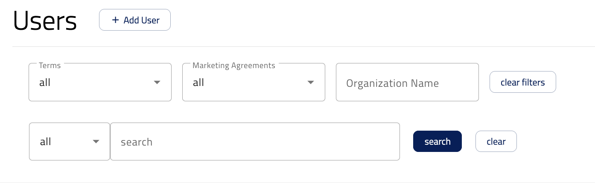
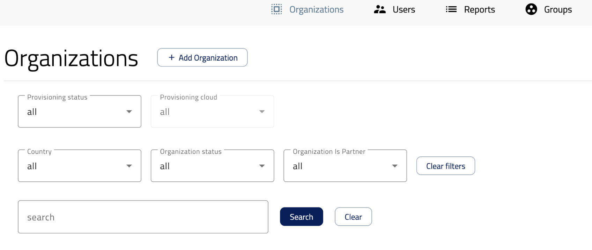
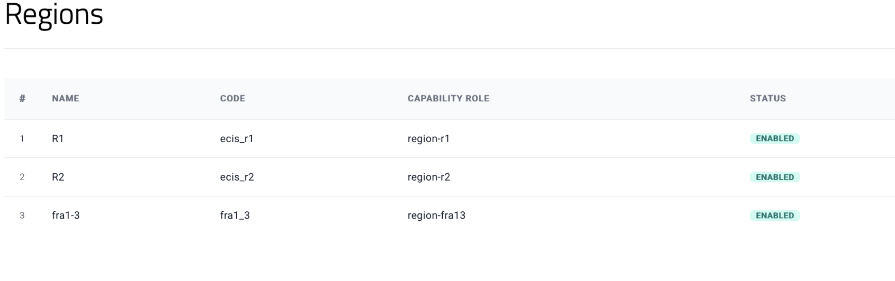
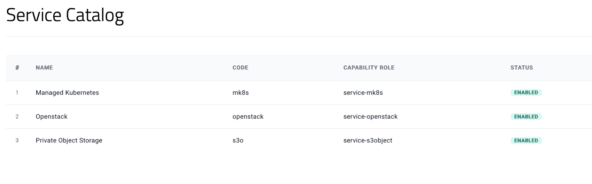

Introduction to the ECIS Dashboard
==================================

Introduction
------------

The ECIS dashboard is a central portal used to onboard users and manage access to available services across an organization. It provides operators with the tools they need to create and manage organizations, add users, assign roles, grant access to cloud regions and services, and adjust quotas as operational needs evolve.

This guide focuses on the main operational areas of the ECIS portal, especially the Organizations and Users tabs. These areas are part of the portal that is available only to operators and are intended for privileged administrative tasks.

Purpose of this guide
---------------------

The purpose of this guide is to provide an overview of how the ECIS portal is used by operators to manage organizations and users. It explains the main actions available in the dashboard and describes the basic workflows for listing, filtering, exporting, and creating records.

Intended audience
-----------------

This guide is intended for Operators who use the ECIS portal within their organization.

An operator is a privileged user responsible for onboarding users and managing access across the portal. Operators typically perform tasks such as creating organizations, adding and managing users, granting access to cloud regions and services, assigning roles, managing quotas, and reviewing or exporting user and organization data.

Managing Users in the ECIS Portal
---------------------------------

Overview
^^^^^^^^

The Users tab allows operators to manage users within the ECIS portal. From this tab, operators can list existing users, apply filters, export user data, and create new user accounts.

Accessing the Users tab
^^^^^^^^^^^^^^^^^^^^^^^

To manage users, navigate to the Users tab in the ECIS portal. This tab displays a table containing the users available to the operator. Operators can perform the following actions from this tab:

* List users
* Filter users
* Export user data in CSV format
* Create a new user

Listing and filtering users
^^^^^^^^^^^^^^^^^^^^^^^^^^^

The Users tab provides filtering options that help operators find specific users more quickly. Operators can use the available filters above the user table to narrow down results based on the information available in the dashboard.

Filtering is especially helpful when managing many users across multiple organizations, services, or roles.

Exporting user data
^^^^^^^^^^^^^^^^^^^

Operators can export the list of users in CSV format by clicking the Export CSV button located in the top-right area above the users’ table. This exported file can be used for reporting, internal records, or operational review.

Creating a new user
^^^^^^^^^^^^^^^^^^^

To create a new user:

1. Click the Add user button in the Users tab.
2. The portal opens a user creation form where the operator must enter the required details.
3. After completing the form, click the Create account button to submit it to create the new user account.

Managing Organizations in the ECIS Portal
-----------------------------------------

Overview
^^^^^^^^

The Organizations tab allows operators to view, filter, export, and create organizations in the ECIS portal. This section explains the main actions available in this tab and how operators can use them during daily operations.

Accessing the Organizations tab
^^^^^^^^^^^^^^^^^^^^^^^^^^^^^^^

To manage organizations, open the ECIS portal and navigate to the Organizations tab. This tab displays a table containing the list of organizations available to the operator. From this view, operators can perform the following actions:

* List organizations
* Filter organizations
* Export organization data in CSV format
* Create a new organization

Listing and filtering organizations
^^^^^^^^^^^^^^^^^^^^^^^^^^^^^^^^^^^

The Organizations tab provides a table view where existing organizations are listed. Operators can use the available filters above the table to narrow down the list and quickly find the required organization. The filtering section shown in the dashboard allows operators to search or filter organizations based on available criteria.

Using filters is useful when working with many organizations, as it helps operators locate specific records more efficiently.

Exporting organization data
^^^^^^^^^^^^^^^^^^^^^^^^^^^

Operators can export the organization list in CSV format by clicking the Export CSV button located in the top-right area above the organizations table. This export option is useful for reporting, auditing, or offline review of organization data.

Creating a new organization
^^^^^^^^^^^^^^^^^^^^^^^^^^^

To create a new organization:

1. Click the Add organization button.
2. After clicking the button, the portal opens a new page where the operator must fill in the required organization details.
3. Once all required fields have been completed, click the Register organization button to create the organization.

After registration, the new organization becomes available in the Organizations list and can be managed through the portal.

What’s next
^^^^^^^^^^^

After an organization has been created, operators can continue the onboarding process by granting access to the required cloud regions and services.

For existing organizations, access to additional regions and services can also be granted as operational needs change.

Granting Access to Cloud Regions and Services
---------------------------------------------

Overview
^^^^^^^^

Access to cloud regions and services is granted at the organization level.

To grant access to services or regions to an organization:

1. Go to the Organizations tab.
2. Click the organization in the list where you want to make changes.
3. After opening the organization details page, you will see a section where you can grant access to cloud regions and services.

Granting access to regions
^^^^^^^^^^^^^^^^^^^^^^^^^^

To grant access to one or more regions:

1. Go to the Orders and Contracts section on the left-hand side and select Regions.
2. Then enable one or more regions that should be available for the organization.

When all R1, R2, and ELA regions are enabled, the configuration should look like the screenshot above.

Granting access to services
^^^^^^^^^^^^^^^^^^^^^^^^^^^

To grant access to one or more services:

1. Go to the Orders and Contracts section on the left-hand side and select Service Catalog.
2. Then enable one or more services that should be available for the organization.

When all services are enabled, the configuration should look like the screenshot above.

Managing S3 and MK8S Quotas
---------------------------

Overview
^^^^^^^^

Quotas are managed at the organization level. This section applies to quotas for S3 Private Object Storage and Managed Kubernetes Service (MK8S).

OpenStack quotas are also managed in ECIS, but they are managed in a different section of the interface. For more information, see the article Managing OpenStack Quotas.

Managing quotas
^^^^^^^^^^^^^^^

To manage S3 or MK8S quotas for an organization:

1. Go to the Organizations tab.
2. Click the organization in the list where you want to make changes.
3. After opening the organization details page, go to Orders and Contracts on the left-hand side.
4. Select Quotas.
5. In the Quotas section, use the available dropdowns to select the service and region for which you want to manage quotas.
6. First, select the required service from the service dropdown:

   a. S3 Private Object Storage
   b. Managed Kubernetes Service (MK8S)

7. Then select the required region from the region dropdown.

After selecting the service and region, the available quota options for that service and region are displayed. The operator can then review the current quotas and increase them according to the organization’s operational needs.

Available quotas
^^^^^^^^^^^^^^^^

The following quotas are available for the S3 service:

.. jinja:: caption_colors

   .. list-table:: :{{ caption }}:`S3 service quotas`
      :header-rows: 1

      * - :{{ header }}:`Quota`
        - :{{ header }}:`Maximum value`
        - :{{ header }}:`Unit`
      * - Max Objects per Bucket
        - 2,000,000
        - count
      * - Max Bucket Size
        - 524,288,000
        - KiB
      * - Max Buckets
        - 1,000
        - count
      * - Max Storage Size
        - 524,288,000
        - KiB
      * - Max Objects
        - 100,000,000
        - count
The following quotas are available for the mk8s service:

.. jinja:: caption_colors

   .. list-table:: :{{ caption }}:`MK8S service quotas`
      :header-rows: 1

      * - :{{ header }}:`Quota`
        - :{{ header }}:`Maximum value`
        - :{{ header }}:`Unit`
      * - Max Clusters
        - 10
        - count
      * - CPU Cores
        - 100
        - vCPU
      * - Memory
        - 256
        - GiB
      * - Max Instances
        - 50
        - count
      * - Max Volumes
        - 100
        - count
      * - GPU RAM
        - 0
        - GiB
      * - Max Volume Size
        - 1024
        - GiB
      * - Max Total Volume Size
        - 10240
        - GiB
      * - Max Load Balancers
        - 5
        - count
      * - Max Floating IPs
        - 5
        - count
