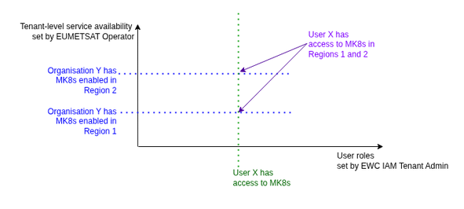
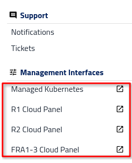
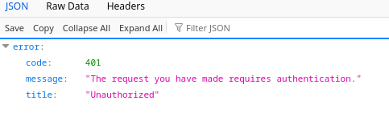

Service access
==============

Access model
------------------

For EWC users, access to the available services (OpenStack, S3, Managed Kubernetes) is granted by default as part of the operator-led onboarding process. During the onboarding process, the cloud region(s) in which services can be used are also set.

For other users, services and/or cloud regions are not enabled by default. Accesses to regions and services are granted by EUMETSAT Operator as part of onboarding process. Users can request to be added but must submit an access request ticket, which is reviewed and processed by an Operator.

Note:  Services make authorization decisions based on two dimensions from different sources:

User-level access — set in EWC KC (e.g. "User X has access to MK8s")

Organization-level availability — set in Dolores (e.g. "Organization Y has MK8s R1 enabled")

Access requires both conditions. Neither source has visibility into the other.

Requests
-------------

Users can submit request for various reasons like requesting access, additional quota or reporting a bug. Only admin can request additional quota, access to services, regions

* For a user to request access to a given service, they need to:

* Log in to the Dolores portal.

* Go to the left-hand navigation.

* In the **Support** section, select **Tickets**.

* Click on the **Add ticket** button to create a new ticket. You will be redirected to email application.

* Fill out the details about your request (what service, cloud etc).

* Send an email.

.. list-table::
   :header-rows: 1
   :widths: 20 24 28 28

   * - Service requested
     - Request category
     - Summary
     - Ticket content
   * - OpenStack
     - Service access request
     - Enable service x for organization xxx
     -
   * - S3
     - Service access request
     - Enable service x for organization xxx
     -
   * - Managed Kubernetes
     - Service access request
     - Enable service x for organization xxx
     -

Service access in the left-hand navigation
--------------------------------------------------

Depending on the user’s permissions, the left-hand navigation in the “Management Interfaces” section displays menu(s) for the following services:

* OpenStack

* S3

* Managed Kubernetes

For S3 and Managed Kubernetes, there is one menu item that applies to all regions. For the OpenStack service, the portal displays a separate menu item for each cloud region.

OpenStack access
----------------------

Access to OpenStack Services is managed directly within the dashboard.

Users access the application via tab to Horizon (OpenStack UI), which appears as entries in the dashboard interface (separately tab for each region).

When trying to connect to Horizon without appropriate permissions you will not be able to enter.

S3 access
--------------

S3 is an object storage service that provides access to data over HTTPS via a REST API. To use the service, the user must generate an access key and a secret key. Users can generate these credentials in S3 Key Manager. The S3 Key Manager is deployed centrally and is a single point of managing S3 Key for all regions.

To access the S3 Key Manager, select the S3 Key Manager menu item.

Managed Kubernetes access
---------------------------------

Access to Managed Kubernetes is managed directly within Dolores.

Users access the application via dynamic tab, which appears as entries in the Dolores interface.