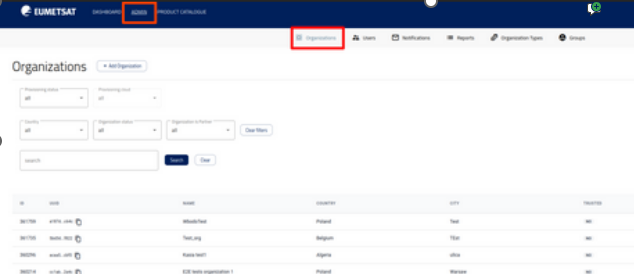
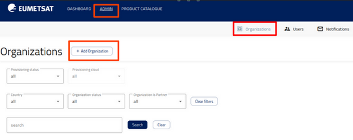
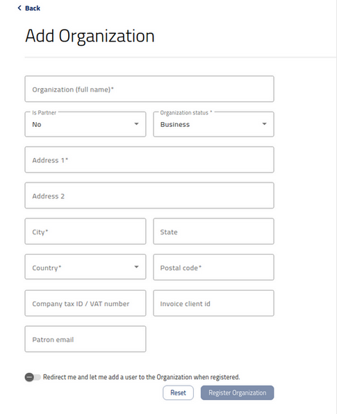
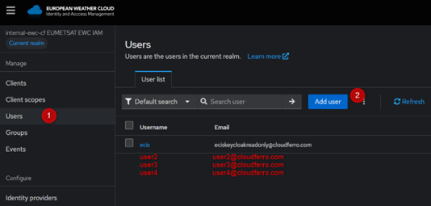
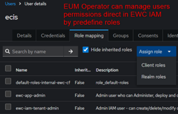
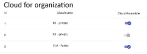
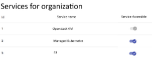

Operating the portal
================================

This section describes the day-to-day administrative workflows performed by an operator. An operator is a privileged user responsible for onboarding users and managing access across the portal. It covers creating organizations, adding and managing users, granting access to cloud regions and services, assigning roles, and adjusting quotas to match evolving operational needs.

This guide is intended for EUMETSAT Team members operating and using the Dolores portal within their organization.

Terminology
---------------

 .. list-table::
    :header-rows: 1
    :widths: 20 80

    * - **Term**
      - **Description**
    * - Access key / Secret key
      - The credential pair used for S3-compatible access.
    * - End user
      - A regular user who accesses services through the portal.
    * - Operator
      - A privileged user who onboards users and manages access, roles, and quotas.
    * - Organization
      - The client’s logical boundary in the portal.
    * - Portal / Dolores portal
      - The web UI used to onboard users and provide access to services (and related areas like profile/billing if applicable).
    * - Portal role
      - Role controlling permissions and visibility within the portal UI.
    * - Quota
      - A limit on usage/capacity.
    * - Service
      - An integrated product accessible via the portal (e.g., S3).
    * - Service role
      - Role controlling permissions within a specific service.
    * - S3 Key Manager
      - Portal components used to generate and manage S3 credentials.

Listing an organizations
---------------------------

Operator can see the list of all organisations by going to organisations page.

* Operator can search for organisation using search field

* Operator can also filter organisations using by

   * Provisioning status on selected cloud

   * Country

   * Organisation status (Internal/Test/Business)

   * Is partner

Managing an organization
----------------------------

* Only Operator is allowed to create/modify/delete organisations.

* Onboarding process in EWC IAM (internal EUMETSAT procedure)

* After logging in as an Operator, go to the Organizations tab.

* Click on the “Add new organization button”.

Fill in the required fields or leave default values:

 * Address

 * City

 * Country

 * Postal Code

 * Field of Activity

Update information in EWC IAM

EUMETSAT Operator assigns id in EWC IAM in order to automate creating Organisation on ECIS Platform side.

Managing users, roles, passwords
-----------------------------------

Main assumptions
^^^^^^^^^^^^^^^^^^

All users are managed in external identity provider EWC IAM.

In EWC IAM EUMETSAT Operator/ EWC IAM Tenant Admin manages among others

* Users

* Passwords

* Roles

The above steps are not in the scope of this document as it is taking place in EWC IAM in accordance with its processes.

User can be assigned to only one Organization in EWC IAM and ECIS IAM.

If single person is simultaneously in multiple Organizations then in EWC IAM there will be multiple independent accounts with different access data used to authenticate in EWC IAM.

From the ECIS point of view, these are independent identities.

Also, EUM operator can manage users permissions directly in EWC IAM by predefines roles.and

Role synchronization
^^^^^^^^^^^^^^^^^^^^

Role synchronization between EWC IAM and ECIS IAM relies on Keycloak’s native federation mechanism. Each time a user logs into the ECIS Platform including Dolores or another Services Control Panel the system checks for role updates. Any role assigned or removed in EWC IAM is automatically synchronized into ECIS IAM when the user logs in.

Granting access to cloud regions and services
-----------------------------------------------

Cloud regions
^^^^^^^^^^^^^^

To grant or edit access to a cloud region, go to Regions, then turn on the cloud.

You can select cloud region R1 (private cloud), R2 (private cloud), and/or ELA (public cloud). You may choose a single region or any combination of regions.

Cloud regions
----------------

To grant access to a service, go to Service Catalog:

You can select S3, OpenStack and/or Managed Kubernetes.

Note: For now you can only enable access for services and there is no option for disabling it.

.. Note::

    Access to services is granted for all selected cloud regions.

Creating an OpenStack project
------------------------------------

To provision a new OpenStack project, go to Accounts/Projects.

.. list-table::
   :header-rows: 1
   :widths: 24 24 52

   * - Field
     - Type
     - Description
   * - Project name*
     - string
     - The OS project name must be unique within the organization's context.
   * - Region*
     - Enum (single-select), allowed values: R1, R2, ELA
     - Cloud region
   * - Security class*
     - Enum (single-select), allowed values: sc3, sc4, sc5
     - Mapping to workflow type
   * - SFS*
     - Boolean
     - Should SFS be enabled for this project
   * - Quotas*
     - Several fields with default values, values can be changed by operator
     -

OpenStack Domain Name - invisible in frontend, automatically derived from the Dashboard Organization name.

