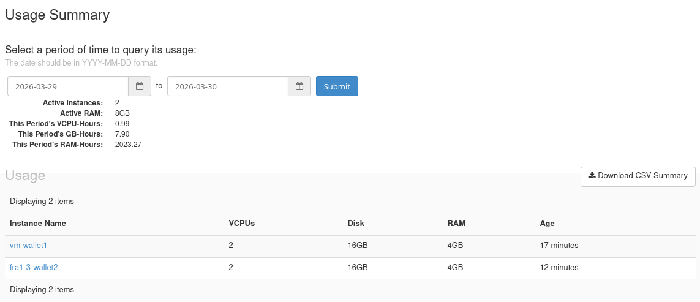
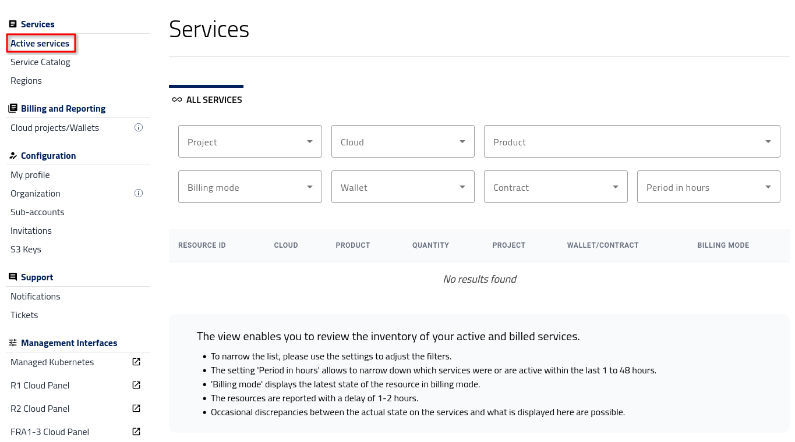

Active services
=================

Monitoring cloud costs regularly helps you manage resource consumption and optimize spending.
Click on **Active services** to view your usage and costs in two distinct ways:

Prerequisites
-------------

No. 1 **Hosting account**

You need an active user account and access to the |brand-name| Dashboard at |brand-name-site-auth-link|.

Check active resources in Horizon
------------------------------------------

We will now gather data about the instances we used so that we can see the exact cost, using either of the billing reports options.

Before comparing billing reports, it helps to know which instances and flavors are active during the billing period. You can check this in **Horizon** → **Compute** → **Overview** → **Usage Summary**, as shown below.

1) Enter Horizon through one of the links from above.

2) Select the cloud you want to work with -- here it will be **FRA1-3**.

3) Use command **Compute** -> **Overview** and scroll to the bottom of the browser window to see **Usage Summary**.

Table **Usage** displays instances active on that cloud in that period:

   *Usage summary in Horizon*

5) Decide which resources you want to investigate further

   As an example, click the name of the first instance and see which flavor it uses. You can directly see which resources are used on that cloud, in that period of time, and, consequently, you will be able to see how much they cost.

Open billing reports in Dashboard
--------------------------------------

Enter the Dashboard via |brand-name-site-auth-link| and click on **Services** -> **Active services**. This is the starting form to enter the data into:

   *Active services screen*

Define report filters
^^^^^^^^^^^^^^^^^^^^^^^^^^^^^^^^^^^^

The same filter panel is used for both report types. It defines the time window, project, and cloud, and allows you to narrow your report by product, billing mode, and wallet.

Filters include:

* **Project** – Choose one of your OpenStack projects.
* **Cloud** – Available regions include *FRA1-3*, **R1** and **R2** denoted as **ecis-r1**, **ecis-pr2** and **fra1-3**.
* **Product** – Combination of cloud and product type (e.g. *ecis-r1 / 1cpu-4gbmem*). Use **search** files to narrow down the number of options.
* **Billing mode** – *PPU*, *PAYG*, or *FIXED-TERM*.
* **Wallet** – Payment source.
* **Contract** – Predefined contract.
* **Period in hours** - from 1 to 48 hours prior.

