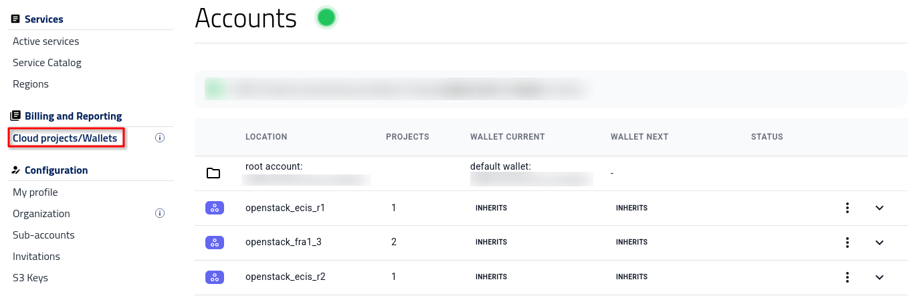
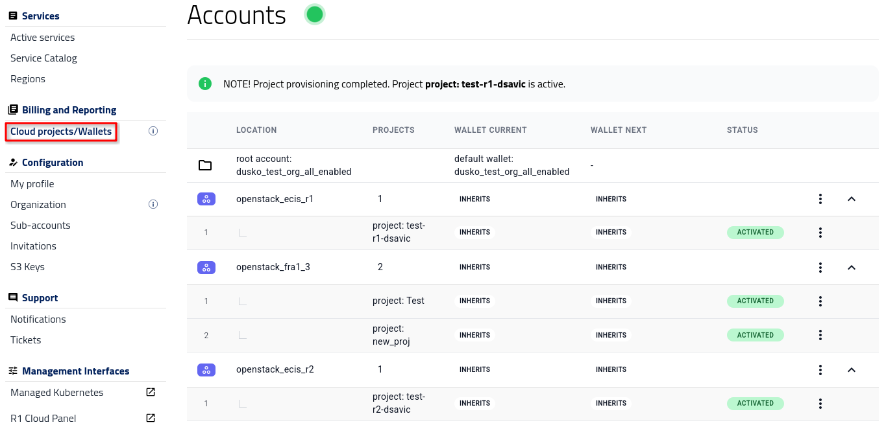
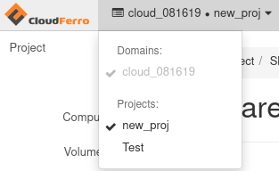
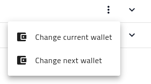
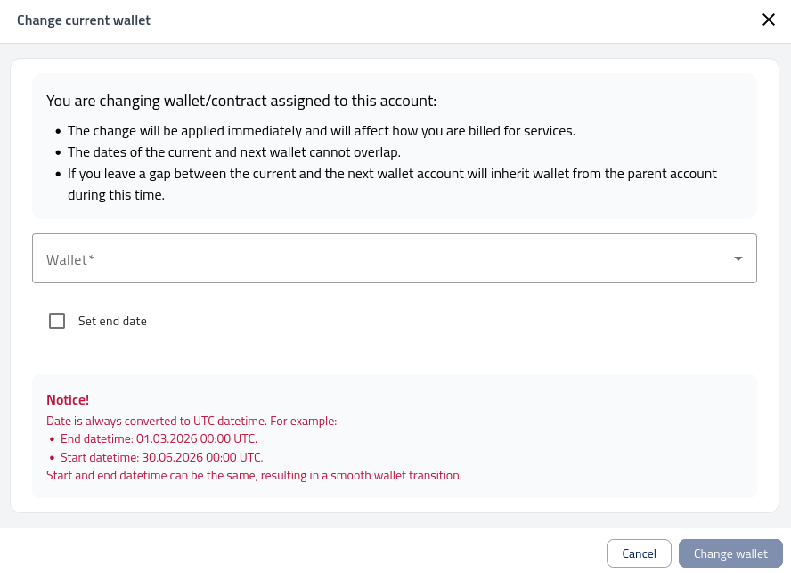

Cloud projects and wallets
==========================

.. important::

   Only a user with the **admin** role can see and use option **Cloud projects/Wallets** under section **Billing and Reporting**.

In OpenStack environments, a **project** represents an isolated workspace where users can create and manage cloud resources such as virtual machines, volumes, and networks.
Each project has its own quotas, permissions, and billing configuration, allowing organizations to separate workloads and track resource usage independently.

This article explains how to use the |brand-name| Dashboard to manage your cloud projects and wallets, including project activation, wallet assignment, and billing verification.

.. raw:: html

   <h2>What we are going to cover</h2>

.. contents::
   :depth: 2
   :local:
   :backlinks: none

Prerequisites
----------------

.. jinja:: brand_names

   No. 1 **Account on {{ brand_name }} Dashboard**

You need an active user account and access to the |brand-name| Dashboard at |brand-name-site-auth-link|.
Use this interface to manage wallets and cloud projects.

No. 2 **Access to Horizon**

You should also be able to log in to Horizon at |brand-name-site-link|.
Horizon is used to verify OpenStack projects, quotas, and resource usage.

No. 3 **Configured and funded wallet**

Wallets for R1 and R2 are funded in advance, while for access to FRA1-3 cloud, you should have an active and funded wallet.

No. 4 **Admin permission**

To manage projects and wallets you need an **Admin** permission.

Wallets (overview)
--------------------

A **wallet** is the billing source for projects. You may have one shared wallet or multiple wallets for separation by project or contract.

**Wallet states in the Dashboard**

.. jinja:: caption_colors

    .. list-table::
       :widths: 20 80
       :header-rows: 1

       * - :{{ header }}:`Term`
         - :{{ header }}:`Meaning`
       * - Current wallet
         - The wallet used **now** for billing the region/project.
       * - Next wallet
         - A scheduled replacement wallet that becomes current on its **start date**.
       * - Wallet inheritance
         - If there’s a date gap, the project temporarily uses the **parent account’s wallet**.

**Examples**

* **One wallet, many regions**: set the wallet **on the region** so that all new projects in that region inherit it by default.

* **Separate wallets by workload**: set different wallets **on individual projects** within a region to isolate costs between teams or environments.

Cloud projects/Wallets view
-------------------------------------------

After logging into |brand-name-site-auth-link|, click **Cloud projects/Wallets** in the left menu bar to view the details of your projects.

   *Dashboard view showing the Cloud projects/Wallets section, where all project and wallet details are listed.*

This view shows the table of active cloud regions for your account.

To see what projects are active in a region, click on the row for that region. The following image shows all three regions activated in that way:

Here we see the projects that already exist in the corresponding OpenStack environment. For instance, FRA1-3 has two projects active:

If one or more projects have already been used to create resources (for example, virtual machines), the number of instances and RAM used will no longer be **0** in that region.

Attaching wallets to projects in the Dashboard
-----------------------------------------------------

Initially, you will have only one active wallet, and the default wallet is inherited across all of the cloud regions.

The **current wallet** defines the active billing source, while the **next wallet** allows you to schedule a future switch without interrupting services.

You can attach a wallet to a **region** or to a specific **project**.
The wallet attached to the region will be the default for all of the projects within that region.

Three-dots menu
^^^^^^^^^^^^^^^^^^^^^

Use the **three-dots** menu in each row to access region-level or project-level actions.

.. jinja:: caption_colors

    .. list-table::
       :header-rows: 1
       :widths: 25 75

       * - :{{ header }}:`Context`
         - :{{ header }}:`Options`
       * - Region row
         - Change current wallet; change next wallet; add project
       * - Project row
         - View project; extend project (multi-region setups); change current wallet; change next wallet

Attach wallet to a region
^^^^^^^^^^^^^^^^^^^^^^^^^^^^^^^^^^

Attach the appropriate wallet to the region — this determines from which funds the projects' expenses will be drawn.

To change the wallet, click the **three-dots** menu in the row of the region and choose whether to modify the **current** or **next** wallet:

   *Options menu for editing the current or next wallet assigned to a region.*

This opens a new entry window:

   *Form for assigning or scheduling a wallet change for the selected project.*

.. note::

   The following conditions apply when changing wallets:

   1. The change of wallet takes effect immediately and affects how you are billed for services.
   2. The dates of the current and next wallet cannot overlap.
   3. If you leave a gap between the current and next wallet, the account inherits the wallet from the parent account during that time.

Date is always converted to UTC datetime. For example:

    End datetime: 01.03.2026 00:00 UTC.
    Start datetime: 30.06.2026 00:00 UTC.

Start and end datetime can be the same, resulting in a smooth wallet transition.

You can also use the **Active services** view to narrow down the exact cloud region you want to manage.

