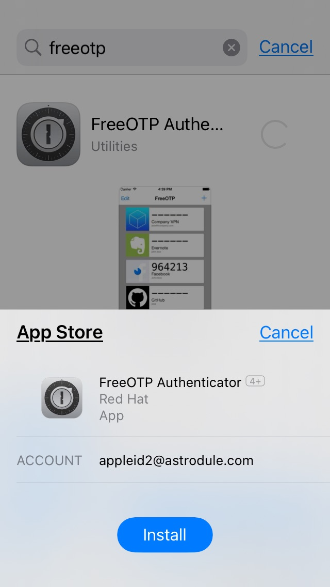
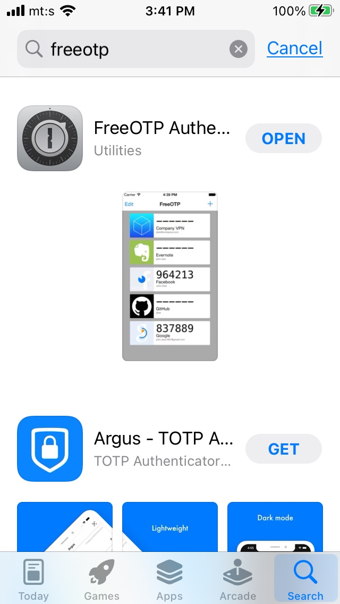
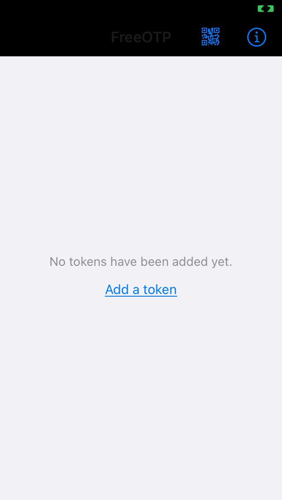
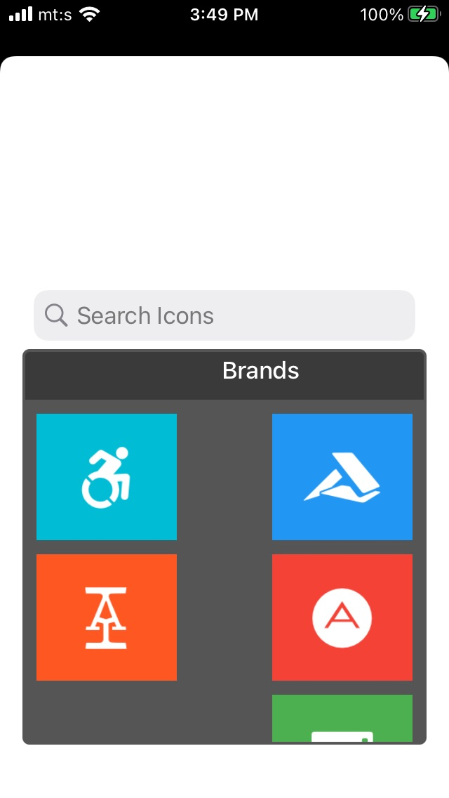
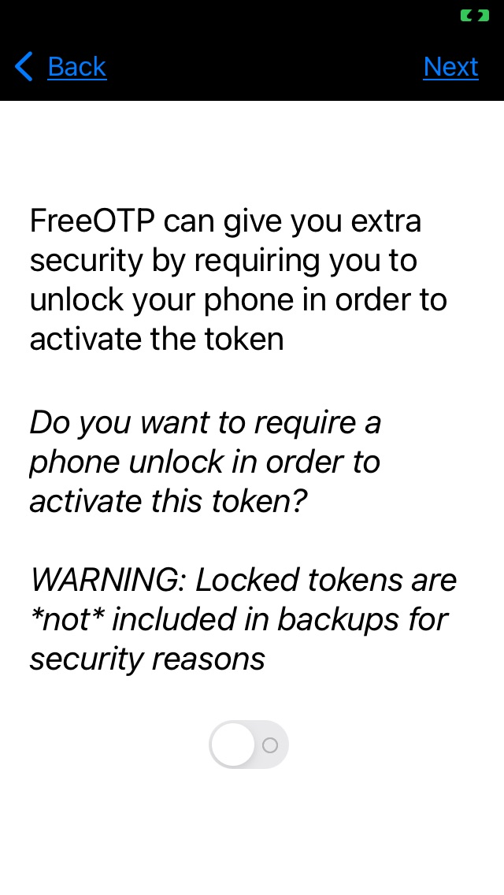
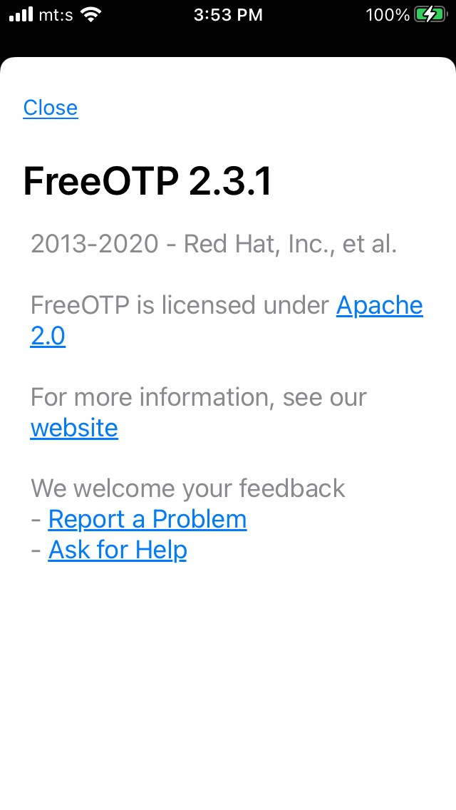
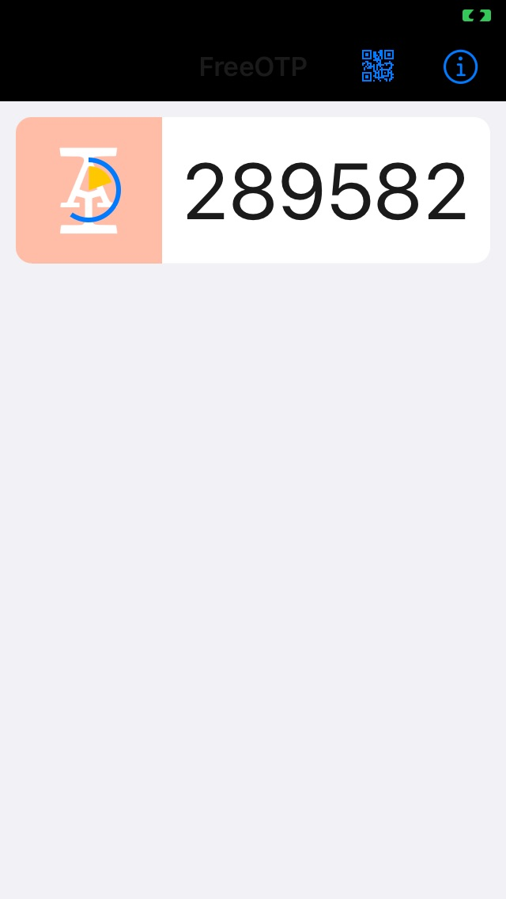
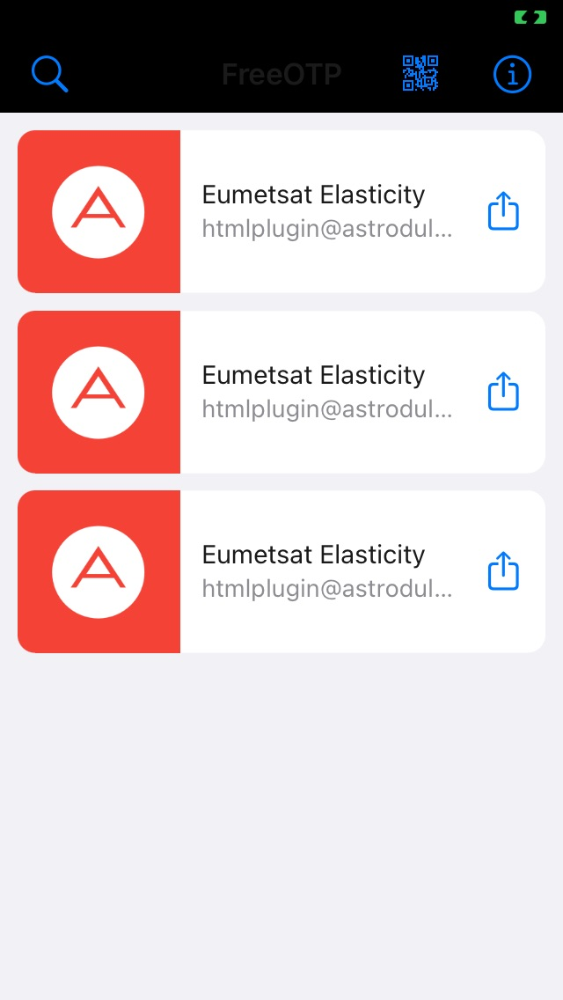
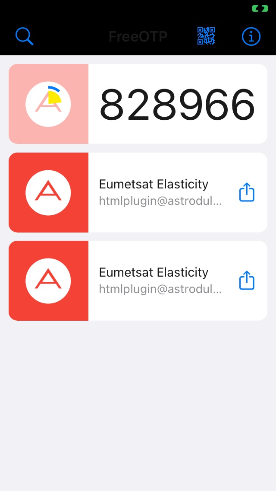

.. meta::
   :description: Dual Factor Authentication for |brand-name| Site 
   :keywords: |brand-name|, Cloudferro, OpenStack, dual factor authentication, freetop, google authenticator

Dual Factor Authentication for |brand-name| Site
====================================================

.. ifconfig:: brand_name == "Creodias"

   .. warning::

      Dual Factor Authentication will be required starting on 14/09/2022 for all Creodias users.

Traditionally, the most basic way to implement security online was to assign usernames and passwords to authorized users and companies. Most usernames are email addresses and if email address is breached, the bad actor can probably learn your password too. What used to be secure enough when the number of Internet users was small, is not secure enough today, especially if the username and the password can be linked and treated as one package of data. 

The way to overcome this limitation is to introduce two or more factors or types of user authorization. These could be

 * something the user knows (email address, the name of their first pet etc.)

 * something the user has (token generator, smartphone, credit card etc.) or 

 * biometic information such as fingerprint, iris, retina, voice, face and so on. 

Logging into the |brand-name| site uses dual factor authentication, meaning you will have to supply two independent types of data:

 * the "classical" username and password, as well as

 * the numeric code supplied by a concrete mobile app. 
 
.. jinja:: brand_names

   This article is about using mobile devices to authenticate to the cloud. If you want to use your computer to do that, see :doc:`/{{ gettingstarted }}/Using-KeePassXC-for-Two-Factor-Authentication-on-{{ brand_name_hyphen }}`.

You will first have to install one of the following two mobile applications, for Android or iOS mobile operating systems:

 * `FreeOTP <https://freeotp.github.io/>`_, where OTP stands for One Time Password, or

 * `Google Authenticator <https://googleauthenticator.net/>`_. 

We can use "mobile authenticator" as a generic term for a mobile app that can help authenticate with the account.  

Which One to Use -- FreeOTP or Google Authenticator?
----------------------------------------------------

FreeOTP is based on open source protocols while Google Authenticator, obviously, is not. 

You can use FreeOTP with Google accounts instead of Google Authenticator app. 

If you already use Google Authenticator app for other accounts, you may prefer it over FreeOTP. 

.. warning::

   If your accounts are protected by Google Authenticator and it stops working, then you risk losing **all** the data that were behind those protected accounts. The most common scenario is to switch to a new phone number and then not be able to verify the accounts via a text message to the previous phone number. 

In this tutorial, you are going to use the FreeOTP app. 

.. warning::

   If you lose access to QR codes and cannot log into the Horizon site for |brand-name|, ask Support service to help you by sending email to the following address support@cloudferro.com.

What We Are Going To Cover
--------------------------

 * How to start using the mobile authenticator

 * How to locate, download and install FreeOTP app on your mobile device

 * How to set up FreeOTP app and connect it to your |brand-name| account

 * How to get new code each time you want to enter the site

Prerequisites
-------------

Use only one of the four possible combinations for two apps and two app stores.

No. 1 **FreeOTP app in Google Play Store**

Download `FreeOTP app in Google Play Store using this link <https://play.google.com/store/apps/details?id=org.fedorahosted.freeotp>`_.

No. 2 **FreeOTP app in iOS App Store**

Download `FreeOTP app in iOS App Store using this link <https://apps.apple.com/la/app/freeotp-authenticator/id872559395>`_.

No. 3 **Google Authenticator in Google Play Store**

Download `Google Authenticator in Google Play Store using this link <https://play.google.com/store/apps/details?id=com.google.android.apps.authenticator2&hl=en&gl=US>`_.

No. 4 **Google Authenticator in iOS App Store**

Download `Google Authenticator in iOS App Store using this link <https://apps.apple.com/us/app/google-authenticator/id388497605>`_.

.. warning::

   You should install the authenticator app **before** trying to log into the |brand-name| site.

You are now going to download, install and use the FreeOTP app to authenticate to |brand-name| site.

Step 1 Download and Install FreeOTP from the App Store
-------------------------------------------------------

Using the App Store icon from the desktop of your iOS device, locate app called **freeotp**. A screen like this will appear:

Tap on GET and the app will start downloading to your device. 

It may take a minute or so and then install it by tapping on button Install.

Once installed, type on **Open** and the app will run. At first, there will be no tokens to work with:

.. note:: 

   FreeOTP can also use tokens to secure access to the remote site. The |brand-name| site uses QR code, so that is what you will use in this tutorial. (Both "token" and "QR scan" denote a secure connection to the site, but use different techniques in the process.) 

Step 2 Scan QR and Create Brand 
------------------------------------

Select a brand, which means select an icon that will make your tokens stand out graphically. If you will employ this app only to get access to |brand-name|, you may select whichever icon you want. 

In the next step, you may require that the phone is unlocked when the token is to be activated. Choose that if you are afraid someone might steal your phone and get access to your |brand-name| data that way. 

Clicking on **information** icon will show you legal details about this app. 

To scan the QR code, use a QR like icon in the upper part of the screen, like this:

Click on it to get to the scanner part of the application and read the QR code from the login screen.

.. note::

   The QR code will appear on screen when you first try to log into the |brand-name| site (see below).

.. jinja:: dual_factor_authentication

   .. image:: {{ eefa_qr_screen }}
      :scale: 50

Step 3 Create a Six-digit Code to Enter Into the Login Screen
--------------------------------------------------------------

Finally, you will see a row within the FreeOTP app, with the icon you chose and with the code that will appear automatically. For instance, the code is **289582** and that is the code that you need to enter when the site asks you for *One-time code*. 

If you created several tokens or repeatedly scanned QR code from the screen, you may see the appropriate number of rows on the mobile screen:

Tapping on any of these will produce the six-digit code that you have to type into the entry form to get logged in. Only one of these will be the right one, in this case, the first row produces the correct six-digits code for |brand-name| site. 

You are now ready to log into the |brand-name| site using the dual factor authentication.

How to Start Using the Mobile Authenticator With Your Account
-------------------------------------------------------------

Use the usual link |brand-name-site-link| to log into your |brand-name| account and choose |brand-name| in the input menu.

.. jinja:: dual_factor_authentication

   .. image:: {{ eefa_start }}
      :align: center
      :scale: 75

Click on blue button Sign In and enter your username / email and password:

.. jinja:: dual_factor_authentication

   .. image:: {{ eefa_sign_regular }}
      :align: center
      :scale: 75

If the data you entered has not already been linked to dual factor authentication, the next screen will be **Mobile Authenticator Setup**:

.. jinja:: dual_factor_authentication

   .. image:: {{ eefa_mobile_auth_setup }}
      :align: center
      :scale: 75

This screen will contain the QR code that you have to read from using the mobile authenticator app, in this case, the FreeOTP app. 

At this moment, start using the mobile device -- activate the FreeOTP first if not already active, scan the QR code with the QR icon and, as explained above, get the six-digit code on the mobile device screen.

Retype that six-digit code into the **One-time code** field on computer screen. It is denoted by an asterisk, meaning that it is mandatory to enter a value into this field. 

You can use the field **Device Name** to remind yourself on which device was the mobile authenticator app installed on. 

Click on **Submit** and you will be brought back to the **Sign in** screen from the beginning:

.. jinja:: dual_factor_authentication

   .. image:: {{ eefa_normal_Login }}
      :align: center
      :scale: 75

Logging In Into the Site Once the Dual Factor Authentication is Installed
-------------------------------------------------------------------------

Here is the workflow in one place, with all of the screens repeated for easy reference.

Use the usual link |brand-name-site-link| to log into your |brand-name| account and choose |brand-name| in the input menu.

.. jinja:: dual_factor_authentication

   .. image:: {{ eefa_start }}
      :align: center
      :scale: 75

Click on blue button **Sign In** and enter your username / email and password:

.. jinja:: dual_factor_authentication

   .. image:: {{ eefa_sign_regular }}
      :align: center
      :scale: 75

Since the dual factor authentication is already installed, you will only see the window to enter the six-digit code. 

.. jinja:: dual_factor_authentication

   .. image:: {{ eefa_restart_login }}
      :align: center
      :scale: 75

Now activate the mobile authenticator app and get the code on the device screen, for instance, like this:

.. jinja:: dual_factor_authentication

   In this case, the code is {{ eefa_828966_code }}. Enter it into the form, **Submit** and you will be logged in. 

.. jinja:: dual_factor_authentication

   .. image:: {{ eefa_logged_in }}
      :align: center
      :scale: 75

.. note:: 

   If the FreeOTP app is in the foreground on the mobile device while you are submitting the username and password, the app will react automatically and the proper six-digit code will appear on its own on the authenticator device. 
