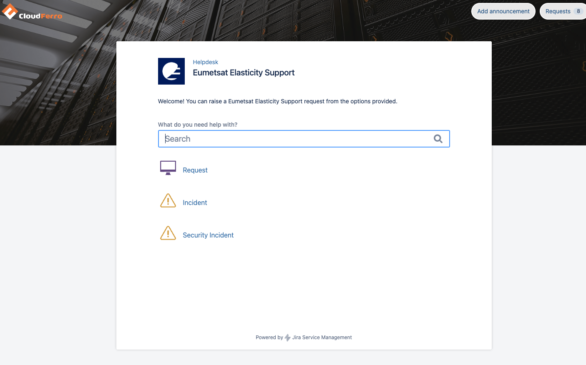
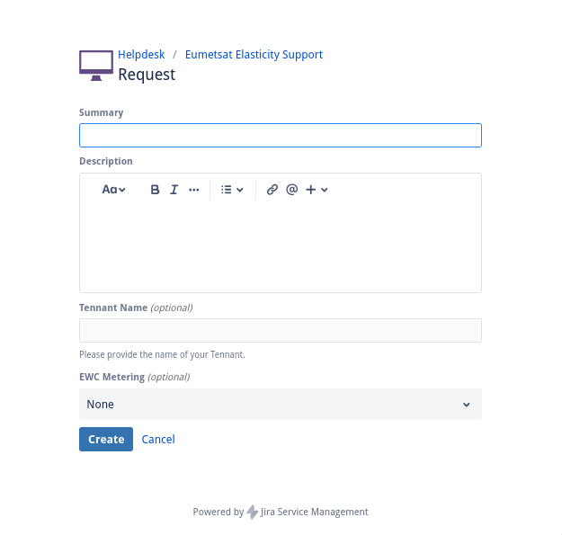
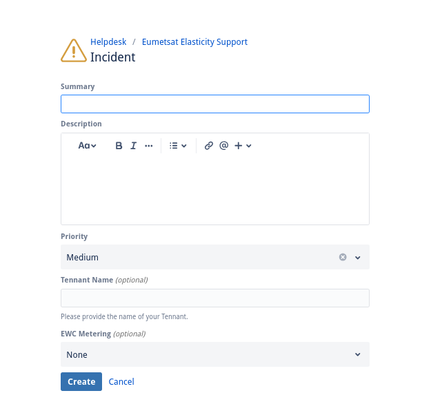
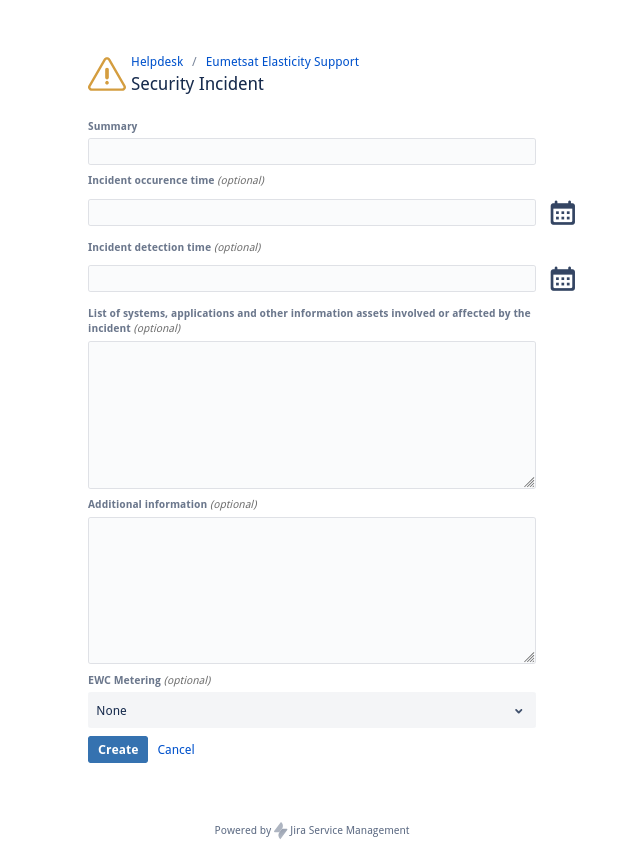

Helpdesk and Support for |brand-name|
========================================

The following link is the route to customer support for Eumetsat Elasticity customers:

https://jira.cloudferro.com/servicedesk/customer/portal/35

Once there, you will see the main menu:

There are three types of help that you can ask for:

**Request** -- General type of questions and support

Use **Request** option if you want a new feature to be implemented on the site.

**Incident** -- something is wrong and you want the Support Team to react

Use **Incident** if one of the pages does not load or if the resources are not available.

**Security Incident** -- breach of security happened and it needs to be solved.

Use Request option if you want a new feature to be implemented on the site.

Use Security Incident if there is a security breach, you want to change access to the site for certain categories of users etc.
