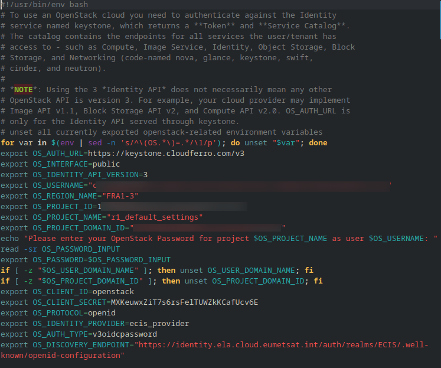
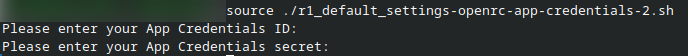
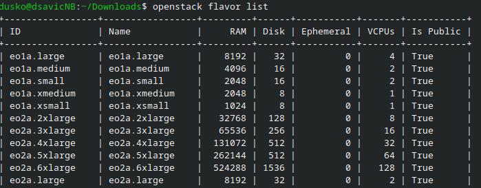
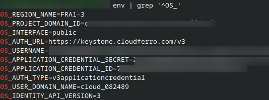

How to activate OpenStack CLI access to |brand-name| cloud
==========================================================

OpenStack CLI access can be activated by sourcing an RC file downloaded from Horizon., application credential authentication is available on **R1**, **R2**, and **FRA1-3**. On **FRA1-3**, you can also use the classic OpenStack RC file with your OpenStack username and password.

Horizon can also provide a **clouds.yaml** file when you create an application credential. That workflow is introduced in the application credential article; this article focuses on activating CLI access by using RC files.

What We Are Going To Cover
--------------------------

* How OpenStack CLI authentication with RC files works
* Which RC file option to download from Horizon
* How to activate an application credential RC file
* How to activate a classic username/password RC file
* How to test the connection
* How long the activated environment remains valid
* How to resolve common authentication errors

Prerequisites
-------------

No. 1 **Account**

You need a |brand-name| hosting account with access to the Horizon interface:

   .. jinja:: horizon_interfaces

      .. tabs::

         
         .. tab:: {{ item.label }}

            {{ item.url }}

            
            {{ item.note }}
            

         

No. 2 **RC file authentication option available**

Before activating CLI access, make sure that one of the supported authentication options is available to you: an application credential created in Horizon, or access to the classic **OpenStack RC File** option where username/password authentication is available for the selected region.

.. jinja:: brand_names

   Application credentials are the preferred option because they avoid using your interactive password directly and can be revoked independently. To create an application credential, see :doc:`/accountmanagement/Use-Horizon-to-create-application-credential-on-{{ brand_name_hyphen }}/Use-Horizon-to-create-application-credential-on-{{ brand_name_hyphen }}`.

No. 3 **OpenStack CLI installed and verified**

This article assumes that the OpenStack CLI client is already installed on the machine from which you will run commands. If it is not installed, install it first. See the official `OpenStackClient installation documentation`_ and choose the method appropriate for your operating system.

Check the installation before continuing:

.. code-block:: console

   openstack --version

Do not continue until **openstack --version** works. The RC files described in this article provide access credentials; they do not install the OpenStack CLI client.

Choose the RC file type
-----------------------

For this article, use one of these RC file options:

* **OpenStack RC File (App Credentials)** -- use this option with an application credential.
* **OpenStack RC File** -- use this option for classic username/password authentication on **FRA1-3**.

The application credential RC file uses an application credential **ID** and **Secret**. The classic RC file uses your OpenStack username and prompts you for your password when sourced.

Download the RC file from Horizon
---------------------------------

Horizon provides RC files from the account menu in the upper-right corner of the interface. Click your account name to open the menu. The menu is not identical in all regions: **R1** and **R2** provide the application credential RC file, while **FRA1-3** also provides the classic username/password RC file.

.. tabs::

   .. tab:: R1 | R2

        .. figure:: Screenshot_20260527_105024.png
           :class: image-with-border

           RC file download options in R1 and R2

   .. tab:: FRA1-3

        .. figure:: Screenshot_20260527_104306.png
           :class: image-with-border

           RC file download options in FRA1-3

Depending on the selected region and authentication setup, the menu can contain several RC-file options:

* **OpenStack RC File**
* **OpenStack RC File (2FA)**
* **OpenStack RC File (Federated IDP)**
* **OpenStack RC File (App Credentials)**

For this article, use one of the following two RC file options.

OpenStack RC File (App Credentials)
^^^^^^^^^^^^^^^^^^^^^^^^^^^^^^^^^^^

Use **OpenStack RC File (App Credentials)** to authenticate with an application credential. The downloaded file uses the application credential **ID** and **Secret** instead of your interactive user password, so access can be replaced or revoked later without changing your main login credentials.

You can download the application credential RC file immediately after creating the credential, or later from the Horizon account menu. This option is available in all three regions: **R1**, **R2**, and **FRA1-3**.

.. tabs::

   .. tab:: R1

        .. figure:: Screenshot_20260527_132457.png
           :class: image-with-border

           Open RC file in R1

   .. tab:: R2

        .. figure:: Screenshot_20260527_132655.png
           :class: image-with-border

           Open RC file in R2

   .. tab:: FRA1-3

        .. figure:: Screenshot_20260527_132751.png
           :class: image-with-border

           Open RC file download options in FRA1-3

OpenStack RC File
^^^^^^^^^^^^^^^^^

Use **OpenStack RC File** to authenticate to the selected region with your OpenStack username and password. This file does not use an application credential; when sourced, it prompts you for your password and stores it in the current shell environment for the duration of that terminal session., this option is available for **FRA1-3**. For **R1** and **R2**, use **OpenStack RC File (App Credentials)**.

Click the RC file option that matches your authentication method. Horizon downloads a shell file with the **.sh** extension, usually into your browser's default download folder.

   Downloaded open RC file OpenStack RC File from FRA1-3

The **OpenStack RC File (2FA)** and **OpenStack RC File (Federated IDP)** options are intended for accounts that use those authentication flows. They are visible in the menu, but they are not required for the standard application credential workflow described here.

.. note::

   Download the RC file from the region where you want to work. If you switch to another region in Horizon, download a new RC file for that region.

Activate access with openrc.sh
------------------------------

An **openrc.sh** file is a shell script that sets OpenStack authentication environment variables in your current terminal session. These variables usually start with **OS_**, for example:

* **OS_AUTH_URL**
* **OS_AUTH_TYPE**
* **OS_APPLICATION_CREDENTIAL_ID**
* **OS_APPLICATION_CREDENTIAL_SECRET**
* **OS_USERNAME**
* **OS_PROJECT_NAME**
* **OS_REGION_NAME**
* **OS_INTERFACE**
* **OS_IDENTITY_API_VERSION**

The exact variables depend on the RC-file type you downloaded.

Find the downloaded RC file
^^^^^^^^^^^^^^^^^^^^^^^^^^^

The exact file name depends on the project, region, and RC file type. If you downloaded the file more than once, your browser may also add a number to the file name.

Move to your browser's download directory and list the downloaded shell files:

.. code-block:: console

   cd ~/Downloads
   ls -l *.sh

Look for the file that matches the RC file type you downloaded from Horizon. For an application credential RC file, the name usually contains words such as **openrc** and **app-credentials**. For a classic username/password RC file, it usually contains **openrc**, but not **app-credentials**. Use the actual file name shown by **ls** in the **source** command.

Application credential RC file
^^^^^^^^^^^^^^^^^^^^^^^^^^^^^^

If you downloaded **OpenStack RC File (App Credentials)**, the file usually contains the application credential **ID** and **Secret**. After you identify the downloaded file name, activate it with **source**:

.. code-block:: console

   source./project-name-openrc-app-credentials.sh

Replace **project-name-openrc-app-credentials.sh** with the actual file name shown by **ls**. For example, if the downloaded file is named **r1_default_settings-openrc-app-credentials-2.sh**, run:

.. code-block:: console

   source./r1_default_settings-openrc-app-credentials-2.sh

This is what it would look like in the Terminal window:

   Sourcing the downloaded open RC file

After the file is sourced, test authentication:

.. code-block:: console

   openstack flavor list

If authentication works, the command returns the list of flavors visible in the selected project and region. This confirms that the current terminal session is authenticated.

Classic username/password RC file
^^^^^^^^^^^^^^^^^^^^^^^^^^^^^^^^^

If you downloaded **OpenStack RC File**, the file uses ordinary username/password authentication for the selected region. After you identify the downloaded file name, activate it with **source**:

.. code-block:: console

   source./project-name-openrc.sh

Replace **project-name-openrc.sh** with the actual file name shown by **ls**. For example, if the downloaded file is named **cf-readthedocs-fra1-3-openrc.sh**, run:

.. code-block:: console

   source./cf-readthedocs-fra1-3-openrc.sh

The script prompts you for a password. Enter the password used for the selected OpenStack region and press **Enter**. The password itself is not shown on the screen while you type or paste it; this is normal terminal behavior.

After the file is sourced, test authentication:

.. code-block:: console

   openstack token issue

If authentication works, the command returns token information. This confirms that the current terminal session is authenticated.

.. warning::

   The classic **OpenStack RC File** method uses your user password. For repeated use, prefer an application credential: it can be deleted or replaced without changing your main login credentials.

Check which environment variables are active
^^^^^^^^^^^^^^^^^^^^^^^^^^^^^^^^^^^^^^^^^^^^

To see which OpenStack environment variables are currently set, run:

.. code-block:: console

   env | grep '^OS_'

The output may include application credential secrets, project identifiers, usernames, region names, and authentication URLs.

   A list of env parameters the openstack commands draws data from

Use this command when you want to confirm that the terminal session is using the expected authentication data. Do not paste the full output into tickets or public documentation, because it may contain sensitive values.

How long openrc.sh activation lasts
^^^^^^^^^^^^^^^^^^^^^^^^^^^^^^^^^^^

The variables set by **source** exist only in the current terminal session. If you open a new terminal window, they are not available there until you source the file again. For example:

1. Open one terminal window.
2. Source the **openrc.sh** file.
3. Run **openstack token issue**.
4. Open a second terminal window.
5. Run **openstack token issue** without sourcing the file.

The second terminal will not use the variables from the first one. This is expected behavior. Source the file again whenever you start a new terminal session.

Protect authentication files
----------------------------

The downloaded **openrc.sh** files contain authentication data. Do not commit them to Git repositories, paste them into public documentation, attach them to public tickets, or share them with users who should not have access to the project.

If you are still in the directory where the RC file was downloaded, restrict access to the file:

.. code-block:: console

   chmod 600./actual-downloaded-file-name.sh

Replace **actual-downloaded-file-name.sh** with the file name shown by **ls -l *.sh** in the current directory.

If you decide to remove an unused downloaded RC file, first confirm the file name:

.. code-block:: console

   ls -l *.sh

Then remove only the file you no longer need:

.. code-block:: console

   rm./actual-downloaded-file-name.sh

Troubleshooting
---------------

Authentication fails with HTTP 401
^^^^^^^^^^^^^^^^^^^^^^^^^^^^^^^^^^

If the OpenStack CLI returns an error similar to this:

.. code-block:: console

   The request you have made requires authentication. (HTTP 401)

the authentication data is not valid for the request.

If you used **OpenStack RC File (App Credentials)**, check the application credential **ID**, application credential **Secret**, expiration date, and whether the credential still exists in Horizon.

If you used **OpenStack RC File**, check the username, password, selected region, whether the password has changed, and whether the account has access to the selected project.

If you used **OpenStack RC File (App Credentials)** and the secret was lost or replaced, create a new application credential and download a new RC file. If you used the classic **OpenStack RC File**, source the file again and enter the correct password when prompted.

Application credential has expired
^^^^^^^^^^^^^^^^^^^^^^^^^^^^^^^^^^

If the application credential has expired, the RC file that uses it will no longer authenticate. Create a new application credential in Horizon, download a new application credential RC file, and source the new file.

The command uses the wrong region
^^^^^^^^^^^^^^^^^^^^^^^^^^^^^^^^^

If commands work but return resources from the wrong region, check the region set by the sourced RC file:

.. code-block:: console

   echo "$OS_REGION_NAME"

If the region is not the one you expected, return to Horizon, switch to the required region, download the RC file from that region, and source the newly downloaded file. If you use **clouds.yaml** for region switching, follow the workflow described in the application credential article.

The openstack command is not found
^^^^^^^^^^^^^^^^^^^^^^^^^^^^^^^^^^

If the terminal returns:

.. code-block:: console

   openstack: command not found

the OpenStack CLI is not installed or it is not available in your **PATH**. Install the OpenStack CLI client, then verify the installation:

.. code-block:: console

   openstack --version

The shell cannot find the openrc.sh file
^^^^^^^^^^^^^^^^^^^^^^^^^^^^^^^^^^^^^^^^

If you get an error similar to:

.. code-block:: console

   No such file or directory

check that you are in the directory where the file is stored:

.. code-block:: console

   pwd
   ls -l *.sh

If the file is in **Downloads**, move there first:

.. code-block:: console

   cd ~/Downloads
   ls -l *.sh

Then source the file by using the exact file name shown in the output:

.. code-block:: console

   source./cf-readthedocs-r1-openrc-app-credentials.sh

You can also use the full path:

.. code-block:: console

   source ~/Downloads/cf-readthedocs-r1-openrc-app-credentials.sh

Wrong RC file type was downloaded
^^^^^^^^^^^^^^^^^^^^^^^^^^^^^^^^^

If authentication fails, check that you downloaded the RC file type intended for your region and authentication method.:

* use **OpenStack RC File (App Credentials)** for **R1**, **R2**, and **FRA1-3** application credential authentication,
* use **OpenStack RC File** only for **FRA1-3** username/password authentication.

If you are not sure which file you sourced, download the correct file again from Horizon and repeat the activation step.

OpenStack command returns permission denied
^^^^^^^^^^^^^^^^^^^^^^^^^^^^^^^^^^^^^^^^^^^

If authentication works but a command fails with a permission error, the authenticated user or application credential does not have the required role for that operation. For example, a credential may allow listing resources but not creating or deleting them.

Use an account with the required project role, create an application credential with the correct role selection, or contact your project administrator.

What To Do Next
---------------

After CLI access is active, you can use OpenStack commands to manage resources such as instances, volumes, networks, images, flavors, and security groups.

After either RC file is sourced, you can list common OpenStack resources:

.. code-block:: console

   openstack server list
   openstack network list
   openstack image list
   openstack flavor list

These commands show resources visible to the project and region selected by the sourced RC file. The exact output depends on the selected region, project, and assigned roles.

You can also create a virtual machine with the OpenStack CLI, see:

.. jinja:: brand_names

   :doc:`/cloud/How-to-create-a-VM-using-the-OpenStack-CLI-client-on-{{ brand_name_hyphen }}-cloud/How-to-create-a-VM-using-the-OpenStack-CLI-client-on-{{ brand_name_hyphen }}-cloud`

If you need to upload a custom image before creating a virtual machine, see:

.. jinja:: brand_names

   :doc:`/cloud/How-to-upload-your-custom-image-using-OpenStack-CLI-on-{{ brand_name_hyphen }}/How-to-upload-your-custom-image-using-OpenStack-CLI-on-{{ brand_name_hyphen }}`

.. _OpenStackClient installation documentation: https://docs.openstack.org/python-openstackclient/latest/install/index.html