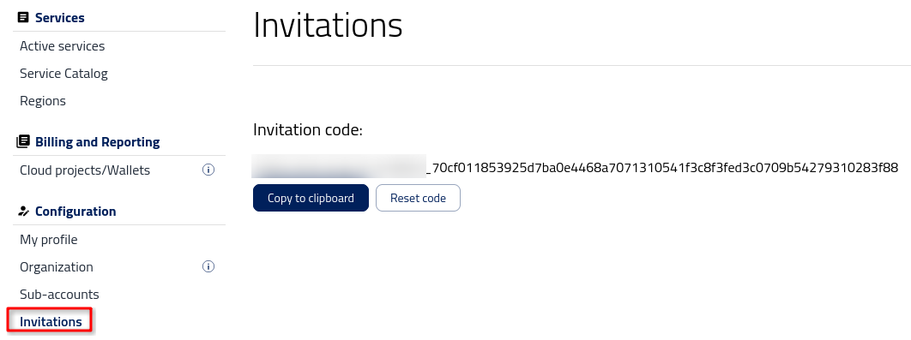

Inviting new user to your Organization
==========================================

.. important::

   One user can only be assigned to one organization at a time.

To invite a new user to your organization you need to share an **invitation code**.

After logging into |brand-name-site-auth-link| press **Invitations** button on the left bar menu.

Now you can copy an invitation code by clicking on **Copy to clipboard** button and send it to a new user by email.

After receiving the code, the user will join the organization by

 * clicking **Join an Organization** in **Organization** tab and
 * pasting the invitation code.

As an organization admin, you need to accept the invitation first.

Go to the **Invitations** tab and choose an invitation that you want to accept or -- in other case -- reject.

After accepting the invitation you will be able to add/edit roles. For more details please check :doc:`/accountmanagement/Users-and-roles/Users-and-roles`

