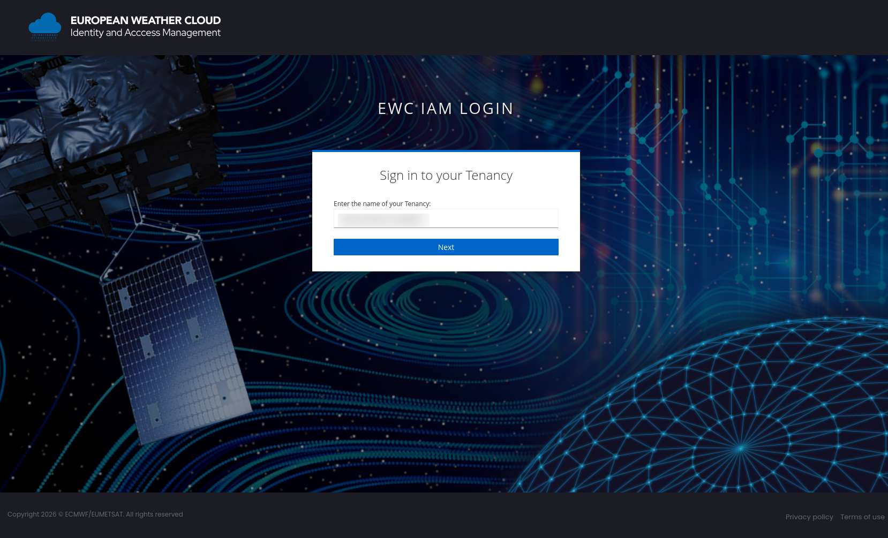
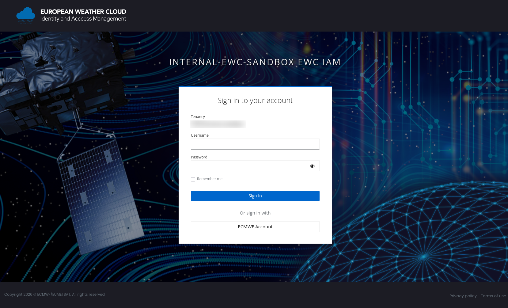
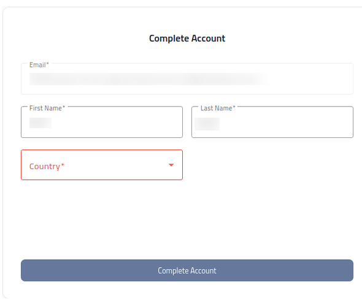
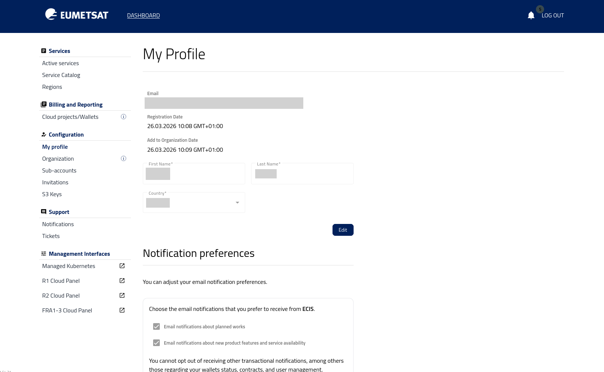

Log in to dashboard
===================

This article explains how to log in to the dashboard for the first time and complete your account setup.

First-time login to dashboard
-----------------------------

1. On the |brand-name-site-auth-link| page press **Log in**.

    .. figure:: access-your-account-portal.png
       :align: center
       :class: image-with-border

.. raw:: html

   

2. Click on **Sign in** from the following form:

    .. figure:: sign-into-your-account-portal.png
       :align: center
       :class: image-with-border

.. raw:: html

   

3. In form **Sign in to your Tenancy**, enter the name of the tenancy provided to you by the operator.

.. raw:: html

   

Click on **Next**.

4. Form **Sign in to your account**. Then fill in your credentials and press **Sign In**:

.. raw:: html

   

5. On the **Complete Account** page, review your account details and click Complete Account to confirm them:

.. raw:: html

   

6. Finally, log in to the portal. The **My Profile** page opens as the default landing page.

.. raw:: html

   

Subsequent logins
-----------------

For subsequent logins, the process is the same, except that the **5. Complete Account** step is not required.

What to do next
---------------

After you log in to the dashboard, check which services are available for your account. For more information, see :doc:`/accountmanagement/Service-catalog/Service-catalog`.