Management interfaces
=====================

This article explains how to open the management interfaces available from the portal.

The exact set of interfaces shown in your portal depends on the services and regions enabled for your account, so the options visible to you may differ from those shown in this article.

Prerequisites
-------------

Before you begin, make sure that:

.. jinja:: brand_names

   No. 1 **Account on {{ brand_name }} Dashboard**

You need an active user account and access to the |brand-name| Dashboard at |brand-name-site-auth-link|.

No. 2 **The required services are enabled for your account**

The management interfaces available in the portal depend on the services assigned to your account. Use option **Service Catalog** to see which services are active:

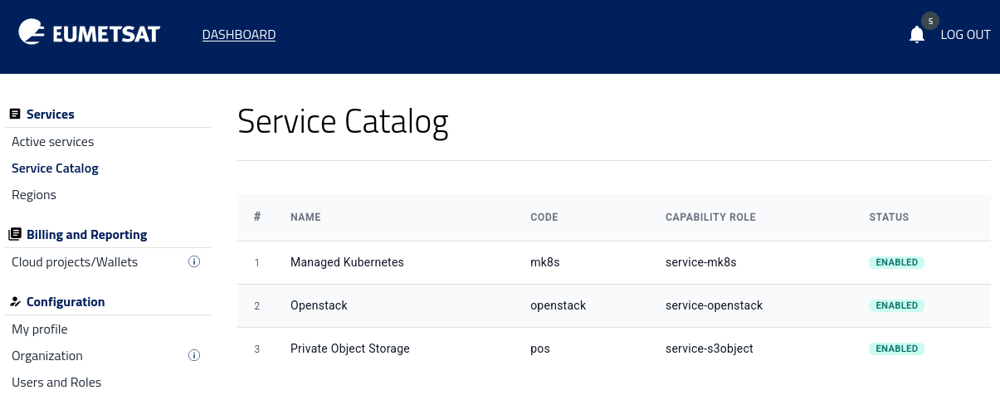

No. 3 **You have access to at least one region**

Some interfaces are region-specific, so the list of available regions may differ from one account to another. Use option **Regions** to see which regions are active:

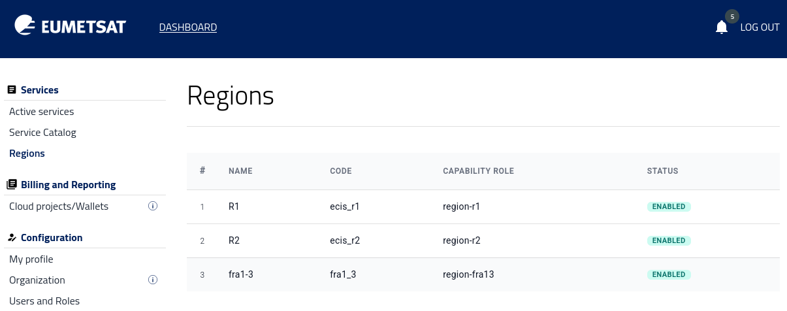

No. 4 **You have the necessary role to open the selected interface**

Some actions, such as obtaining **Keystone credentials**, may require administrator-level access in the portal. See article :doc:`/accountmanagement/Users-and-roles/Users-and-roles`.

No. 5 **Managed Kubernetes and OpenStack**

There are several management interfaces that you can open from the portal.

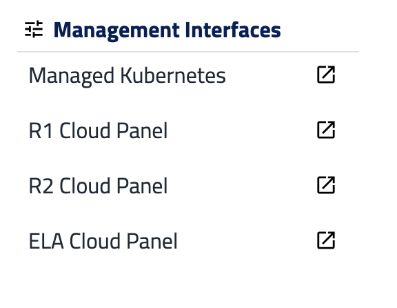

**Managed Kubernetes** is a Kubernetes service that runs separately from **OpenStack**. The other interfaces -- **R1**, **R2** and **FRA1-3** -- are **OpenStack** based, each within its own region.

For further details, see the :doc:`Managed Kubernetes section </kubernetes/kubernetes>` as well as :doc:`Cloud Services </cloud/cloud>`.

Managed Kubernetes
------------------

For this interface, click on **Managed Kubernetes** and then select one of the regions available to your account.

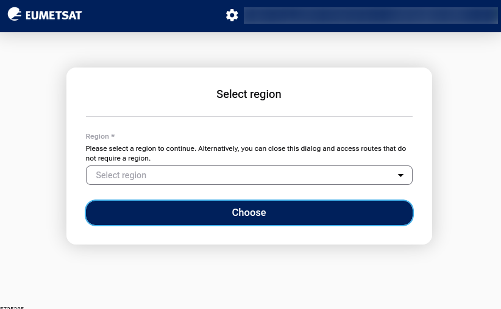

For example, you can select **FRA1-3**:

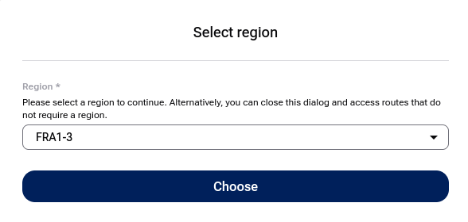

After that, the interface opens and displays the list of existing clusters in that region:

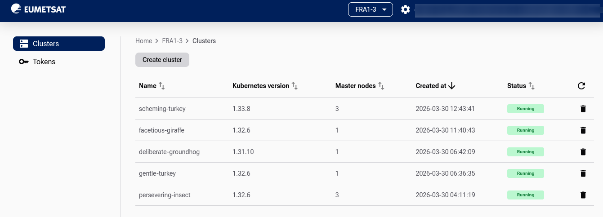

Clouds **R1** and **R2** are opened through the portal and use the EUMETSAT-branded login page.

Cloud **FRA1-3** may serve as an extension to R1 and/or R2 but is also a public CloudFerro cloud. Its Horizon interface is opened through the shared CloudFerro Horizon service at **horizon.cloudferro.com**, where you must first select youridentity provider and then choose the **FRA1-3** region.

R1 Cloud Panel
--------------

Clicking this option opens the following form:

You are the admin of the account
^^^^^^^^^^^^^^^^^^^^^^^^^^^^^^^^^^^

If you are an administrator of your account in the portal, click on button **Sign In** and proceed to the Horizon interface.

You are the user of the account
^^^^^^^^^^^^^^^^^^^^^^^^^^^^^^^^^^^^^

If you are a user of the account (meaning the admin of that account has previously assigned you a **member** role) click **Keystone credentials** and select **Keystone Credential** from the drop-down list:

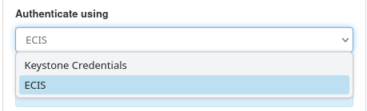

The form then changes as follows:

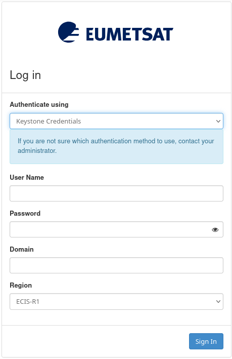

Enter the **User Name** and **Password** that were allocated to you in order to continue to the **Horizon** interface for **R1** region. Then use EWC IAM identity provider to sign in

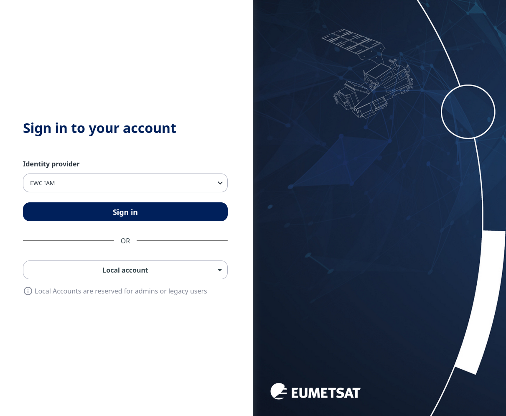

The next step is to enter the Horizon interface:

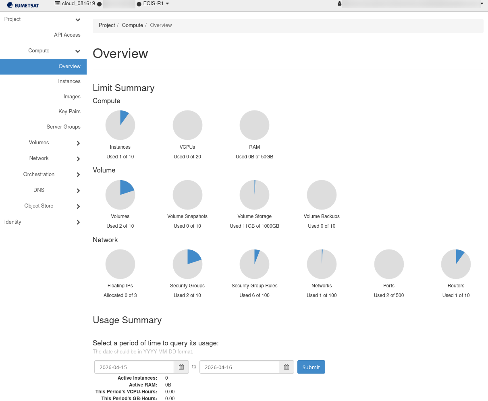

In the upper left corner you can see the projects and regions present:

R2 Cloud Panel
--------------

This option opens the **OpenStack Horizon** interface for region **R2**:

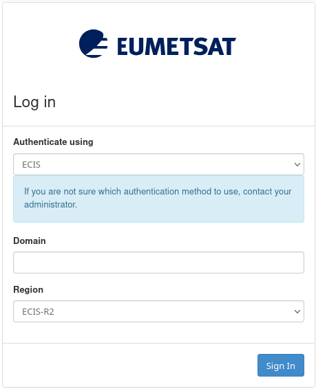

The same logic applies for both the admin and the user/member of the **R2** account.

You will end up in Horizon interface for region **R2**:

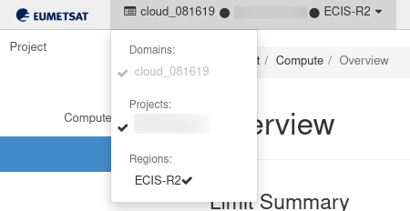

FRA1-3 Cloud Panel
------------------

This option opens the **OpenStack Horizon** interface for region **FRA1-3**:

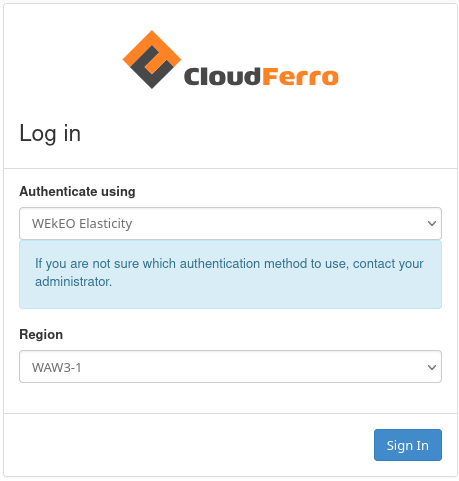

Note that you are logging in to one of the public clouds run by CloudFerro. First find ECIS in **Authenticate using** field

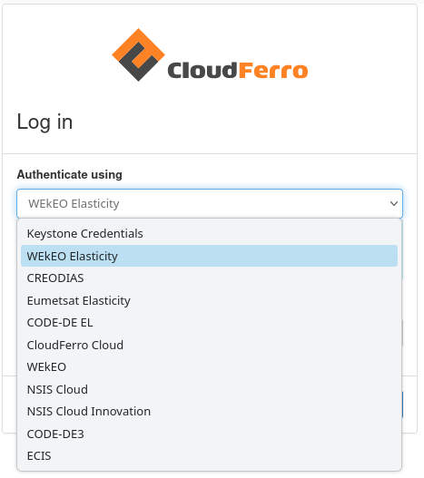

and then find **FRA1-3** in **Region** fields:

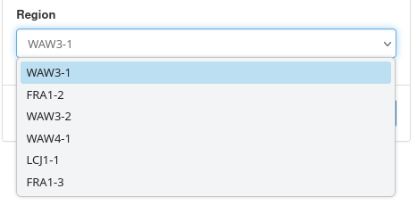

You should have this on the screen:

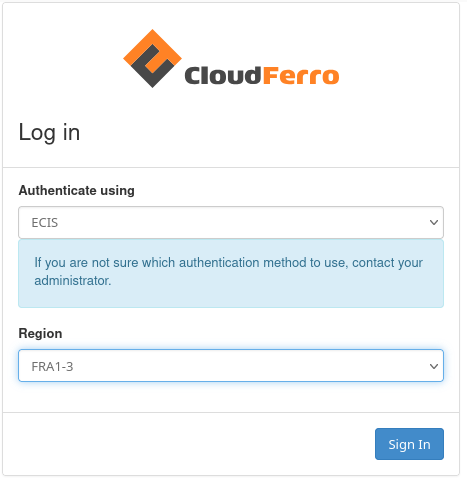

You should end up in Horizon interface:

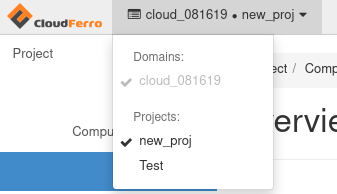

What To Do Next
-------------------

It is possible to use **OpenStack** in combination with **Managed Kubernetes** and **Private storage**, see :doc:`/accountmanagement/Service-catalog/Service-catalog`.

