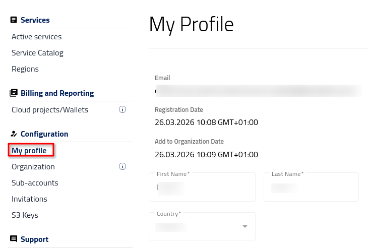

Editing profile
===============

After logging into |brand-name-site-auth-link| press **My Profile** button on the left bar menu.

Personal data
-------------

In **My Profile** tab you will be able to:

 * check your email address and registration date

 * view and edit your name and country.able

Notification preferences
------------------------

Notifications are the email messages that the panel will send you, from time to time and when there is a specific need. You can opt from receiving email notifications about

* planned works such availability or decommissioning of specific datasets or about

* new product features and services, for example, installing a new version of the software on the site.

You cannot opt out of receiving other transactional notifications, among others those regarding your wallets status, contracts, and user management.

.. figure:: notification-preferences--portal.png
   :class: image-with-border

Change of password
------------------

Enter the new password twice and start using it.

.. figure:: change-password--portal.png
   :class: image-with-border

It is a good practice to frequently change passwords!

Accepted agreements
-------------------

View and edit accepted agreements.

.. figure:: list-of-agreements--portal.png
   :class: image-with-border

The usual list of agreements that one can be offered when onboarding to a site may be divided into two parts:

Mandatory agreements
^^^^^^^^^^^^^^^^^^^^

You cannot use the site if you do not accept mandatory agreements:

* I agree that hat my personal data collected in this form will be processed in accordance with the Privacy Policy
* Terms of Access to Data
* General Terms and Conditions of Services

Voluntary agreements
^^^^^^^^^^^^^^^^^^^^

You may specify one or more from the likes of the following:

* Microsoft SPLA END USERS LICENSE TERMS
* I agree to share my personal data with partners specified in Privacy Policy
* I agree to receive marketing information from, including updates about products, services, industry trends, and upcoming events, to the email address provided above.

For voluntary agreements, you can change them any time you want.