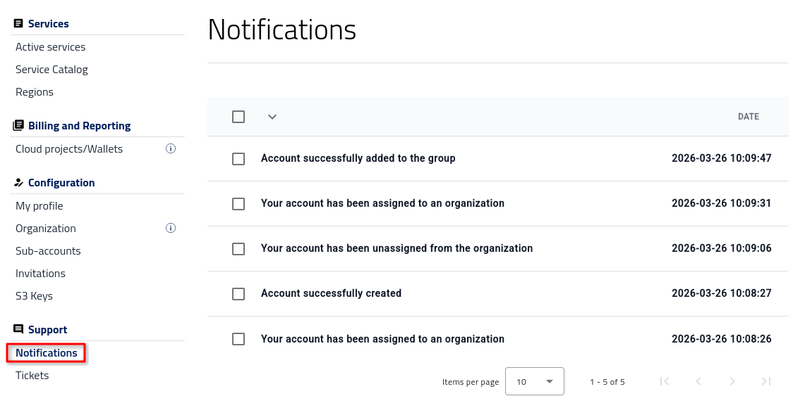
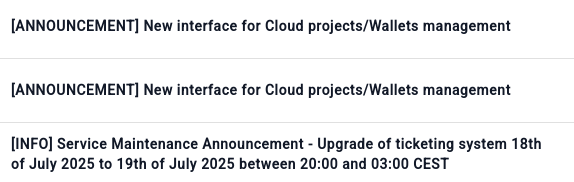

Notifications
=============

The **Notifications** section shows messages related to your account and to activity on the platform.

Use this section to review account-related updates, operator announcements, maintenance notices, and other important messages that may affect your access or services.

Prerequisites
-------------

No. 1 **Hosting account**

You need an active |brand-name| hosting account and access to the portal |brand-name-site-auth-link|.

No. 2 **User and roles**

Some notifications may reflect changes to your organization membership or assigned role. For background information, see :doc:`/accountmanagement/Users-and-roles/Users-and-roles`.

Overview
--------

Open option **Notifications** in the left-side menu under **Support**.

This section displays messages sent through the portal. These messages may concern:

* account creation and account status changes,
* assignment to or removal from an organization,
* changes related to groups or roles,
* service announcements,
* maintenance events, and
* portal updates.

Most notifications are informational, but some may describe changes that affect your access to services.

Account-related notifications
-----------------------------

When an account is first created, the notification list may contain setup-related events.

In the example above, the messages show that the account:

* was created,
* was assigned to an organization,
* was unassigned from an organization, and
* was added to a group.

These entries help you confirm that account and organization changes have been processed in the portal.

Similar messages may also appear later if your access, group membership, or organizational assignment changes.

Service and maintenance notifications
-------------------------------------

In regular use, the **Notifications** section is also used for operator announcements.

Notifications may appear under different message labels, such as **ANNOUNCEMENT** and **INFO**. These messages may cover new portal features, planned maintenance, service upgrades, fixes, and other operational updates.

Some of these notifications may also be sent by email, especially when they concern maintenance, availability, or other service-impacting changes. Examples include advance notice of planned work, scheduled improvements, or temporary service unavailability during a specific time window.

Review this section from time to time, especially before starting important work or when you notice a change in portal behavior.

What to do next
---------------

For more information related to account access and portal usage, see:

* :doc:`/accountmanagement/Users-and-roles/Users-and-roles`
* :doc:`/accountmanagement/Management-interfaces/Management-interfaces`
* :doc:`/accountmanagement/Regions/Regions`
* :doc:`/accountmanagement/Help-Desk-And-Support/Help-Desk-And-Support`