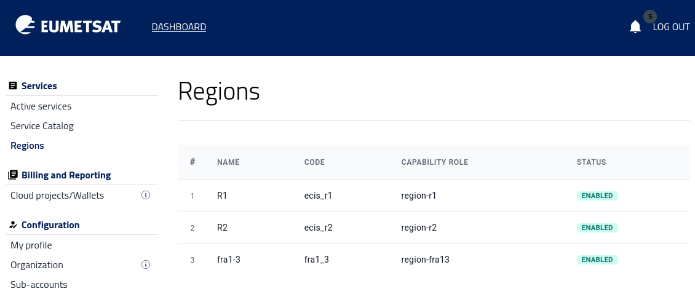

Regions
=======

The |brand-name| platform can provide access to the following regions: **R1**, **R2**, and **FRA1-3**.

Prerequisites
-------------

No. 1 **Hosting account**

You need an active |brand-name| hosting account and access to the portal |brand-name-site-auth-link|.

No. 2 **Management interfaces**

From the portal, you can access four different management interfaces, as described in :doc:`/accountmanagement/Management-interfaces/Management-interfaces`.

Available regions
-----------------

This option, **Regions**, shows which regions are currently enabled for your account.

Use it to check which regional environments are available to you before creating resources or opening a management interface.

Only the regions shown here are available to your account in the portal.

The set of available regions may differ between users and projects. If you need access to a region that is not listed, contact the operator as described in :doc:`/accountmanagement/Help-Desk-And-Support/Help-Desk-And-Support`.