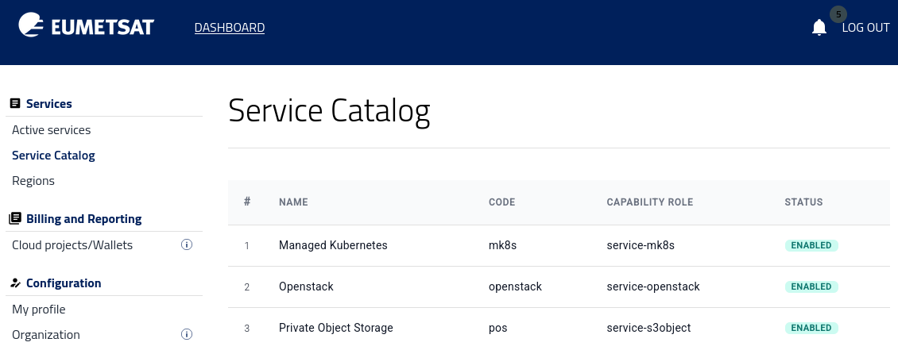
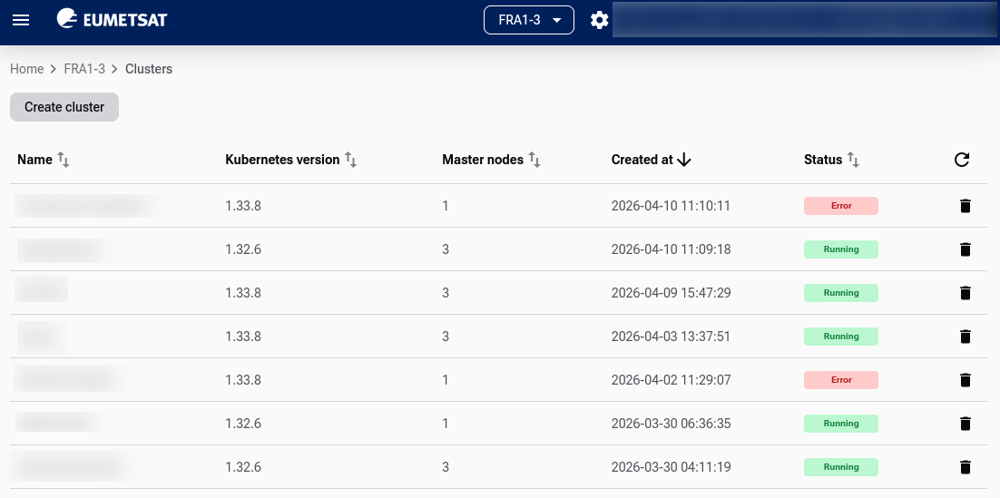
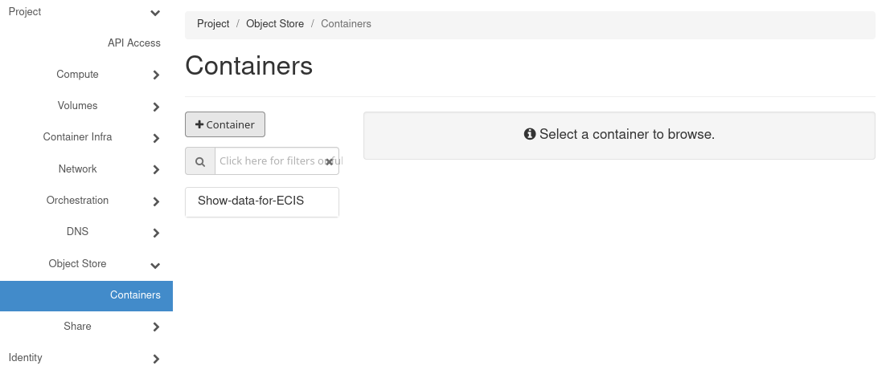

Services available
==================

This article describes the services available in the Service Catalog and explains how to use the catalog to check which services are enabled for your account, choose services that fit your project needs, and request access to additional services.

Prerequisites
----------------

.. jinja:: brand_names

   No. 1 **Account on {{ brand_name }} Dashboard**

You need an active user account and access to the |brand-name| panel at |brand-name-site-auth-link|.

No. 2 **Check services available at your account**

To check which services are available for your account:

1. Log in to the dashboard, using one of the links from above.
2. In the navigation menu, go to **Services**.
3. Select **Service Catalog**.

The **Service Catalog** page shows the services that are available for your account. Use this page before starting a project to confirm which services you can use.

If the service you need is not available for your account, request access to it. See :ref:`request_additional_services` at the end of this article.

This is what it looks like when all of the services are present:

The available services are **OpenStack**, **Managed Kubernetes** and **Private Object Storage**.

No. 3 **Management interfaces**

See article :doc:`/accountmanagement/Management-interfaces/Management-interfaces` for instructions how to select and enter the appropriate environment towards Horizon in **R1**, **R2** or **FRA1-3** regions.

OpenStack
-----------

**OpenStack** is the core infrastructure service for running virtual machines and related cloud resources.

For many projects, this is the most natural starting point. It suits practical workloads such as a blog, a **WordPress** site, a company website, an image or media site, a database server, a VPN server, a firewall appliance, or a **JupyterLab** environment. It is also the right choice when full control over the operating system, installed software, and server configuration matters.

**OpenStack** supports traditional server-based hosting and custom virtual machine setups. Its GUI is called Horizon and you can access it via the following links:

.. tabs::

   .. tab:: R1

        https://horizon.api.r1.cloud.eumetsat.int/

        .. figure:: Screenshot_20260527_161140.png
           :class: image-with-border

        Horizon on R1 region

   .. tab:: R2

        https://horizon.api.r2.cloud.eumetsat.int/

        .. figure:: Screenshot_20260527_161323.png
           :class: image-with-border

        Horizon on R2 region

   .. tab:: ELA

        https://horizon.cloudferro.com/, then choose **ECIS** and **FRA1-3** as the region.

        .. figure:: Screenshot_20260527_161411.png
           :class: image-with-border

        Horizon on FRA1-3 region

For Horizon, the documentation starts at :doc:`/cloud/cloud` and for the CLI, it is at :doc:`/openstackcli/openstackcli`.

Managed Kubernetes
-------------------

**Managed Kubernetes** is designed for applications built from containers.

It is a good fit for platforms made of several components, such as a web application with an API, background workers, and scheduled jobs. It also suits projects that are expected to grow and may later need simpler scaling, rolling updates, and more structured deployment.

In practice, this service is best suited to modern application platforms rather than to a simple website or a single server.

.. jinja:: brand_names

   Start working with Managed Kubernetes through the following link: https://{{ mk8s_url }}.

   The documentation for |brand-name| site is here: :doc:`/kubernetes/kubernetes`.

Private Object Storage
-----------------------

S3 is the standard protocol for modern object storage, may be used for large quantities of data. It is well suited to backups, archives, datasets, uploaded files, media libraries, logs, and other large collections of files. The service uses an **S3-compatible** interface, so it can be accessed by many existing tools, scripts, and applications that already support the **S3** protocol.

This makes it especially useful when files should be kept separately from a virtual machine or container environment.

For an array of articles on using S3 standard to enter and store data, see section :doc:`/s3/s3`. Regions R1 and R2 do not have Horizon interface for private object storage, while region FRA1-3 does have it. In Horizon for FRA1-3, you would see it as option **Project** -> **Containers**.

You should also be able to use private object service as a standalone service.

Which service fits which kind of project
-----------------------------------------

A simple website, blog, **WordPress** site, or business application will usually fit best on **OpenStack**.

A container-based application with several connected components will usually fit best on **Managed Kubernetes**.

A backup repository, file archive, dataset collection, or media library will usually fit best on **Private Object Storage**.

Many real projects, however, do not rely on a single service.

Typical service combinations
------------------------------------

**Private Object Storage** pairs well with both **OpenStack** and **Managed Kubernetes**.

The former combination is excellent for a website or custom application running on a virtual machine, while backups, uploaded files, exports, or media content are kept in object storage.

With **Managed Kubernetes** and **Private Object Storage**, you can have an application running in containers, while uploads, static assets, logs, and backup data are stored separately.

For EO data and analytical work, **OpenStack** and **Private Object Storage** are often used together. For example, you can run **JupyterLab** on a virtual machine, access datasets stored through an **S3-compatible** interface, test notebooks and scripts on those data, and save processed results back to object storage.

For larger platforms, **OpenStack** and **Managed Kubernetes** can take on different roles in the same environment. Supporting services such as a VPN gateway, bastion host, monitoring node, or administration server can remain on virtual machines, while the main application runs on Kubernetes.

In more advanced setups, all three services may be combined. In that model, **Managed Kubernetes** runs the application layer, **OpenStack** hosts supporting services or administration tools, and **Private Object Storage** keeps datasets, backups, generated files, and user uploads.

A practical way to decide
--------------------------

For straightforward projects such as a website, a server, **JupyterLab**, or custom software, start with **OpenStack**.

For applications that need structured deployment, easier scaling, and automation, start with **Managed Kubernetes**.

For files, backups, and datasets, start with **Private Object Storage**.

If your project needs both computing power and data storage, plan to combine services.

.. _request_additional_services:

How to request additional services
----------------------------------------

If the service you need is not available for your account, contact the operator by email.

In the dashboard, go to Account Manager > Help Desk and Support. The page provides the contact email address for support requests. Alternatively, you can visit page  :doc:`/accountmanagement/Help-Desk-And-Support/Help-Desk-And-Support`.

In your message, include:

 * the name of the service you want to request
 * your account or project details
 * a short explanation of why you need the service
