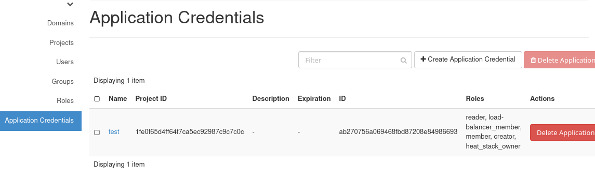
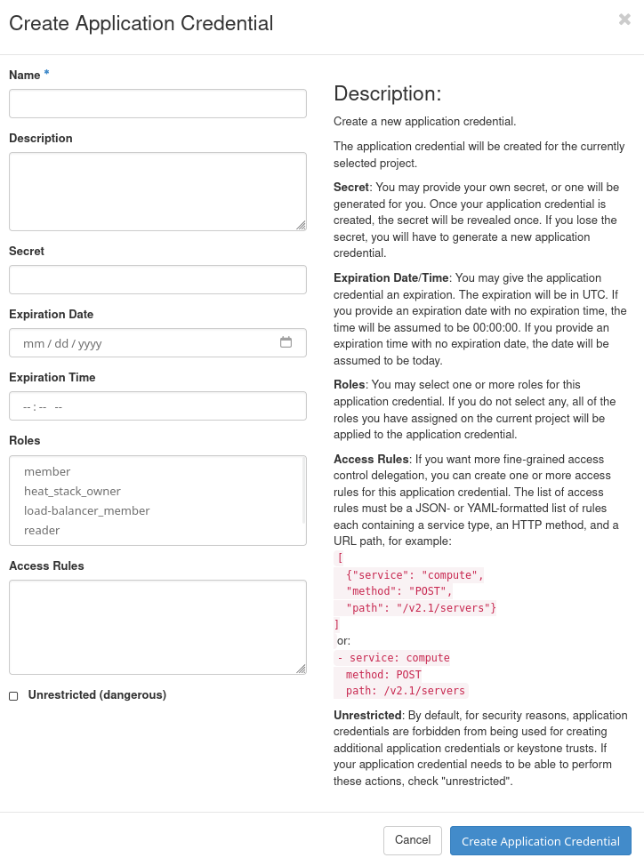
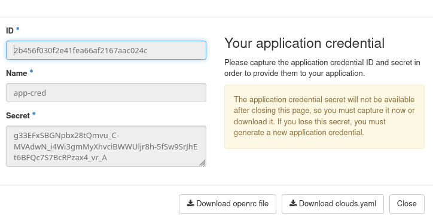
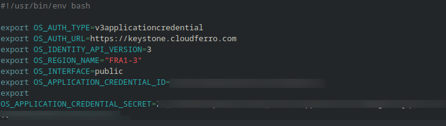
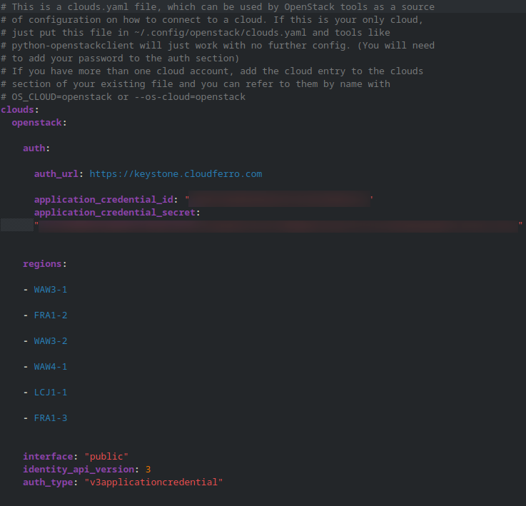

Use Horizon to create an application credential on |brand-name|
==========================================================================

Cloud parameters for authentication and later OpenStack CLI access are stored in an OpenStack environment file, often called an *RC file*. When you use application credentials, Horizon can also provide a **clouds.yaml** file.

This article explains how to create an application credential in Horizon, download the generated access files, and use them to authenticate with the OpenStack CLI.

What We Are Going To Cover
------------------------------

* How to create an application credential in Horizon
* How to download the generated **openrc.sh** file
* How to use the **openrc.sh** file for OpenStack CLI access
* How to download and use the **clouds.yaml** file
* How to switch between regions by using **clouds.yaml**
* How to test the connection
* How to resolve common errors
* What the application credential fields mean

Prerequisites
-------------------

No. 1 **Account**

You need a |brand-name| hosting account with access to the Horizon interface:

   .. jinja:: horizon_interfaces

      .. tabs::

         
         .. tab:: {{ item.label }}

            {{ item.url }}

            
            {{ item.note }}
            

         

No. 2 **OpenStackClient installed and available**

RC file sets up the values of local environment variables and is a Bash file, ending in .sh. Here is how to run it on various operating systems:

Install GitBash on Windows
   .. jinja:: brand_names

      Run **.sh** files and install OpenStackClient from a GitBash window under Windows:  :doc:`/openstackcli/How-to-install-OpenStackClient-GitBash-or-Cygwin-for-Windows-on-{{ brand_name_hyphen }}/How-to-install-OpenStackClient-GitBash-or-Cygwin-for-Windows-on-{{ brand_name_hyphen }}`.

Install and run WSL (Linux under Windows)
   .. jinja:: brand_names

      Run **.sh** files and install OpenStackClient from a Ubuntu window under Windows. :doc:`/openstackcli/How-to-install-OpenStackClient-on-Windows-using-Windows-Subsystem-for-Linux-on-{{ brand_name_hyphen }}-OpenStack-Hosting/How-to-install-OpenStackClient-on-Windows-using-Windows-Subsystem-for-Linux-on-{{ brand_name_hyphen }}-OpenStack-Hosting`.

Install OpenStackClient on Linux
   .. jinja:: brand_names

      :doc:`/openstackcli/How-to-install-OpenStackClient-for-Linux-on-{{ brand_name_hyphen }}/How-to-install-OpenStackClient-for-Linux-on-{{ brand_name_hyphen }}`.

Create a new application credential
-----------------------------------------

On regions R1 and R2, the usual Horizon login credentials are not used directly as OpenStack CLI credentials. Instead, OpenStack provides *application credentials*. An application credential gives command-line tools and automation scripts their own authentication data without exposing your interactive login credentials.

In Horizon, use the following command chain:

**Identity** -> **Application Credentials** -> **+ Create Application Credential**.

   Opening the Application Credentials page in Horizon

Then enter the required data in the **Create Application Credential** form.

   Creating a new application credential

.. note::

   The options in this form are described at the end of this article in more detail.

The fastest option is to enter only the credential name in the **Name** field. If you do not change the other fields, Horizon uses their default values.

After entering the name, click **Create Application Credential**.

   Application credential details after creation

Save the values shown in the following fields:

* **ID**
* **Name**
* **Secret**

.. warning::

   The application credential secret is shown only once. It will not be available after you close this page. Save it now or download one of the generated credential files. If you lose the secret, you must create a new application credential.

Download the openrc file
-----------------------------

After the application credential is created, click **Download openrc file**.

Horizon downloads a shell file similar to this:

   Downloaded application credential openrc file

This file is a reduced version of a standard OpenStack RC file. It already contains the application credential ID and secret in the correct places.

On Linux, you can activate it with **source**:

.. code-block:: console

   source ./app-cred-openrc.sh

Replace **app-cred-openrc.sh** with the actual file name downloaded from Horizon.

After the file is sourced, the required authentication variables are available in the current terminal session. You can then run OpenStack CLI commands against the selected region.

For example:

.. code-block:: console

   openstack token issue

If authentication works, the command returns token information.

You can also test access by listing projects, servers, networks, or images, depending on the permissions assigned to your account and application credential:

.. code-block:: console

   openstack server list
   openstack network list
   openstack image list

Download the clouds.yaml file
--------------------------------

You can also download the **clouds.yaml** file from the same application credential page.

It looks similar to this:

   Downloaded clouds.yaml file

The **clouds.yaml** file contains the application credential ID and secret. Unlike an **openrc.sh** file, it can store multiple cloud or region definitions in one place.

This is useful when you want to switch between regions without repeatedly sourcing different shell files.

Where to place clouds.yaml
-----------------------------

By default, the OpenStack CLI looks for **clouds.yaml** in this location:

.. code-block:: console

   ~/.config/openstack/clouds.yaml

Create the directory if it does not already exist:

.. code-block:: console

   mkdir -p ~/.config/openstack

Then copy the downloaded file to that location:

.. code-block:: console

   cp ./clouds.yaml ~/.config/openstack/clouds.yaml

Replace **./clouds.yaml** with the actual path to the downloaded file if needed.

Use clouds.yaml with OpenStack CLI
--------------------------------------

When **clouds.yaml** is in place, you can choose the cloud entry with the **--os-cloud** parameter.

For example:

.. code-block:: console

   openstack --os-cloud ecis-r1 token issue

You can also export the selected cloud once and then omit **--os-cloud** from later commands:

.. code-block:: console

   export OS_CLOUD=ecis-r1

   openstack token issue
   openstack server list
   openstack network list

The value **ecis-r1** is only an example. Use the actual cloud name defined in your downloaded **clouds.yaml** file.

Switch from one region to another by using clouds.yaml
---------------------------------------------------------

A **clouds.yaml** file can contain more than one entry. Each entry can point to a different region while using the same application credential authentication method.

A simplified example may look like this:

.. code-block:: yaml

   clouds:
     ecis-r1:
       auth:
         auth_url: https://identity.api.r1.cloud.eumetsat.int/v3
         application_credential_id: 11111111111111111111111111111111
         application_credential_secret: "REPLACE_WITH_SECRET"
       region_name: ECIS-R1
       interface: public
       identity_api_version: 3
       auth_type: v3applicationcredential

     ecis-r2:
       auth:
         auth_url: https://identity.api.r2.cloud.eumetsat.int/v3
         application_credential_id: 11111111111111111111111111111111
         application_credential_secret: "REPLACE_WITH_SECRET"
       region_name: ECIS-R2
       interface: public
       identity_api_version: 3
       auth_type: v3applicationcredential

In this example, the file defines two OpenStack CLI targets:

* **ecis-r1**
* **ecis-r2**

To use the first region, run:

.. code-block:: console

   openstack --os-cloud ecis-r1 server list

To use the second region, run:

.. code-block:: console

   openstack --os-cloud ecis-r2 server list

You can also switch the active region for the current terminal session by changing **OS_CLOUD**:

.. code-block:: console

   export OS_CLOUD=ecis-r1
   openstack server list

   export OS_CLOUD=ecis-r2
   openstack server list

This method is convenient when you frequently work with more than one region.

.. note::

   Use the exact **auth_url**, **region_name**, application credential ID, and application credential secret from the files downloaded from Horizon. The values shown above are examples.

Test the connection
-----------------------

After activating either the **openrc.sh** file or the **clouds.yaml** entry, test authentication first:

.. code-block:: console

   openstack token issue

If the token command works, test access to common OpenStack resources:

.. code-block:: console

   openstack project list
   openstack server list
   openstack network list
   openstack image list

The exact results depend on your assigned roles and the project selected for the application credential.

Use application credentials in scripts
------------------------------------------

Application credentials are suitable for scripts and automation because they avoid using your interactive user login data.

For example, after setting **OS_CLOUD**, a script can call OpenStack CLI commands directly:

.. code-block:: bash

   #!/usr/bin/env bash

   set -euo pipefail

   export OS_CLOUD=ecis-r1

   echo "Testing OpenStack authentication..."
   openstack token issue

   echo "Listing servers..."
   openstack server list

You can also pass the cloud entry directly:

.. code-block:: bash

   #!/usr/bin/env bash

   set -euo pipefail

   openstack --os-cloud ecis-r1 token issue
   openstack --os-cloud ecis-r1 server list

Using **--os-cloud** makes the script explicit and avoids depending on an existing terminal environment.

Protect credential files
----------------------------

The **openrc.sh** and **clouds.yaml** files contain secrets. Store them carefully and do not commit them to Git repositories.

After copying **clouds.yaml** into place, restrict access to the file:

.. code-block:: console

   chmod 600 ~/.config/openstack/clouds.yaml

If you keep downloaded **openrc.sh** files on disk, protect them as well:

.. code-block:: console

   chmod 600 ./app-cred-openrc.sh

Resolving common errors
---------------------------

Authentication fails
^^^^^^^^^^^^^^^^^^^^^^^^

If authentication fails, verify that the application credential ID and secret are correct.

For **clouds.yaml**, check that the selected cloud entry exists:

.. code-block:: console

   openstack --os-cloud ecis-r1 token issue

If the cloud name is wrong, the OpenStack CLI cannot load the correct configuration.

Secret was lost
^^^^^^^^^^^^^^^^^^^

If you no longer have the application credential secret, you cannot recover it from Horizon.

Create a new application credential and download new access files.

Wrong region is used
^^^^^^^^^^^^^^^^^^^^^^^^

If commands return resources from the wrong region, check the selected cloud entry:

.. code-block:: console

   echo "$OS_CLOUD"

You can switch to another region by changing **OS_CLOUD**:

.. code-block:: console

   export OS_CLOUD=ecis-r2

Or by passing the cloud name directly:

.. code-block:: console

   openstack --os-cloud ecis-r2 server list

Permission denied
^^^^^^^^^^^^^^^^^^^^^

If authentication works but a command returns a permission error, your user account or application credential may not have the required role for that operation.

For example, you may be able to list networks but not create new ones, or you may be able to view servers but not delete them.

Create a new application credential with the correct roles, or contact your project administrator.

clouds.yaml is ignored
^^^^^^^^^^^^^^^^^^^^^^^^^^

If the OpenStack CLI does not use your **clouds.yaml** file, verify that it is stored in the default location:

.. code-block:: console

   ~/.config/openstack/clouds.yaml

You can also point the OpenStack CLI to a specific file by setting **OS_CLIENT_CONFIG_FILE**:

.. code-block:: console

   export OS_CLIENT_CONFIG_FILE=/path/to/clouds.yaml

Then test again:

.. code-block:: console

   openstack --os-cloud ecis-r1 token issue

Application credential fields explained
--------------------------------------------

For a basic CLI setup, you usually need only a clear **Name**. Leave **Secret** empty so Horizon can generate it, and keep the advanced fields unchanged unless you have a specific reason to limit the credential further.

Use the fields as follows:

**Name**
   Should be a short name that explains the purpose of the credential, for example **cli-access-r1**, **backup-script-r2**, or **automation-readonly**. Avoid generic names such as **test**, **new**, or **credential1**, because they become difficult to recognize later.

**Description**
   Optional, but useful when the credential belongs to a script, machine, workflow, or temporary task. The description is only a note. It does not affect authentication.

   Example:

   .. code-block:: text

      Used by backup script on admin VM. Created for ECIS-R1 CLI access.

**Secret**
   Leave this field empty unless you must provide your own value. Horizon generates the secret automatically and shows it only once. Save it immediately. If the secret is lost, create a new application credential.

**Expiration Date**
   Leave empty for regular CLI access from a trusted workstation. Set a date for temporary tests, troubleshooting, one-time automation, or credentials that should stop working automatically.

**Roles**
   For normal CLI access, the default role selection is usually enough. For automation, assign only the roles the script actually needs. A script that only lists resources should not receive broad permissions.

**Unrestricted**
   Keep disabled unless your workflow specifically requires operations that standard application credentials cannot perform. It is not needed for ordinary OpenStack CLI commands.

**Access Rules**
   Usually left empty. Use access rules only when you need API-level restrictions, for example to limit the credential to selected OpenStack services or API paths.

**ID**
   The identifier used by OpenStack tools together with the secret. In **clouds.yaml**, it appears as **application_credential_id**. The ID alone is not enough to authenticate, but complete **openrc.sh** and **clouds.yaml** files must still be protected because they usually contain both the ID and the secret.

Protect downloaded credential files carefully. Do not commit them to Git repositories, paste them into tickets, or include them in public documentation.

What to do next
---------------------

.. jinja:: brand_names

   :doc:`/accountmanagement/How-to-activate-OpenStack-CLI-access-to-{{ brand_name_hyphen }}-cloud/How-to-activate-OpenStack-CLI-access-to-{{ brand_name_hyphen }}-cloud`