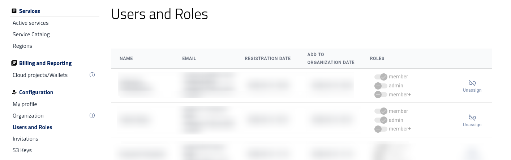
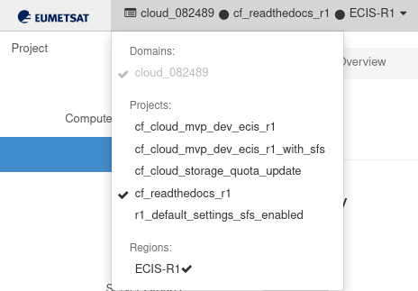
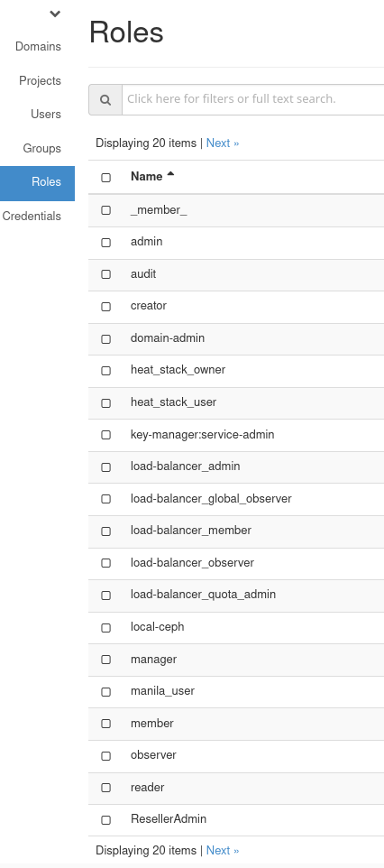

Tenant Manager users and roles
==============================

This article explains how user roles work in Tenant Manager and OpenStack. It describes the available Tenant Manager roles, compares the menu options available to each role, and explains what the roles mean for OpenStack and S3 access.

What Are We Going To Cover
--------------------------

* The difference between OpenStack user roles and Tenant Manager roles.
* The Tenant Manager roles available to users in an organization.
* The Tenant Manager menu options visible to each role.
* What the roles mean for OpenStack and S3 access.

Difference between OpenStack user roles and Tenant Manager roles
----------------------------------------------------------------

An OpenStack role is a set of permissions that a user assumes to perform a specific set of operations in OpenStack. A role includes a set of rights and privileges. A user assuming that role inherits those rights and privileges.

OpenStack roles are assigned for each user and each project independently. This means that the same user may have different OpenStack permissions in different projects.

A Tenant Manager role, on the other hand, controls what the user can do in Tenant Manager and across organization services. It defines whether the user can manage the organization, invite and manage users, access billing-related information, manage S3 keys, or use organization services.

Tenant Manager roles
--------------------

The following three Tenant Manager roles are available:

**admin**
   Corresponds to **Service/App Admin**.

   The organization administrator role, providing full administrator permissions for services within the organization or workspace, including all resources. An **admin** can manage the organization, manage users and roles, access billing-related information, manage S3 keys, use organization services, and access the ticket module.

   This tenant role includes the following OpenStack roles:

   * **creator**
   * **domain_admin**
   * **member**
   * **manila_user**
   * **heat_stack_owner**
   * **load-balancer_member**

   Users with this role can manage their own S3 keys, providing full control over S3 resources within the organization account. This includes object operations such as uploading, modifying, and deleting objects inside assigned buckets.

**member+**
   Corresponds to **Service/App Memberplus**.

   This role provides extended service permissions within the organization or workspace. It gives access to all organization services except billing-related matters.

   Users with this role can access the ticket module, manage their S3 keys, and use the organization services available to them. However, they cannot manage the organization itself, invite users, assign roles, or access billing-related functions.

   This tenant role includes the following OpenStack roles:

   * **creator**
   * **member**
   * **manila_user**
   * **heat_stack_owner**
   * **load-balancer_member**

   Users with this role can manage their S3 keys and have access to full object operations, including uploading, modifying, and deleting objects inside assigned buckets. However, they cannot change the global S3 configuration.

**member**
   Corresponds to **Service/App Member**.

   This is the default user role with read-only permissions for services within the organization or workspace. Users with this role can view statistics and access the ticket module, but they do not have permission to use organization services in the same way as **admin** or **member+** users.

   This tenant role includes exactly one OpenStack role: **member**.

Users and roles in Tenant Manager
--------------------------------------

Tenant Manager roles are managed by users with the **admin** role. Only an **admin** can open **Users and Roles**, view the full list of organization users, invite users, remove users, and assign Tenant Manager roles.

After logging into |brand-name-site-auth-link| as an **admin**, click **Users and Roles** in the left sidebar menu.

On the **Users and Roles** page, an **admin** can:

* Check the organization's list of users and their roles.
* Add users to the organization.
* Remove users from the organization.
* Assign Tenant Manager roles to users.

Tenant Manager menu options by role
-----------------------------------

Most Tenant Manager menu options are available to all three roles: **admin**, **member**, and **member+**. These shared options are:

.. jinja:: caption_colors

   .. list-table:: :{{ caption }}:`Tenant Manager menu options available to all roles`
      :header-rows: 1
      :widths: 35 65

      * - :{{ header }}:`Menu group`
        - :{{ header }}:`Menu options`
      * - **Services**
        - **Active services**, **Service Catalog**,

           **Regions**
      * - **Configuration**
        - **My profile**, **Organization**
      * - **Support**
        - **Notifications**, **Tickets**
      * - **Management Interfaces**
        - **Managed Kubernetes**, **R1 Cloud Panel**,

          **R2 Cloud Panel**, **ELA Cloud Panel**

The options that differ by role are shown in the following table.

.. jinja:: caption_colors

   .. list-table:: :{{ caption }}:`Tenant Manager menu options that differ by role`
      :header-rows: 1
      :widths: 45 18 18 19

      * - :{{ header }}:`Menu option`
        - :{{ header }}:`admin`
        - :{{ header }}:`member`
        - :{{ header }}:`member+`
      * - **Billing and Reporting** → **Cloud projects/Wallets**
        - ✓
        - —
        - —
      * - **Configuration** → **Users and Roles**
        - ✓
        - —
        - —
      * - **Configuration** → **Invitations**
        - ✓
        - —
        - —
      * - **Configuration** → **S3 Keys**
        - ✓
        - —
        - ✓

The **S3 Keys** option is available only to **admin** and **member+** users. The permissions of the generated keys depend on the user's assigned S3 service role.

.. jinja:: caption_colors

   .. list-table:: :{{ caption }}:`S3 permissions by Tenant Manager role`
      :header-rows: 1
      :widths: 20 30 50

      * - :{{ header }}:`Tenant Manager role`
        - :{{ header }}:`S3 service role`
        - :{{ header }}:`S3 permissions`
      * - **admin**
        - **s3object-admin**
        - Full control over S3 resources within

          the organization account.
      * - **member+**
        - **s3object-memberplus**
        - Can upload, modify, and delete objects

          inside assigned buckets, but cannot change

          global S3 configuration.
      * - **member**
        - **s3object-member**
        - Does not have the **S3 Keys** option

          in Tenant Manager.

OpenStack access by Tenant Manager role
---------------------------------------

Tenant Manager roles are connected with OpenStack roles, but they are not assigned in Horizon. Tenant Manager roles are assigned by an **admin** in the **Users and Roles** page of Tenant Manager.

After a Tenant Manager role has been assigned, the user can log in to the appropriate Horizon interface for the region they want to use.

.. tabs::

   .. tab:: R1

      https://horizon.api.r1.cloud.eumetsat.int/

   .. tab:: R2

      https://horizon.api.r2.cloud.eumetsat.int/

   .. tab:: ELA

      https://horizon.cloudferro.com/

      Choose **ECIS** and **FRA1-3** as the region.

After logging in, check the upper-left corner of the Horizon interface. It shows the cloud and project you are currently working with.

.. jinja:: caption_colors

   .. list-table:: :{{ caption }}:`Example Horizon context shown in the upper-left corner`
      :header-rows: 1
      :widths: 30 70

      * - :{{ header }}:`Value`
        - :{{ header }}:`Meaning`
      * - **cloud_962489**
        - Internal label of the cloud.
      * - **cf_readthedocs_r1**
        - Project name.
      * - **ECIS-R1**
        - Current region or cloud panel. You can change it by clicking the downward arrow next to the label.

In Horizon, the **Identity** section may show projects and roles, depending on the permissions available to the logged-in user. However, Horizon is not used in this procedure to assign Tenant Manager roles.

You can view the list of available OpenStack roles by selecting **Identity** → **Roles**.

This page shows the available OpenStack roles. It does not assign Tenant Manager roles to users. To change a user's Tenant Manager role, an **admin** must use **Users and Roles** in Tenant Manager.

If a user cannot access the expected OpenStack service after the Tenant Manager role has been assigned, check the following:

* The user has the correct Tenant Manager role.
* The user is logging in to the correct Horizon interface for the required region.
* The user has selected the correct project or region in Horizon.
* The OpenStack service is available to the organization.

If the user still cannot access the required service, contact support.

What To Do Next
---------------

.. jinja:: brand_names

   The article :doc:`/accountmanagement/Invitations/Invitations` shows how to invite a new user.

   The article :doc:`/accountmanagement/Removing-User-From-Organization/Removing-User-From-Organization` shows how to remove a user from the organization.