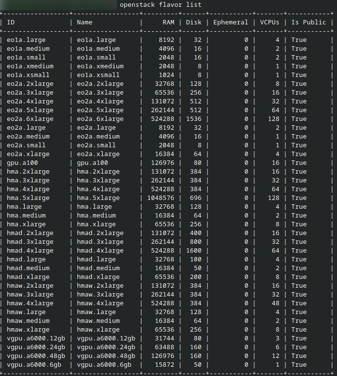
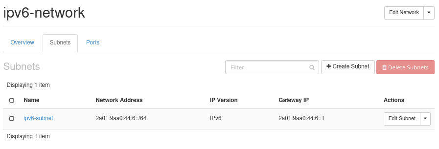
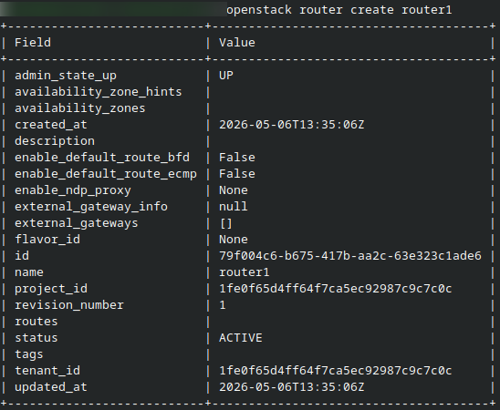
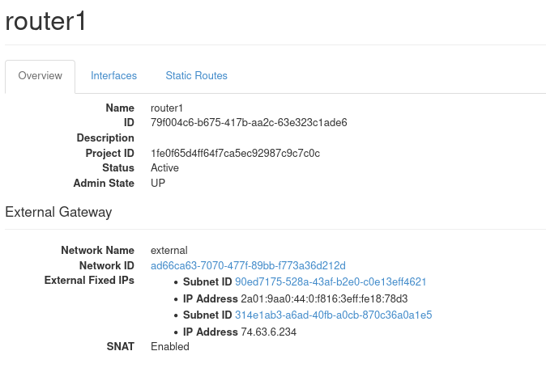
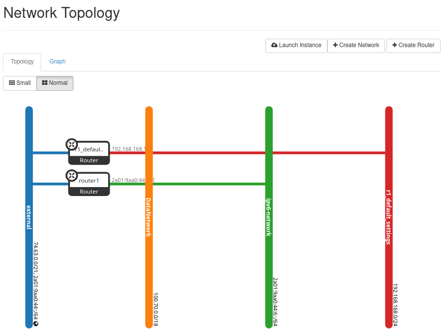
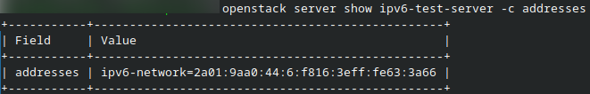
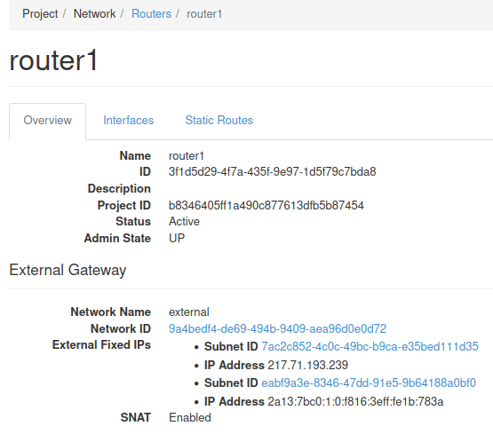
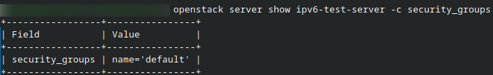
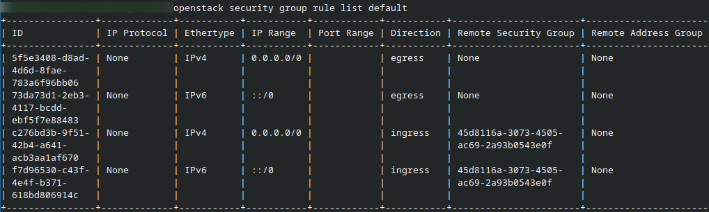
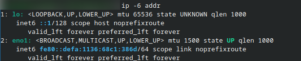

Create an IPv6 network on |brand-name|
======================================

This article shows the normal tenant workflow for creating an IPv6-enabled network on |brand-name| by using the OpenStack CLI.

By the end of this article, you will have:

* created a network
* created an IPv6 subnet
* created a router
* attached the subnet to the router
* attached an instance to the network
* confirmed that the instance received an IPv6 address

If you want to understand why these settings are recommended and what IPv6 limitations to keep in mind, continue with the companion article:

.. jinja:: brand_names

   * :doc:`/cloud/Understand-IPv6-on-{{ brand_name_hyphen }}`

.. raw:: html

   <h2>What we are going to cover</h2>

.. contents::
   :depth: 2
   :local:
   :backlinks: none

Prerequisites
^^^^^^^^^^^^^

No. 1 **Account**

You need a |brand-name| hosting account.

No. 2 **OpenStack CLI client**

If you want to interact with the |brand-name| cloud by using the OpenStack CLI client, you need to have it installed. Check one of these articles:

.. jinja:: brand_names

    * :doc:`/openstackcli/How-to-install-OpenStackClient-for-Linux-on-{{ brand_name_hyphen }}/How-to-install-OpenStackClient-for-Linux-on-{{ brand_name_hyphen }}`

    * :doc:`/openstackcli/How-to-install-OpenStackClient-GitBash-or-Cygwin-for-Windows-on-{{ brand_name_hyphen }}/How-to-install-OpenStackClient-GitBash-or-Cygwin-for-Windows-on-{{ brand_name_hyphen }}`

    * :doc:`/openstackcli/How-to-install-OpenStackClient-on-Windows-using-Windows-Subsystem-for-Linux-on-{{ brand_name_hyphen }}-OpenStack-Hosting/How-to-install-OpenStackClient-on-Windows-using-Windows-Subsystem-for-Linux-on-{{ brand_name_hyphen }}-OpenStack-Hosting`

.. ifconfig:: brand_name in two_fa_activated

    .. jinja:: brand_names

       Once you have installed this piece of software, you need to authenticate to start using it:
  .. jinja:: doc_links

     :doc:`{{ openstack_cli_auth }}`

.. ifconfig:: brand_name not in two_fa_activated

    .. ifconfig:: brand_name!= 'WEkEO'

       .. jinja:: brand_names

          Once you have installed this software, you need to authenticate before you can start using it: :doc:`/accountmanagement/How-to-activate-OpenStack-CLI-access-to-{{ brand_name_hyphen }}-cloud/How-to-activate-OpenStack-CLI-access-to-{{ brand_name_hyphen }}-cloud`

    .. ifconfig:: brand_name == 'WEkEO'

       Once you have installed this software, you need to authenticate before you can start using it: :doc:`/accountmanagement/How-to-activate-OpenStack-CLI-access-to-WEkEO-cloud-using-Federated-IDP-authorization-and-application-credentials`

To test whether the **openstack** command is working, list flavors:

.. code-block:: console

   openstack flavor list

If you get a list of flavors, you will know that the command is working correctly.

Create the IPv6 network
-----------------------

The commands below use the recommended basic settings for normal tenant usage:

* **IPv6**
* **SLAAC**
* default subnet pool
* router with external gateway

Step 1: Create the network
^^^^^^^^^^^^^^^^^^^^^^^^^^

Start by creating a network:

.. code::

   openstack network create ipv6-network

This is the result in Terminal.

Step 2: Create the IPv6 subnet
^^^^^^^^^^^^^^^^^^^^^^^^^^^^^^

Create the IPv6 subnet and enable SLAAC:

.. code::

   openstack subnet create \
   --ip-version 6 \
   --ipv6-ra-mode slaac \
   --ipv6-address-mode slaac \
   --use-default-subnet-pool \
   --network ipv6-network \
   ipv6-subnet

This creates an IPv6 subnet on the network and enables automatic address assignment by using SLAAC.

   IPv6 subnet details for the tenant network. Open **Network > Networks**, select your network, and open the **Subnets** tab.

Step 3: Create the router
^^^^^^^^^^^^^^^^^^^^^^^^^

Create a router so that the subnet can communicate beyond its local segment:

.. code::

   openstack router create router1

   Newly created router in Horizon. Open **Network > Routers**.

Step 4: Set the external gateway
^^^^^^^^^^^^^^^^^^^^^^^^^^^^^^^^

Configure the router to connect to an external network:

.. code::

   openstack router set router1 --external-gateway external

This step gives the router a path toward the external network.

   Router with external gateway configured. Open **Network > Routers**, select the router, and review its overview or details page.

Step 5: Attach the subnet to the router
^^^^^^^^^^^^^^^^^^^^^^^^^^^^^^^^^^^^^^^

Attach the subnet to the router:

.. code::

   openstack router add subnet router1 ipv6-subnet

After finishing these steps, the result can be reviewed in the network topology.

   IPv6 network connected to the router in Horizon topology view. Open **Network > Network Topology**.

At this point, your IPv6 subnet is ready to be used by instances attached to this network.

Attach an instance and verify IPv6
----------------------------------

The final step is to attach an instance to the network and confirm that it actually receives and uses IPv6 as expected.

Step 6: Attach a new or existing instance to the network
^^^^^^^^^^^^^^^^^^^^^^^^^^^^^^^^^^^^^^^^^^^^^^^^^^^^^^^^

You can either launch a new instance on the network or attach an additional interface from an existing instance to it.

For example, to create a new instance on the IPv6-enabled network:

.. code::

   openstack server create \
   --flavor eo1a.xmedium \
   --image "Ubuntu 24.04 LTS" \
   --network ipv6-network \
   --key-name sshkey \
   ipv6-test-server

Replace the image name, flavor, and key pair with values available in your project.

If you want to use an existing instance instead, first list its ports and networks, then add a port or interface connected to the IPv6-enabled network.

Step 7: Confirm that the instance received an IPv6 address
^^^^^^^^^^^^^^^^^^^^^^^^^^^^^^^^^^^^^^^^^^^^^^^^^^^^^^^^^^

Display the instance details:

.. code::

   openstack server show ipv6-test-server

Look for the **addresses** field. It should show an IPv6 address from your new subnet.

You can also display the server addresses more directly:

.. code::

   openstack server show ipv6-test-server -c addresses

   Instance connected to the IPv6-enabled network and showing an IPv6 address.

The same data, only visible from Horizon:

   Open **Compute > Instances**, select the instance, and review its details or interfaces.

Step 8: Verify that traffic is allowed
^^^^^^^^^^^^^^^^^^^^^^^^^^^^^^^^^^^^^^

If public IPv6 is used, verify that the expected traffic is allowed by the security group.

For example, display the security groups attached to the instance:

.. code::

   openstack server show ipv6-test-server -c security_groups

The result is:

   The security group which allows IPv6 traffic.

If needed, inspect the rules of the relevant security group:

.. code::

   openstack security group rule list <security-group-name>

   The internal data of the security group 'default'

Remember that IPv6 traffic must be allowed explicitly. For example, **::/0** represents any IPv6 source address.

Step 9: Do a simple connectivity check
^^^^^^^^^^^^^^^^^^^^^^^^^^^^^^^^^^^^^^

Once the instance has an IPv6 address, sign in to it and inspect its network configuration:

.. code::

   ip -6 addr

You should see the IPv6 address assigned to the interface connected to **ipv6-network**.

   The addresses to which IPv6 is assigne.

If your instance should have public IPv6 connectivity, you can also test outbound connectivity from inside the instance, for example:

.. code::

   ping -6 ipv6.google.com

Troubleshooting checks
^^^^^^^^^^^^^^^^^^^^^^

If connectivity does not work, check the following first:

* confirm that the instance is attached to the correct network
* confirm that the instance received an IPv6 address
* confirm that the subnet is attached to the router
* confirm that the router has an external gateway
* confirm that the security group allows the expected IPv6 traffic

What to do next
---------------

You have now created an IPv6-enabled tenant network and verified that an instance can receive an IPv6 address on it.

To continue, read the companion article:

.. jinja:: brand_names

   * :doc:`/cloud/Understand-IPv6-on-{{ brand_name_hyphen }}`

That article explains:

* private and public IPv6 networks
* single-stack and dual-stack usage
* security groups for IPv6
* SLAAC and address assignment modes
* load balancer limitations
* important IPv6 considerations on |brand-name|
