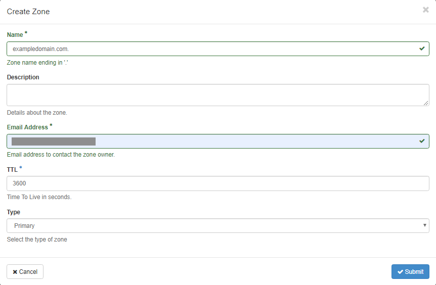
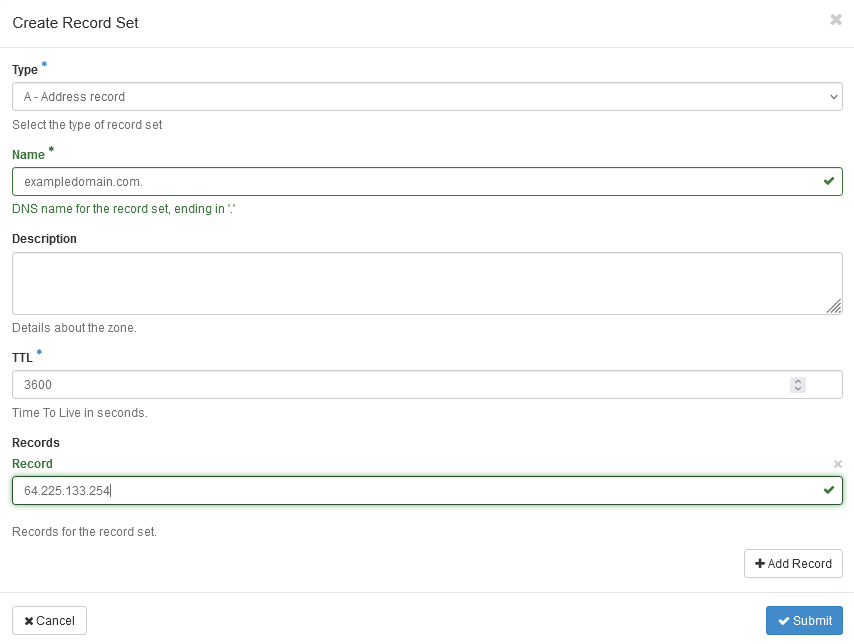
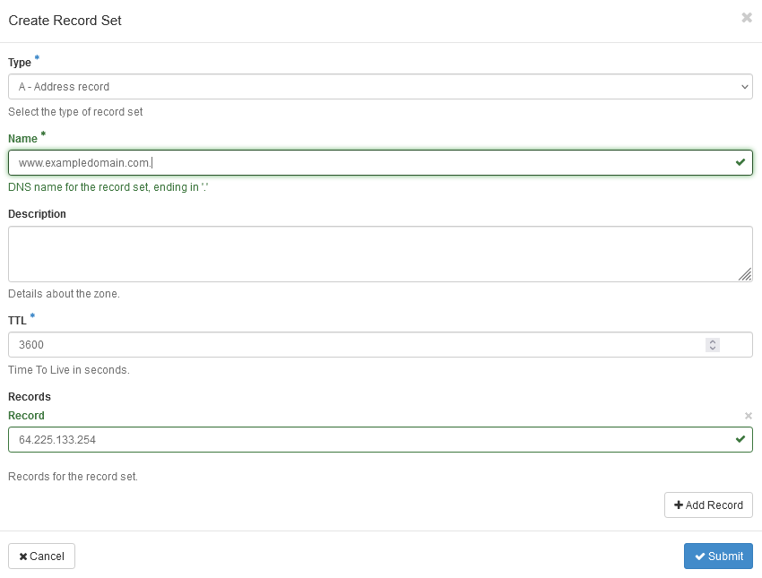
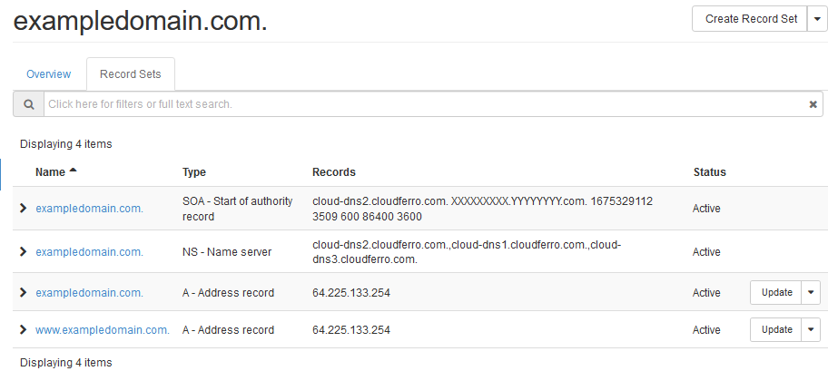

DNS as a Service on |brand-name| hosting
========================================

DNS as a Service (DNSaaS) provides functionality of managing configuration of user's domains. Managing configuration means that the user is capable of creating, updating and deleting the following DNS records:

.. jinja:: caption_colors

   .. list-table::
      :header-rows: 1
      :widths: 20 80

      * - :{{ header }}:`Type`
        - :{{ header }}:`Description`
      * - **A**
        - Address record
      * - **AAAA**
        - IPv6 address record
      * - **CNAME**
        - Canonical name record
      * - **MX**
        - Mail exchange record
      * - **PTR**
        - Pointer record
      * - **SPF**
        - Sender Policy Framework
      * - **SRV**
        - Service locator
      * - **SSHFP**
        - SSH Public Key Fingerprint
      * - **TXT**
        - Text record

DNS configuration management is available via OpenStack web dashboard (Horizon), OpenStack command line interface as well as via the API.

DNS records management is performed on the level of an OpenStack project.

Since DNSaaS purpose is to deal with external domain names, the internal name resolution (name resolution for private IP addresses within user's projects) is not covered by this documentation.

.. raw:: html

   <h2>What we are going to cover</h2>

* Domain delegation in registrar's system

* Domain configuration through Zone configuration

* Checking the presence of the domain on the Internet

* Adding new record for the domain

* Adding records for subdomains

* Managing records

* Limitations in OpenStack DNSaaS

Prerequisites
-------------

No. 1 **Account**

You need a |brand-name| hosting account with access to the Horizon interface:

.. tabs::

   .. tab:: R1

      https://horizon.api.r1.cloud.eumetsat.int/

   .. tab:: R2

      https://horizon.api.r2.cloud.eumetsat.int/

   .. tab:: ELA

      https://horizon.cloudferro.com/

      Choose **** and **FRA1-3** as the region.

.. jinja:: brand_names

   No. 2 **Must have access to a project in {{ brand_name }} OpenStack account**

If you are a tenant manager, you will be able to either use the existing basic project or create new projects for yourself or your users.

If you are a user of the account, the tenant manager will have already created a project for you.

No. 3 **Basic knowledge of DNS notions and principles**

We assume you already have a

 * basic knowledge of Domain Name Service principles as well as

 * understanding of the purpose of DNS records.

If not, please see `DNS article on Wikipedia <https://en.wikipedia.org/wiki/Domain_Name_System>`_ or `OpenStack DNSaaS command line reference <https://docs.openstack.org/python-designateclient/latest/user/shell-v2.html>`_

No. 4 **Must have domain purchased from a registrar**

You also must own a domain purchased from any registrar (domain reseller). Obtaining a domain from registrars is not covered in this article.

No. 5 **Must have a Linux server with an assigned IP address**

To verify DNS creation and propagation, you shall use the **dig** command from Linux. You will also need an IP address to point the domain name to. You may have already created one such VM in your |brand-name| |cloud-name| server and if not, here is how to create a virtual machine, assign a floating IP to it and access it from Windows desktop computer:

.. jinja:: brand_names

   :doc:`/cloud/How-to-create-a-Linux-VM-and-access-it-from-Windows-desktop-on-{{ brand_name_hyphen }}/How-to-create-a-Linux-VM-and-access-it-from-Windows-desktop-on-{{ brand_name_hyphen }}`

Or, you might connect from a Linux based computer to the cloud:

.. jinja:: brand_names

   :doc:`/cloud/How-to-create-a-Linux-VM-and-access-it-from-Linux-command-line-on-{{ brand_name_hyphen }}/How-to-create-a-Linux-VM-and-access-it-from-Linux-command-line-on-{{ brand_name_hyphen }}`

In both cases, the article will contain a section to connect floating IP to the newly created VM. The generated IP address will vary, but for the sake of concreteness we shall assume that it is **64.225.133.254**. You will enter that value later in this article, to create record set for the site or service you are making.

Step 1 Delegate domain to your registrar's system
-------------------------------------------------

The configuration of domain name in your registrar's system must point to the NS records of CloudFerro name servers. It can be achieved in two ways:

**Option 1 - Use CloudFerro name servers (recommended)**

 provides two distinct DNS environments, with different nameservers.

.. jinja:: caption_colors

    .. list-table::
       :header-rows: 1

       * - :{{ header }}:`Environment`
         - :{{ header }}:`Nameservers to use for delegation`
         - :{{ header }}:`IP`
       * - **ELA**
         - `cloud-dns1.cloudferro.com`

           `cloud-dns2.cloudferro.com`,

           `cloud-dns3.cloudferro.com`
         - 91.212.141.94

           91.212.141.102

           91.212.141.86
       * - **Region 1 / Region 2**
         - `dns1.cloud.eumetsat.int`

           `dns2.cloud.eumetsat.int`,

           `dns3.cloud.eumetsat.int`
         - 185.52.195.100

           185.52.195.162

           124.197.37.53

The nameservers you configure in your registrar (Step 1) must match the environment where you create the zone (Step 2). Mixing delegation from one environment with a zone in the other will result in DNS resolution failure.

**Option 2 - Set up your own glue records (not recommended)**

.. Warning::

   This configuration option may be not supported by some registrars.

Configure glue records for your domain, so that they point to the following IP addresses, for ELA:

.. jinja:: caption_colors

   .. list-table::
      :header-rows: 1
      :widths: 30 45 25

      * - :{{ header }}:`Purpose`
        - :{{ header }}:`Name Server`
        - :{{ header }}:`IP`
      * - Primary name server
        - **ns1.exampledomain.com**
        - **91.212.141.94**
      * - Secondary name server
        - **ns2.exampledomain.com**
        - **91.212.141.102**
      * - Secondary name server
        - **ns3.exampledomain.com**
        - **91.212.141.86**

For **R1** and **R2**:

.. jinja:: caption_colors

   .. list-table::
      :header-rows: 1
      :widths: 30 45 25

      * - :{{ header }}:`Purpose`
        - :{{ header }}:`Name Server`
        - :{{ header }}:`IP`
      * - Primary name server
        - **dns1.cloud.eumetsat.int**
        - **185.52.195.100**
      * - Secondary name server
        - **dns2.cloud.eumetsat.int**
        - **185.52.195.162**
      * - Secondary name server
        - **dns3.cloud.eumetsat.int**
        - **124.197.37.53**

Step 2 Zone configuration
-------------------------

Zone configuration is defining parameters for the main domain name you have purchased.

To manage domain *exampledomain.com* in OpenStack, login to OpenStack dashboard, choose the right project if different than default, go to **Project** → **DNS** → **Zones**, click **Create Zone** and fill in the required fields:

Here is what the parameters mean:

 * **Name**: your domain name

 * **Description**: free text description

 * **Email Address**: an administrative e-mail address associated with the domain

 * **TTL**: *Time To Live* in seconds - a period of time between refreshing cache in DNS servers. Please note that the longer time, the faster will be name recognition for your domain by external DNS servers but also if you introduce changes, they will propagate slower. The default value of 3600 seconds is a reasonable compromise.

 * **Type**: You may choose if OpenStack name servers will be primary or secondary for your domain. Default: Primary. In case you want to setup secondary name servers, you just define IP addresses or master DNS servers for the domain.

After submitting, your domain should be served by OpenStack.

Step 3 Checking the presence of the domain on the Internet
----------------------------------------------------------

It usually takes from 24 up to 48 hours for the domain name to propagate through the Internet so it will **not** be available right away. Rarely, domain name starts resolving in matters of minutes and hours instead of days, so it pays to try the domain address in your browser an hour or two after configuring the zone for the domain.

There are several ways of checking whether the domain name has propagated.

**Domain name in the browser**
   The most natural way of checking is to enter the domain name into the browser. If you get a message that the site cannot be found, you will have to wait longer.

   Browsers, in general, do not provide messages that pinpoint to the lack of propagation as the source of error. Be sure to check in the browser again after you add records to the zone (see below).

**Check with Linux dig command**
   The **dig** command has several parameters. The following combination will show the presence of the name servers in the global DNS system:

    .. code::

       dig -t any +noall +answer exampledomain.com @cloud-dns1.cloudferro.com
       exampledomain.com. 3600 IN SOA cloud-dns2.cloudferro.com. XXXXXXXXX@YYYYYYY.com. 1675003306 3588 600 86400 3600
       exampledomain.com. 3600 IN NS cloud-dns1.cloudferro.com.
       exampledomain.com. 3600 IN NS cloud-dns3.cloudferro.com.
       exampledomain.com. 3600 IN NS cloud-dns2.cloudferro.com.

**Check with Linux curl command**
   The **curl** command will transfer data from one domain address to the host on which it is running. Here is what the output would look like for the domain name that does not exist:

.. code::

    curl someinvaliddomain.com
    curl: (6) Could not resolve host: someinvaliddomain.com

If the site responds via HTML that means the domain was resolved:

.. code::

    curl exampledomain.com
   <!DOCTYPE html>
   <html>
   <head>
        ...

**Check with sites that specialize in DNS configuration tracking**
   There are sites that will show on the map of the world whether the chosen servers on the Internet know about the domain name or not. Search in the search engine of your choice for a key phrase such as "*DNS checker propagation*", choose a site and enter the domain name.

   Specify **A** to see the propagation of the domain itself and specify **NS** to see the propagation of nameservers across the Internet.

Step 4 Adding new record for the domain
---------------------------------------

To add a new record to the domain, click on **Create Record Set** next to the domain name and fill in the required fields. The most important entry is to connect the domain name to the IP address you have. To configure an address of web server in **exampledomain.com**, so that it is resolved to **64.225.133.254** which is a Floating IP address of your server, fill the form as follows:

The parameters are:

 * **Type**: Type of record (for example A, MX, etc.)

 * **Name**: name of the record (for example **www.exampledomain.com**, **mail.exampledomain.com**,...)

 * **Description**: free text description

 * **TTL**: Time To Live in seconds - a period of time between refreshing cache in DNS serves.

 * **Records**: Desired record value (there may be more than one - one per line):

       * for records of Type A put IP address
       * for records of Type MX put name of a mail server which hosts e-mails for the domain
       * for records of Type CNAME put original name which is to be aliased

Submit the form and check whether your configuration works:

.. code::

   dig -t any +noall +answer exampledomain.com @cloud-dns1.cloudferro.com
   exampledomain.com. 3600 IN SOA cloud-dns2.cloudferro.com. XXXXXXXXX.YYYYYYYY.com. 1675325538 3530 600 86400 3600
   exampledomain.com. 3600 IN A 64.225.133.254
   exampledomain.com. 3600 IN NS cloud-dns1.cloudferro.com.
   exampledomain.com. 3600 IN NS cloud-dns2.cloudferro.com.
   exampledomain.com. 3600 IN NS cloud-dns3.cloudferro.com.

.. note::

   Each time a name of domain or a server is added or edited, add dot '.' at the end of the entry.
   For example: **exampledomain.com.** or **mail.exampledomain.com.**.

Step 5 Adding records for subdomains
------------------------------------

Defining subdomains is similar except that, normally, the subdomain would propagate within minutes instead of days.

As previously, use command is **DNS** -> **Zones** -> **Record Sets**.

To configure an address of web server in **exampledomain.com**, so that **www.exampledomain.com** is resolved to **64.225.133.254** which is a Floating IP address of your server, fill the form as follows:

Submit the form and check whether your configuration works:

.. code::

   dig -t any +noall +answer www.exampledomain.com @cloud-dns1.cloudferro.com
   www.exampledomain.com. 3600 IN A 64.225.133.254

Step 6 Managing records
-----------------------

Anytime you want to review, edit or delete records in your domain, visit OpenStack dashboard, **Project** → **DNS** → **Zones**. After clicking the domain name of your interest, choose **Record Sets** tab and see the list of all records:

From this screen you can update or delete records.

Limitations
-----------

There are the following limitations in OpenStack DNSaaS:

 * You cannot manage NS records for your domain. Therefore

    - you cannot add additional secondary name servers

    - you are unable to delegate subdomains to external servers

 * Even though you are able to configure reverse DNS for your domain, this configuration will have no effect since reverse DNS for |brand-name| IP pools are managed on DNS servers other than OpenStack DNSaaS.

What To Do Next
---------------

Once an OpenStack object has floating IP address, you can use the DNS service to propagate a domain name and, thus, create a service or a site. There are several situations in which you can create a floating IP address:

.. jinja:: brand_names

    You already have an existing VM
       Follow the procedure in article :doc:`/networking/How-to-Add-or-Remove-Floating-IPs-to-your-VM-on-{{ brand_name_hyphen }}/How-to-Add-or-Remove-Floating-IPs-to-your-VM-on-{{ brand_name_hyphen }}` to assign a new floating IP to it.

Assign floating IP while creating a new VM from scratch
   That is the approach in articles from Prerequisite No. 5.

.. ifconfig:: brand_name in managed_kubernetes_with_magnum

   **Kubernetes services can have an automatically assigned floating IP**
     The following article shows how to deploy an HTTPS service on Kubernetes:

   .. jinja:: brand_names

      :doc:`/kubernetes/Deploying-HTTPS-Services-on-Magnum-Kubernetes-in-{{ brand_name_cloud }}-Cloud`

