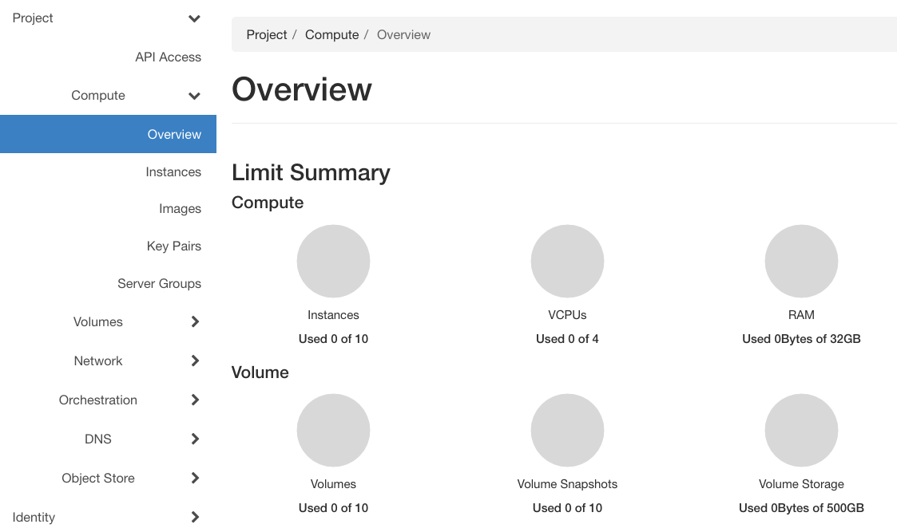
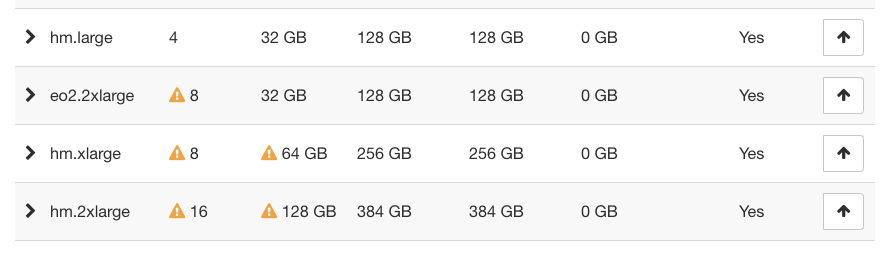

.. meta::
   :description: Dashboard overview - project quotas and flavors limits
   :keywords: |brand-name|, Dashboard, overview, project, quotas, flavors, limits

Dashboard Overview -- Project Quotas And Flavors Limits on |brand-name|
=======================================================================

While using |brand-name| platform, one of the first things you will spot is the "Limit Summary". Each project is restricted by preset quotas. This is preventing system capacities from being exhausted without notification and guaranteeing free resources.

On the first screen after logging into Horizon Dashboard you will see seven charts reflecting limits most essential to the stability of the platform. You can always show this screen with command **Compute** -> **Overview**.

Instances
  Number of virtual machines your project can contain at once, regardless of the flavors (it could be eo1.xsmall as well as hm.2xlarge).

VCPUs
  Number of cores you can assign while launching VMs of different flavors (it varies for each flavor, for example eo1.xsmall has only one core, while eo1.large has four VCPUs).

RAM
  The amount of RAM you have available in you project according to the assigned quota.

Floating IPs
   A pool of unique Floating IP addresses assigned only to your project.

Security Groups
   Two of the ten Security Groups are preset during the creation of the domain (one is a default group and the second one allows connection via SSH and RDP and pinging instances).

Volumes
  Disks provided only by flavor (unchecked "Create new volume" while instances creation) won't count in.

Volume Storage
   You can store data from your instances and disposable volumes.

During the VM creation process, while choosing flavor, you may spot a yellow exclamation mark next to some values. It means that the remaining resources are exceeding the quota, or (more rarely) that this flavor is unavailable due to some maintenance reason.

You can expand the flavor summary by clicking the arrow on the left. The charts will show the current free resources as well as the resources that will remain after creating a new instance.

If the quota would be exceeded, OpenStack will non allow to choose this particular flavor.