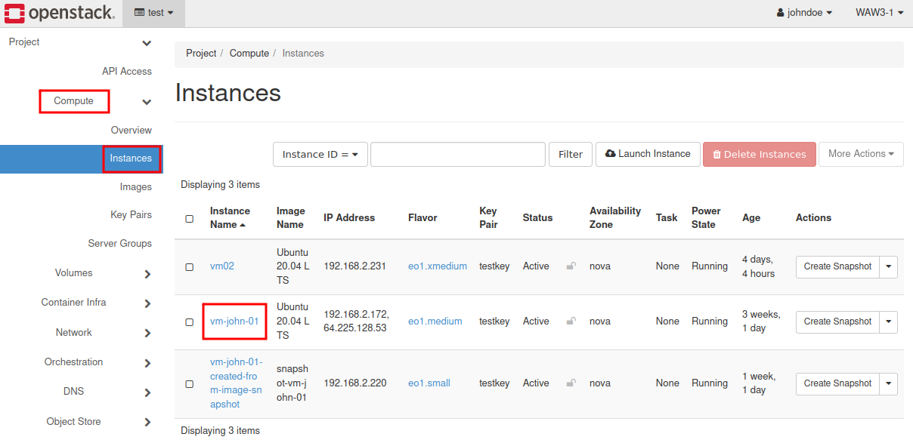
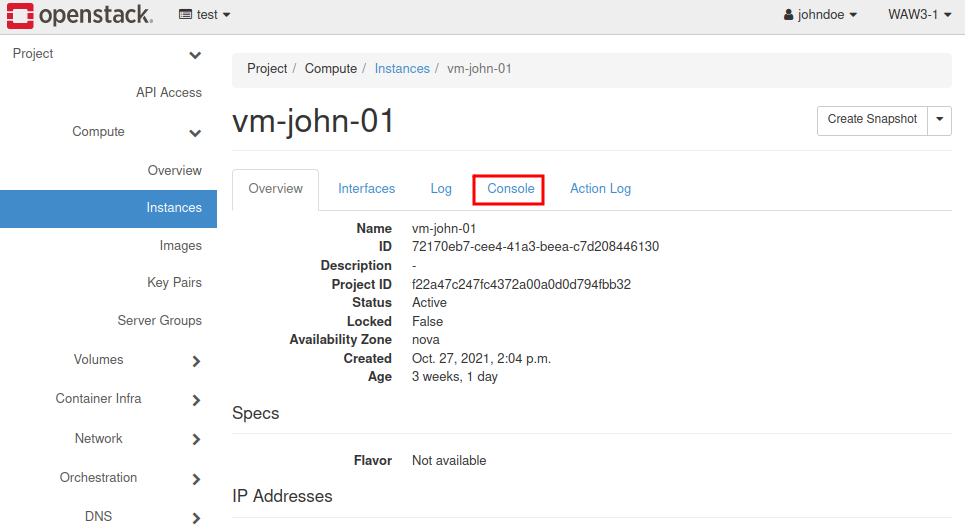
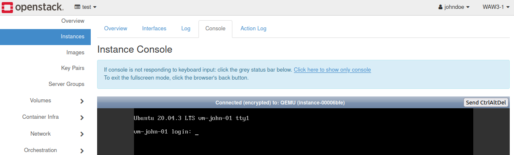
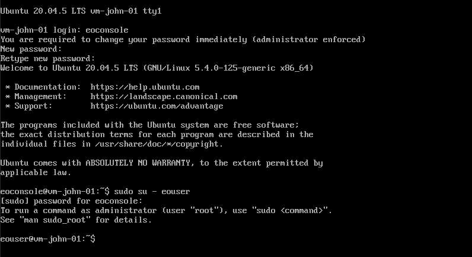
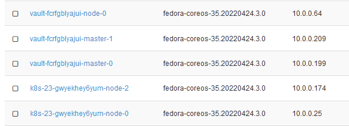
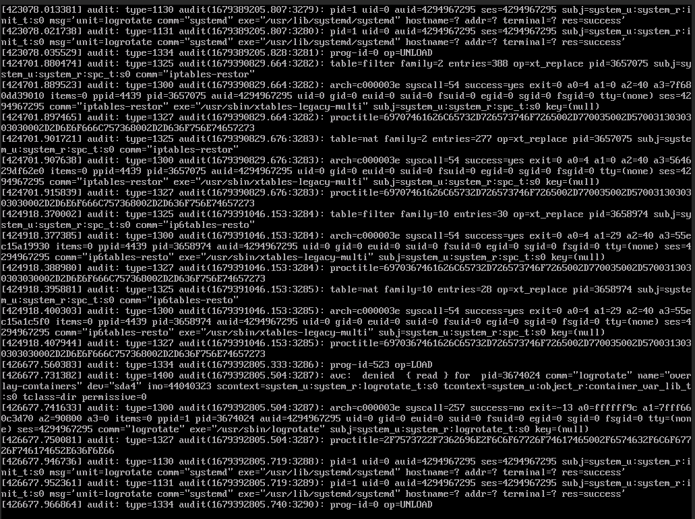

How to access the VM from OpenStack console on |brand-name|
========================================================================

Once you have created a virtual machine in OpenStack, you will need to perform various administrative tasks such as:

 * installing and uninstalling software,
 * uploading and downloading files,
 * setting up passwords and access policies

and so on. There are three ways to enter the back end part of virtual machines:

**Linux**
   For Linux, either of the Ubuntu or CentOS variety, you will be using the console that is present with every VM. You enter the console as a predefined user called **eoconsole**, define the password and switch to another, also predefined, user called **eouser**. After that, each time you are use the console, you will be present as **eouser**.

.. ifconfig:: brand_name != "Destination Earth"

    **Windows**
       You only need to create an *Administrator* profile within the virtual machine. Once you do that, you will work with Windows just like on the desktop computer, with possible delays in response due to the speed of Internet connection you have.

**Fedora**
   Fedora images technically belong to the family of Linux operating systems, but cannot be accessed via the console. To be more precise, you will see the console but won't be able to log in as the standard **eoconsole** user.

   As these images are only used for automatic creation of Kubernetes instances, you have to enter them using Kubernetes methods. That boils down to using **kubectl exec** command (see below).

What We Are Going To Cover
-------------------------------

 * Use console for Linux based virtual machines
 * Use console for Windows based virtual machines
 * Use console for Fedora base virtual machines

Prerequisites
--------------------

No. 1 **Account**

You need a |brand-name| hosting account with access to the Horizon interface:

.. tabs::

   .. tab:: R1

      https://horizon.api.r1.cloud.eumetsat.int/

   .. tab:: R2

      https://horizon.api.r2.cloud.eumetsat.int/

   .. tab:: ELA

      https://horizon.cloudferro.com/

      Choose **ECIS** and **FRA1-3** as the region.

Using console for administrative tasks within Linux based VMs
---------------------------------------------------------------------------

1. Go to |brand-name-site-link| and select your authentication method:

.. jinja:: login_vm

   .. figure:: {{ login }}

You will enter the Horizon main screen.

2. Open the **Compute/Instances** tab and select the desired VM by clicking on its name:

3. Select **"Console"** pane

4. When logging in for the first time, you will see the generic console screen:

Click on link **Click here to show only console** and then click on the console surface to make it active.

Enter the predefined user name **eoconsole**. You will be asked to set up a new password, twice. This user **eoconsole** serves only for you to enter the console.

The next step is to start using another user, called **eouser**. Just like **eoconsole**, it is already defined for you, so you only need to switch from **eoconsole** to **eouser**. Linux command to do that is

.. code::

   sudo su - eouser

You will then use the console as a predefined user called **eouser**.

.. attention::

   Google Chrome seems to work slowly while using the OpenStack console. Firefox works well.

Using console to perform administrative tasks within Fedora VMs
---------------------------------------------------------------------------

For normal VMs, choose either Ubuntu- or CentOS-based images while creating a VM -- but not Fedora. It is meant only for automatic creation of instances that belong to Kubernetes clusters. Such instances will have either word *master* or *node* in their names. Here is a typical series of instances that belong to two different clusters, called *vault* and *k8s-23*:

So if you click on any of these Kubernetes instances, you will be able to enter the console but will not be able to use it. In this context, Fedora image is **intentionally** set up in such a way that you **cannot enter it through the console**. You will, typically, see this after Fedora starts:

Instead, it is possible to enter one such instance using main Kubernetes command, **kubectl** with parameter **exec**. The main command would look like this:

.. code::

   kubectl -n vault exec -it vault-0 -- sh

where *vault* is the namespace within which the pod *vault-0* will be found and entered.

Further explanations of **exec** command are out of scope of this article. The following article will show you how to activate the **kubectl** command after the cluster has been created:

.. jinja:: brand_names

   :doc:`/kubernetes/How-To-Access-Kubernetes-Cluster-Post-Deployment-Using-Kubectl-On-{{ brand_name_hyphen }}-OpenStack-Magnum`

This article shows an example of an **exec** command to enter the VM and, later, save the data within it:

.. jinja:: brand_names

   :doc:`/kubernetes/Volume-based-vs-Ephemeral-based-Storage-for-Kubernetes-Clusters-on-{{ brand_name_hyphen }}-OpenStack-Magnum`

.. ifconfig:: not (brand_name == "Destination Earth" or brand_name == "ESA HPC")

    Performing administrative tasks within Windows based VMs
    ---------------------------------------------------------------

    In case of **Windows** set a new password for *Administrator* profile.

    .. figure:: accessvm5.png

    You will then be able to perform administrative tasks on your instance.

