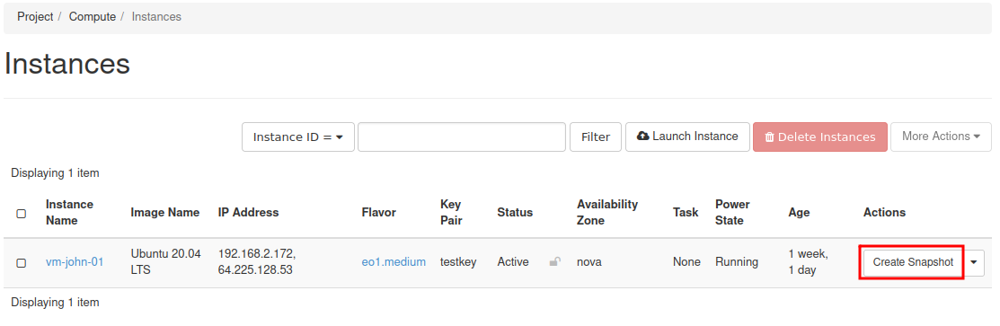
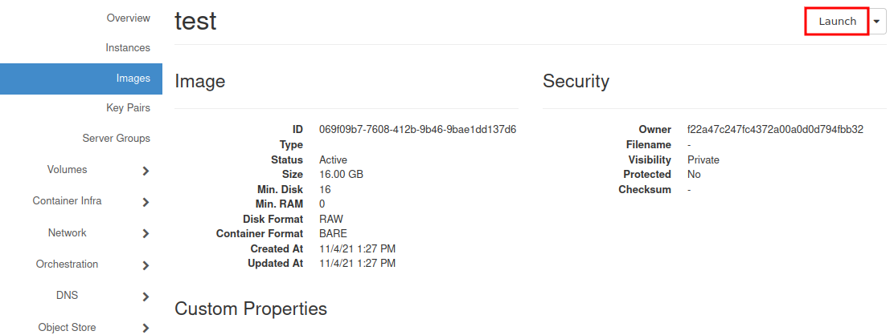

How to clone existing and configured VMs on |brand-name|
=======================================================================

The simplest way to create the snapshot of your machine is using "Horizon" - graphical interface of OpenStack dashboard.

In summary, there will be 2 operations:

1. Creating snapshot

2. Restoring snapshot to newly created VM.

To start, please visit our website |brand-name-site-link| and login.

.. jinja:: access_sen4cap

   .. figure:: {{ access_sen4cap_02 }}
      :align: center

After logon, in **"Instances"** menu select VM to be cloned, and create its snapshot by clicking "Actions" Menu

Once the snapshot is ready, you may see it on **"Images”** page of Horizon. Select its name to see properties.

Now, you may click **"Launch"** in right upper corner of the window or just go back to **"Instances”** menu and launch new instance.

.. jinja:: brand_names

   Full manual is here: :doc:`/cloud/How-to-create-new-Linux-VM-in-OpenStack-Dashboard-Horizon-on-{{ brand_name_hyphen }}/How-to-create-new-Linux-VM-in-OpenStack-Dashboard-Horizon-on-{{ brand_name_hyphen }}`

But if this process is familiar to you, there is only one difference. Chose as the source **"boot from snapshot”** instead of **"boot from image"** and select your snapshot from the list below. In next steps select parameters (flavour, size), at least the same as the original one. ("Launch instance" button will be unavailable until all necessary settings were completed).

The new machine gets configured as a clone of the original one, except of network addresses (new floating-ip must be associated) and network policies.

.. caution::

   If the original machine had any additional volumes attached to it, they should also be cloned.

.. jinja:: brand_names

   You may also want to read: :doc:`/datavolume/Volume-snapshot-inheritance-and-its-consequences-on-{{ brand_name_hyphen }}/Volume-snapshot-inheritance-and-its-consequences-on-{{ brand_name_hyphen }}`.

