How to create Windows VM on OpenStack Horizon and access it via web console on |brand-name|
================================================================================================================

This article shows how to create a functional Windows VM on |brand-name| cloud
using the Horizon graphical interface.

The workflow is to:

* start the creation of a Windows virtual machine from the Horizon dashboard,
* access the virtual machine through the web console,
* set the **Administrator** password,
* update Windows after the first login.

What we are going to cover
--------------------------

* Accessing the **Launch Instance** menu
* Choosing the instance name
* Choosing the source image
* Choosing the flavor
* Attaching networks
* Choosing security groups
* Launching the virtual machine
* Setting the **Administrator** password
* Updating Windows

Prerequisites
-------------

No. 1 **Account**

You need a |brand-name| hosting account with access to the Horizon interface:

.. tabs::

   .. tab:: R1

      https://horizon.api.r1.cloud.eumetsat.int/

   .. tab:: R2

      https://horizon.api.r2.cloud.eumetsat.int/

   .. tab:: ELA

      https://horizon.cloudferro.com/

      Choose **ECIS** and **FRA1-3** as the region.

Step 1: Access the Launch Instance menu
---------------------------------------

In the Horizon dashboard, navigate to **Compute** -> **Instances**.

Click **Launch Instance** at the top of the **Instances** section.

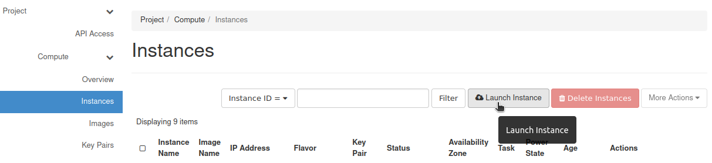

   Launch Instance button in Horizon

You should get the **Launch Instance** window.

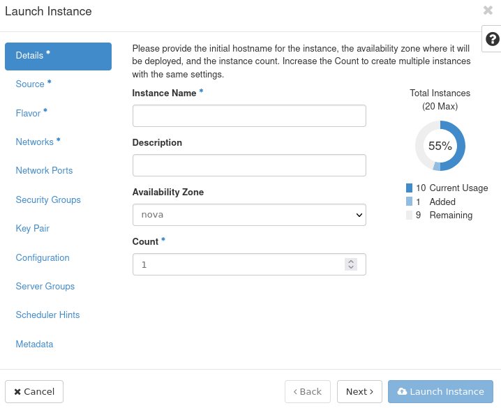

   Launch Instance window in Horizon

Step 2: Choose the instance name
--------------------------------

In the **Instance Name** text field, enter the name you want to give to your
instance.

In this example, the instance is called **test-windows-vm**.

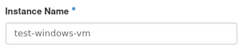

   Enter the Windows VM instance name

Click **Next >**.

Step 3: Choose source
---------------------

The default value in the **Select Boot Source** drop-down menu is **Image**.
This means that you will choose from the images available in Horizon.

If another value is selected, change it back to **Image**.

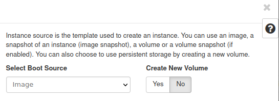

   Select Image as the boot source

Enter **windows** in the search field in the **Available** section to filter
Windows images.

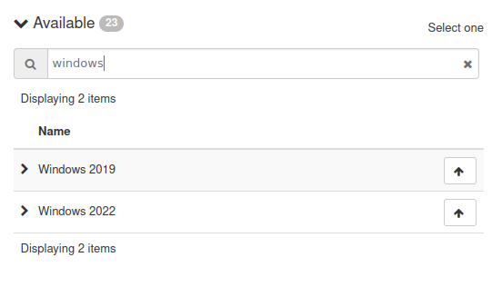

   Filter Windows images

Choose the newest available Windows image by clicking **↑** next to it.

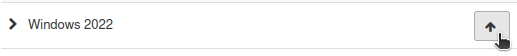

   Allocate a Windows image

The chosen image should appear in the **Allocated** section.

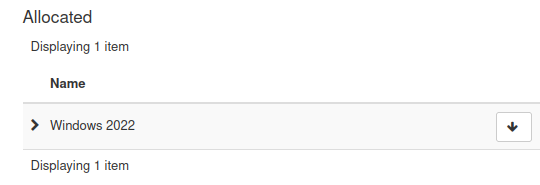

   Windows image allocated as source

Click **Next >**.

If you allocate the wrong image by mistake, remove it from the **Allocated**
section by clicking **↓** next to its name.

Step 4: Choose flavor
---------------------

In this step, choose the flavor of your virtual machine. Flavors define access
to resources such as vCPUs, RAM, and storage.

The following screenshot shows what the flavors table looks like in general.

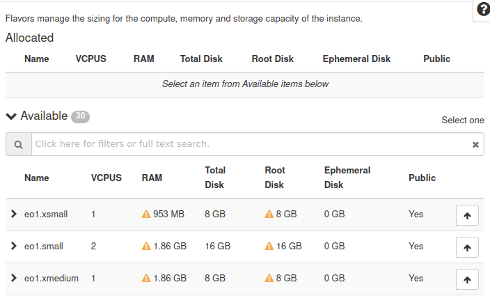

   Flavor selection table

Yellow warning triangles indicate that a flavor is not available to you. To
see the reason, hover the mouse over the warning triangle.

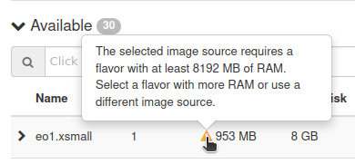

   Flavor availability warning

Use a flavor suitable for Windows. The available flavor names may differ
between regions and environments, so check the actual flavor list in Horizon.

A practical way to find Windows-compatible flavors is to search for common
Windows flavor prefixes used in your environment, or to check the flavor
description and available quota. If you are not sure which flavor to use, ask
your project administrator or support team.

Choose the flavor that suits your workload and click **↑** next to it to
allocate it.

Click **Next >**.

.. note::

   In the examples that follow, two networks are shown. One network name starts
   with **cloud_** and another with **eodata_**. The first network should
   normally be present in the project. The second one may or may not be
   present, depending on your environment. If you do not have a network whose
   name starts with **eodata_**, use another suitable network that exists in
   your project.

Step 5: Attach networks to your virtual machine
-----------------------------------------------

The next step contains the list of networks available to you.

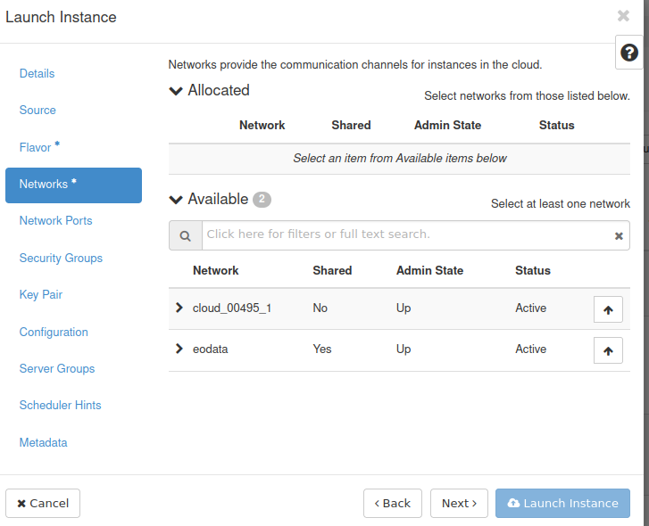

   Network selection in Horizon

By default, you should usually have access to a project network. This network
can be used to connect your virtual machines and to access the Internet,
depending on the project configuration.

If an **eodata** network is available and you need access to the EODATA
repository from the VM, allocate it as well.

Allocate the networks you want to attach to the VM and click **Next >**.

The next step is called **Network Ports**. In this article, you do not need to
change anything there. Click **Next >**.

Step 6: Choose security groups
------------------------------

Security groups control network traffic for your virtual machine.

In this step, make sure that the **default** security group is allocated. It
usually blocks incoming network traffic and allows outgoing traffic.

The security group **allow_ping_ssh_icmp_rdp**, or a similarly named group,
may expose your VM to several types of incoming traffic. Do not allocate it if
you only intend to access the VM through the web console.

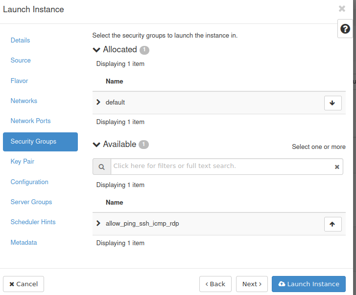

   Security group selection for the Windows VM

You should still be able to perform standard Windows operations such as
browsing the Internet or accessing email without exposing RDP directly.

Step 7: Launch your virtual machine
-----------------------------------

Other steps in the **Launch Instance** window are optional for this basic
workflow.

After completing the previous steps, click **Launch Instance**.

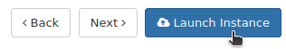

   Launch the Windows VM

Your virtual machine should appear in the **Instances** section of the Horizon
dashboard. Wait until its **Status** changes to **Active**.

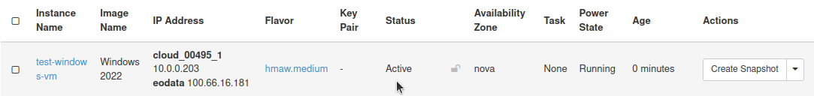

   Windows VM in Active status

Once the **Status** is **Active**, the virtual machine should be running.

Step 8: Set the Administrator password
--------------------------------------

Once your instance has **Active** status, click its name.

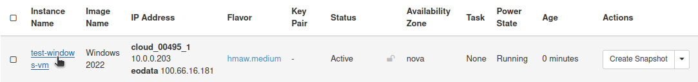

   Open the Windows VM details page

You should see a page containing information about your instance. Navigate to
the **Console** tab.

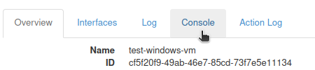

   Open the Console tab

You should see the web console, which lets you control the virtual machine
from the browser.

When Windows finishes startup, you should see a prompt to set the
**Administrator** password.

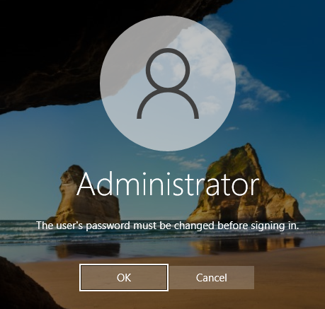

   Prompt to set the Administrator password

Click **OK**.

You should now see two text fields.

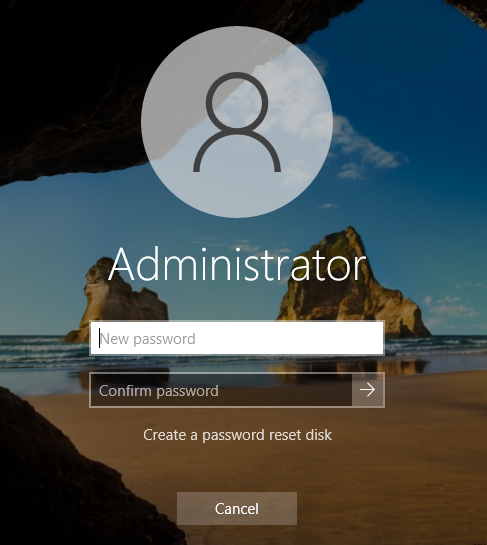

   Administrator password fields

Enter your chosen password in the **New password** text field.

Enter it again in the **Confirm password** text field.

Click the right arrow next to the **Confirm password** text field.

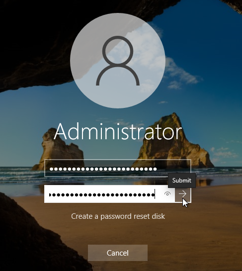

   Confirm the Administrator password

You should get a confirmation.

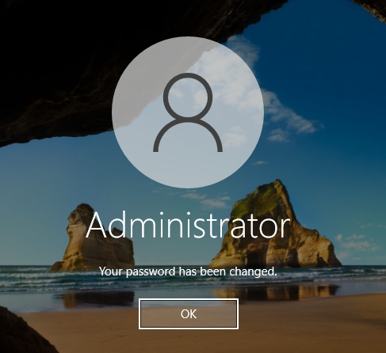

   Administrator password confirmation

Click **OK**.

Wait until you see the standard Windows desktop.

Step 9: Update Windows
----------------------

Once the Windows virtual machine is running, update the operating system to
install the latest security fixes.

Click **Start**, and then **Settings**.

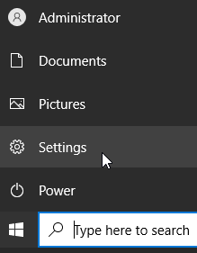

   Open Windows Settings

Click **Update & Security**.

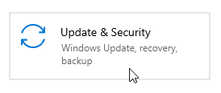

   Open Update and Security

You should now see the **Windows Update** screen.

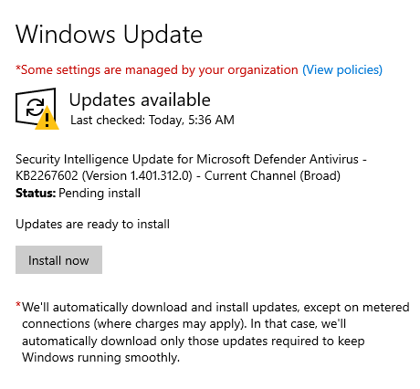

   Windows Update screen

Follow the prompts to update the operating system.

What to do next
---------------

.. ifconfig:: brand_name not in brands_without_eodata

   To learn how to access the EODATA repository on your new Windows virtual
   machine, check this article:

   .. jinja:: doc_links

      :doc:`{{ eodata_windows_vm_mount }}`

If you want to access your virtual machine remotely using RDP, consider using
a bastion host to improve security.

.. jinja:: doc_links

   :doc:`{{ windows_vm_rdp_bastion }}`

To learn more about security groups, see this article:

.. jinja:: doc_links

   :doc:`{{ security_groups_horizon }}`