How to create a Linux VM and access it from Windows desktop on |brand-name|
===========================================================================

Creating a virtual machine in a |brand-name| cloud allows you to perform computations without having to engage your own infrastructure. In this article you shall create a Linux based virtual machine and access it remotely using PuTTY on Windows.

.. jinja:: brand_names

   If you want to access Linux VM from a Linux command line, follow this article instead: :doc:`/cloud/How-to-create-a-Linux-VM-and-access-it-from-Linux-command-line-on-{{ brand_name_hyphen }}`.

.. note::

   This article only covers the basics of creating a VM - it does not cover topics such as use of NVIDIA hardware or creating a volume during the creation of a VM.

What We Are Going To Cover
--------------------------

 * Creating a Linux virtual machine in |brand-name| cloud using command **Launch Instance** from Horizon Dashboard

You will enter the following data into that window:

 * Instance name

 * Instance source (from an operating system image)

 * Instance flavor (the combination of CPU, memory and storage capacity)

 * Networks that the newly created VM will use

Then create elements later needed for SSH connection:

 * Security groups to control access to the machine

 * A chosen key pair for SSH access to the Linux based VM in the cloud

For external access

 * Attach a floating IP to the instance so that it can be found on the Internet.

After that, you will connect to a VM using PuTTY:

 * Convert the public key to the format compatible with PuTTY

 * Configure PuTTY

 * Save PuTTY configuration

 * Connect to a VM

Prerequisites
-------------

No. 1 **Hosting**

You need a |brand-name| hosting account with Horizon interface |brand-name-site-link|.

No. 2 **Basic knowledge of Linux terminal**

You should have some experience with Linux command line interface.

No. 3 **Windows**

You need to have Microsoft Windows 10 or newer installed on your computer.

.. the earlier versions as of 11 January 2022 are not supported by Microsoft; we are not writing about Windows Server here

No. 4 **PuTTY installed on your local Windows computer**

You should have PuTTY installed on your computer. You can download it from the following website: https://www.chiark.greenend.org.uk/~sgtatham/putty/.

No. 5 **SSH key**

You need to have an SSH key pair. It consists of a public and private key. You can use your existing pair in this workflow or create a new one. If you do not have one, you have several options, such as:

.. jinja:: brand_names

    * Generate them directly using the Horizon dashboard: :doc:`/cloud/How-to-create-key-pair-in-OpenStack-Dashboard-on-{{ brand_name_hyphen }}`.

.. jinja:: brand_names

    * Generate your key pair using the Windows command line. Please check this article: :doc:`/windows/How-To-Create-SSH-Key-Pair-In-Windows-On-{{ brand_name_hyphen }}`. If you choose that option, make sure that you upload your public key to the Horizon dashboard: :doc:`/networking/How-to-Import-SSH-Public-Key-to-OpenStack-Horizon-on-{{ brand_name_hyphen }}`.

.. TODO you can also create it using PuTTYgen, but we do not have such article yet

This article contains information about configuring PuTTY using one such key pair.

Options for creation of a Virtual Machine (VM)
----------------------------------------------

Creation of a virtual machine is divided into 11 sections, four of which are mandatory (denoted by an asterisk in the end of the name of the option). In addition to those four (**Details**, **Source**, **Flavor**, and **Networks**), we shall define **Security Groups** and **Key Pairs**. The rest of the options to launch an instance is out of scope of this article.

.. note::

   In OpenStack terminology, a *virtual machine* is also an *instance*. *Instance* is a broader term as not all instances need be virtual machines, it is also possible to use real hardware as an instance.

The window to create a virtual machine is called **Launch Instance**. You will enter all the data about an instance into that window.

Step 1 Start the Launch Instance window and name the virtual machine
--------------------------------------------------------------------

In the Horizon dashboard go to **Compute** -> **Instances** and click **Launch Instance**. You should get the following window:

.. image:: create-linux-linux-04_creodias.png

Type the name for your virtual machine in the **Instance Name** text field.

Click **Next** or the **Source** option on the left side menu.

Step 2 Define the source of the virtual machine
-----------------------------------------------

The **Source** window appears:

.. image:: create-linux-linux-05_creodias.png

Make sure that from the drop-down menu **Select Boot Source** option **Image** is selected.

.. image:: boot_source.png

From the **Available** list choose Linux distribution that suits you best and click **↑** next to it. It should now be visible in the **Allocated** section:

.. image:: create-linux-linux-06_creodias.png

This image shows that a Ubuntu 20.04 LTS was selected; if you, however, chose CentOS 7, that is what would show here instead of Ubuntu 20.04 LTS.

If you change your mind, click **↓** to unselect a source and then choose a different one.

Images which have **NVIDIA** in their name contain NVIDIA hardware. This article does not cover their use. Therefore, make sure that you choose the image without it.

Also, make sure that in the section **Create New Volume** option **No** is selected.

Click **Next** or click on button **Flavor** to define the flavor of the instance.

Step 3 Define the flavor of the instance
----------------------------------------

You should now see the following form:

.. image:: create-linux-linux-07_creodias.png

The standard definition of OpenStack *flavor* is the amount of resources available to the instance - like VCPU, memory and storage capacity.

Choose the one which suits you best and click **↑** next to it.

.. warning::

   Make sure that you do **not** select one of the below flavors - they contain NVIDIA hardware and this article does not cover their use.

    * **vm.a6000.1**

    * **vm.a6000.2**

    * **vm.a6000.4**

    * **vm.a6000.8**

Sometimes, a flavor might be insufficient for source you chose in the previous step. If this is the case, you will see a yellow warning sign next to at least one of the values in the row for that flavor:

.. image:: yellow_triangles.png

To solve this issue, choose a flavor that supports your chosen source instead. In the image above, *vm.a6000.4* is not available but, say, *hm.large* is.

Another possible cause might be that your quota is too low for creating a VM with your chosen flavor. You can see your quota in the **Compute -> Overview** section of your Horizon dashboard. If that is the case, you can either:

.. jinja:: brand_names

    * choose a different flavor or
    * contact the |brand-name| Support to request quota increase - :doc:`/accountmanagement/Help-Desk-And-Support`.

Click **Next** or click **Networks** to define networks.

Step 4 Define networks for the virtual machine
----------------------------------------------

You should now see a window to choose one or several networks that you want your VM to work with:

.. image:: create-linux-linux-08_creodias.png

Here you can select networks that will be attached to your virtual machine. They control the way your machine is connected to the Internet, to the other machines and to other resources as well.

By default, you should have access to the network whose name starts with **cloud_**. It

 * connects your machines together and
 * has access to the **external** network, which gives the instance access to the Internet.

Other networks may be present in the system.

These were the obligatory options. Since you want to access the instance through an SSH connection, you will need to define **Security Groups** and **Key Pair**.

Step 5 Define security groups for VM
------------------------------------

Security groups control network traffic to and from your virtual machine.

Click **Security Groups**. You should see the following form:

.. image:: create-linux-linux-09_creodias.png

By default, you have access to two groups:

 * **default** which blocks all incoming traffic and allows all outgoing traffic

 * **allow_ping_ssh_icmp_rdp** which allows incoming Ping, SSH, ICMP and RDP connections

Enable both of these rules. One of the open ports in **allow_ping_ssh_icmp_rdp** is 22, which is a prerequisite for SSH access.

Step 6 Create a key pair for SSH access
---------------------------------------

To use SSH to connect your local Linux computer to the cloud Linux "computer", you will need to provide one public and one secret key. (Keys are random strings, usually hundreds of characters long.)

Click **Key Pair**. You should now see the following window:

.. image:: create-linux-linux-10_creodias.png

In the image above, the key is called **test-key**. There are three ways to enter the keys into this window:

 * using option **Create Key Pair** -- create it on the spot,

 * using option **Import Key Pair** -- take the keys you already have and upload them to the cloud,

 * using one of the key pairs that were already existing within OpenStack cloud.

If you haven't created your key pair yet, please follow Prerequisite No. 5.

Anyways, make sure that your uploaded key is in the **Allocated** section.

.. removed this information, it is already in What To Do Next

Step 7 Create the instance
--------------------------

Once you have set everything up, click **Launch Instance**.

Your instance should now be in the **Instances** list. Initially, the instance will be in a state of "Spawning" as in this image:

.. image:: create-linux-linux-12_creodias.png

Spawning is the process of preparing the instance.

Wait up to a few minutes until your instance has finished spawning. The next state is **Running** label in the **Power State** column:

.. image:: create-linux-linux-13_creodias.png

It means that the instance is ready to use.

In Step 4 you have attached a network with the name that starts with **cloud_**. It allows the instance to send and receive data from other instances in the cloud and the Internet but does not automatically provide a static IP address. Such address is important if you want to host a website or access the instance via the SSH protocol.

Just like on the above screenshot, under header **IP Address**, you will see network addresses which both start with **10.**. It means that they are local network addresses. If you want to access your instance remotely, it must have a static IP address. The way to add it is to attach a so-called *floating IP* address to the instance.

Step 8 Attach a Floating IP to the instance
-------------------------------------------

.. jinja:: brand_names

   Here is how to create and attach a floating IP to your instance: :doc:`/networking/How-to-Add-or-Remove-Floating-IPs-to-your-VM-on-{{ brand_name_hyphen }}`.

Once you have added the floating IP, you will see it in the Horizon dashboard under header **IP Address** - just like in the last image from that article:

.. image:: ip_address_from_article.png

The floating IP address in that article is **64.225.132.0**. Your address will vary.

Step 9 Convert your SSH key
---------------------------

If you followed Prequisite No. 5, you should have an SSH key pair on your local computer - public and private.

.. TODO when we have info about creating an SSH keypair using PuTTYgen, we would need info that in this case you do not need to convert those keys

In order to connect to a virtual machine using PuTTY, you must first convert your private key to the PuTTY format.

If you didn't install PuTTY yet, please follow Prerequisite No. 4. You should have the following section in your **Start** menu:

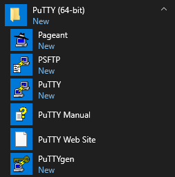

Choose **PuTTYgen**. You should get the following window:

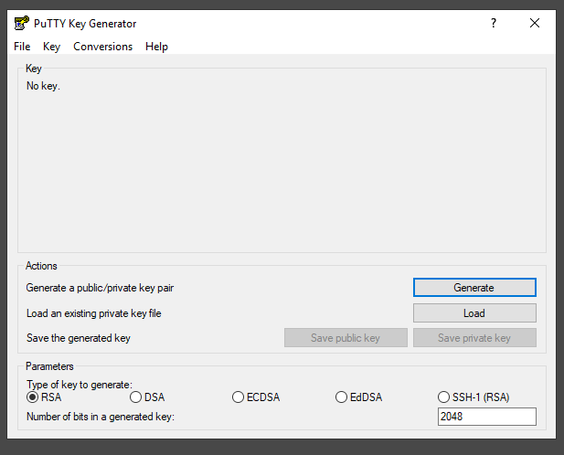

Click **Load**. A file sector should appear:

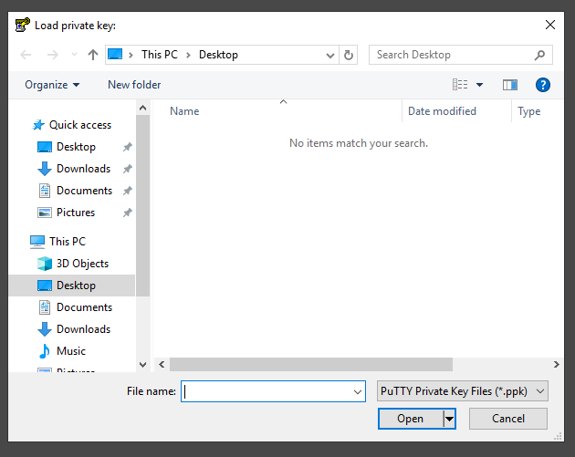

In the lower section of the window there should be a drop-down menu with the option **PuTTY Private Key Files** already selected. Click it and choose **All Files (*.*)** instead:

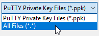

Find your downloaded private key and click **Open**.

A following message should appear:

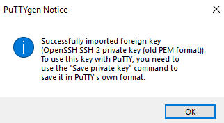

Click **OK**. You should return to the previous window (**PuTTY Key Generator**). Click **Save private key**. You should get the following question:

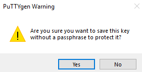

Click **Yes**.

In the next window **Save private key as:** choose the location in which you wish to place your private key. Choose a name for your file and press **Save**.

Close the **PuTTY Key Generator** window. Your saved file should like like this:

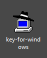

Of course, your file will probably have a different name than the one on the screenshot above.

Step 10 Configure PuTTY
-----------------------

Run **PuTTY** from your **Start** menu. The following window should appear:

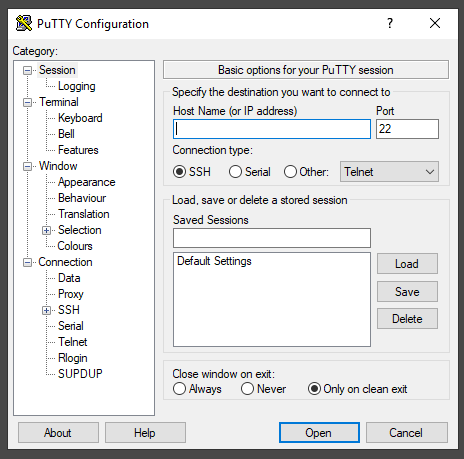

In the text field **Host Name (or IP address)** type the floating IP of your virtual machine - in this example it is **64.225.133.247**:

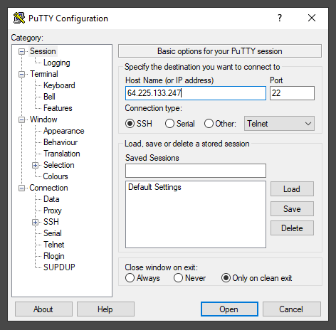

In the **Category** section (in the left part of the window) go to **Connection -> SSH -> Auth -> Credentials to authenticate with**. You should get the following form:

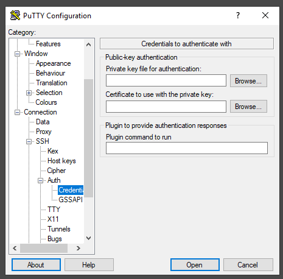

Click **Browse...** next to the text field **Private key file for authentictation**.

Choose your converted private key.

The location of your key should appear in the **Private key file for authentication** text box:

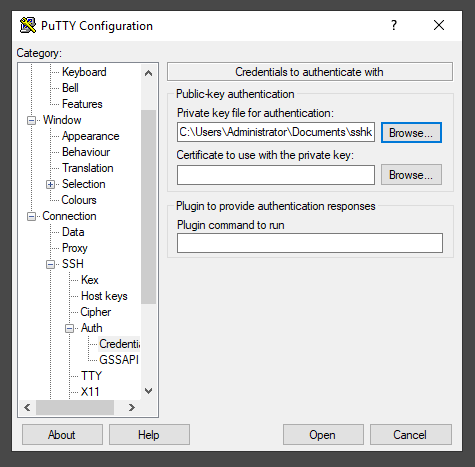

Step 11 Save the session settings
---------------------------------

To save these settings for future use, return to the **Session** category in which you typed the floating IP of your virtual machine. Choose the name of your session and type it in the text field found in the **Load, save or delete a stored session**:

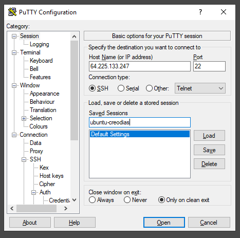

Click **Save**. Your saved session should appear on the list:

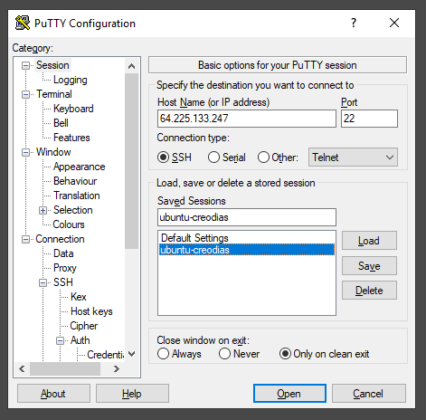

Step 12 Connect to your virtual machine
---------------------------------------

To connect to your virtual machine, click **Open**. If you are connecting to that machine for the first time, you should receive the following alert:

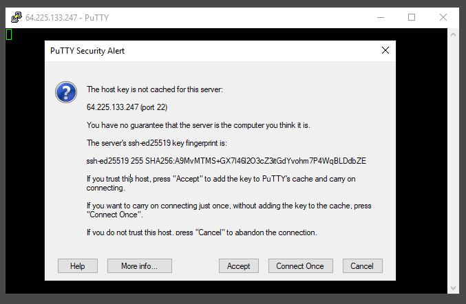

Click **Accept**.

You will be asked for your username:

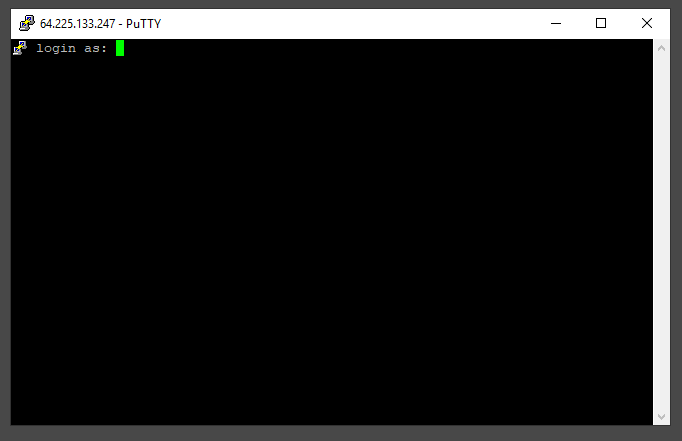

Type **eouser** and press Enter.

.. note::

   User **eouser** is the predefined Linux user name on default images on |brand-name| hosting.

You should now be connected to your virtual machine and be able to execute commands:

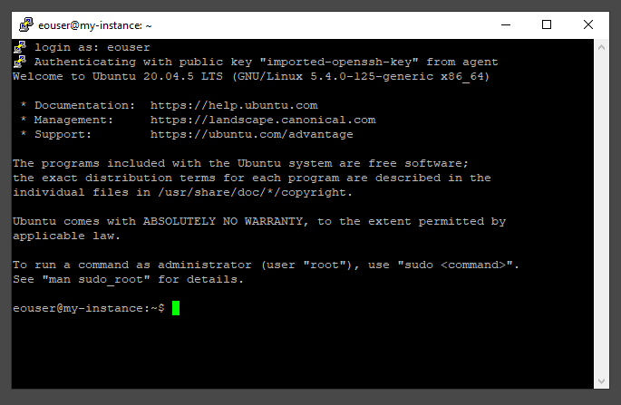

Using your saved PuTTY session to simplify login
------------------------------------------------

In order to use your saved session, open **PuTTY**. In the **Load, save or delete a stored session**, click the name of your saved session from the list and click **Load**.

All your settings, including the floating IP of your VM should now be provided:

You can now start your session as explained in Step 12 above.

What To Do Next
---------------

|brand-name| cloud can be used for general hosting needs, such as

 * installing LAMP servers,

 * installing and using WordPress servers,

 * email servers,

 * Kubernetes and SLURM clusters and so on.

.. ifconfig:: brand_name not in brands_without_eodata

    You can also take advantage of its access to the **eodata** repository, where "eodata" stands for "Earth Observation Data" from satellites.

    .. jinja:: brand_names

       :doc:`/eodata/How-to-mount-eodata-using-S3FS-in-Linux-on-{{ brand_name_hyphen }}`

    .. jinja:: brand_names

       :doc:`/eodata/How-to-download-EODATA-files-using-s3cmd-on-{{ brand_name_hyphen }}`

    .. jinja:: brand_names

       :doc:`/eodata/How-to-access-EODATA-using-boto3-on-{{ brand_name_hyphen }}`.

        If you need more performance for purposes such as deep learning, you can use VMs with NVIDIA hardware. The following article covers the creation of such VM:

        .. jinja:: brand_names

           :doc:`/cloud/How-To-Create-a-New-Linux-VM-With-NVIDIA-Virtual-GPU-in-the-OpenStack-Dashboard-Horizon-on-{{ brand_name_hyphen }}`

        For a cutting edge example of using **eodata** and deep learning algorithms, please see:

        .. jinja:: brand_names

           :doc:`/cuttingedge/Sample-Deep-Learning-workflow-using-vGPU-and-EO-DATA-on-{{ brand_name_hyphen }}`.

To create a *cluster* of instances, see the series of articles on Kubernetes:

.. jinja:: brand_names

   :doc:`/kubernetes/How-to-Create-a-Kubernetes-Cluster-Using-{{ brand_name_hyphen }}-OpenStack-Magnum`.

If you find yourself unable to connect to your virtual machine using SSH, you can use the web console for troubleshooting and other purposes. Here's how to do it:

.. jinja:: brand_names

   :doc:`/cloud/How-to-access-the-VM-from-OpenStack-console-on-{{ brand_name_hyphen }}`

.. jinja:: brand_names

If you don't want the storage of your instance to be deleted while the VM is removed, you can choose to use a volume during instance creation. Please see the following articles:

.. jinja:: brand_names

   :doc:`/cloud/VM-created-with-option-Create-New-Volume-No-on-{{ brand_name_hyphen }}`

.. jinja:: brand_names

   :doc:`/cloud/VM-created-with-option-Create-New-Volume-Yes-on-{{ brand_name_hyphen }}`.

.. the user might not know what a web console is

You can't apply the SSH keys uploaded to the Horizon dashboard directly to a VM after its creation. The following article presents a walkaround to this problem:

.. jinja:: brand_names

   :doc:`/networking/How-to-add-SSH-key-from-Horizon-web-console-on-{{ brand_name_hyphen }}`.

.. jinja:: brand_names

   If you find that the storage of your VM is insufficient for your needs, you can attach the volume to it after its creation. The following articles contain appropriate instructions: :doc:`/datavolume/How-to-attach-a-volume-to-VM-less-than-2TB-on-Linux-on-{{ brand_name_hyphen }}` and :doc:`/datavolume/How-to-attach-a-volume-to-VM-more-than-2TB-on-Linux-on-{{ brand_name_hyphen }}`.