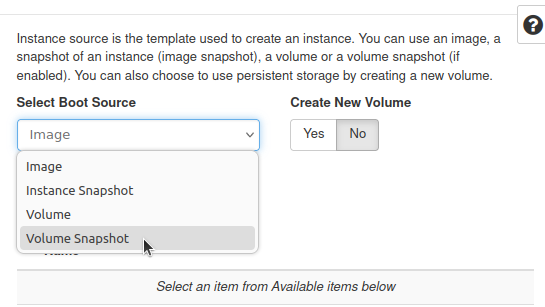
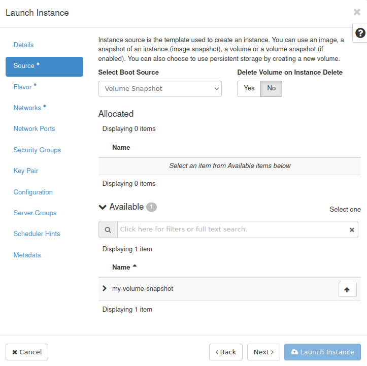
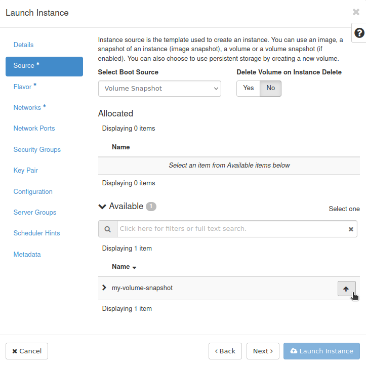
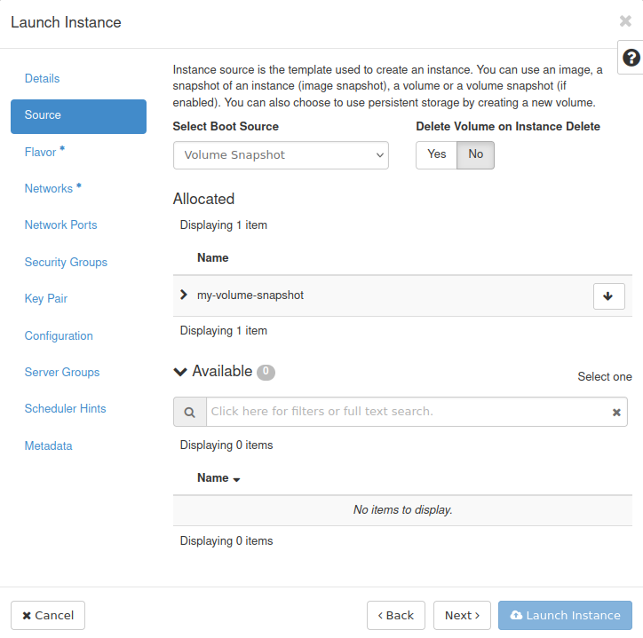
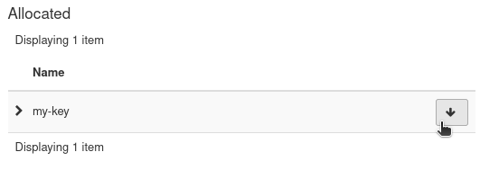

How to create a VM from volume snapshot using Horizon dashboard on |brand-name|
===============================================================================

In this article, you will learn how to create a virtual machine from a volume snapshot using Horizon dashboard.

Prerequisites
-------------

No. 1 **Account**

You need a |brand-name| hosting account with access to the Horizon interface: |brand-name-site-link|.

No. 2 **Familiarity with the process of creating a virtual machine**

.. jinja:: brand_names

   You need to be familiar with the basics of creating a virtual machine: :doc:`/cloud/How-to-create-a-Linux-VM-and-access-it-from-Linux-command-line-on-{{ brand_name_hyphen }}`

In this article, we work with above mentioned article but modify some of its steps.

No. 3 **Volume snapshot created from a bootable volume which contains an operating system**

This article involves creating a virtual machine from a volume snapshot. We therefore assume that you already have a volume snapshot created from a bootable volume. See the following articles for more information:

.. jinja:: brand_names

    * :doc:`/datavolume/Bootable-versus-non-bootable-volumes-on-{{ brand_name_hyphen }}`

    * :doc:`/datavolume/How-to-create-or-delete-volume-snapshot-on-{{ brand_name_hyphen }}`

Of course, if you want your new virtual machine to be operational, that bootable volume needs to have a functional operating system, for example Ubuntu 22.04.

.. We assume here that for your particular volume snapshot uploading of SSH keys during creation of virtual machine will not work and that your image already has them if needed. We also assume that when a virtual machine is spawned, you will be able to access it, for example via SSH or web console.

.. However, if in the case of your particular volume snapshot the upload of SSH keys does work, you can ignore instructions from this article and upload an SSH key while creating a virtual machine. You can perform tests yourself to see if it works for you.

In this article, term *source volume* denotes the volume from which the volume snapshot that we are working with was created.

No. 4 **Access to the virtual machine being created**

There are different methods of accessing virtual machines. This includes SSH and web console.

For SSH, while creating a virtual machine from a volume snapshot, there is an option of "injecting" an SSH key to the machine being created. Some operating systems are compatible with this feature, while others are not.

If for your particular volume snapshot attaching of an SSH key with this method does not work, make sure that your installation of an operating system includes some method of accessing it.

What We Are Going To Cover
--------------------------

 * :ref:`example-scenario-in-which-this-article-applies`

 * :ref:`creating-vm-from-volume-snapshot-using-the-horizon-dashboard`

   * :ref:`step-1-provide-information-about-virtual-machine-you-want-to-create`

     * :ref:`changes-to-step-2-boot-source`

     * :ref:`changes-to-step-6-ssh-key-pair`

   * :ref:`step-2-other-operations`

.. _example-scenario-in-which-this-article-applies:

Example scenario in which this article applies
----------------------------------------------

.. jinja:: brand_names

   You created an Ubuntu 22.04 virtual machine by following :doc:`/cloud/How-to-create-a-Linux-VM-and-access-it-from-Linux-command-line-on-{{ brand_name_hyphen }}`

   While creating that virtual machine, you set option **Create New Volume** to **Yes** and option **Delete Volume on Instance Delete** to **No**: :doc:`/cloud/VM-created-with-option-Create-New-Volume-Yes-on-{{ brand_name_hyphen }}`

   After some time, you shut down your virtual machine and deleted it. The volume which was used as boot volume of that VM is still available. You created a snapshot of that volume: :doc:`/datavolume/How-to-create-or-delete-volume-snapshot-on-{{ brand_name_hyphen }}`.

.. _creating-vm-from-volume-snapshot-using-the-horizon-dashboard:

Creating VM from volume snapshot using the Horizon dashboard
------------------------------------------------------------

.. _step-1-provide-information-about-virtual-machine-you-want-to-create:

Step 1: Provide information about virtual machine you want to create
^^^^^^^^^^^^^^^^^^^^^^^^^^^^^^^^^^^^^^^^^^^^^^^^^^^^^^^^^^^^^^^^^^^^

.. jinja:: brand_names

   We are modifying steps from reference article :doc:`/cloud/How-to-create-a-Linux-VM-and-access-it-from-Linux-command-line-on-{{ brand_name_hyphen }}`

.. _changes-to-step-2-boot-source:

Changes to Step 2 Boot Source
+++++++++++++++++++++++++++++

In Step 2 of above mentioned article, you are supposed to choose the image from which you want to create a virtual machine. Instead of that, from the drop-down menu **Select Boot Source** choose option **Volume Snapshot**. This will allow you to choose from the existing volume snapshots.

You should get a list of volume snapshots:

Click **↑** next to the volume snapshot from which you want to create your virtual machine:

It should now be visible in the **Allocated** section:

You should now be able to proceed to the next step.

.. _changes-to-step-6-ssh-key-pair:

Changes to Step 6 SSH key pair
++++++++++++++++++++++++++++++

If your particular installation of an operating system supports "injecting" of an SSH key this way, you can perform this step just like it was done in the reference article.

.. We assume that for your particular volume snapshot uploading of an SSH key during volume creation does not work.

.. Therefore **do not follow** Step 6 of the above mentioned article. Instead, make sure that no SSH key is selected in step **Key Pair** of the **Launch Instance** window.

If, however, it is not support this process, make sure that no keys are selected in this step. If a key has already been chosen and exists in the **Allocated** section, you can click **↓** next to its name to unselect it:

.. _step-2-other-operations:

Step 2: Other operations
^^^^^^^^^^^^^^^^^^^^^^^^

You should be able to attach a floating IP to a virtual machine created in this way just like to any other virtual machine.

See Step 8 of the reference article.

The floating IP will almost certainly be different from the value given in that article so adjust where needed.

.. jinja:: brand_names

   You might also need to configure appropriate security groups: :doc:`/cloud/How-to-use-Security-Groups-in-Horizon-on-{{ brand_name_hyphen }}`

Virtual machines are controlled using different methods, for example SSH or web console. Whatever methods are available on the operating system stored on the volume snapshot should be available on your new virtual machine, since this is the assumption of this article. However, the commands used might be different, for example if the floating IP changed, the SSH command used to access the virtual machine might also change.

.. _what-to-do-next:

What To Do Next
---------------

.. jinja:: brand_names

   If you want to create a virtual machine from a volume snapshot using the OpenStack CLI client instead of the Horizon dashboard, see: :doc:`/openstackcli/How-to-create-a-VM-from-volume-snapshot-using-OpenStack-CLI-on-{{ brand_name_hyphen }}`

.. jinja:: brand_names

   Now that you have created a virtual machine from your volume snapshot, the need may arise in the future to delete that volume snapshot. To that end, see :doc:`/datavolume/How-to-create-or-delete-volume-snapshot-on-{{ brand_name_hyphen }}`