How to create a VM using the OpenStack CLI client on |brand-name| cloud
=================================================================================================

This article will cover creating a virtual machine on |brand-name|  cloud using the OpenStack CLI client exclusively. It contains basic information to get you started.

What We Are Going To Cover
---------------------------

 * The **openstack** command to create a VM
 * Selecting parameters of the new virtual machine

  - Image
  - Flavor
  - Key pair
  - Network(s)
  - Security group(s)

 * Creating a virtual machine with CLI only
 * Adding a floating IP to the existing VM
 * Using SSH to access the VM

Prerequisites
----------------

No. 1 **Account**

You need a |brand-name| hosting account with access to the Horizon interface: |brand-name-site-link|.

No. 2 **OpenStack CLI client configured**

.. jinja:: brand_names

   To have the OpenStack CLI client configured and operational, see article: :doc:`/openstackcli/How-to-install-OpenStackClient-for-Linux-on-{{ brand_name_hyphen }}/How-to-install-OpenStackClient-for-Linux-on-{{ brand_name_hyphen }}`.

If the command

.. code::

   openstack flavor list

shows a list of flavors, the **openstack** command is operational.

No. 3 **Available image to create a new VM from**

In general, you can create a new virtual machine from these four sources:

 * operating system image
 * instance snapshot
 * volume
 * volume snapshot

In this article, we will use the first option, an operating system image, as a source of a new virtual machine. There are three ways you can obtain an image:

Images that are automatically included on |brand-name| cloud
   There is a set of images that come predefined with the cloud. Typically, that default list of images will contain Ubuntu, CentOS, and Windows 2019/22 images, with various flavors. Other default images could be available as well, say, for AlmaLinux, OPNSense, OSGeolive, Rocky Linux and so on.

Images shared from other projects
   Under OpenStack, images can be shared between the projects. To have an alien image available in your project, you have to accept it first.

Images uploaded within your account
   Finally, you can upload an image by yourself. Once uploaded, the image will be a first class citizen but it may not be automatically available on other accounts you might have.

   See this article

   .. jinja:: brand_names

      :doc:`/cloud/How-to-upload-your-custom-image-using-OpenStack-CLI-on-{{ brand_name_hyphen }}/How-to-upload-your-custom-image-using-OpenStack-CLI-on-{{ brand_name_hyphen }}`

   for an example of uploading a new Debian image to the cloud.

No. 4 **Available SSH key pair**

These two articles should help generate and import the SSH key into the cloud:

.. jinja:: brand_names

    * :doc:`/networking/Generating-a-sshkeypair-in-Linux-on-{{ brand_name_hyphen }}` and
    * :doc:`/networking/How-to-Import-SSH-Public-Key-to-OpenStack-Horizon-on-{{ brand_name_hyphen }}/How-to-Import-SSH-Public-Key-to-OpenStack-Horizon-on-{{ brand_name_hyphen }}`

No. 5 **Know the rules for the image before using it**

Here are the important bits of information about the image used:

The name of the user
   You must know the name of the user for the image you are using.

   For Ubuntu and CentOS images on |brand-name|, there will be two users,

    * **eoconsole** to change the password and
    * **eouser** to actually use the system with.

   If you were using a custom uploaded Debian image, there would be one user, **debian**.

The type of remote access available
   For Linux based VMs, in most cases it will be SSH -- hence the need to install the key pair first.

   For a custom Debian 11 image, login via password is not allowed, therefore, SSH availability would be a must.

   For Windows based VMs, the protocol used can be RDP. Since it is not secure over the Internet, a web console is the preferred way of using Windows based VMs.

Web console access
   Is there a default account in the image to use? Is web console access allowed?

Privileges
   Does the user of the image have **sudo** privileges or not? **eouser** and **debian** users do have **sudo** privileges on their respective hosts, but that does not have to be so in every case.

To connect to the VM through SSH, you will also need its IP address. You can only obtain that IP address once the VM has been created so, strictly speaking, it is not prerequisite in itself.

Always use the latest value of image id
-------------------------------------------------------------------

From time to time, the default images of operating systems in the |brand-name| cloud are upgraded to the new versions. As a consequence, their **image id** will change. Let's say that the image id for Ubuntu 20.04 LTS was **574fe1db-8099-4db4-a543-9e89526d20ae** at the time of writing of this article. While working through the article, you would normally take the **current** value of image id, and would use it to replace **574fe1db-8099-4db4-a543-9e89526d20ae** throughout the text.

Now, suppose you wanted to automate processes under OpenStack, perhaps using Heat, Terraform, Ansible or any other tool for OpenStack automation; if you use the value of **574fe1db-8099-4db4-a543-9e89526d20ae** for image id, it would remain **hardcoded** and once this value gets changed during the upgrade, the automated process may stop to execute.

.. warning::

   Make sure that your automation code is using the **current value** of an OS image id, not the hardcoded one.

The openstack command to create a VM
--------------------------------------------

The **openstack** command to create a VM is

.. code::

   openstack server create

Here is how to see all of its parameters:

.. code::

   openstack server create --help

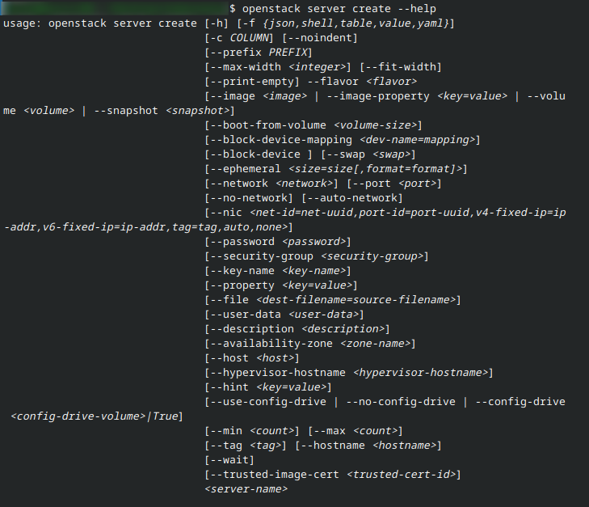

The name of each of the parameters starts with two dashes, **-\-**, and after that comes the value of the parameter. For example, you can specify the name of the image used to create a virtual machine using parameter **\-\-image**. It will look like this within the command:

.. code::

   openstack server create \
   --image Debian-custom-upload \

There are about 27 different parameters you can use to create a new VM using CLI. For practical purposes, you will choose only a few and leave the rest to the defaults by not providing them.

Step 1: Selecting parameters of the new virtual machine
-----------------------------------------------------------------

This is the process of defining and selecting the parameters with which your new VM will operate.

Image
^^^^^^^^^^^^^^^^^^^

To discover the name of the image to use, execute the following command and see these images:

.. code::

   openstack image list

You should get the output like this:

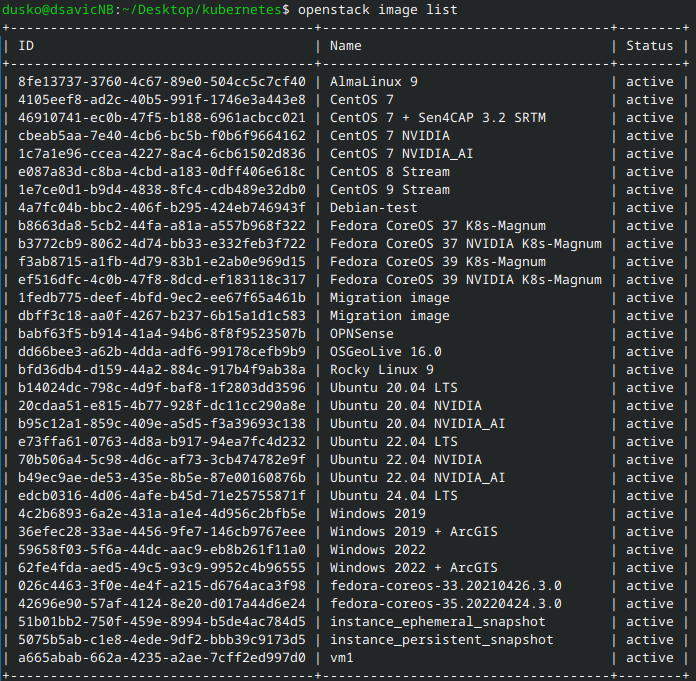

The parameter for **openstack server create** is **\-\-image**.

On screenshot above, we can see:

 * the default images available on |brand-name| cloud, as well as
 * custom image called **Debian-test** uploaded by the user while following the article mentioned in Prerequisite No. 3.

In this example, we will use above mentioned custom image:

.. code::

   --image "Ubuntu 22.04 LTS"

Flavor
^^^^^^^^^^^^^^^^^^^

Flavors determine hardware available to the virtual machine. You can list flavors available to you using this command:

.. code::

   openstack flavor list

The parameter for **openstack server create** is **-\-flavor**.

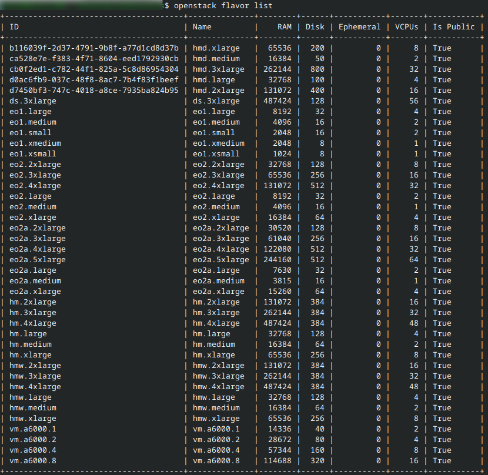

The flavors that you can choose will depend on the image you selected. For instance, the following flavors contain access to NVIDIA GPU:

 * **vm.a6000.1**
 * **vm.a6000.2**
 * **vm.a6000.4**
 * **vm.a6000.8**

but should only be used with default images which contain the phrase **NVIDIA** in their names. (These images contain software specifically designed for those flavors.)

For example:

.. code::

   --flavor eo1.small

Key Pair
^^^^^^^^^^^^^^^^

Use this parameter only if you want to apply an SSH key to your virtual machine and the image of your choice supports it.

The Ubuntu image which we will use in this example does support this method. Apart from that, if you don't apply an SSH key to virtual machine created using that image, accessing that VM will require additional tinkering.

To list the available key pairs, execute:

.. code::

   openstack keypair list -c Name -c Type

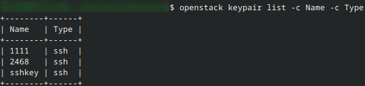

The parameter to use is **-\-key-name**

For example:

.. code::

   --key-name sshkey

Networks
^^^^^^^^^^^^

To list networks which can be connected to your virtual machine, execute the following command:

.. code::

   openstack network list -c Name

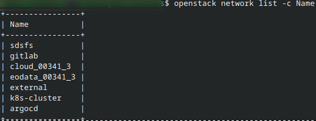

The parameter to use is **-\-network**.

You may want to use two or more networks in the new VM. Just repeat the **-\-network** parameter with another value as many times as needed. For example, to add **network1** and **network2**, add the following to the **openstack server create** command:

.. code::

   --network network1 --network network2

.. ifconfig:: brand_name in brands_without_eodata

   .. note::

      If you want to access the EODATA repository on your virtual machine, you should add a network which has a name starting with |eodata-network| which was added by default to your project.

Security groups
^^^^^^^^^^^^^^^^^^^

Security groups block or allow different types of Internet traffic on your virtual machine. To list security groups available to you, execute the following command:

.. code::

   openstack security group list -c Name

Here is a list of available security groups in a system that has been used for a while:

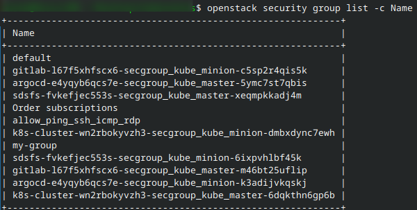

The most basic security group is **default**, however, in the image above we also see group called **allow_ping_ssh_icmp_rdp** and this is what it contains:

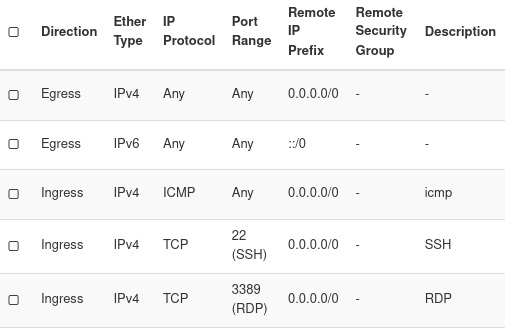

There may be other security groups present, especially if you were creating Kubernetes clusters.

The parameter to use is **-\-security-group** parameter. To add two security groups, use **-\-security-group** two times and so on.

.. code::

   --security-group group1 --security-group group2

Step 2: Create a virtual machine
--------------------------------------

Execute the **openstack server create** command. Add parameters based on choices you made in Step 1. Finish the command with the name of your choice for the new  virtual machine.

Example
^^^^^^^^^

Let us use the image of Ubuntu 22.04. LTS. We do not have another image under the same name and we want to create a virtual machine with the following specifications:

.. ifconfig:: brand_name in  brands_without_eodata

    * Name: **Test-Ubuntu**
    * Flavor: **eo1.small**
    * Source: the **Ubuntu 22.04 LTS** image
    * Key Pair: **sshkey** previously uploaded to your account
    * Security groups: **default** and **allow_ping_ssh_icmp_rdp**
    * Networks: **cloud_00341_1**, **eodata_00341_1**

.. ifconfig:: brand_name not in brands_without_eodata

    * Name: **Test-Ubuntu**
    * Flavor: **eo1.small**
    * Source: the **Ubuntu 22.04 LTS** image
    * Key Pair: **sshkey** previously uploaded to your account
    * Security groups: **default** and **allow_ping_ssh_icmp_rdp**
    * Network: **cloud_00341_1**

In your case, these parameters will probably be different.

Here is the command to create virtual machine with the following parameters:

.. ifconfig:: brand_name in brands_without_eodata

   .. code::

        openstack server create \
        --image "Ubuntu 22.04 LTS" \
        --flavor eo1.small \
        --key-name sshkey \
        --network cloud_00341_3 \
        --network eodata_00341_3 \
        --security-group default \
        --security-group allow_ping_ssh_icmp_rdp \
        Test-Ubuntu

.. ifconfig:: brand_name not in brands_without_eodata

   .. code::

        openstack server create \
        --image "Ubuntu 22.04 LTS" \
        --flavor eo1.small \
        --key-name sshkey \
        --network cloud_00341_3 \
        --security-group default \
        --security-group allow_ping_ssh_icmp_rdp \
        Test-Ubuntu

Backslash character, **\\**, is was used to separate one command into multiple lines, for additional legibility.

If you entered the command correctly, you should see the output containing the information about your VM, for example:

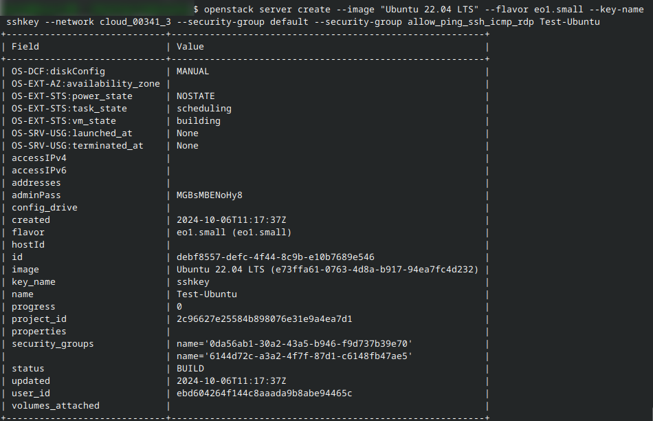

.. warning::

   If you repeat the same **server create** command for the second time, a new instance will be created, also named **Test-Ubuntu**. You will end up with two instances of the same name as shown here:

   .. image:: Screenshot_20241006_133524.png

To differentiate between them, use their ID values. For instance, execute the command below and in it replace **debf8557-defc-4f44-8c9b-e10b7689e546** with the ID of your VM.

.. code::

   openstack server show debf8557-defc-4f44-8c9b-e10b7689e546

Typically, after up to a minute, this command should show the output with **Running** in the field **power_state**:

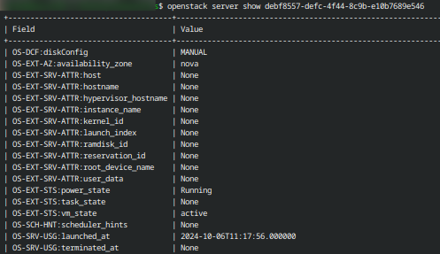

This means that your virtual machine is operational.

Step 3 Add a floating IP to the existing VM
----------------------------------------------------------

To access the virtual machine from the Internet, the virtual machine needs a floating IP. You can check the list of floating IPs available in your project by executing this command:

.. code::

   openstack floating ip list

If the output is empty, it means that the project does not have any IPs yet.

To assign a floating IP to your project, execute the following command.

.. code::

   openstack floating ip create external

In it, **external** is the name of the external network used in your project.

.. note::

   The name of this network is by default **external** -- you can find it using the command **openstack network list**.

The output of this command should provide information about the created floating IP, for example:

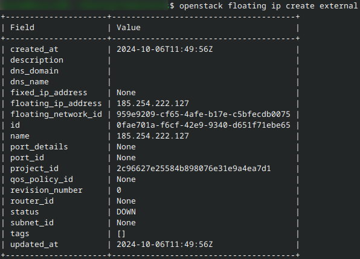

Note down the value in field **floating_ip_address** -- it is the actual IP address for the new machine.

The general form of the CLI command to assign and IP address to the new machine is:

.. code::

   openstack server add floating ip <instance_name_or_id> <floating_ip>

If the instance you just created has unique name, the floating IP address will be readily allocated to it; however, if the name is not unique, you must specify the ID vale. In our case:

.. code::

   openstack server add floating ip debf8557-defc-4f44-8c9b-e10b7689e546 185.254.222.127

and be sure to replace **185.254.222.127** with the IP address from the field **floating_ip_address**.

If this command is executed successfully, it should not give any output. You can check the assignment by executing the following command:

.. code::

   openstack server list -f json

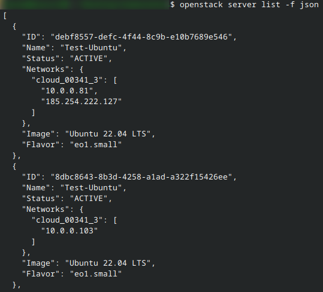

Step 4: Use SSH to access the VM
---------------------------------------

The SSH command will start executing the terminal on the remote instance. It has three main parameters:

Keypair
   Use the private key from a file. In our case, let it be called **sshkey.pem** and be placed in the same directory from which we are using the **openstack** command.

User name
   This has to be an existing user within the instance. In this article, we are using one of the default images, for Ubuntu, and so user name is **eouser**;  for a Debian image, the user would be **debian** and so on.

IP address
   Use the IP address from this article, **185.254.222.127**.

The command is:

.. code::

   ssh -i sshkey.pem user@185.254.222.127

where, obviously, you would replace **185.254.222.127** with the actual floating IP address of your virtual machine.

You should receive an output similar to this:

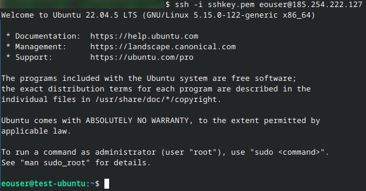

The prompt changes to **eouser@test-ubuntu** and you can now issue commands on local computer that will have effect on the remote computer.

What To Do Next
--------------------

You can use CLI commands for practically any task regarding the OpenStack environment. Here are some links:

.. jinja:: brand_names

    :doc:`/openstackcli/How-to-access-object-storage-using-OpenStack-CLI-on-{{ brand_name_hyphen }}`

    :doc:`/openstackcli/How-to-create-a-set-of-VMs-using-OpenStack-Heat-Orchestration-on-{{ brand_name_hyphen }}/How-to-create-a-set-of-VMs-using-OpenStack-Heat-Orchestration-on-{{ brand_name_hyphen }}`

    :doc:`/openstackcli/How-to-transfer-volumes-between-domains-and-projects-using-OpenStack-CLI-client-on-{{ brand_name_hyphen }}/How-to-transfer-volumes-between-domains-and-projects-using-OpenStack-CLI-client-on-{{ brand_name_hyphen }}`

    :doc:`/openstackcli/How-to-move-data-volume-between-two-VMs-using-OpenStack-CLI-on-{{ brand_name_hyphen }}/How-to-move-data-volume-between-two-VMs-using-OpenStack-CLI-on-{{ brand_name_hyphen }}`

To use the VM through a console, see

.. jinja:: brand_names

    :doc:`/cloud/How-to-access-the-VM-from-OpenStack-console-on-{{ brand_name_hyphen }}/How-to-access-the-VM-from-OpenStack-console-on-{{ brand_name_hyphen }}`
