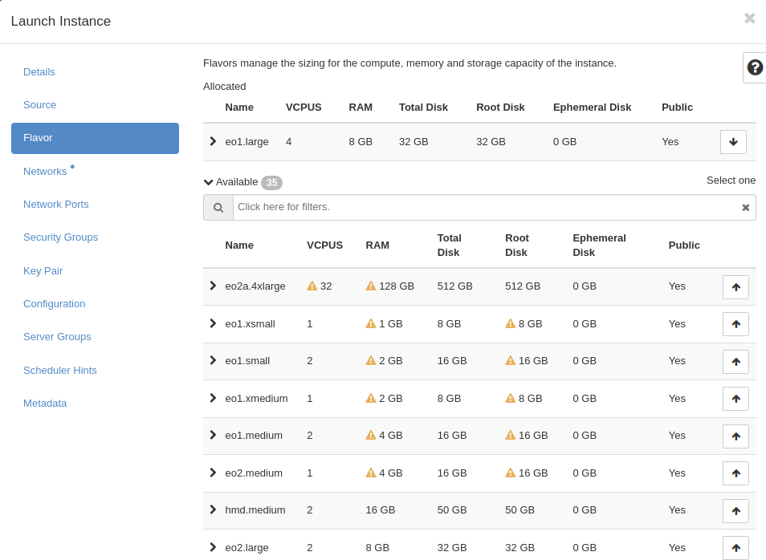
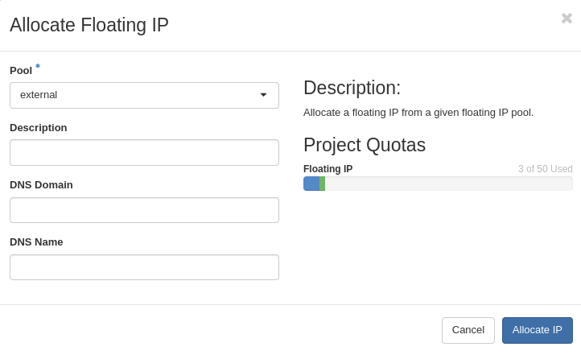
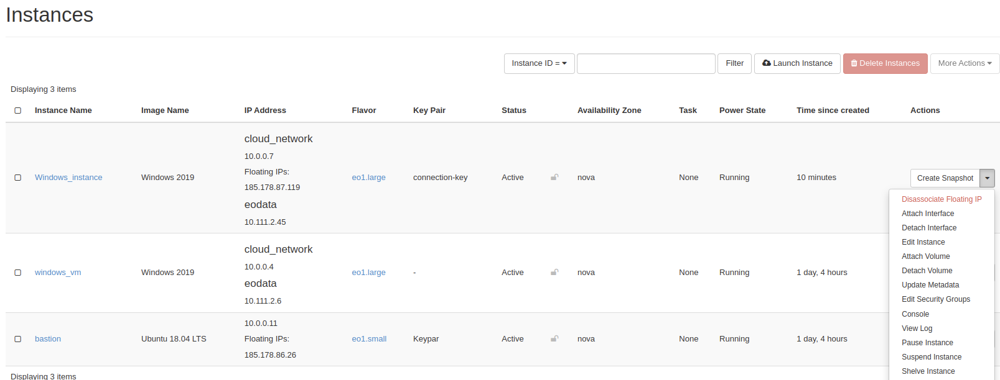
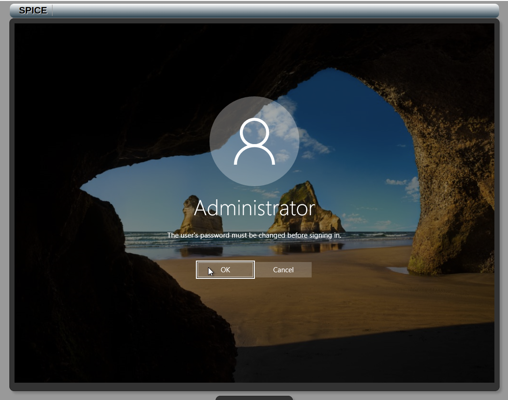
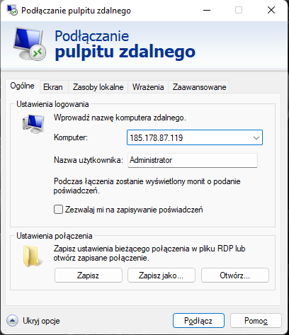
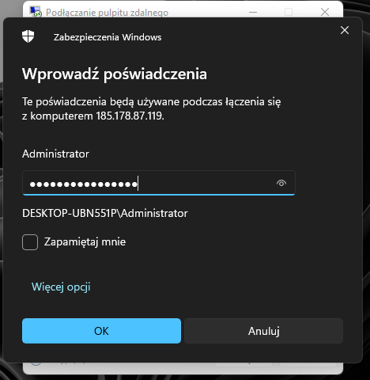
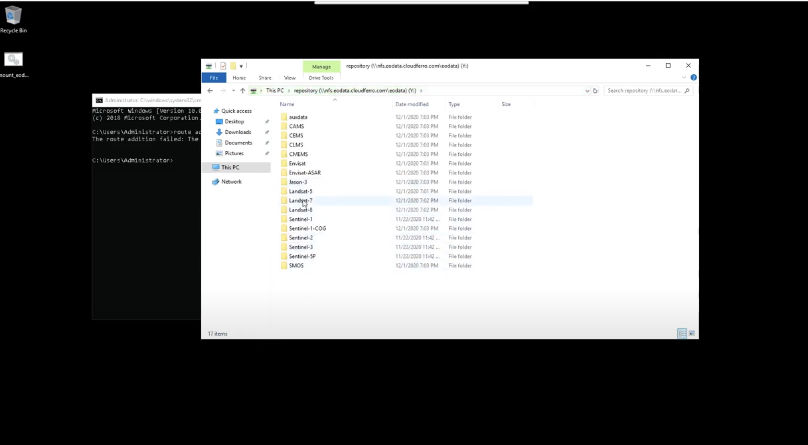

How to create a Windows Server VM and access it from Windows desktop on |brand-name|
======================================================================================================

**Step 1:** Login into your account on |brand-name-site-auth-link| webpage.

.. jinja::  create_windows_wm_server

   .. figure:: {{ ww1 }}
      :align: center

**Step 2:** On the left bottom side, you can find Management Interfaces, choose  Horizon.

.. jinja::  create_windows_wm_server

   .. figure:: {{ ww2 }}
      :align: center

.. jinja::  create_windows_wm_server

   In another one logging step choose {{ access_option }} and use the same credentials as before.

The second option is **Keystone Credentials**, if you want to use this option, you have to know your domain. (as below)

.. jinja::  create_windows_wm_server

   .. figure:: {{ ww3 }}
      :align: center

**HOW TO FIND THE DOMAIN:**

On top right, near the CloudFerro Logo you'll find your domain name and project that you are recently using. You can create new projects and switching between them.

.. jinja::  create_windows_wm_server

   .. figure:: {{ ww4 }}
      :align: center

**Step 3:** After you've successfully logged in, you may start creating your Windows instance.

Go to Compute→Instances and click Launch Instance.

.. figure:: ww5.png

In **Details** tab type **Name** of your instance and then click next.

.. figure:: ww6.png

After that, you need to choose the source of your instance. Click one of the up arrows on the right side and allocate one of the following.

.. figure:: ww7.png

In flavor tab choose one of the available flavours, like step before. If you see yellow warning on flavour you are not able to use this flavour.

In next tab choose **eodata** network, this network gives you access to Earth Observation Data and another one network called **cloud_xxxx** this network is default network created for your project.

.. figure:: ww9.png

You can also create your own network in Main Network tab.

.. figure:: ww10.png

If you want to run services or use specified protocols you must allocate security groups choose **allow_ping_ssh_icmp_rdp** group and allocate it to your instance

.. figure:: ww11.png

Now you can click **launch Instance**, wait several minutes to launch it right.

.. figure:: ww12.png

When our instance is working we must **Allocate Floating IP** (public IP) to it, after this step your vm should be able to connect from the other space.

.. figure:: ww13.png

To allocate floating IP you must click "+" (plus) next to Select an IP address. You must also select interface please do not select eodata interface.

Choose Pool external and click Allocate IP

If everything is right you should see public address next to your cloud_xxx network, you can also use console that is implemented in OpenStack, open pull down menu and choose Console, you can log into it with **Administrator** account, but on the beginning you must change password.

With this console is several problems, is very slow and you can not copying and pasting. Please set **strong password to your VM.**

**Step 4:** Connect to your Windows Server via RDP.

Open remote desktop app, click on show options, in field Computer type your **public ip** associated with vm interface , and in username type **Administrator**

Now you can click connect, in password field type your **STRONG** password.

When you are logged into your Administrator account you double click on .bat script placed in Desktop, this script is mounting eodata folder in network locations.

.. figure:: ww19.png

If you have problem with this script and eodata is not mounted yet open cmd and type: **route add 10.97.0.0/24 10.111.0.1**

Try run script again and check your network locations. Now you should have eodata access

