How to create a Windows VM and access it from Linux desktop on |brand-name|
=============================================================================

**Step 1:** Login into your account on |brand-name-site-auth-link| webpage.

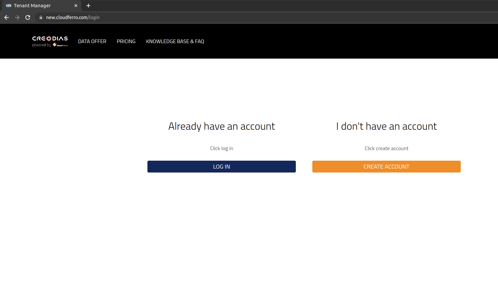

**Step 2:** On the left bottom side, you can find Management Interfaces, choose ** Horizon**

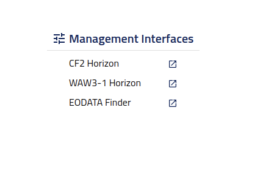

In the next login step, choose the access option available for your ECIS environment. Use the same credentials as before.

The second option is **Keystone Credentials**, if you want to use this option, you have to know your domain. (as below)

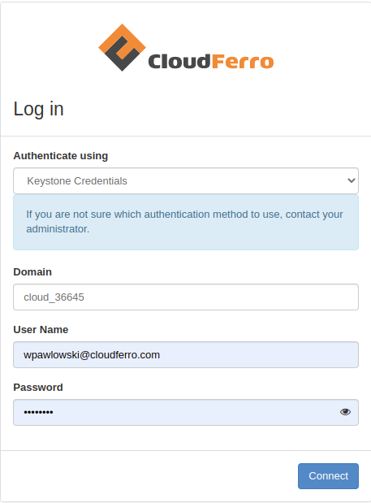

**HOW TO FIND THE DOMAIN:**

On top right, near the CloudFerro Logo you'll find your domain name and project that you are recently using. You can create new projects and switching between them.

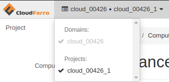

**Step 3:** After you've successfully logged in, you may start creating your Linux instance.

Go to Compute→Instances and click Launch Instance.

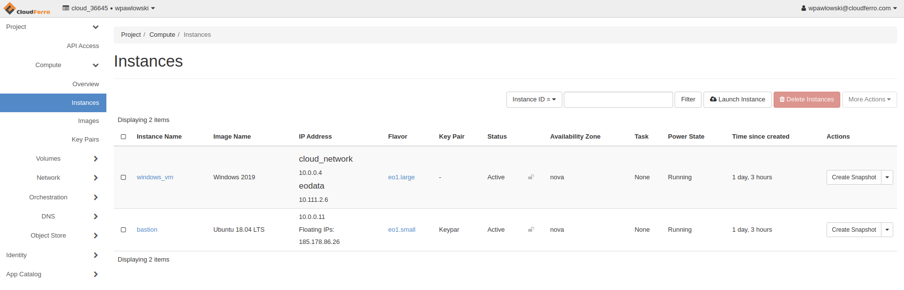

In **Details** tab type **Name** of your instance and then click next.

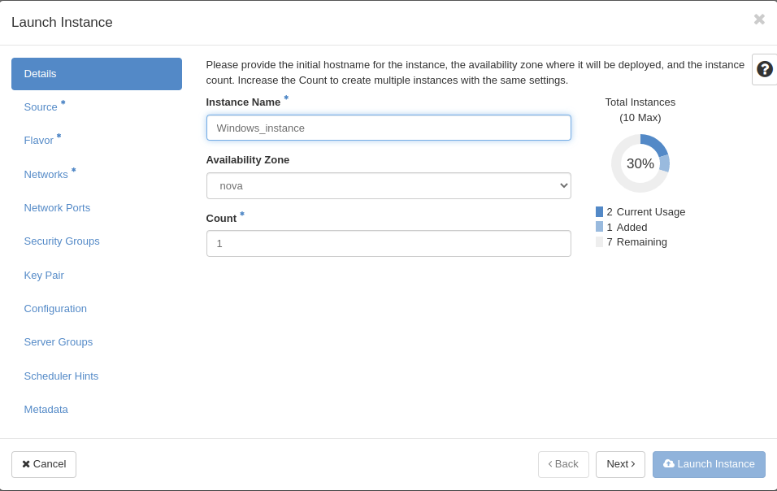

After that, you need to choose the source of your instance. Click one of the up arrows on the right side and allocate one of the following.

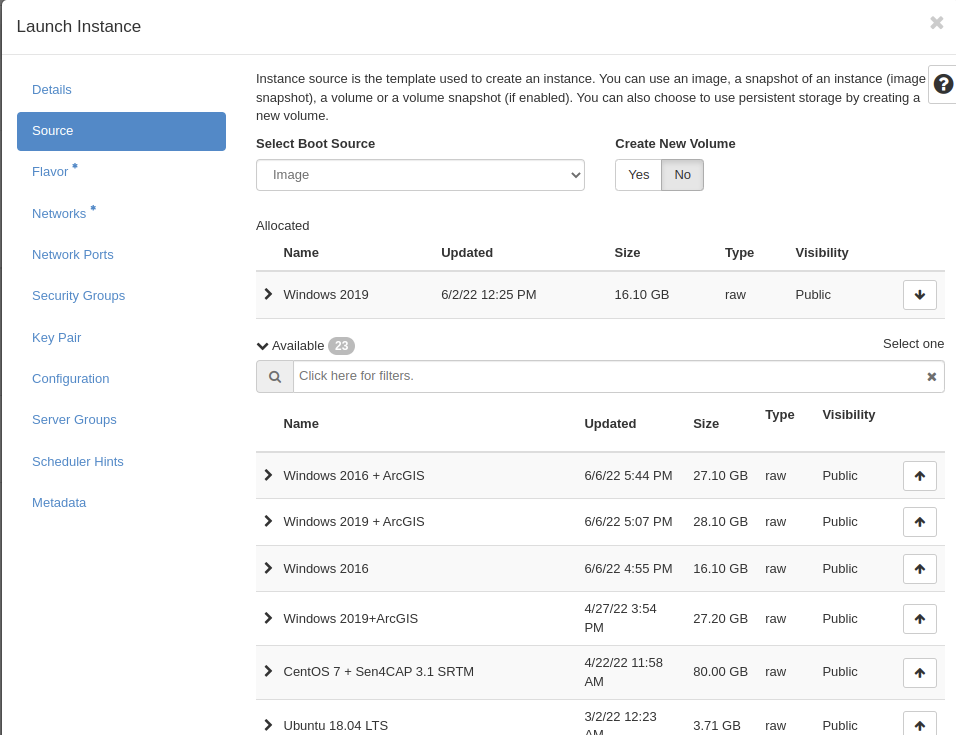

In flavor tab choose one of the available flavours, like step before. If you see yellow warning on flavour you are not able to use this flavour.

.. figure:: lw8.png

In next tab choose **eodata** network, this network gives you access to Earth Observation Data and another one network called **cloud_xxxx** this network is default network created for your project.

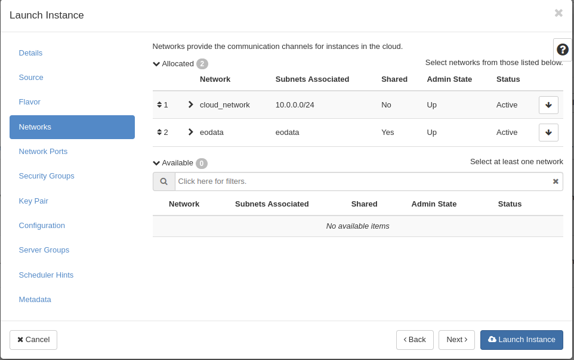

You can also create your own network in Main Network tab.

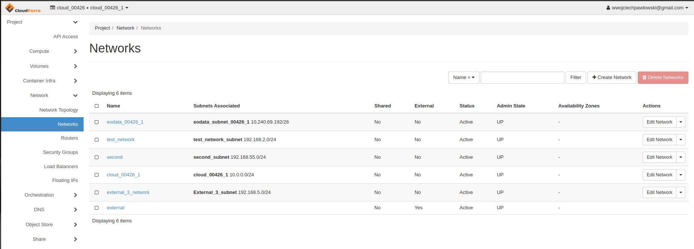

If you want to run services or use specified protocols you must allocate security groups choose **allow_ping_ssh_icmp_rdp** group and allocate it to your instance

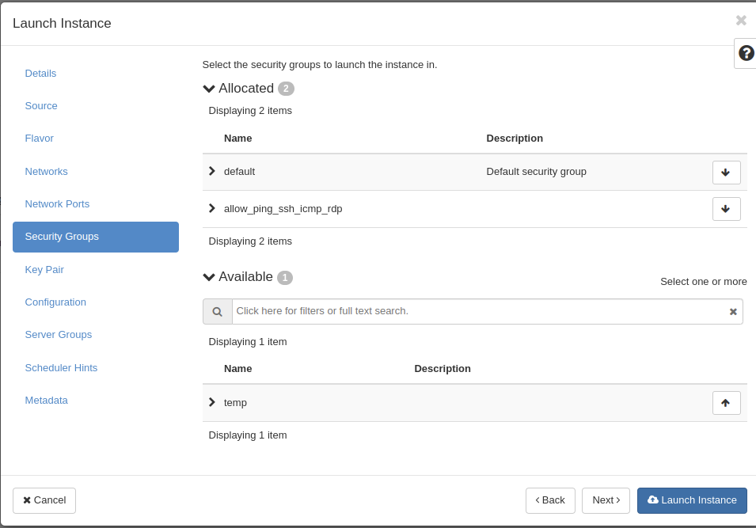

Now you can click **launch Instance**, wait several minutes to launch it right.

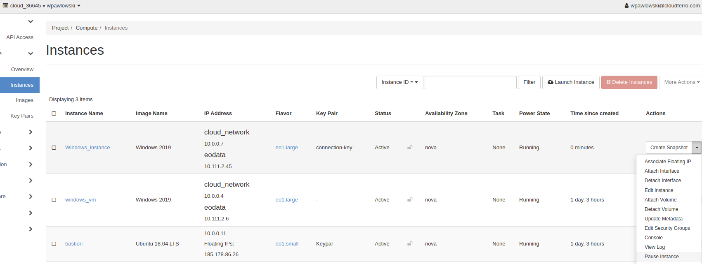

When our instance is working we must **Allocate Floating IP** (public IP) to it, after this step your vm should be able to connect from the other space.

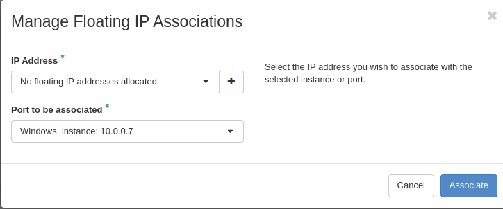

To allocate floating IP you must click "+" (plus) next to Select an IP address. You must also select interface please do not select eodata interface.

.. figure:: lw14.png

Choose Pool external and click Allocate IP

If everything is right you should see public address next to your cloud_xxx network, you can also use console that is implemented in OpenStack, open pull down menu and choose Console, you can log into it with **Administrator** account, but on the beginning you must change password.

.. figure:: lw15.png

With this console is several problems, is very slow and you can not copying and pasting. Please set **strong password to your VM.**

.. figure:: lw16.png

**Step 4:** Connect to your Windows Server via RDP.

To install Remmina use command:

::

  johndoe@johndoe:~$ sudo snap install remmina

Open Remmina app, click on top left add button, in field Server type your **public ip** associated with vm interface , and in username type **Administrator** in password field type your **STRONG** password. Make sure, protocol that has been chosen is **RDP**, click Save and Connect.

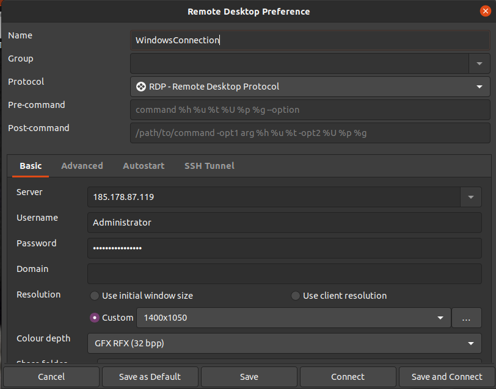

When you are logged into your Administrator account you double click on .bat script placed in Desktop, this script is mounting eodata folder in network locations.

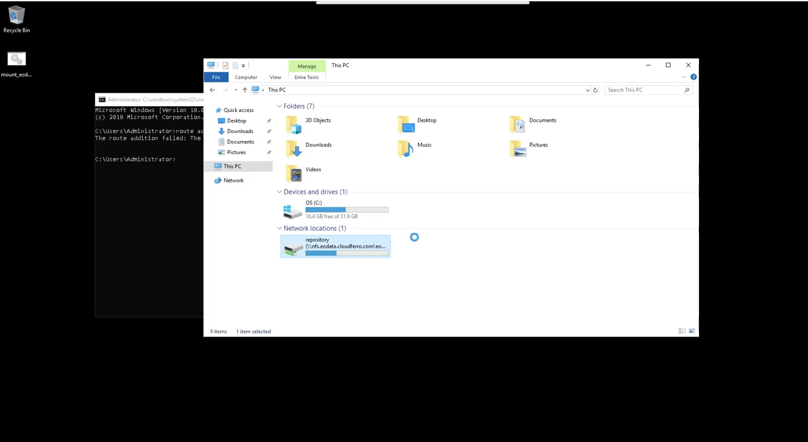

If you have problem with this script and eodata is not mounted yet, just open cmd and type: **route add 10.97.0.0/24 10.111.0.1**

Try to run the script again and check your network locations. Now you should have eodata access

.. figure:: lw19.png
