How to create instance snapshot using Horizon on |brand-name|
=============================================================

In this article, you will learn how to create instance snapshot on |brand-name| cloud, using Horizon dashboard.

Instance snapshots allow you to archive the state of the virtual machine. You can, then, use them for

 * backup,
 * migration between clouds
 * disaster recovery and/or
 * cloning environments for testing or development.

We cover both types of storage for instances, *ephemeral* and *persistent*.

The plan
--------

In reality, you will be using the procedures described in this article with the already existing instances.

However, to get a clear grasp of the process, while following this article you are going to create two new instances, one with *ephemeral* and the other with *persistent* type of storage. Let their names be **instance-which-uses-ephemeral** and **instance-which-uses-volume**. You will create an instance snapshot for each of them.

If you are only interested in one of these types of instances, you can follow its respective section of this text.

It goes without saying that after following a section about one type of virtual machine you can clean up the resources you created to, say, save costs.

Or you can keep them and use them to create an instance out of it using one of articles mentioned in What To Do Next.

What We Are Going To Cover
--------------------------

 * Create snapshot of instance which uses ephemeral storage

   * Navigate to the list of instances in Horizon
   * Shut down the VM
   * Create a snapshot
   * Show what the snapshot will contain for ephemeral storage

 * Create snapshot of instance which uses persistent storage

   * Navigate to the list of instances in Horizon
   * Shut down the VM
   * Create a snapshot
   * What does creating a snapshot of instance with persistent storage do?
   * Exploring instance snapshot and volume snapshots which were created alongside it
   * What happens if there are multiple volumes?

 * Downloading an instance snapshot

Prerequisites
-------------

No. 1 **Account**

You need a |brand-name| hosting account with access to the Horizon interface: |brand-name-site-link|.

No. 2 **Ephemeral storage vs. persistent storage**

.. jinja:: brand_names

   Please see article :doc:`/datavolume/Ephemeral-vs-Persistent-storage-option-Create-New-Volume-on-{{ brand_name_hyphen }}` to understand the basic difference between ephemeral and persistent types of storage in OpenStack.

No. 3 **Instance with ephemeral storage**

You need a virtual machine hosted on |brand-name| cloud.

Using any of the following articles will produce an instance with ephemeral storage:

.. jinja:: brand_names

    * :doc:`/cloud/How-to-create-a-Linux-VM-and-access-it-from-Windows-desktop-on-{{ brand_name_hyphen }}`
    * :doc:`/cloud/How-to-create-a-Linux-VM-and-access-it-from-Linux-command-line-on-{{ brand_name_hyphen }}`

.. ifconfig:: brand_name!= 'ESA HPC'

   .. jinja:: brand_names

      To learn how to create a Windows virtual machine, see this article: :doc:`/cloud/How-to-create-Windows-VM-on-OpenStack-Horizon-and-access-it-via-web-console-on-{{ brand_name_hyphen }}`

With ephemeral storage, only one new instance is created. It is a bootable instance, at that.

No. 4 **Instance with persistent storage**

.. jinja:: brand_names

   When creating an instance with persistent storage, all of the steps in articles from Prerequisite No. 3 are the same, save one: you set option **Create New Volume** option to **Yes**. For details, see :doc:`/datavolume/Ephemeral-vs-Persistent-storage-option-Create-New-Volume-on-{{ brand_name_hyphen }}`.

With persistent storage, one instance and one volume are created:

 * a special kind of instance (with no ephemeral storage) and
 * the volume that is attached to that instance.

The instance will boot from the volume that was attached during the creation of instance.

Otherwise, an instance can have two or more volumes attached to it, however, only one will be its boot volume.

No. 5 **How to delete resources**

If you want to delete instances, snapshots, volumes and other OpenStack objects, please have a look at the following articles:

.. jinja:: brand_names

   :doc:`/networking/How-to-correctly-delete-all-the-resources-in-the-project-via-OpenStack-commandline-Clients-on-{{ brand_name_hyphen }}`.

   :doc:`/datavolume/How-to-create-or-delete-volume-snapshot-on-{{ brand_name_hyphen }}`.

Creating a snapshot of instance which uses ephemeral storage
------------------------------------------------------------

Follow Prerequisite No. 3 and create an instance named **instance-which-uses-ephemeral**.

Navigate to the list of instances in Horizon
^^^^^^^^^^^^^^^^^^^^^^^^^^^^^^^^^^^^^^^^^^^^

Navigate to section **Compute** -> **Instances** of the Horizon dashboard and see the list of your instances.

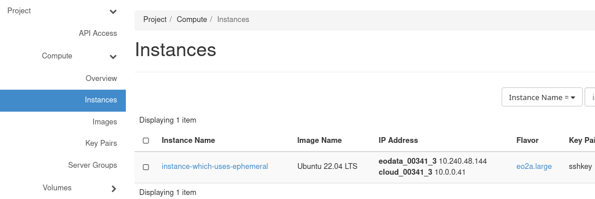

Shut down the VM
^^^^^^^^^^^^^^^^

The first step when creating a snapshot is to shut down your virtual machine. The best method is using the functions of its operating system. If, like here, the image used was Ubuntu 22.04. LTS, you could use the Horizon console or SSH access to execute a command such as

.. code::

   sudo shutdown now

There are many other such commands and they will depend on the type of image used, so further explanations are out of scope of this article.

Another way of shutting down is the one available in Horizon. You can click on the dropdown menu to the right and click on **Shut Off Instance**.

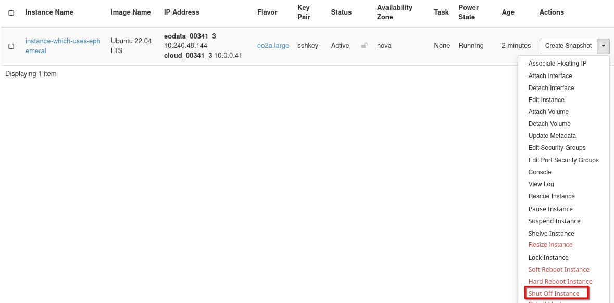

Once the instance is shut down, its **Status** (on the screenshot below marked with a red rectangle) should be **Shutoff**:

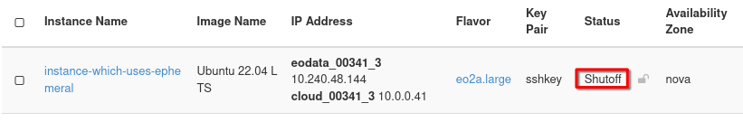

Create a snapshot
^^^^^^^^^^^^^^^^^

In the row which contains your virtual machine, from the dropdown menu in the **Actions** column, choose **Create Snapshot**:

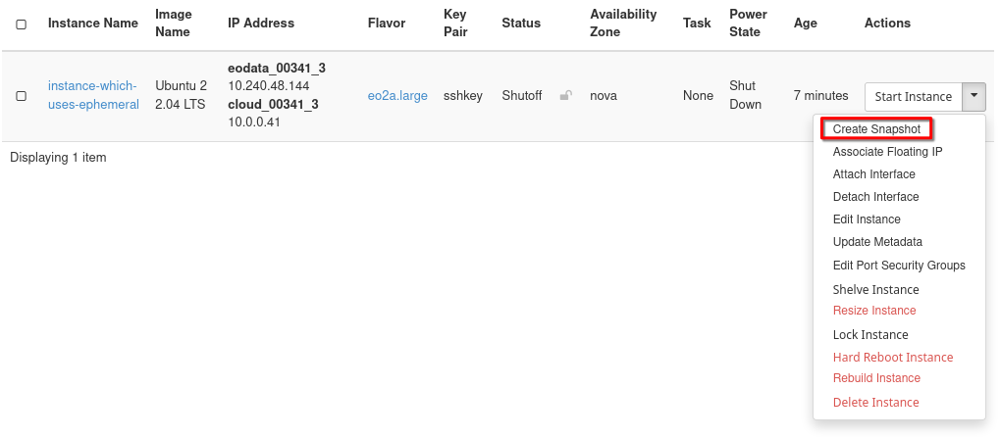

You should be prompted for the name of your snapshot:

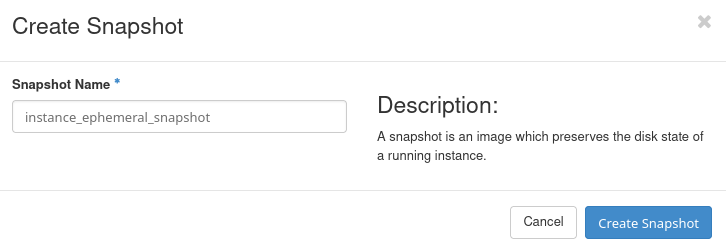

A long term approach would be to include into that name

 * the date,
 * the time and
 * the version of the snapshot.

Or, it can be anything else that can later remind you which version of the snapshot to use. Here, just enter a descriptive name such as **instance_ephemeral_snapshot** and click **Create Snapshot**.

You should now be redirected to section **Compute** -> **Images** of the Horizon dashboard. If it didn't happen, navigate there yourself.

In that section, you should see your newly created snapshot, alongside with other images, including the ones which are available by default on |brand-name| cloud. Wait until its **Status** (here marked with a dark green rectangle) is **Active**:

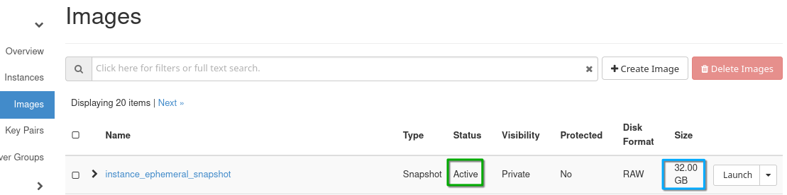

If the window of your Internet browser is sufficiently extended, you should also see the size of your snapshot, marked with a dark blue rectangle. It should be identical to the amount of storage which the flavor of your virtual machine contains. In this example, the flavor was **eo2a.large**; it has size of 32 GB and that is exactly the number we see in the blue rectangle in the image above.

What will the snapshot contain for ephemeral storage
^^^^^^^^^^^^^^^^^^^^^^^^^^^^^^^^^^^^^^^^^^^^^^^^^^^^

This instance snapshot should contain the content of boot drive of your virtual machine. It will not, however, include any content of any volumes which might have been connected to that virtual machine.

:red:`Rule of thumb`: always check whether there are volumes attached to the instance and if you want to preserve their states as well, copy or create snapshot of each of those volumes.

Snapshot of instance which uses persistent storage
--------------------------------------------------

Follow Prerequisite No. 4 and create an instance named **instance-which-uses-volume**.

Navigate to the list of instances in Horizon
^^^^^^^^^^^^^^^^^^^^^^^^^^^^^^^^^^^^^^^^^^^^

Navigate to **Compute** -> **Instances** and see a list of existing virtual machines. The screenshot below shows both instances created in this article -- **instance-which-uses-ephemeral** and **instance-which-uses-volume**.

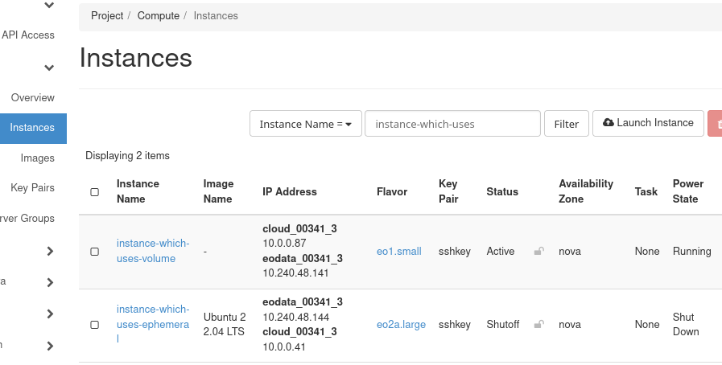

The volume on which the operating system of **instance-which-uses-volume** is installed can be found in section **Volumes** -> **Volumes** and has the same name as its ID -- **5f92521d-6e71-4d58-a3d9-171eeb9c1e77**:

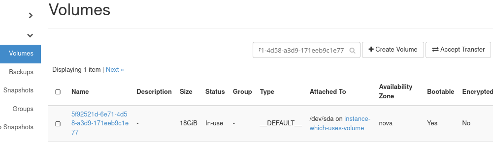

Shut down the VM
^^^^^^^^^^^^^^^^

Shut down **instance-which-uses-volume**. Again, the choice is between using the functions of its operating system or using Horizon commands. In Horizon, first list the instances with **Compute** -> **Instances** and then use command **Shut Off Instance** upon **instance-which-uses-volume**.

Once it is shut down, its **Power State** (on the screenshot below marked with a dark green rectangle) should be **Shut Down**:

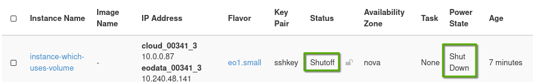

Create a snapshot
^^^^^^^^^^^^^^^^^

In the row which contains your virtual machine, from the dropdown menu in the **Actions** column, choose **Create Snapshot**:

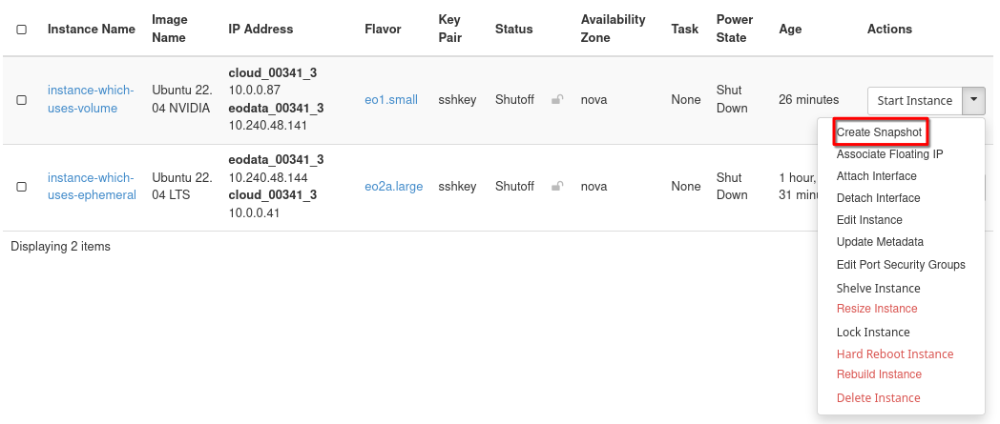

You should be prompted for a name of your snapshot:

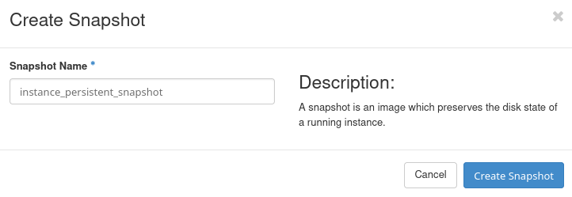

Enter a descriptive name of your choice (here we are using **instance_persistent_snapshot**) and click **Create Snapshot**.

You should now be redirected to section **Compute -> Images** of the Horizon dashboard. If it didn't happen, navigate there yourself.

In that section, you should see your newly created snapshot, alongside with other images, including the ones which are available by default on |brand-name| cloud. Wait until its **Status** (here marked with a dark green rectangle) is **Active**

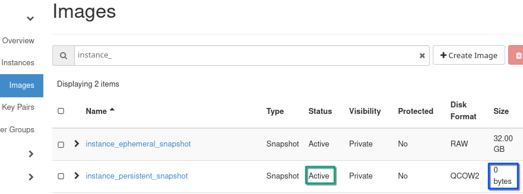

Because this snapshot does not contain the data stored on the hard drive of that virtual machine, its size (on screenshot above marked with a dark blue rectangle) appears to be 0 bytes.

What does creating a snapshot of instance with persistent storage do?
^^^^^^^^^^^^^^^^^^^^^^^^^^^^^^^^^^^^^^^^^^^^^^^^^^^^^^^^^^^^^^^^^^^^^

When creating a snapshot of instance with persistent storage, the following is created:

 * Snapshot of volume which serves as boot drive of the instance
 * Snapshots of other volumes connected to the virtual machine (if any)
 * Instance snapshot which appears to have the size of 0 bytes (because it does not contain data stored on your virtual machine). This snapshot contains the list of all these other snapshots in its metadata.

Note that names of volumes which were connected to the VM at the time of creating a snapshot will **not** be preserved.

If in the future you want to create a virtual machine from this instance snapshot:

 * If you don't have the snapshot of volume which the instance used as boot volume, you will not be able to recreate the instance from that snapshot.
 * If the snapshot of one of the attached volumes does not exist, the virtual machine will be recreated without that volume.

Exploring instance snapshot and volume snapshots which were created alongside it
^^^^^^^^^^^^^^^^^^^^^^^^^^^^^^^^^^^^^^^^^^^^^^^^^^^^^^^^^^^^^^^^^^^^^^^^^^^^^^^^

While still in section **Compute -> Images** of the Horizon dashboard, click on the name of the instance snapshot you just created. You should see its properties, including:

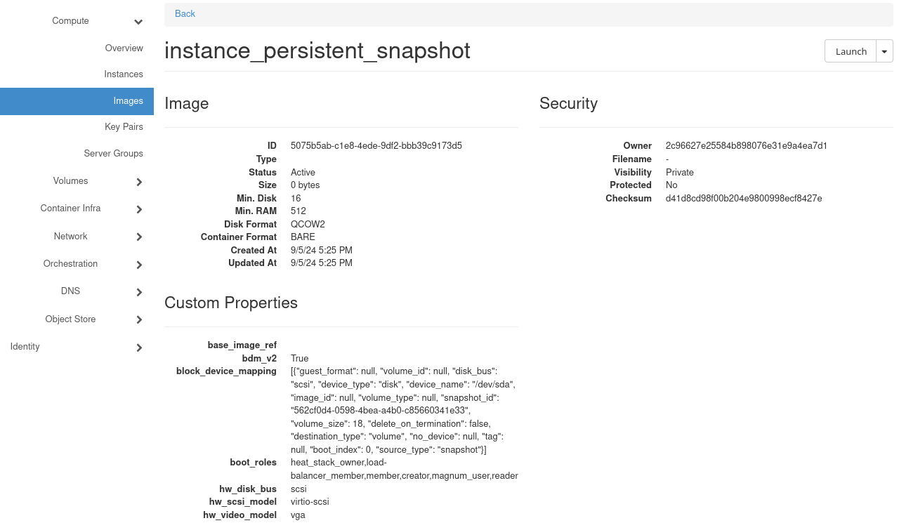

In section **Custom Properties**, you should see property called **block_device_mapping**. This property should contain list of volume snapshots which were created

In this example, since this instance only had one volume attached, this list only has one item:

.. code-block:: json

   [
        {"guest_format": null,
        "volume_id": null,
        "disk_bus": "scsi",
        "device_type": "disk",
        "device_name": "/dev/sda",
        "image_id": null,
        "volume_type": null,
        "snapshot_id": "562cf0d4-0598-4bea-a4b0-c85660341e33",
        "volume_size": 18,
        "delete_on_termination": false,
        "destination_type": "volume",
        "no_device": null,
        "tag": null,
        "boot_index": 0,
        "source_type": "snapshot"
        }
   ]

Value of key **snapshot_id** is the ID of this volume snapshot. To see this volume snapshot, navigate to section **Volumes -> Snapshots**

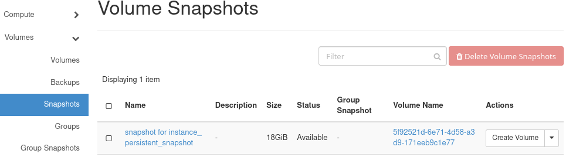

What happens if there are multiple volumes?
+++++++++++++++++++++++++++++++++++++++++++

If multiple volumes were connected to your instance, snapshot of each of them should appear on the list. For example, this is how this list could look like if there are were two volumes:

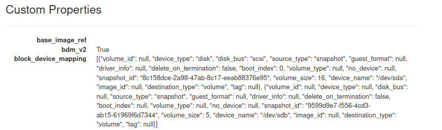

In this example, we have two volume snapshots, each created for one of the volumes of our VM:

 * one with ID of **8c158dce-2a98-47ab-8c17-eeab88376e95** and size of 16 GB, as well as
 * another one with ID of **9599d9e7-f556-4cd3-ab15-61969f6d7344** and size of 5 GB

What To Do Next
---------------

To create a new virtual machine from an instance snapshot, see

.. jinja:: brand_names

    * :doc:`/cloud/How-to-start-a-VM-from-instance-snapshot-using-Horizon-dashboard-on-{{ brand_name_hyphen }}`
    * :doc:`/openstackcli/How-to-start-a-VM-from-instance-snapshot-using-OpenStack-CLI-on-{{ brand_name_hyphen }}`

.. jinja:: brand_names

   You can create instance snapshot with OpenStack CLI as well. See :doc:`/openstackcli/How-to-create-instance-snapshot-using-OpenStack-CLI-on-{{ brand_name_hyphen }}`

   For discusion regarding bootable vs. non-bootable volumes, see :doc:`/datavolume/Bootable-versus-non-bootable-volumes-on-{{ brand_name_hyphen }}`.

Downloading an instance snapshot
^^^^^^^^^^^^^^^^^^^^^^^^^^^^^^^^

.. jinja:: brand_names

   There is something you should be aware of when using command **openstack image save** explained in :doc:`/networking/OpenStack-instance-migrationcommand-line-on-{{ brand_name_hyphen }}` to download an instance snapshot. There are two cases:

Ephemeral storage
   This command should work correctly for downloading snapshots of an instance which uses **ephemeral storage**.

Persistent storage
   Executing that command to download a snapshot of instance which uses **persistent** storage will result in downloading of an empty file.