How to create new Linux VM in OpenStack Dashboard Horizon on |brand-name|
=========================================================================

Go to **Project → Compute → Instances**.

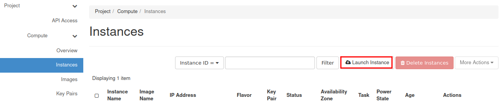

Click **"Launch Instance"**.

Insert the name of the Instance (eg. "vm01") and click Next button.

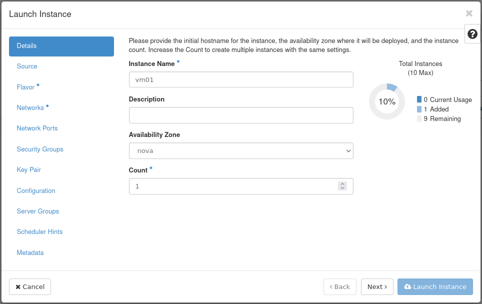

Select Instance Boot Source (eg. "Image"), and choose desired image (eg. "Ubuntu 20.04 LTS") by clicking on arrow.

.. note::

   If you do not need to have the system disk bigger than the size defined in a chosen flavor, we recommend setting "Create New Volume" feature to "No" state.

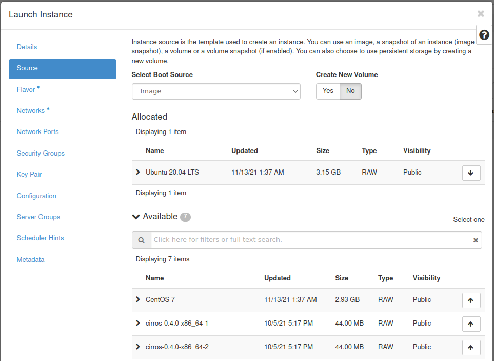

Choose Flavor (eg. eo1.xsmall).

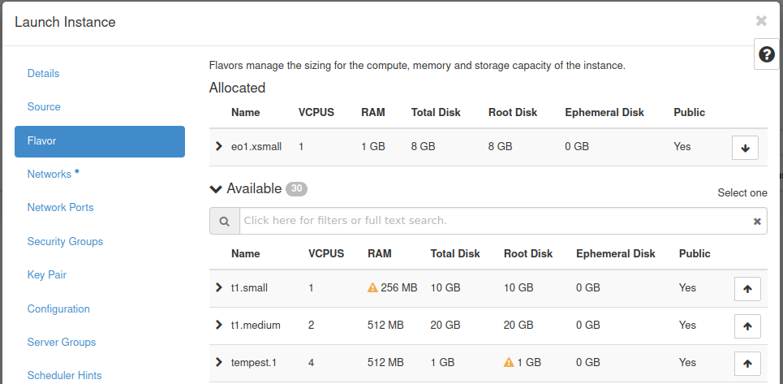

Click **"Networks"** and then choose desired networks.

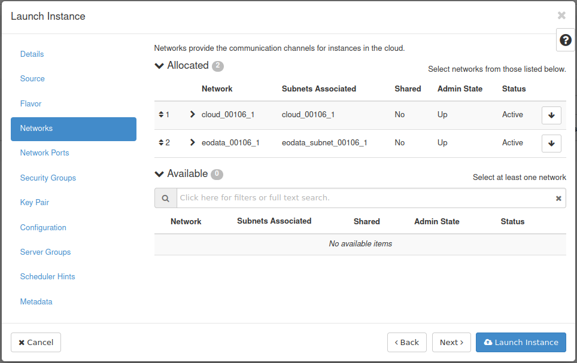

Open **"Security Groups"** After that, choose "default" and "allow_ping_ssh_icmp_rdp" groups.

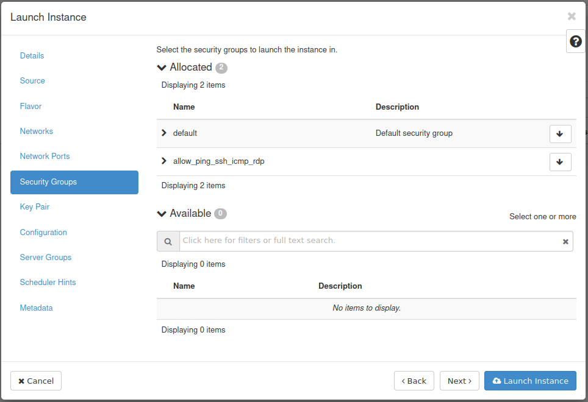

.. jinja:: brand_names

   Choose or generate SSH keypair :doc:`/cloud/How-to-create-key-pair-in-OpenStack-Dashboard-on-{{ brand_name_hyphen }}/How-to-create-key-pair-in-OpenStack-Dashboard-on-{{ brand_name_hyphen }}` for your VM. Next, launch your instance by clicking on blue button.

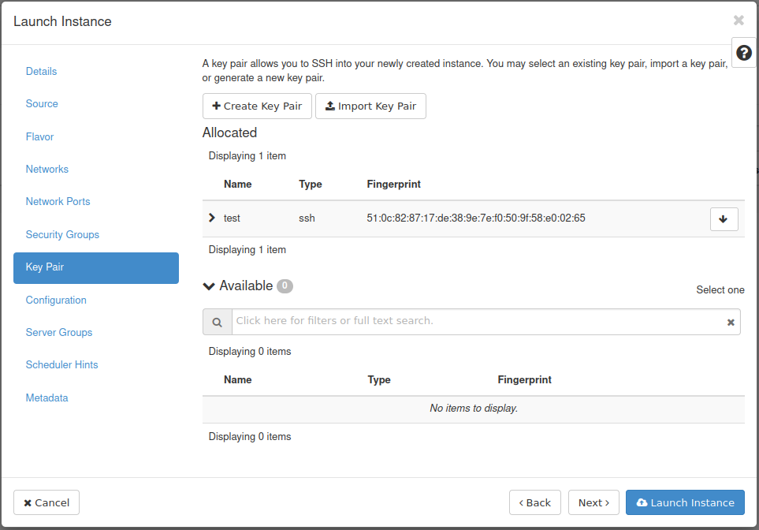

You will see **"Instances"** menu with your newly created VM.

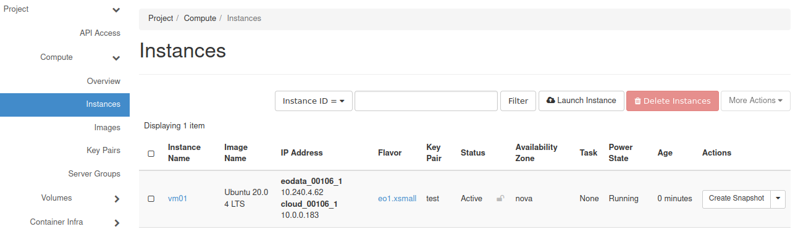

Open the drop-down menu and choose **"Console"**.

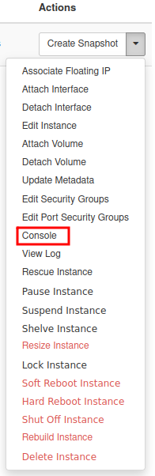

 Click on the black terminal area (to activate access to the console). Type: **eoconsole** and hit Enter.

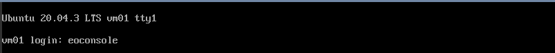

Insert and retype new password.

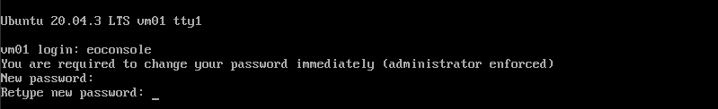

Now you can type commands.

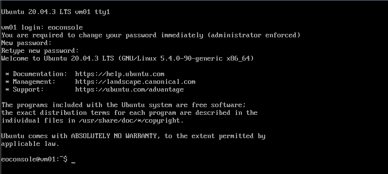

After you finish, type "exit".

This will close the session.

.. jinja:: brand_names

   If you want to make your VM accessible from the Internet check :doc:`/networking/How-to-Add-or-Remove-Floating-IPs-to-your-VM-on-{{ brand_name_hyphen }}/How-to-Add-or-Remove-Floating-IPs-to-your-VM-on-{{ brand_name_hyphen }}`.

