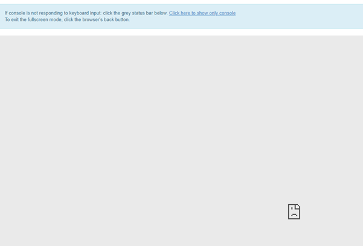

How to fix unresponsive console issue on |brand-name|
=====================================================

When you create a new virtual machine, the first thing you might want to do is to have a look at the console panel and check whether the instance has booted correctly.

After opening up the console in OpenStack you might encounter this error:

* unresponsive grey screen
* document icon in the down-right corner which informs about the issue on client side

**In this case:**

Check your firewall rules for port 6082 and assign "incoming" traffic the "allow" rule.

**Connecting through RDP:**

Make sure that you included your floating IP in RDP rules on your computer. If you want to make these changes for more than one machine, then include our external network address: 185.178.84.0/22.

