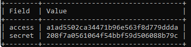
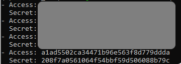
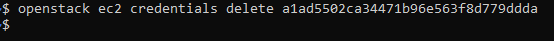

How to generate and manage EC2 credentials on |brand-name|
==========================================================

EC2 credentials are used for accessing private S3 buckets on |brand-name| cloud. This article covers how to generate and manage a pair of EC2 credentials so that you will be able to mount those buckets both

 * on your virtual machines and
 * on your local computers.

.. warning::

   A pair of EC2 credentials usually provides access to secret data so share it only with trusted individuals.

Prerequisites
-------------

No. 1 **Hosting**

You need a |brand-name| hosting account with access to Horizon interface: |brand-name-site-link|

No. 2 **OpenStack CLI client installed and configured**

You need to have the OpenStack CLI operational.

First, it must be installed. You have several options, such as:

.. jinja:: brand_names

    * :doc:`/openstackcli/How-to-install-OpenStackClient-for-Linux-on-{{ brand_name_hyphen }}`

.. jinja:: brand_names

    * :doc:`/openstackcli/How-to-install-OpenStackClient-GitBash-or-Cygwin-for-Windows-on-{{ brand_name_hyphen }}`

.. jinja:: brand_names

    * :doc:`/openstackcli/How-to-install-OpenStackClient-on-Windows-using-Windows-Subsystem-for-Linux-on-{{ brand_name_hyphen }}-OpenStack-Hosting`

   After that, you must configure it for access to your |brand-name| cloud environment.

.. ifconfig:: brand_name in two_fa_activated

    .. jinja:: brand_names

       Once you have installed this piece of software, you need to authenticate to start using it:
  .. jinja:: doc_links

     :doc:`{{ openstack_cli_auth }}`

.. ifconfig:: brand_name not in two_fa_activated

    .. ifconfig:: brand_name!= 'WEkEO'

       .. jinja:: brand_names

          Once you have installed this piece of software, you need to authenticate to start using it: :doc:`/accountmanagement/How-to-activate-OpenStack-CLI-access-to-{{ brand_name_hyphen }}-cloud`

    .. ifconfig:: brand_name == 'WEkEO'

       Once you have installed this piece of software, you need to authenticate to start using it: :doc:`/accountmanagement/How-to-activate-OpenStack-CLI-access-to-WEkEO-cloud-using-Federated-IDP-authorization-and-application-credentials`

At this point, you should have access to the cloud environment, using the OpenStack CLI client, meaning the command **openstack** is operational.

Creating a pair of EC2 credentials
----------------------------------

The command to create a pair of EC2 credentials may look like this:

.. code::

   openstack ec2 credentials create -c access -c secret

Parameter **c** is there to select which values to show. In this case, we show only **access** and **secret**, for example:

Save the values for **access** and **secret** keys in secure place, as you will certainly use or refer to them again.

Listing EC2 credentials
-----------------------

If you did save the values for **access** and **secret** in a file but that file got somehow inaccessible or lost, you do not have to generate a new key pair. List the existing EC2 credentials by executing the following command:

.. code::

   openstack ec2 credentials list -c Access -c Secret -f yaml

The output should contain the list of EC2 credentials:

The syntax is a bit different. Instead of lower case **access** and **secret** for a concrete pair of values, the **list** command uses capital letters for **Access** and **Secret** as there may be several key pairs stored in the system. In the image above, indeed there were several such pairs, however, those not of interest for this article were grayed out (for security reasons).

Deleting EC2 credentials
------------------------

You can delete a pair of EC2 credentials if you want to, say, disable access of people with whom you shared it.

Before deleting, list all EC2 credentials, once again using command **openstack ec2 credentials list** from above.

.. warning::

   The **list** command will show all EC2 pairs that exist in the system, so be careful what you choose, save and (possibly) delete!

After that, execute the following command (replace **a1ad5502ca34471b96e563f8d779ddda** with the access key from the key pair you wish to remove):

.. code::

   openstack ec2 credentials delete a1ad5502ca34471b96e563f8d779ddda

If the command was successful, the output should be empty:

To confirm, list EC2 credentials with **openstack ec2 credentials list**. The deleted key pair should no longer be on the list.

What To Do Next
---------------

.. jinja:: brand_names

   EC2 credentials created in this article are used to access object storage buckets from |brand-name| cloud. If you have not yet created any such buckets, visit this article to learn how to do it: :doc:`/s3/How-to-use-Object-Storage-on-{{ brand_name_hyphen }}`

Using a newly created pair of EC2 credentials, you can access buckets on different platforms, using different methods. The following articles contain more information:

.. jinja:: brand_names

    * :doc:`/s3/How-to-mount-object-storage-container-as-a-file-system-in-Linux-using-s3fs-on-{{ brand_name_hyphen }}`

.. jinja:: brand_names

    * :doc:`/s3/How-to-access-private-object-storage-using-S3cmd-or-boto3-on-{{ brand_name_hyphen }}`

.. jinja:: brand_names

    * :doc:`/s3/How-to-mount-object-storage-container-from-{{ brand_name_hyphen }}-as-file-system-on-local-Windows-computer`
