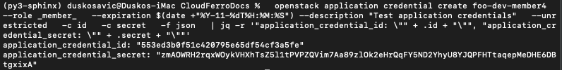
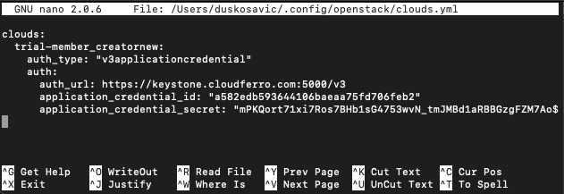
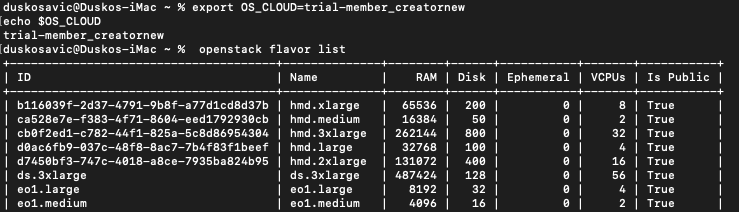

How to generate or use Application Credentials via CLI on |brand-name|
======================================================================

You can authenticate applications to **Keystone** by creating application
credentials.

Application credentials can delegate a subset of role assignments on a project
to an application. This allows the application to authenticate with an
**application credential ID** and a **secret** instead of using the user's
password.

This is useful when:

* you do not want to embed a user password in application configuration,
* the user authenticates through an external identity system,
* the user uses two-factor authentication,
* scripts or services need non-interactive authentication.

Application credentials are a recommended authentication method for automated
tools and scripts.

What we are going to cover
--------------------------

.. contents::
   :depth: 2
   :local:
   :backlinks: none

Prerequisites
-------------

No. 1 **Hosting account**

You need a |brand-name| hosting account with access to the Horizon interface:

.. tabs::

   .. tab:: R1

      https://horizon.api.r1.cloud.eumetsat.int/

   .. tab:: R2

      https://horizon.api.r2.cloud.eumetsat.int/

   .. tab:: ELA

      https://horizon.cloudferro.com/

      Choose **ECIS** and **FRA1-3** as the region.

No. 2 **Authentication configured for OpenStack CLI**

Before creating application credentials, authenticate with OpenStack CLI.

.. jinja:: brand_names

   :doc:`{{ doc_links.openstack_cli_auth }}`

No. 3 **OpenStackClient installed and available**

OpenStackClient is written in Python. It is recommended to use a dedicated
Python virtual environment when working with it.

Install OpenStackClient on Windows with Git Bash or Cygwin
   .. jinja:: doc_links

      :doc:`{{ openstackclient_windows }}`

Install OpenStackClient on Windows using WSL
   .. jinja:: doc_links

      :doc:`{{ openstackclient_windows_wsl }}`

Install OpenStackClient on Linux
   .. jinja:: doc_links

      :doc:`{{ openstackclient_linux }}`

No. 4 **jq installed and available**

Ensure that `jq <https://jqlang.org/download/>`_ is installed. On Ubuntu, run:

.. code-block:: bash

   sudo apt update && sudo apt upgrade -y
   sudo apt install jq -y
   jq --version

No. 5 **Knowledge of OpenStack user roles**

Application credentials are created with role assignments. To choose the right
roles, you should know which roles are available in your OpenStack project.

.. jinja:: doc_links

   :doc:`{{ openstack_user_roles }}`

Step 1: Review CLI commands for application credentials
-----------------------------------------------------------------------

The following command shows the application credential command group:

.. code-block:: bash

   openstack application credential

It lists the available subcommands:

.. code-block:: text

   application credential create
   application credential delete
   application credential list
   application credential show

To see the parameters for a specific subcommand, add **--help**:

.. code-block:: bash

   openstack application credential create --help

Among the available options, the parameters used to create a new credential are
particularly important.

.. figure:: credential_create_help.png
   :alt: Help output for application credential create
   :class: image-with-border

   Help output for **openstack application credential create**

.. note::

   The **--help** option may open output in a pager. Press **q** to return to
   the terminal prompt.

Step 2: Create a simple application credential
-------------------------------------------------------

The simplest way to generate a new application credential is to define only
its name. The remaining values are generated automatically.

The following command creates an application credential named **cred2**:

.. code-block:: bash

   openstack application credential create cred2

The new application credential is created and shown on screen.

.. figure:: create_new_with_name.png
   :alt: New application credential created with only a name
   :class: image-with-border

   New application credential created with only a name

Step 3: Use parameters to create a new application credential
-------------------------------------------------------------------------

The most important parameters are described below.

**--secret**
   Defines the secret value used for authentication. If omitted, the secret is
   generated automatically.

**--role**
   Defines roles assigned to the application credential. If omitted, all roles
   of the current user are copied. Repeat this parameter to add more roles.

Example roles:

.. code-block:: text

   _member_ reader load-balancer_member heat_stack_owner creator

.. note::

   Role **_member_** is a common basic role. In some OpenStack environments,
   the equivalent role may be called **member** instead.

**--expiration**
   Sets an expiration date. If not present, the application credential does not
   expire. The format is **YYYY-mm-ddTHH:MM:SS**.

Example:

.. code-block:: bash

   --expiration $(date +"%Y-11-%dT%H:%M:%S")

This produces a value similar to:

.. code-block:: text

   2026-11-09T13:27:01

**--restricted** and **--unrestricted**
   By default, application credentials are restricted from creating additional
   application credentials or Keystone trusts.

   If an application must perform those actions, use **--unrestricted**.

.. ifconfig:: brand_name in managed_kubernetes_with_magnum

   .. warning::

      If your environment includes Magnum-based Kubernetes provisioning through
      OpenStack, creating clusters may require **--unrestricted**.

Generally, **--unrestricted** should be used carefully. It gives the
application credential more power and increases risk if the credential is
misused. Use it only for trusted applications and make sure monitoring and
auditing are in place.

Example roles
^^^^^^^^^^^^^

Roles such as **_member_** or **member** provide basic project access. More
specific roles, such as **reader** or **load-balancer_member**, are intended
for narrower sets of tasks.

When you assign roles to an application credential, you define what that
credential can do in the OpenStack project. For example:

* **reader** can be used for inventory, reporting, or monitoring workflows,
* **load-balancer_member** can be used for load-balancer-related operations,
* **member** can be used for standard project operations.

See Prerequisite No. 5 for a complete list of OpenStack roles.

Create a test application credential
^^^^^^^^^^^^^^^^^^^^^^^^^^^^^^^^^^^^

Here is a complete example that creates a new application credential and uses
**jq** to print only the ID and secret values:

.. code-block:: bash

   openstack application credential create foo-dev-member4 \
     --role _member_ \
     --expiration $(date +"%Y-11-%dT%H:%M:%S") \
     --description "Test application credentials" \
     --unrestricted \
     -c id \
     -c secret \
     -f json | jq -r '"application_credential_id: \"" + .id + "\"", "application_credential_secret: \"" + .secret + "\""'

The result should contain the application credential ID and secret.

   Complete application credential creation example

The part of the command starting with **| jq -r** prints only the values that
you need to add to the **clouds.yml** file.

Normal OpenStack user role: member
++++++++++++++++++++++++++++++++++

The **member** role is a basic role commonly granted to users or application
credentials within a project. It provides standard access to project resources,
including the ability to read and modify resources, but not administer
project-wide settings unless additional roles are assigned.

Example:

.. code-block:: bash

   openstack application credential create normal-user \
     --role member \
     --expiration $(date +"%Y-11-%dT%H:%M:%S") \
     --description "Normal OpenStack user credentials" \
     -c id \
     -c secret \
     -f json | jq -r '"application_credential_id: \"" + .id + "\"", "application_credential_secret: \"" + .secret + "\""'

Reader role: reader
+++++++++++++++++++

The **reader** role is intended for read-only access. It is useful when an
application needs to inspect resources, configurations, or status information
without modifying resources.

Example:

.. code-block:: bash

   openstack application credential create reader-user \
     --role reader \
     --expiration $(date +"%Y-11-%dT%H:%M:%S") \
     --description "Read-only credentials" \
     -c id \
     -c secret \
     -f json | jq -r '"application_credential_id: \"" + .id + "\"", "application_credential_secret: \"" + .secret + "\""'

Load balancer role: load-balancer_member
++++++++++++++++++++++++++++++++++++++++

The **load-balancer_member** role is intended for working with load balancer
resources in OpenStack. It is useful for applications that create, update, or
manage load balancer components without requiring broader permissions.

Example:

.. code-block:: bash

   openstack application credential create lb-member-user \
     --role load-balancer_member \
     --expiration $(date +"%Y-11-%dT%H:%M:%S") \
     --description "Load balancer role credentials" \
     -c id \
     -c secret \
     -f json | jq -r '"application_credential_id: \"" + .id + "\"", "application_credential_secret: \"" + .secret + "\""'

Step 4: Enter ID and secret into clouds.yml
-------------------------------------------

You can store the application credential ID and secret in a file called
**clouds.yml**. Future **openstack** commands can then use these values to
authenticate without asking for a password.

OpenStackClient searches for **clouds.yml** in the following locations:

Current directory
   **./clouds.yml**

   The current directory is searched first.

User configuration directory
   **$HOME/.config/openstack/clouds.yml**

   This is the common default location for individual users.

System-wide configuration directory
   **/etc/openstack/clouds.yml**

   This is searched last. You usually need **root** privileges to modify it.

The first **clouds.yml** file found is used.

.. note::

   The file content is written in YAML format. It is common for YAML files to
   use the **.yaml** extension, but OpenStackClient expects this file to be
   named **clouds.yml**.

Create a new application credential called **trial-member_creatornew**:

.. code-block:: bash

   openstack application credential create trial-member_creatornew \
     --unrestricted \
     -c id \
     -c secret \
     -f json | jq -r '"application_credential_id: \"" + .id + "\"", "application_credential_secret: \"" + .secret + "\""'

The command returns the ID and secret.

.. figure:: create_credential.png
   :alt: Application credential ID and secret
   :class: image-with-border

   Application credential ID and secret

Create or edit **clouds.yml** using your preferred editor. For example, with
**nano**:

.. code-block:: bash

   mkdir -p $HOME/.config/openstack
   nano $HOME/.config/openstack/clouds.yml

Example **clouds.yml** file:

.. jinja:: regional_clouds

   .. tabs::

      
      .. tab:: {{ region.display_name }}

         .. code-block:: yaml

            clouds:
              trial-member_creatornew:
                auth_type: "v3applicationcredential"
                auth:
                  auth_url: {{ region.keystone_v3_endpoint }}
                  application_credential_id: "a582edb593644106baeaa75fd706feb2"
                  application_credential_secret: "mPKQort71xi7Ros7BHb1sG4753wvN_tmJMBd1aRBBGzgFZM7AoUkLWzCutQuh-dAyac86-rkikYqqYaT1_f0hA"

      

Replace the example values with the real ID and secret returned by your
application credential creation command.

This is what the file may look like in the editor.

   clouds.yml file in nano editor

Save it with **Ctrl** + **X**, then press **Y** and **Enter**.

The file contains:

**clouds:**
   A top-level key. It is plural because one file can contain multiple cloud
   profiles.

**trial-member_creatornew**
   The name of the cloud profile. In this article, it is the same as the name
   of the application credential.

**auth_type**
   The authentication type. For application credentials, use
   **v3applicationcredential**.

**auth**
   The authentication parameters.

**auth_url**
   The Keystone authentication URL for the selected region.

**application_credential_id**
   The ID returned by the application credential creation command.

**application_credential_secret**
   The secret returned by the application credential creation command.

Step 5: Access the cloud with OS_CLOUD or --os-cloud
----------------------------------------------------

Application credentials can give access to activated regions. Specify which
region you want to use with **--os-region**.

Common regions are rendered from the current regional configuration:

.. jinja:: regional_clouds

   .. tabs::

      
      .. tab:: {{ region.display_name }}

         .. code-block:: bash

            openstack --os-cloud trial-member_creatornew \
              --os-region {{ region.display_name }} \
              flavor list

      

In the previous step, the **clouds.yml** file started with **clouds:**. Under
it, the profile name was **trial-member_creatornew**.

OpenStackClient needs to know which profile to use. You can define that in one
of two ways:

* set **OS_CLOUD** as an environment variable,
* pass **--os-cloud** directly in the command line.

Set **OS_CLOUD** for the current terminal session:

.. code-block:: bash

   export OS_CLOUD=trial-member_creatornew
   echo $OS_CLOUD

Open a new terminal window, execute the command above, and then try to access
the cloud.

   OS_CLOUD environment variable

You can also use **--os-cloud** directly in the command line:

.. code-block:: bash

   openstack --os-cloud trial-member_creatornew flavor list

It works as well.

.. figure:: cli_os_cloud.png
   :alt: Using --os-cloud directly
   :class: image-with-border

   Using **--os-cloud** directly

Set **OS_CLOUD** once per newly opened terminal window if you want to use the
**openstack** command without adding **--os-cloud** every time.

If **clouds.yml** contains several profiles, using **--os-cloud** directly can
be more flexible.

In both cases, you can access the cloud without entering your password.

Environment variable-based storage
----------------------------------

You can also export credential values as environment variables. This can be
useful for scripted deployments, temporary sessions, and situations where you
do not want credentials stored in files.

To set them for the current session:

.. code-block:: bash

   export OS_CLOUD=mycloud
   export OS_CLIENT_ID=<your-id>
   export OS_CLIENT_SECRET=<your-secret>

To make them persistent, add them to **~/.bashrc** or **~/.zshrc**.

Example for **~/.bashrc**:

.. code-block:: bash

   echo 'export OS_CLOUD=mycloud' >> ~/.bashrc
   echo 'export OS_CLIENT_ID=<your-id>' >> ~/.bashrc
   echo 'export OS_CLIENT_SECRET=<your-secret>' >> ~/.bashrc
   source ~/.bashrc

.. warning::

   Environment variables can still be exposed to processes running under the
   same user or through shell history and logs if handled carelessly. Use them
   only where this fits your security model.

Rotating application credentials
--------------------------------

Security considerations
^^^^^^^^^^^^^^^^^^^^^^^

When a team member who knows an application credential ID and secret leaves
the team, the credential should be rotated.

With application credentials, you can create multiple credentials with the
same role assignments on the same project. This makes it possible to rotate
application credentials with minimal or no downtime.

Rotating application credentials is also recommended as part of regular
application maintenance.

How to rotate an application credential
^^^^^^^^^^^^^^^^^^^^^^^^^^^^^^^^^^^^^^^

Create a new application credential
   Application credential names must be unique within the user's application
   credentials. The new credential must not have the same name as the old one.

Update your application configuration
   Configure the application with the new ID and the new secret. For
   distributed applications, update one node at a time if needed.

Delete the old application credential
   When the application is fully configured with the new application
   credential, delete the old one.

Expiration dates
^^^^^^^^^^^^^^^^

Use **--expiration** to set how long a credential remains valid. This is useful
when a credential is needed only for a limited period.

Setting expiration dates is a good security practice because credentials do
not remain valid indefinitely. Make sure that the application configuration is
updated before the credential expires to avoid service disruption.

Defining special --access-rules
-------------------------------

Access rules allow administrators to limit what an application credential can
access. By default, application credentials can have broad access to resources
within a project, depending on assigned roles.

The **--access-rules** option can restrict an application credential to
specific services or endpoints.

What to do next
---------------

For more information about application credentials and OpenStack roles, see:

.. jinja:: doc_links

   :doc:`{{ openstack_user_roles }}`