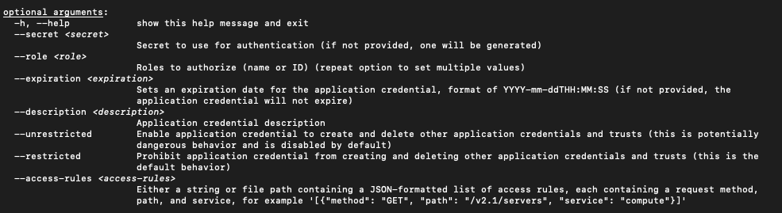
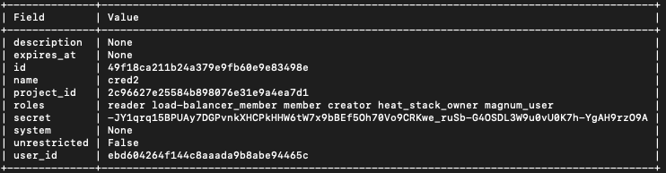
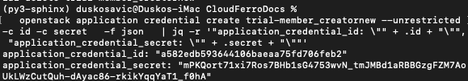
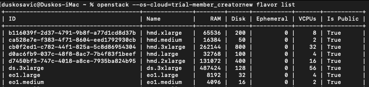

How to generate or use Application Credentials via CLI on |brand-name|
======================================================================

You can authenticate your applications to *Keystone* by creating application credentials. It is also possible to delegate a subset of role assignments on a project to an application credential, granting the same or restricted authorization to a project for the app.

With application credentials, apps authenticate with the "application credential ID" and a "secret" string which is not the user’s password. Thanks to this, the user’s password is not embedded in the application’s configuration, which is especially important for users whose identities are managed by an external system such as LDAP or a single sign-on system.

Authenticating with application credentials is a recommended alternative way instead of using two-factor authentication.

.. raw:: html

   <h2>What we are going to cover</h2>

.. contents::
   :depth: 2
   :local:
   :backlinks: none

Prerequisites
-------------

No. 1 **Hosting**

You need a |brand-name| hosting account with Horizon interface |brand-name-site-link|.

No. 2 **Authenticate**

.. ifconfig:: brand_name in two_fa_activated

    .. jinja:: brand_names

       Once you have installed this piece of software, you need to authenticate to start using it:
  .. jinja:: doc_links

     :doc:`{{ openstack_cli_auth }}`

.. ifconfig:: brand_name not in two_fa_activated

    .. ifconfig:: brand_name!= 'WEkEO'

       .. jinja:: brand_names

          Once you have installed this piece of software, you need to authenticate to start using it: :doc:`/accountmanagement/How-to-activate-OpenStack-CLI-access-to-{{ brand_name_hyphen }}-cloud`

    .. ifconfig:: brand_name == 'WEkEO'

       Once you have installed this piece of software, you need to authenticate to start using it: :doc:`/accountmanagement/How-to-activate-OpenStack-CLI-access-to-WEkEO-cloud-using-Federated-IDP-authorization-and-application-credentials`

No. 3 **OpenStackClient is installed and available**

OpenStack is written in Python, it is recommended to use a dedicated virtual environment for the rest of this article.

Install GitBash on Windows
   .. jinja:: brand_names

      :doc:`/openstackcli/How-to-install-OpenStackClient-GitBash-or-Cygwin-for-Windows-on-{{ brand_name_hyphen }}`.

Install and run WSL (Linux under Windows)
   .. jinja:: brand_names

      :doc:`/openstackcli/How-to-install-OpenStackClient-on-Windows-using-Windows-Subsystem-for-Linux-on-{{ brand_name_hyphen }}-OpenStack-Hosting`.

Install OpenStackClient on Linux
   .. jinja:: brand_names

      :doc:`/openstackcli/How-to-install-OpenStackClient-for-Linux-on-{{ brand_name_hyphen }}`.

No. 4 **jq installed and running**

Ensure `jq <https://jqlang.org/download/>`_ is installed, up and running. On Ubuntu, for example, the commands would be:

.. code-block:: console

   apt update && apt upgrade -y
   apt install jq -y
   jq --version

No. 5 **User roles on OpenStack**

.. jinja:: brand_names

   The list of user roles on OpenStack is in article :doc:`/cloud/OpenStack-user-roles-on-{{ brand_name_hyphen }}`

Step 1 CLI commands for application credentials
-----------------------------------------------

Command

.. code-block:: console

   openstack application credential

will list four commands available:

.. code-block:: console

   application credential create
   application credential delete
   application credential list
   application credential show

To see the parameters for these commands, end them with **\-\-help**, like this:

.. code-block:: console

   openstack application credential create --help

Among the many lines describing all possible parameters, of particular interest are the options used to create a new credential:

.. note::

   The **\-\-help** option may produce a *vim*-like output, so type **q** on the keyboard to return to the usual terminal prompt.

Step 2 The simplest way to create a new application credential
--------------------------------------------------------------

The simplest way to generate a new application credential is just to define the name. The remaining parameters will be defined automatically for you. The following command uses the name **cred2**:

.. code-block:: console

   openstack application credential create cred2

The new application credential will be created and shown on the screen:

Step 3 Using parameters to create a new application credential
--------------------------------------------------------------

Here is the meaning of the main parameters.

**\-\-secret**

Secret value to use for authentication. If omitted, it will be generated automatically.

**\-\-role**

Roles to authorize. If not specified, all roles of the current user are copied. Repeat this parameter to add more roles to the credential.

The example of roles is:

.. code-block:: console

   _member_ reader load-balancer_member heat_stack_owner creator

.. note::

   Role **_member_** is the most basic role and should always be present. Beware, however, that in some variations of OpenStack it can be called **member** instead of **_member_**.

**\-\-expiration**

Sets an expiration date. If not present, the application credential will not expire. The format is **YYYY-mm-ddTHH:MM:SS**, for instance:

.. code-block:: console

   --expiration $(date +"%Y-11-%dT%H:%M:%S")

That will yield a value such as:

.. code-block:: console

   2022-11-09T13:27:01.000000

Parameters **\-\-unrestricted** and **\-\-restricted**

By default, for security reasons, application credentials are forbidden from being used to create additional application credentials or Keystone trusts. If your application needs to perform these actions, use parameter **\-\-unrestricted**.

.. ifconfig:: brand_name in managed_kubernetes_with_magnum

    .. warning::

       If your environment includes Magnum-based Kubernetes provisioning through OpenStack, creating clusters may require parameter **\-\-unrestricted**.

Generally speaking, using **\-\-unrestricted** is considered a security risk. While it allows the credential to perform more powerful operations, such as creating additional application credentials, this also broadens what can be done if the credential is misused. Limit the use of **\-\-unrestricted** to trusted applications and ensure proper auditing and monitoring are in place.

Example roles
^^^^^^^^^^^^^

Roles like **\_member\_** grant basic access, while more specific roles such as **reader** or **load-balancer_member** are intended for narrower sets of tasks. When you assign roles to an application credential, you define what actions that credential can perform in your OpenStack project. For example, a credential with the **reader** role can be used to inspect resources, while a credential with the **load-balancer_member** role can be used to manage load balancer-related resources.

See Prerequisites No. 5 for a complete list of roles under OpenStack.

Test application credentials
++++++++++++++++++++++++++++

Here is a complete example using several parameters to create a new application credential:

.. code-block:: console

   openstack application credential create foo-dev-member4 --role _member_ --expiration $(date +"%Y-11-%dT%H:%M:%S") --description "Test application credentials" --unrestricted -c id -c secret -f json | jq -r '"application_credential_id: \"" +.id + "\"", "application_credential_secret: \"" +.secret + "\""'

The result is:

.. image:: complete_example.png

The name of the new application credential will be **foo-dev-member4** and it will use role **_member_**. The part of the command starting with **| jq -r** prints only the values of credentials **id** and **secret**, as you need to enter those values into the *clouds.yml* file in order to activate this authentication method.

Normal OpenStack user role (**member**)
+++++++++++++++++++++++++++++++++++++++

The **member** role is the most basic role granted by default to any user or application credential within a project. It provides standard access to the resources within the project, including the ability to read and modify resources, but not administer project-wide settings.

It is also crucial for defining basic access control in OpenStack environments. All users or applications with this role can interact with resources, but cannot perform administrative tasks unless other, more privileged roles are also assigned.

.. code-block:: console

   openstack application credential create normal-user --role member --expiration $(date +"%Y-11-%dT%H:%M:%S") --description "Normal OpenStack user credentials" -c id -c secret -f json | jq -r '"application_credential_id: \"" +.id + "\"", "application_credential_secret: \"" +.secret + "\""'

Reader role (**reader**)
++++++++++++++++++++++++

The **reader** role is intended for read-only access. It is useful when an application needs to inspect resources, configurations, or status information without being able to modify anything in the project.

This makes it suitable for monitoring tools, inventory scripts, and reporting workflows.

.. code-block:: console

   openstack application credential create reader-user --role reader --expiration $(date +"%Y-11-%dT%H:%M:%S") --description "Read-only credentials" -c id -c secret -f json | jq -r '"application_credential_id: \"" +.id + "\"", "application_credential_secret: \"" +.secret + "\""'

Load balancer role (**load-balancer_member**)
+++++++++++++++++++++++++++++++++++++++++++++

The **load-balancer_member** role is intended for working with load balancer resources in OpenStack. It can be useful for applications that create, update, or manage load balancing components without requiring broader project permissions.

This role is a practical choice when you want to limit an application credential to a specific service area.

.. code-block:: console

   openstack application credential create lb-member-user --role load-balancer_member --expiration $(date +"%Y-11-%dT%H:%M:%S") --description "Load balancer role credentials" -c id -c secret -f json | jq -r '"application_credential_id: \"" +.id + "\"", "application_credential_secret: \"" +.secret + "\""'

Step 4 Enter id and secret into clouds.yml
------------------------------------------

You are now going to store the values of **id** and **secret** that the cloud has sent to you. Once stored, future **openstack** commands will use these values to authenticate to the cloud without using any kind of password.

The place to store *id* and *secret* is a file called *clouds.yml*. It may reside on your local computer in one of these three locations:

Current directory
   **./clouds.yml**

   You may want to create a special folder with the **mkdir** command and place *clouds.yml* into it.

   The current directory is searched first.

User configuration directory
   **$HOME/.config/openstack/clouds.yml**

   The most common default location for individual users.

   Searched after the current directory.

System-wide configuration directory
   **/etc/openstack/clouds.yml**

   Searched as the last resort.

   Usually you must be *root* to modify that file.

The first *clouds.yml* file that is found will be used.

.. note::

   The contents of the *clouds.yml* file will be in *yaml* format. It is customary for such files to use the extension **yaml**, but here the file name is **yml** instead.

Let us create a new application credential called *trial-member_creatornew*.

.. code-block:: console

   openstack application credential create trial-member_creatornew --unrestricted -c id -c secret -f json | jq -r '"application_credential_id: \"" +.id + "\"", "application_credential_secret: \"" +.secret + "\""'

This is the result:

Now create the *clouds.yml* file using your preferred editor. Here it is *nano*:

.. code-block:: console

   nano $HOME/.config/openstack/clouds.yml

If not already existing, *nano* will create that file anew. Here are its contents:

**clouds.yml**

.. code-block:: console

   clouds:
     trial-member_creatornew:
       auth_type: "v3applicationcredential"
       auth:
         auth_url: https://keystone.cloudferro.com:5000/v3
         application_credential_id: "a582edb593644106baeaa75fd706feb2"
         application_credential_secret: "mPKQort71xi7Ros7BHb1sG4753wvN_tmJMBd1aRBBGzgFZM7AoUkLWzCutQuh-dAyac86-rkikYqqYaT1_f0hA"

Let us dissect that file line by line:

* **clouds:** is in plural because it is possible to define parameters of two or more clouds in the same file.

* **trial-member_creatornew** is the name of the application credential used in the previous *credential create* command.

* **auth_type** is the type of auth connection. Here it is **v3applicationcredential**.

* **auth** starts the *auth* parameters.

  * **auth_url** is the address to call on the |brand-name| OpenStack server.

  * **application_credential_id** is the value from the previous *credential create* command.

  * **application_credential_secret** is the value from the previous *credential create* command.

This is how it should look in the editor:

.. image:: nano_values.png

Save it with **Ctrl**-**X**, then press **Y** and Enter.

Step 5 Gain access to the cloud by specifying OS_CLOUD or \-\-os-cloud
----------------------------------------------------------------------

.. ifconfig:: brand_name == ""

   Application credentials give access to all activated regions and you have to specify which one to use. Specify it as the value of parameter **\-\-os-region**, for instance **-R1** or **-R2**.

.. ifconfig:: brand_name!= ""

   Application credentials give access to all activated regions and you have to specify which one to use. Specify it as the value of parameter **\-\-os-region**, for instance **R1**, **R2**, or **FRA1-3**.

In the previous step you defined a *clouds.yml* file and it started with **clouds:**. The next line defined to which cloud the parameters refer, here it was *trial-member_creatornew*. By design, the *clouds.yml* file can contain information on several clouds, so it is necessary to distinguish which cloud you are going to refer to. There is a special parameter for that, called:

* **OS_CLOUD** if used as a system parameter, or
* **\-\-os-cloud** if used from the command line.

You define **OS_CLOUD** by directly assigning its value from the command line:

.. code-block:: console

   export OS_CLOUD=trial-member_creatornew
   echo $OS_CLOUD

Open a new terminal window, execute the command above, and then try to access the server:

.. image:: export_os_cloud.png

It works.

You can also use that parameter directly in the command line:

.. code-block:: console

   openstack --os-cloud=trial-member_creatornew flavor list

It works as well:

You have to set up **OS_CLOUD** once per newly opened terminal window, and then you can use the **openstack** command without adding the **\-\-os-cloud** parameter every time.

If you had two or more clouds defined in the *clouds.yml* file, then using **\-\-os-cloud** directly in the command line would be more flexible.

In both cases, you can access the cloud without specifying the password, which was the goal in the first place.

Environment variable-based storage
----------------------------------

You can also export the values as environment variables. This increases security, especially in virtual machines, and automation tools can use them dynamically.

To set them for the current session:

.. code-block:: console

   export OS_CLOUD=mycloud
   export OS_CLIENT_ID=<your-id>
   export OS_CLIENT_SECRET=<your-secret>

To make them persistent, add these lines to your **~/.bashrc** or **~/.zshrc** file:

.. code-block:: console

   echo 'export OS_CLOUD=mycloud' >> ~/.bashrc
   echo 'export OS_CLIENT_ID=<your-id>' >> ~/.bashrc
   echo 'export OS_CLIENT_SECRET=<your-secret>' >> ~/.bashrc
   source ~/.bashrc

This method is useful for scripted deployments, temporary sessions, and when you do not want credentials stored in files.

Rotating application credentials
--------------------------------

Security concerns
^^^^^^^^^^^^^^^^^

What happens when a team member who knows the application credential identifier and secret leaves the team? If you change a user password, there may be downtime until the application can be updated with the new value.

With application credentials, it is possible to create multiple application credentials with the same role assignments on the same project. This opens up the possibility of rotating application credentials with minimal or no downtime for your application.

Rotating application credentials is also recommended as part of regular application maintenance.

How to rotate an application credential
^^^^^^^^^^^^^^^^^^^^^^^^^^^^^^^^^^^^^^^

Create a new application credential
   Application credential names must be unique within the user’s set of application credentials, so this new application credential must not have the same name as the old one.

Update your application’s configuration
   Configure it with the new ID, or name and user identifier, and the new secret. You can do it one node at a time for distributed applications.

Delete the old application credential
   When your application is fully set up with the new application credential, delete the old one.

Expiration dates
^^^^^^^^^^^^^^^^

You can also use **\-\-expiration** to change the length of time a credential will be valid. You would use it, for instance, if you knew that a member of the team would be engaged for a fixed time period.

Setting an expiration date for application credentials is a good practice for security. It ensures that credentials do not remain valid indefinitely, limiting the potential for misuse if the credentials are compromised. When creating credentials with **\-\-expiration**, ensure that you update your application's configuration before the expiration date to avoid disruptions in service.

Defining special \-\-access-rules
---------------------------------

Access rules allow administrators to limit what resources an application credential can access. By default, application credentials have broad access to resources within a project. However, OpenStack administrators can fine-tune access by using the **\-\-access-rules** option. This option restricts the application credential to only specific services or endpoints.

What To Do Next
---------------

For more information related to application credentials and OpenStack roles, see:

.. jinja:: brand_names

   :doc:`/cloud/OpenStack-user-roles-on-{{ brand_name_hyphen }}`
