How to start a VM from instance snapshot using Horizon dashboard on |brand-name|
==================================================================================================

In this article, you will learn how to create a virtual machine from an instance snapshot using Horizon dashboard.

Prerequisites
------------------------

No. 1 **Account**

You need a |brand-name| hosting account with access to the Horizon interface: |brand-name-site-link|.

No. 2 **Ephemeral storage vs. persistent storage**

.. jinja:: brand_names

   Please see article :doc:`/datavolume/Ephemeral-vs-Persistent-storage-option-Create-New-Volume-on-{{ brand_name_hyphen }}/Ephemeral-vs-Persistent-storage-option-Create-New-Volume-on-{{ brand_name_hyphen }}` to understand the basic difference between ephemeral and persistent types of storage in OpenStack.

No. 3 **Instance snapshot**

You need to have an instance snapshot from which you are going to create your virtual machine. In this article, we will use an exemplary snapshot named **my-instance-snapshot** - here is how it can look like in section **Images -> Images** of the Horizon dashboard:

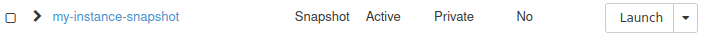

The following articles contain information how to create such a snapshot:

.. jinja:: brand_names

    * :doc:`/openstackcli/How-to-create-instance-snapshot-using-OpenStack-CLI-on-{{ brand_name_hyphen }}/How-to-create-instance-snapshot-using-OpenStack-CLI-on-{{ brand_name_hyphen }}`

    * :doc:`/cloud/How-to-create-instance-snapshot-using-Horizon-on-{{ brand_name_hyphen }}/How-to-create-instance-snapshot-using-Horizon-on-{{ brand_name_hyphen }}`

Note that the name of instance snapshot which will be used in this article is different than the names used in the above mentioned articles.

Regardless, we will cover both

 * snapshots of instances which use **ephemeral** storage, as well as
 * snapshots of instances which use **persistent** storage.

:strong:`Special rules for snapshots of instances which use persistent storage`

If your snapshot uses persistent storage, special rules apply. That instance snapshot will not have its own storage, but a metadata section, which lists volume snapshots which were created for each of the volumes.

Some or all of these volume snapshots theoretically might not exist because later they might have been, say, deleted.

Therefore:

Volume snapshot that represents boot drive is missing
   In that case, you will **not** be able to use instance snapshot to create a virtual machine.

Volume snapshot that represents boot drive is still present
   You will be able to use instance snapshot to create a virtual machine.
   If additional volumes have been connected to your VM, only the ones which still have their respective volume snapshots mentioned in metadata of instance snapshot will be recreated.

No. 4 **Access to the virtual machine being created**

There are different methods of accessing virtual machines, SSH and web console being the most popular.

For SSH, while creating a virtual machine from a volume snapshot, there may be an option of "injecting" an SSH key to the machine being created. Some operating systems are compatible with this feature, while others are not.

If it is not possible to attach an SSH key while creating new instance from a particular instance snapshot, make sure that there is another way of accessing it. Apart from SSH and web-based access, there also are RDP, VNC, API access, web-based tools (Guacamole), SFTP/FTP.

You should know how to access the instance before you start recreating it from a snapshot.

Anyway, see the following related links:

.. jinja:: brand_names

   :doc:`/networking/How-to-add-SSH-key-from-Horizon-web-console-on-{{ brand_name_hyphen }}/How-to-add-SSH-key-from-Horizon-web-console-on-{{ brand_name_hyphen }}`

   :doc:`/networking/What-If-I-Forgot-To-Add-The-SSH-Key-To-My-VM-Or-Deleted-It-{{ brand_name_hyphen }}/What-If-I-Forgot-To-Add-The-SSH-Key-To-My-VM-Or-Deleted-It-{{ brand_name_hyphen }}`

   :doc:`/cloud/How-to-access-the-VM-from-OpenStack-console-on-{{ brand_name_hyphen }}/How-to-access-the-VM-from-OpenStack-console-on-{{ brand_name_hyphen }}`

No. 5 **Familiarity with the process of creating a virtual machine**

.. jinja:: brand_names

   We will use the following article as the *reference* article :doc:`/cloud/How-to-create-a-Linux-VM-and-access-it-from-Linux-command-line-on-{{ brand_name_hyphen }}/How-to-create-a-Linux-VM-and-access-it-from-Linux-command-line-on-{{ brand_name_hyphen }}`. Out of eight or nine steps outlined in that article, we modify just two, in Steps 2 and 6 (see below).

The instance snapshot used here does not have to actually contain Linux - if this is the case, you can ignore Linux-specific parts of *reference* article.

What We Are Going To Cover
---------------------------

 * Creating VM from instance snapshot

   - Identical Step 1 Name the Virtual Machine you are recreating
   - Changed Step 2 Boot from the existing image snapshot
   - Identical Step 3 Define the flavor of the instance
   - Identical Step 4 Define networks for the virtual machine
   - Identical Step 5 Define security groups for VM
   - Changed Step 6 SSH key pair
   - Identical Step 7 Create the instance
   - Identical Step 8 Attach a Floating IP to the instance
   - Possibly identical Step 9 Connecting to your virtual machine using SSH

 * What can go wrong when recreating instance from instance snapshot
 * Verifying volumes (persistent storage)

Creating VM from instance snapshot
-------------------------------------------------------------------------

These steps are the same no matter whether your instance is using ephemeral or persistent storage.

In this example, we will create an instance named **instance-from-snapshot** - its source is instance snapshot named **my-instance-snapshot** that is already present in the system.

Follow reference article mentioned in Prerequisite No. 5. Where identical, we do not supply the images from the reference article but only hint at the commands from Horizon Dashboard.

Steps 2 and 6 will be different so in these two cases we provide detailed explanation of the process.

Identical Step 1 Name the Virtual Machine you are recreating
+++++++++++++++++++++++++++++++++++++++++++++++++++++++++++++++++++++

From Horizon dashboard, execute **Compute** -> **Instances** -> **Launch Instance**. As a minimum, use field **Instance Name** to enter the name of the VM that you want to recreate.

Changed Step 2 Boot from the existing image snapshot
++++++++++++++++++++++++++++++++++++++++++++++++++++++++++++

In Step 2 of above mentioned article, you are supposed to choose the image from which you want to create a virtual machine. Instead of that, from the drop-down menu **Select Boot Source** choose option **Instance Snapshot**. This will allow you to choose from the existing image snapshots.

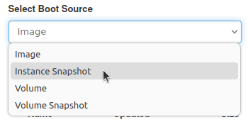

You should get a list of image snapshots:

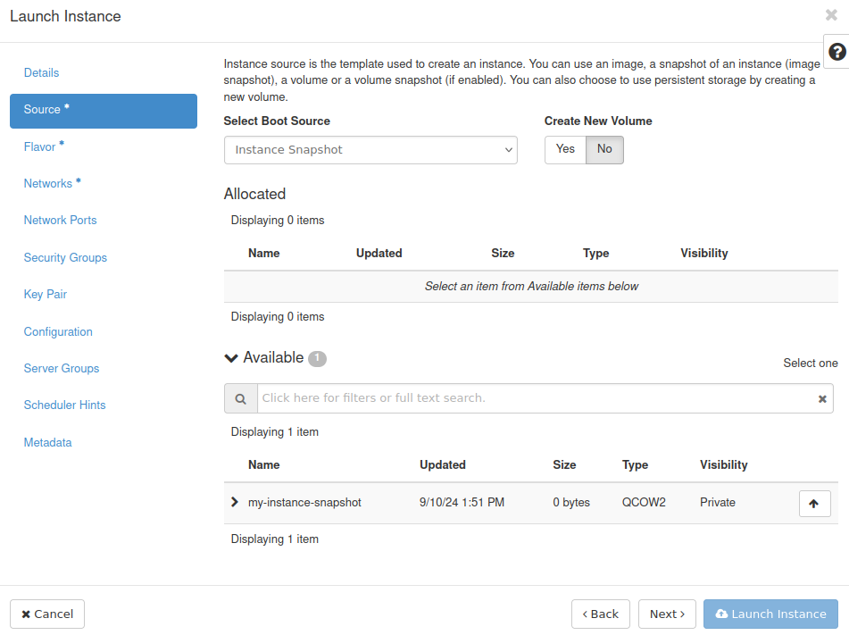

Click **↑** next to the image snapshot from which you want to create your virtual machine:

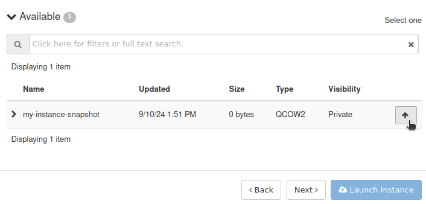

It should now be visible in the **Allocated** section:

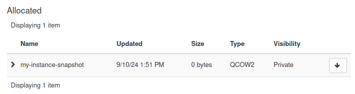

Identical Step 3 Define the flavor of the instance
++++++++++++++++++++++++++++++++++++++++++++++++++++++++

Use option **Flavor** in window **Launch Instance**.

Identical Step 4 Define networks for the virtual machine
+++++++++++++++++++++++++++++++++++++++++++++++++++++++++++++++++

Use option **Networks** in window **Launch Instance**.

This is the end of obligatory options. To be able to access instance through an SSH connection, you will need to define **Security Groups** and **Key Pair**.

Identical Step 5 Define security groups for VM
+++++++++++++++++++++++++++++++++++++++++++++++++++++++++++++++++

Use option **Security Groups** in window **Launch Instance**.

Changed Step 6 SSH key pair
++++++++++++++++++++++++++++++++++++++

If your particular installation of an operating system supports "injecting" of an SSH key this way, you can perform this step just like it was done in the reference article.

If, however, it does not support this process, make sure that no keys are selected in this step. If a key has already been chosen and exists in the **Allocated** section, you can click **↓** next to its name to unselect it:

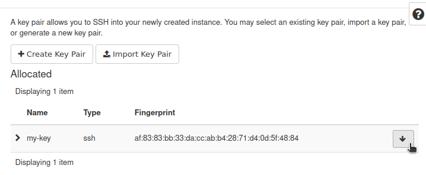

Identical Step 7 Create the instance
++++++++++++++++++++++++++++++++++++++

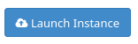

Finally, click on **Launch Instance**.

You will see the new instance through **Compute** -> **Instances**.

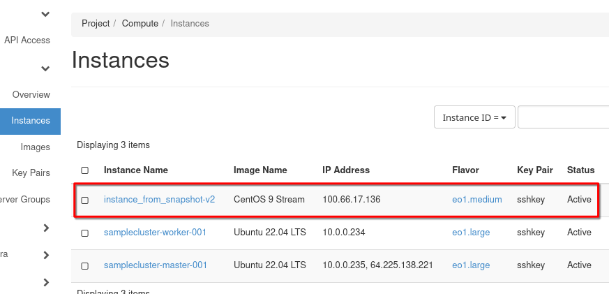

Identical Step 8 Attach a Floating IP to the instance
+++++++++++++++++++++++++++++++++++++++++++++++++++++++++++++

You should be able to attach a floating IP to a virtual machine created in this way just like to any other virtual machine.

Take care which network you are attaching to the new instance in Step 4. If the original instance had access only networks internal to the cloud, it will not be possible to create a floating IP, as an **external** network to get out to the Internet. You may get a message like this in such a case:

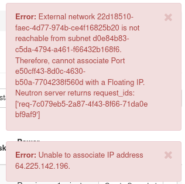

The floating IP will almost certainly be different from the value provided in the reference article so adjust where needed.

Possibly identical Step 9 Connecting to your virtual machine using SSH
+++++++++++++++++++++++++++++++++++++++++++++++++++++++++++++++++++++++++++

If it is possible to get access using SSH, just see Step 9 from the reference article. Note that the command might be different if for example your operating system uses different username.

If you are using some other way of accessing, this step may be drastically different and such cases are out of scope of this article.

What can go wrong when recreating instance from instance snapshot
-----------------------------------------------------------------------

Wrong flavors
   If you specify flavor with insufficient resources like storage, it might not be possible to create an instance, or it might run worse than previously, or not run at all.

Incorrect or Missing Networks
   The network or subnet that you want to use may be absent, deleted, renamed or even not selected during the recreation process.

   If recreated without network connection, the instance may be inaccessible and/or it might not be able to access other resources (like for example databases) which it needs for correct operation.

Unattached volumes
   Connected volumes are usually not included with the instance snapshot. See Prerequisite No. 3 for more information.

   Without volumes, there may be no data to operate upon, or something else may be incomplete.

Loss of metadata or configuration data
   If you had custom metadata, user data scripts, special configuration settings... all these may have to be executed once the instance is restored.

   If not, the applications in that setup may behave erratically or not even start.

IP addresses changed
   The recreated instance might have a different IP address. That may result in loss of connectivity and access.

   You might recognize it as broken links, disrupted communications, failed services in case they rely on static IPs.

Improper quotas and resources
   Quotas and limits for the new instance may differ from the quotas and limits from the old instance.

   The instance will not be created until the quotas are readjusted.

Failed external services
   The instance may depend on external databases, external storage or other types of external services -- and it is possible that these are not recreated automatically with the instance.

   In that case, the services that you hope to be using the instance for, won't be available or will malfunction.

Inconsistent snapshot state
   It is advised to first shut down the instance and only then create its snapshot. If the shapshot was taken while the instance was running, some data may be lost or corrupted.

   This will lead to application errors, data loss or system instability.

Incompatible environments
    The instance might work incorrectly or even not work at all if it contains drivers and other software that is incompatible with the current environment - flavor and/or cloud.

Verifying volumes when using persistent storage
--------------------------------------------------------------------

Skip this section if your instance uses ephemeral storage.

If you created an instance from snapshot of instance which uses persistent storage, you should check whether all volumes were successfully recreated from their respective volume snapshots.

Once the instance was built (its **Status** is **Active**), click on its name:

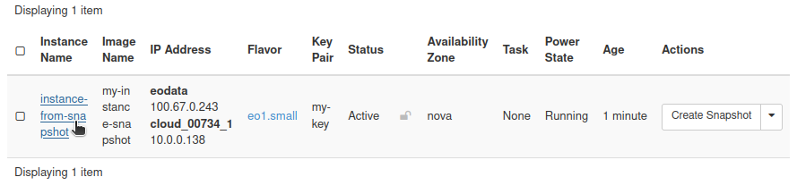

You should get more detailed informations about your instance. Scroll to the bottom of the page. You should see section **Volumes Attached** which contains volumes attached to your instance:

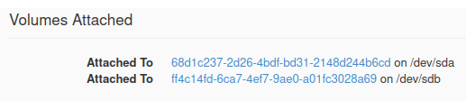

Note that the reference names of volumes are **not** preserved here. The names of volumes created by this process are the same as their respective IDs and **not** the same as IDs of their reference volumes or snapshots.

You can click on each of their names to see more details, for example:

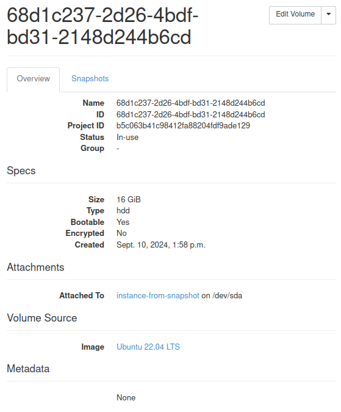

Properties such as **Size** or **Bootable** should be the same as it was in the case of reference volumes.

What To Do Next
--------------------

.. jinja:: brand_names

   If you want to create a virtual machine from an instance snapshot using the OpenStack CLI client instead of the Horizon dashboard, see: :doc:`/openstackcli/How-to-start-a-VM-from-instance-snapshot-using-OpenStack-CLI-on-{{ brand_name_hyphen }}/How-to-start-a-VM-from-instance-snapshot-using-OpenStack-CLI-on-{{ brand_name_hyphen }}`
