How to transfer volumes between domains and projects using Horizon dashboard on |brand-name|
=============================================================================================================

Volumes in OpenStack can be used to store data. They are visible to virtual
machines as drives.

A volume is usually available only to the project in which it was created.
Moving the data stored on such a volume between projects can take a long time,
especially if the volume contains hundreds or thousands of gigabytes.

This article describes how to transfer the ownership of a volume from one
project to another using the Horizon dashboard. This allows you to move a
volume directly from the **source** project to the **destination** project
without copying the data.

The **source** project and the **destination** project must be in the same
cloud region. They can belong to different users, domains, or organizations.

What we are going to cover
--------------------------

* Initializing a volume transfer
* Accepting a volume transfer
* Cancelling a volume transfer

Prerequisites
-------------

No. 1 **Account**

You need a |brand-name| hosting account with access to the Horizon interface:
|brand-name-site-link|.

No. 2 **Volume**

You need a volume that you want to transfer.

The volume must not be attached to a virtual machine. Its **Status** must be
**Available**.

You can check the status of the volume in **Volumes** -> **Volumes** in the
Horizon dashboard. In the screenshot below, the status is marked with a green
rectangle.

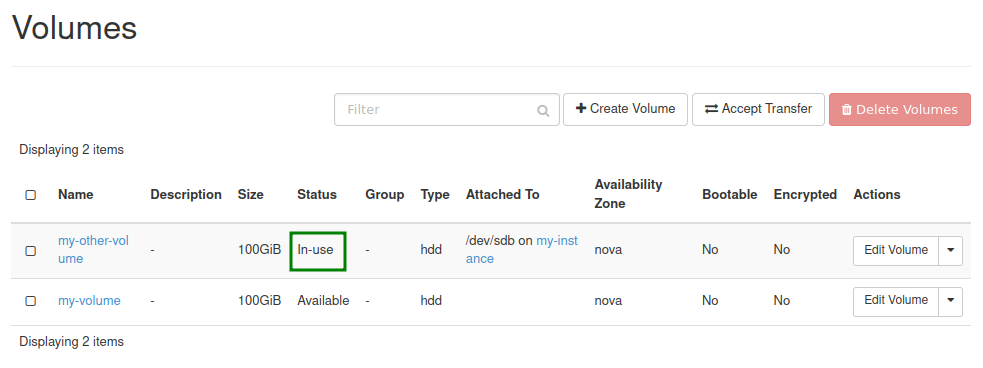

   Volume status in Horizon

.. jinja:: doc_links

   The following article explains how to detach a volume from a virtual
   machine: :doc:`{{ move_volume_between_vms_horizon }}`

No. 3 **Ability to perform operations on both projects**

For the transfer to be successful, you need to:

* initiate the transfer from the **source** project,
* accept the transfer from the **destination** project.

If the source or destination project is not managed by you, ask a user with
the required permissions in that project to perform the relevant part of the
workflow.

To access each project directly, you can sign in to the appropriate account or
use the project switcher at the top of the Horizon dashboard.

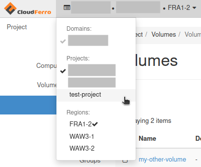

   Project switcher in Horizon

Step 1: Initialize the volume transfer
--------------------------------------

Perform this step in the **source** project.

Navigate to **Volumes** -> **Volumes** in the Horizon dashboard.

Confirm that the volume you want to transfer has **Status** set to
**Available**. In the example below, this requirement is met. The value is
marked with a blue rectangle.

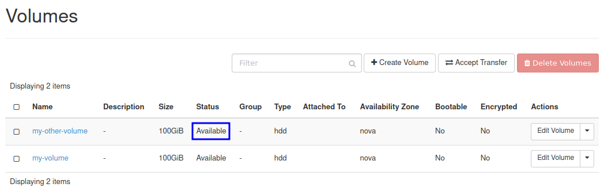

   Available volume in the source project

If your volume has a different status, do not continue. Check Prerequisite
No. 2 and detach the volume if needed.

In the row representing the volume you want to transfer, open the drop-down
menu in the **Actions** column and choose **Create Transfer**.

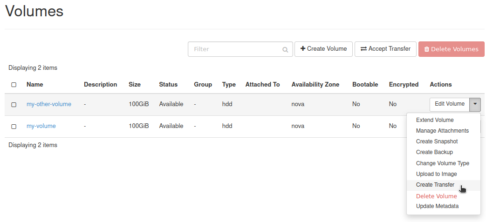

   Create Transfer action in Horizon

You should see the following window.

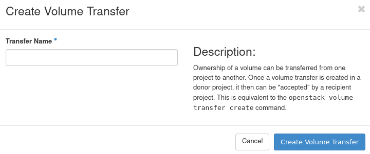

   Create Volume Transfer window

Enter a descriptive name in the **Transfer Name** text field and click
**Create Volume Transfer**.

You should now see the transfer credentials.

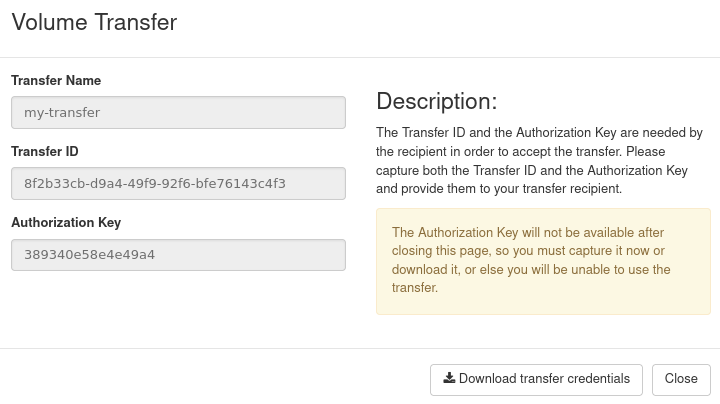

   Volume transfer credentials

Write down the **Transfer ID** and **Authorization Key**. You can also use
**Download transfer credentials** to download these values as a plain text
file.

.. warning::

   These credentials allow the recipient to accept the volume transfer while
   the transfer is active. Protect them and share them only with the intended
   recipient.

After saving the credentials, click **Close**.

The volume should now have **Status** set to **Awaiting Transfer**.

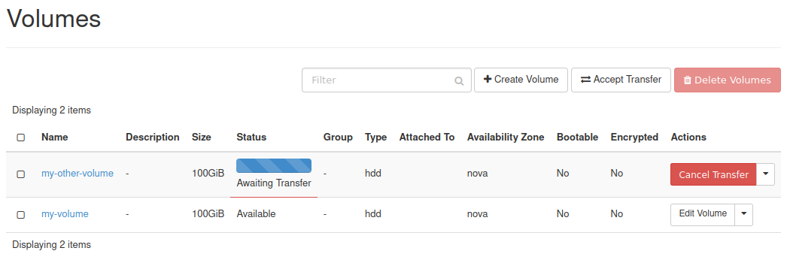

   Volume awaiting transfer

After the transfer is initialized, the volume cannot be attached to a virtual
machine until the transfer is accepted or cancelled.

Step 2: Accept the volume transfer
----------------------------------

Perform this step in the **destination** project.

Navigate to **Volumes** -> **Volumes** in the Horizon dashboard and click
**Accept Transfer**.

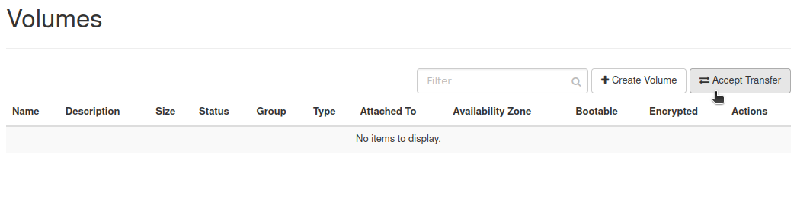

   Accept Transfer button in Horizon

You should see the following window.

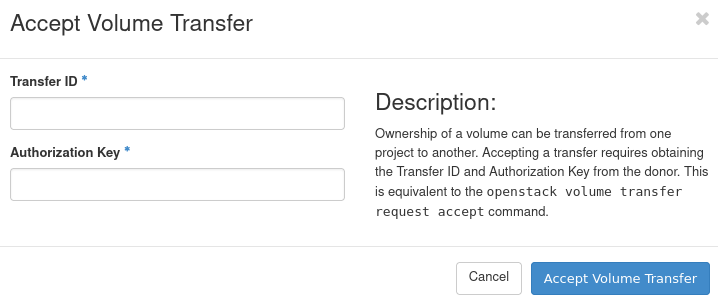

   Accept Volume Transfer window

Enter the **Transfer ID** and **Authorization Key** obtained in Step 1.

Click **Accept Volume Transfer**.

The volume should now be visible in the destination project.

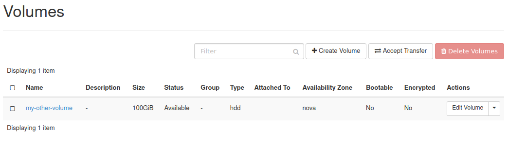

   Transferred volume visible in the destination project

Cancelling a volume transfer
----------------------------

If you accidentally initiated a transfer for the wrong volume and the transfer
has not been accepted yet, you can cancel it.

Perform this step in the **source** project.

Navigate to **Volumes** -> **Volumes** in the Horizon dashboard.

   Volumes list in Horizon

In this example, assume that a transfer was accidentally created for volume
**my-volume**. Because of that, its status is **Awaiting Transfer**. Such a
volume cannot be attached to an instance while the transfer remains active.

To cancel the transfer, click **Cancel Transfer** in the **Actions** column of
the volume row.

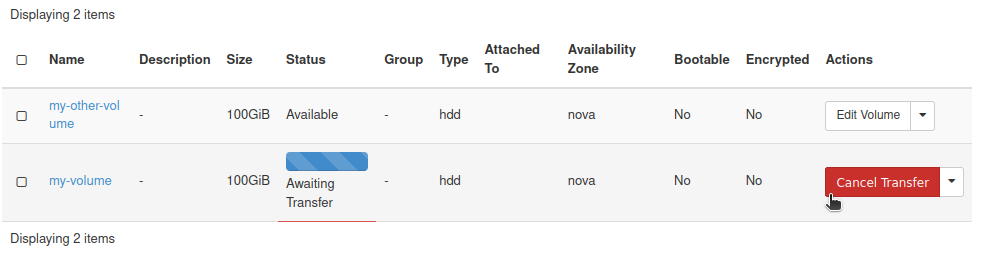

   Cancel Transfer action in Horizon

You will be asked for confirmation.

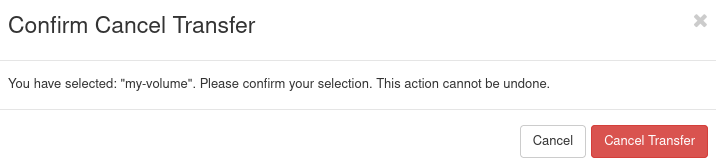

   Confirm cancellation of volume transfer

Click **Cancel Transfer**.

If the operation is successful, you should get a message in the top-right
corner of the Horizon dashboard.

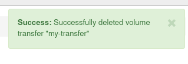

   Volume transfer cancellation message

The message can be confusing if you read only its first line. It does not mean
that the volume was removed. It means that the volume transfer was cancelled.

After cancellation, the volume should again have **Status** set to
**Available**.

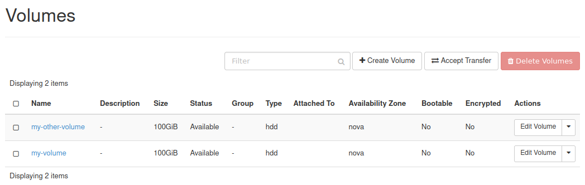

   Volume available after cancelling transfer

What to do next
---------------

After the volume has been transferred, you may want to attach it to a virtual
machine.

.. jinja:: doc_links

   :doc:`{{ move_volume_between_vms_horizon }}`

The workflow described in this article can also be performed using
OpenStack CLI.

.. jinja:: doc_links

   :doc:`{{ transfer_volume_cli }}`