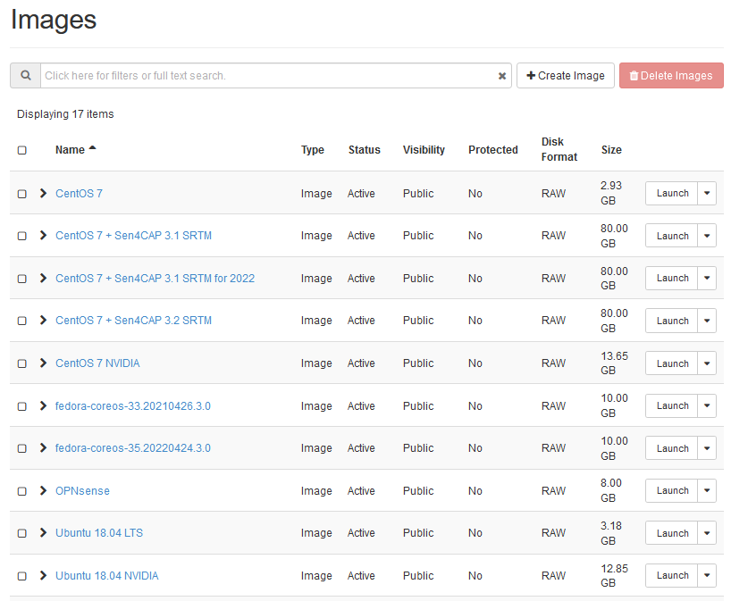
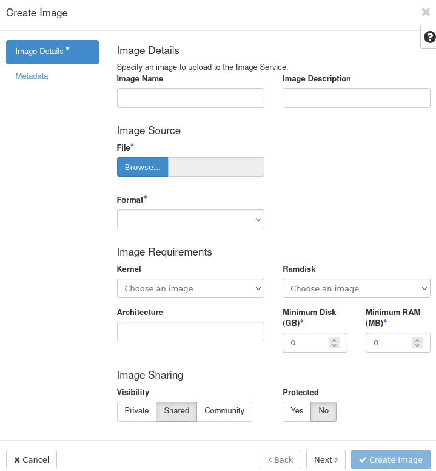
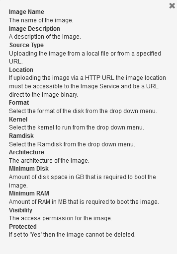
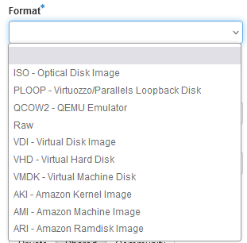
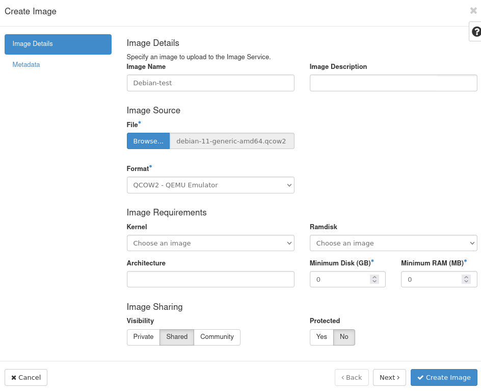
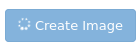
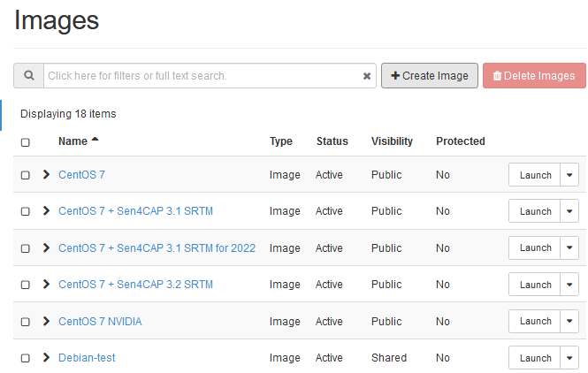
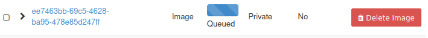
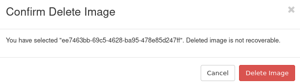

How to upload custom image to |brand-name| cloud using OpenStack Horizon dashboard
=================================================================================================

In this tutorial, you will upload custom image stored on your local computer to |brand-name|  cloud, using the Horizon Dashboard. The uploaded image will be available within your project alongside default images from |brand-name|  cloud and you will be able to create virtual machines using it.

What We Are Going To Cover
------------------------------

 * How to check for the presence of image in |brand-name|  cloud
 * How different images might behave
 * How to upload an image using Horizon dashboard
 * Example: how to upload image for Debian 11
 * What happens if you lose Internet connection during upload

Prerequisites
-----------------

No. 1 **Account**

You need a |brand-name| hosting account with access to the Horizon interface: |brand-name-site-link|.

No. 2 **Custom image you wish to upload**

You need to have the image you wish to upload. It can be one of the following image formats:

 ======= ======= ======== ======== ===========
 aki     ami     ari      iso      qcow2
 raw     vdi     vhd      vhdx     vmdk
 ======= ======= ======== ======== ===========

The following container formats are supported:

 ======= ======= ======== ========
 aki     ami     ari      bare
 docker  ova     ovf
 ======= ======= ======== ========

.. jinja:: brand_names

   For the explanation of these formats, see article  :doc:`/cloud/What-Image-Formats-are-available-in-OpenStack-{{ brand_name_hyphen }}-Cloud/What-Image-Formats-are-available-in-OpenStack-{{ brand_name_hyphen }}-Cloud`.

No. 3 **Uploaded public SSH key**

If the image you wish to upload requires you to attach an SSH public key while creating the virtual machine, the key will need to be uploaded to |brand-name|  cloud. One of these articles should help:

.. jinja:: brand_names

    * :doc:`/networking/How-to-add-SSH-key-from-Horizon-web-console-on-{{ brand_name_hyphen }}/How-to-add-SSH-key-from-Horizon-web-console-on-{{ brand_name_hyphen }}`
    * :doc:`/networking/Generating-a-SSH-keypair-in-Linux-on-{{ brand_name_hyphen }}/Generating-a-SSH-keypair-in-Linux-on-{{ brand_name_hyphen }}` and
    * :doc:`/networking/How-to-Import-SSH-Public-Key-to-OpenStack-Horizon-on-{{ brand_name_hyphen }}/How-to-Import-SSH-Public-Key-to-OpenStack-Horizon-on-{{ brand_name_hyphen }}`

Step 1: Check for the presence of image in your OpenStack cloud
------------------------------------------------------------------------

Login to the Horizon dashboard: |brand-name-site-link|.

Use main menu command  **Compute -> Images** to see a list of images available in your project:

To see whether an image for the operating system you wish to upload is already present in the cloud, you can

 * manually scroll through the list,
 * if present, use buttons **Back** and **Next** to go to the next and previous page of images or
 * type part of your image name into the search field to filter the images

Step 2: Know the rules for the image before uploading it
---------------------------------------------------------------

Different images will behave differently on |brand-name|  cloud, depending on how they are built.

SSH access
   If your image has SSH access enabled, you need to know what username to provide to access virtual machines created using that image. Most images will *expect* you to use SSH for access and will both

    * let you supply your own key-pair during the installation and
    * use it for access.

   And yet, there are images which *mandate* the key pair to use and expect you to both

    * enter it during the installation and then
    * exclusively use it for access.

   There also are images which work under completely different rules - they are outside of scope of this article.

Web console access
   Your image might have a default account which can be used to login to the web console. It might or might not have a password.

Privileges
   User accounts in the image might or might not have **sudo** privileges.

Here are the typical rules for default images from |brand-name| cloud:

Account called eoconsole
   You can login to this account via web console. First login will not require you to provide any password, but you will need to set a new password in order to access this account. It has **sudo** privileges.

Account called eouser
   This account can be accessed via SSH. You can authenticate to it using SSH key you provided during creation of your virtual machine. It also has **sudo** privileges. You will use this account in almost all applications within |brand-name| cloud.

.. jinja:: brand_names

   This article :doc:`/cloud/How-to-access-the-VM-from-OpenStack-console-on-{{ brand_name_hyphen }}/How-to-access-the-VM-from-OpenStack-console-on-{{ brand_name_hyphen }}` explains how to enter the web console as **eoconsole** user and then continue using it as the **eouser** user. If custom image you uploaded supports web console access, you can use the web console mentioned in this article for that purpose. Please note, however, that the way of interacting with web console might be different.

By way of contrast, the rules to access the Debian image uploaded in this article (see below) are:

 * web console access is **not** allowed, so you have to use an SSH client from another machine
 * you can access the account called **debian** using SSH key you provided while creating your virtual machine

Step 3: Upload the image
--------------------------------------------

Assuming you still want to upload the image, click on the **Create Image** button. You should see the following window:

Click on the question mark in the right upper corner will supply the basic information about the options:

Enter the chosen name of the image to the text field **Image Name**.

Optionally, provide description of the image in the text field **Image Description** for your convenience.

Click the **Browse** button to start file selector and select the file on your computer you wish to upload.

From the drop-down menu **Format** choose the format of your image.

If you don't want your image to run on flavors which have RAM and storage lower than a certain value, you can specify those values using the fields **Minimum Disk (GB)** and **Minimum RAM (MB)**.

In **Visibility** section, you can choose the following options:

 * **Private** the image will be visible within your project
 * **Shared**, you will be able to share that image with other projects

Once you have performed the above steps, click **Create Image**.

Wait until your image is uploaded and created. After some time, the **Create Image** window should disappear and you should see that your image has **Saving** status. Wait until it has **Active** status.

If your image is in the **Saving** status for too long, it could mean that something went wrong. Please contact |brand-name| customer support in this case: :doc:`Help-Desk-And-Support`

Your image should now be ready. Let us now download a real image and upload it to |brand-name| cloud.

Example: How to upload image for Debian 11
^^^^^^^^^^^^^^^^^^^^^^^^^^^^^^^^^^^^^^^^^^^^^^^^^^^^

This example covers uploading of the official QCOW2 cloud image for Debian 11, which is not available on |brand-name|  cloud by default.

On virtual machines created using that image, the default user name is **debian**. You can login to that account using SSH key provided during creation of virtual machine. You cannot use the web console to login there since password login is locked.

First, navigate to https://cloud.debian.org/images/cloud/bullseye/latest/ and download the image **debian-11-generic-amd64.qcow2** to your computer.

.. image:: upload-image-horizon-10_creodias.png

Back in Horizon, use command **Compute -> Images** --> **Create Image** to define parameters for the upload.

Enter **Debian-test** into the text field **Image Name**.

Click **Browse** button to choose the file downloaded from Debian website.

Select **QCOW2 - QEMU Emulator** for drop-down menu **Format**.

The window should now look like this:

Click **Create Image**.

At first, the **Create Image** button should show an indicator that work is being performed:

After some time, the **Create Image** window should disappear and you should see that your image has **Saving** status.

The image should be ready when it has **Active** status:

In the future, when you want to create a new virtual machine, you will have the image called **Debian-test** you just uploaded available to you.

Troubleshooting - Internet connection lost
----------------------------------------------------------------

Internet connection lost during upload
^^^^^^^^^^^^^^^^^^^^^^^^^^^^^^^^^^^^^^^^^^^^^

If you lost Internet connection while uploading an image, the process will be stopped. If you were on the **Create Image** window during such loss, the window will still be visible and appear as if the upload was still ongoing.

Refresh the page and login again if necessary. On the **Compute -> Images** section of the Horizon dashboard the image which failed to upload this way will not have the name you chose. The column **Name** will contain its ID. The row with such an image will look similar to this:

Use the **Delete Image** option do delete the image. You will get the following prompt:

Click **Delete Image**.

Try uploading the image again as described in this article.

Internet connection lost during saving
^^^^^^^^^^^^^^^^^^^^^^^^^^^^^^^^^^^^^^^^^^^^^^^^^^

If you lost your connection while the window **Create Image** has already disappeared and the image has the **Saving** status, the upload should still be successful. To verify:

 * refresh the page,
 * login again if needed,
 * navigate to **Compute -> Images** and
 * make sure that the image you uploaded has **Active** status.

If it does not have **Saving** or **Active** status, delete the image as explained above and try again. If it has **Saving** status, wait until it is **Active**.

.. note::

   If the upload fails, the name of the image might be replaced with its ID, like in the case mentioned above.

What To Do Next
----------------------

The following articles explain basics of creating a virtual machine using default images on |brand-name| cloud:

.. jinja:: brand_names

    * :doc:`/cloud/How-to-create-a-Linux-VM-and-access-it-from-Linux-command-line-on-{{ brand_name_hyphen }}/How-to-create-a-Linux-VM-and-access-it-from-Linux-command-line-on-{{ brand_name_hyphen }}` and
    * :doc:`/cloud/How-to-create-a-Linux-VM-and-access-it-from-Windows-desktop-on-{{ brand_name_hyphen }}/How-to-create-a-Linux-VM-and-access-it-from-Windows-desktop-on-{{ brand_name_hyphen }}`

In **Step 2** of these articles, you can choose the image that you uploaded.

Also, note that the rules of accessing your virtual machine might be different from the ones explained in these articles.

.. jinja:: brand_names

   If you want to upload image using the OpenStack CLI client, check the following article: :doc:`/cloud/How-to-upload-your-custom-image-using-OpenStack-CLI-on-{{ brand_name_hyphen }}/How-to-upload-your-custom-image-using-OpenStack-CLI-on-{{ brand_name_hyphen }}`. Using CLI has the advantage of giving you a chance to resume the upload process should the Internet connection fail.

.. ifconfig:: brand_name not in brands_without_eodata

   .. jinja:: brand_names

      After having created a virtual machine using your custom image, you might want to configure access to EODATA, repository which contains Earth observation data. The following article contains information on how to do that if your image is based on Ubuntu, Debian or CentOS: :doc:`/eodata/How-to-mount-eodata-using-S3FS-in-Linux-on-{{ brand_name_hyphen }}`
