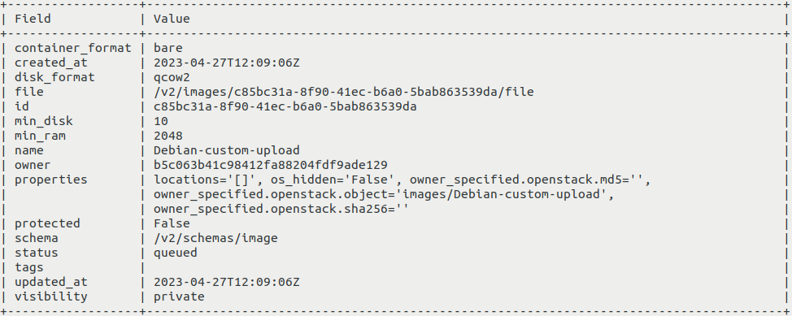
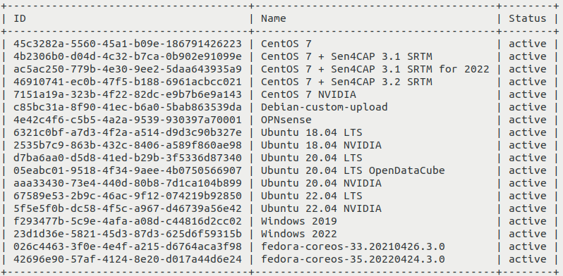
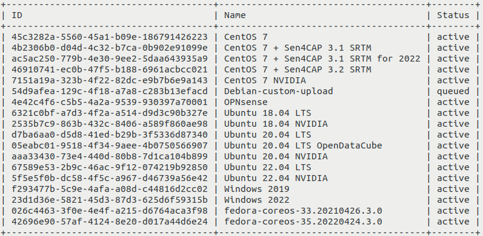

How to upload your custom image using OpenStack CLI on |brand-name|
==================================================================

In this tutorial, you will upload a custom image stored on your local computer to |brand-name| cloud by using the OpenStack CLI client. The uploaded image will be available within your project alongside the default images from |brand-name| cloud, and you will be able to create virtual machines from it.

What We Are Going To Cover
--------------------------

* How to check whether the image is already available in your OpenStack cloud.
* How different images might behave.
* How to upload the image by using only CLI commands.
* Example: how to upload a Debian 11 image.
* What happens if you lose Internet connection during upload.

Prerequisites
-------------

No. 1 **Account**

You need a |brand-name| hosting account with access to the Horizon interface: |brand-name-site-link|.

No. 2 **OpenStack CLI configured**

.. jinja:: brand_names

   You need to have the OpenStack CLI client configured and operational. See :doc:`/openstackcli/How-to-install-OpenStackClient-for-Linux-on-{{ brand_name_hyphen }}/How-to-install-OpenStackClient-for-Linux-on-{{ brand_name_hyphen }}`. You can test whether your OpenStack CLI is properly activated by executing the **openstack server list** command mentioned at the end of that article. It should return the list of your virtual machines.

No. 3 **Custom image you wish to upload**

You need to have the image you wish to upload.

The following image formats are supported:

.. jinja:: caption_colors

   .. list-table:: :{{ caption }}:`Supported image formats`
      :header-rows: 1
      :widths: 20 20 20 20 20

      * - :{{ header }}:`Format`
        - :{{ header }}:`Format`
        - :{{ header }}:`Format`
        - :{{ header }}:`Format`
        - :{{ header }}:`Format`
      * - **aki**
        - **ami**
        - **ari**
        - **iso**
        - **qcow2**
      * - **raw**
        - **vdi**
        - **vhd**
        - **vhdx**
        - **vmdk**

The following container formats are supported:

.. jinja:: caption_colors

   .. list-table:: :{{ caption }}:`Supported container formats`
      :header-rows: 1
      :widths: 25 25 25 25

      * - :{{ header }}:`Format`
        - :{{ header }}:`Format`
        - :{{ header }}:`Format`
        - :{{ header }}:`Format`
      * - **aki**
        - **ami**
        - **ari**
        - **bare**
      * - **docker**
        - **ova**
        - **ovf**
        -

.. jinja:: brand_names

   For the explanation of these formats, see article :doc:`/cloud/What-Image-Formats-are-available-in-OpenStack-{{ brand_name_hyphen }}-Cloud/What-Image-Formats-are-available-in-OpenStack-{{ brand_name_hyphen }}-Cloud`.

No. 4 **Uploaded public SSH key**

If the image you wish to upload requires you to attach an SSH public key while creating the virtual machine, the key must be uploaded to |brand-name| cloud. One of these articles should help:

.. jinja:: brand_names

   * :doc:`/networking/How-to-add-SSH-key-from-Horizon-web-console-on-{{ brand_name_hyphen }}/How-to-add-SSH-key-from-Horizon-web-console-on-{{ brand_name_hyphen }}`
   * :doc:`/networking/Generating-a-SSH-keypair-in-Linux-on-{{ brand_name_hyphen }}/Generating-a-SSH-keypair-in-Linux-on-{{ brand_name_hyphen }}`
   * :doc:`/networking/How-to-Import-SSH-Public-Key-to-OpenStack-Horizon-on-{{ brand_name_hyphen }}/How-to-Import-SSH-Public-Key-to-OpenStack-Horizon-on-{{ brand_name_hyphen }}`

No. 5 **Basic knowledge about the Linux command line**

Basic knowledge about the Linux command-line interface is required.

Always use the latest value of image ID
---------------------------------------

From time to time, the default operating system images in |brand-name| cloud are upgraded to new versions. As a consequence, their **image ID** changes. For example, the image ID for Ubuntu 20.04 LTS may have been **574fe1db-8099-4db4-a543-9e89526d20ae** at the time this article was originally written. When working through the article, you should normally use the current value of the image ID instead.

If you automate OpenStack operations with Heat, Terraform, Ansible, or another automation tool, avoid hardcoding an old image ID. Once the default image is upgraded and its ID changes, automation that uses the old ID may stop working.

.. warning::

   Make sure that your automation code uses the **current value** of an OS image ID, not a hardcoded historical value.

Step 1: Check for the presence of the image in your OpenStack cloud
------------------------------------------------------------------

Before uploading an image, check whether you need to upload it at all. It may already be available in |brand-name| cloud. Assuming that you have met all prerequisites, including authenticating to the OpenStack CLI client, execute the following command:

.. code::

   openstack image list

You should see the list of images available to you, for example:

.. image:: upload-image-cli-10_creodias.png

Step 2: Know the rules for the image before uploading it
--------------------------------------------------------

Different images behave differently in |brand-name| cloud, depending on how they are built.

SSH access
   If your image has SSH access enabled, you need to know which username to use when accessing virtual machines created from that image. Most images expect SSH access and allow you to:

   * supply your own key pair during VM creation,
   * use that key pair for access.

   However, some images require a specific key pair and expect you to:

   * enter it during VM creation,
   * use only that key pair for access.

   Other images may follow different access rules. Those cases are outside the scope of this article.

Web console access
   Your image may have a default account that can be used to log in through the web console. That account may or may not have a password.

Privileges
   User accounts in the image may or may not have **sudo** privileges.

Here are the typical rules for default images from |brand-name| cloud:

Account called eoconsole
   You can log in to this account through the web console. First login does not require a password, but you need to set a new password before continuing to use this account. It has **sudo** privileges.

Account called eouser
   This account can be accessed through SSH. You can authenticate to it by using the SSH key you provided during virtual machine creation. It also has **sudo** privileges. You will use this account in almost all applications within |brand-name| cloud.

.. jinja:: brand_names

   This article :doc:`/cloud/How-to-access-the-VM-from-OpenStack-console-on-{{ brand_name_hyphen }}/How-to-access-the-VM-from-OpenStack-console-on-{{ brand_name_hyphen }}` explains how to enter the web console as the **eoconsole** user and then continue as the **eouser** user. If the custom image you uploaded supports web console access, you can use the web console mentioned in that article for this purpose. However, the way you interact with the web console may differ depending on the image.

By contrast, the Debian image uploaded in this article uses the following access rules:

* Web console access is **not** allowed, so you must use an SSH client from another machine.
* You can access the account called **debian** by using the SSH key you provided while creating your virtual machine.

Step 3: Upload the image
------------------------

Assuming that you still want to upload the image, navigate to the folder that contains the image you wish to upload, for example:

.. code::

   cd ~/my-images

Execute the following command. Replace the relevant parts as explained below.

.. code::

   openstack image create --disk-format qcow2 --container-format bare --private --file ./image.qcow2 --min-disk 6 --min-ram 2048 image_name --fit-width

The meaning of the parameters is as follows:

**--disk-format**
   Replace **qcow2** with the image format. Supported values include **aki**, **ami**, **ari**, **iso**, **ploop**, **qcow2**, **raw**, **vdi**, **vhd**, **vhdx**, and **vmdk**. If you do not specify this parameter, **raw** is used.

**--container-format**
   Replace **bare** with the image container format. Supported values include **ami**, **ari**, **aki**, **bare**, **docker**, **ova**, and **ovf**. If you do not specify this parameter, **bare** is used.

**--file**
   Replace **./image.qcow2** with the name and location of the image file.

**--min-disk**
   Replace **6** with the selected storage requirement in gigabytes. For example, leave **6** if you want to use that image only on virtual disks that have at least 6 GB.

**--min-ram**
   Replace **2048** with the RAM requirement for your operating system in megabytes. This prevents creating VMs with insufficient RAM.

**Image name**
   The last parameter is the name under which the image will be known in OpenStack. It does not have to be the same as the name of the file you are uploading. Replace **image_name** in the command above.

**Visibility rules**

   Image visibility defines which projects can access the new image. You can set it in one of the following ways:

   * **private** makes the image visible within your project. It can be set by passing the **--private** parameter to the command above.
   * **shared** makes the image visible within your project and shareable with other projects. It can be set by passing the **--shared** parameter to the command above.

   These parameters do not take input values. You can choose only one of them at a time. If you do not add either parameter, the image visibility is set to **private**.

   Images with visibility set to **public** can be seen by all users of the cloud. This privilege is reserved for the administrators of |brand-name| cloud as a whole.

   Administrators within their own organizations also cannot use **--public**. If a standard user tries to upload this type of image, the process results in an error.

**--fit-width**
   Optional parameter that improves output legibility in some circumstances. It attempts to fit the output width to the width of the display and can be used with many OpenStack commands.

After executing the command above, the upload process begins. No output should be displayed until it is finished.

If you lose Internet connection during the upload and reconnect, the process might resume. In that case, the image may still be successfully uploaded. If the upload is not successful, delete the failed upload and try again. See the section **Troubleshooting - Internet connection lost** at the end of this article.

Once the process is over, the output should contain information about the uploaded image, including its ID in the **id** field. It will be similar to this:

The next steps are:

* Copy the ID.
* Replace **c85bc31a-8f90-41ec-b6a0-5bab863539da** with the ID you copied in the command below and execute it.

.. code::

   openstack image show c85bc31a-8f90-41ec-b6a0-5bab863539da --fit-width

Make sure that the **status** field contains **active** or **saving**. If it does not, the image was likely uploaded incorrectly. Delete that image and try again. For more information, see the section **Troubleshooting - Internet connection lost** at the end of this article.

If the status of your image is **saving**, execute the command above again until the status becomes **active**.

.. jinja:: brand_names

   If your image remains in the **Saving** status for too long, something may have gone wrong. Contact |brand-name| customer support: :doc:`/accountmanagement/Help-Desk-And-Support/Help-Desk-And-Support`.

Example: How to upload an image for Debian 11
^^^^^^^^^^^^^^^^^^^^^^^^^^^^^^^^^^^^^^^^^^^^^

This example covers uploading the official QCOW2 image for Debian 11, which is not available in |brand-name| cloud by default.

First, navigate to https://cloud.debian.org/images/cloud/bullseye/latest/ and download the image **debian-11-generic-amd64.qcow2** to your computer:

.. image:: upload-image-cli-12_creodias.png

Open the terminal in which you have access to the OpenStack CLI and use the **source** command with the appropriate RC file as the parameter, as you did in **Prerequisite No. 2**.

Navigate to the folder containing that image. Execute the following command:

.. code::

   openstack image create --disk-format qcow2 --container-format bare --private --file ./debian-11-generic-amd64.qcow2 --min-disk 10 --min-ram 2048 Debian-custom-upload --fit-width

It uploads the image under the name **Debian-custom-upload** with visibility set to **private**. The requirements for that image are set to 10 GB minimum storage and 2 GB RAM. You can provide different values if needed. If you want to set the visibility to **shared**, replace **--private** with **--shared**.

During the upload process, you should see no output. Once the process is complete, the output should change to this:

To make sure that the upload was successful, copy the ID of the image shown in the **id** field. In the command below, replace **c85bc31a-8f90-41ec-b6a0-5bab863539da** with the ID of the image you copied:

.. code::

   openstack image show c85bc31a-8f90-41ec-b6a0-5bab863539da --fit-width

Make sure that the **status** field contains **active**:

.. image:: upload-image-cli-02_creodias.png

Execute the following command to see the images available to you again:

.. code::

   openstack image list

You should now see your image on the list.

Troubleshooting - Internet connection lost
------------------------------------------

If you lose Internet connection during image upload, the process may resume automatically if you reconnect in time. After the upload, you receive output similar to the following:

You can verify its status by executing the command below. Replace **c85bc31a-8f90-41ec-b6a0-5bab863539da** with the ID of your image.

.. code::

   openstack image show c85bc31a-8f90-41ec-b6a0-5bab863539da

If the status is **active**, you can create a virtual machine using that image.

Sometimes, however, the upload is not successful. The **openstack image list** command then shows that the image still has the status **queued**, which means that the upload is waiting in a queue:

You then need to delete that image and upload it again. First, copy the ID of the image from the command output. Then execute the command below. Replace **54d9afea-129c-4f18-a7a8-c283b13efacd** with the ID you copied:

.. code::

   openstack image delete 54d9afea-129c-4f18-a7a8-c283b13efacd

After that, you can try uploading again.

What To Do Next
---------------

.. jinja:: brand_names

   You can also upload images using the Horizon dashboard: :doc:`/cloud/How-to-upload-custom-image-to-{{ brand_name_hyphen }}-cloud-using-OpenStack-Horizon-dashboard/How-to-upload-custom-image-to-{{ brand_name_hyphen }}-cloud-using-OpenStack-Horizon-dashboard`.

.. ifconfig:: brand_name not in brands_without_eodata

   .. jinja:: brand_names

      After creating a virtual machine from your custom image, you may want to configure access to the EODATA repository, which contains Earth observation data. The following article explains how to do that if your image is based on Ubuntu, Debian, or CentOS: :doc:`/eodata/How-to-mount-eodata-using-S3FS-in-Linux-on-{{ brand_name_hyphen }}`.