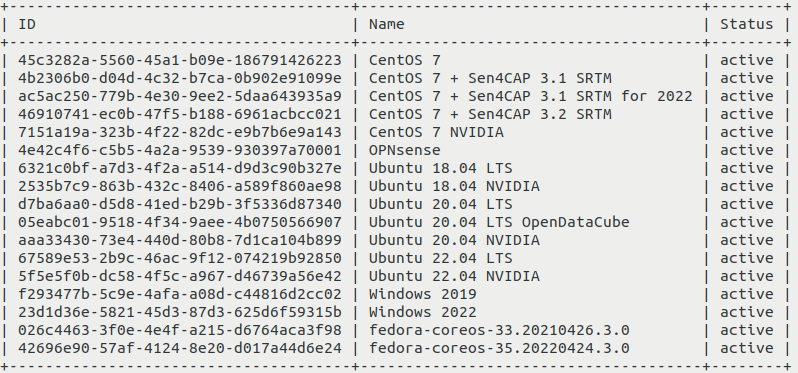
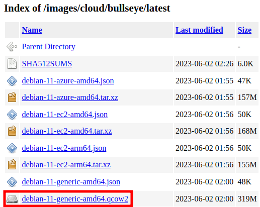
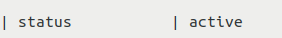

How to upload your custom image using OpenStack CLI on |brand-name|
===================================================================

In this tutorial, you will upload custom image stored on your local computer to |brand-name| cloud, using the OpenStack CLI client. The uploaded image will be available within your project alongside default images from |brand-name| cloud and you will be able to create virtual machines using it.

What We Are Going To Cover
--------------------------

 * How to check for the presence of the image in your OpenStack cloud
 * How different images might behave
 * How to upload the image using only CLI commands
 * Example: how to upload image for Debian 11
 * What happens if you lose Internet connection during upload

Prerequisites
-------------

No. 1 **Account**

You need a |brand-name| hosting account with access to the Horizon interface: |brand-name-site-link|.

No. 2 **OpenStack CLI configured**

.. jinja:: brand_names

   You need to have the OpenStack CLI client configured and operational. See :doc:`/openstackcli/How-to-install-OpenStackClient-for-Linux-on-{{ brand_name_hyphen }}`. You can test whether your OpenStack CLI is properly activated by executing the **openstack server list** command mentioned in the end of that article - it should return the list of your virtual machines.

No. 3 **Custom image you wish to upload**

You need to have the image you wish to upload. It can be one of the following image formats:
The following image formats are supported:

.. jinja:: caption_colors

   .. list-table:: :{{ caption }}:`Supported image formats`
      :header-rows: 1
      :widths: 20 20 20 20 20

      * - :{{ header }}:`Format`
        - :{{ header }}:`Format`
        - :{{ header }}:`Format`
        - :{{ header }}:`Format`
        - :{{ header }}:`Format`
      * - **aki**
        - **ami**
        - **ari**
        - **iso**
        - **qcow2**
      * - **raw**
        - **vdi**
        - **vhd**
        - **vhdx**
        - **vmdk**

The following container formats are supported:

.. jinja:: caption_colors

   .. list-table:: :{{ caption }}:`Supported container formats`
      :header-rows: 1
      :widths: 25 25 25 25

      * - :{{ header }}:`Format`
        - :{{ header }}:`Format`
        - :{{ header }}:`Format`
        - :{{ header }}:`Format`
      * - **aki**
        - **ami**
        - **ari**
        - **bare**
      * - **docker**
        - **ova**
        - **ovf**
        -

.. jinja:: brand_names

   For the explanation of these formats, see article :doc:`/cloud/What-Image-Formats-are-available-in-OpenStack-{{ brand_name_hyphen }}-Cloud`.

No. 4 **Uploaded public SSH key**

If the image you wish to upload requires you to attach an SSH public key while creating the virtual machine, the key will need to be uploaded to |brand-name| cloud. One of these articles should help:

.. jinja:: brand_names

    * :doc:`/networking/How-to-add-SSH-key-from-Horizon-web-console-on-{{ brand_name_hyphen }}`
    * :doc:`/networking/Generating-a-SSH-keypair-in-Linux-on-{{ brand_name_hyphen }}` and
    * :doc:`/networking/How-to-Import-SSH-Public-Key-to-OpenStack-Horizon-on-{{ brand_name_hyphen }}`

No. 5 **Basic knowledge about the Linux command line**

Basic knowledge about the Linux command line interface is required.

Always use the latest value of image id
---------------------------------------

From time to time, the default images of operating systems in the |brand-name| cloud are upgraded to the new versions. As a consequence, their **image id** will change. Let's say that the image id for Ubuntu 20.04 LTS was **574fe1db-8099-4db4-a543-9e89526d20ae** at the time of writing of this article. While working through the article, you would normally take the **current** value of image id, and would use it to replace **574fe1db-8099-4db4-a543-9e89526d20ae** throughout the text.

Now, suppose you wanted to automate processes under OpenStack, perhaps using Heat, Terraform, Ansible or any other tool for OpenStack automation; if you use the value of **574fe1db-8099-4db4-a543-9e89526d20ae** for image id, it would remain **hardcoded** and once this value gets changed during the upgrade, the automated process may stop to execute.

.. warning::

   Make sure that your automation code is using the **current value** of an OS image id, not the hardcoded one.

Step 1: Check for the presence of the image in your OpenStack cloud
-------------------------------------------------------------------

Before uploading an image you can check whether you need to do it - it may already be available on |brand-name| cloud. Assuming that you have met all of the prerequisites, including authenticating to the OpenStack CLI client, execute the following command:

.. code::

   openstack image list

You should see the list of images available to you, for example:

Step 2: Know the rules for the image before uploading it
--------------------------------------------------------

Different images will behave differently on |brand-name| cloud, depending on how they are built.

SSH access
   If your image has SSH access enabled, you need to know what username to provide to access virtual machines created using that image. Most images will *expect* you to use SSH for access and will both

    * let you supply your own key-pair during the installation and
    * use it for access.

   And yet, there are images which *mandate* the key pair to use and expect you to both

    * enter it during the installation and then
    * exclusively use it for access.

   There also are images which work under completely different rules - they are outside of scope of this article.

Web console access
   Your image might have a default account which can be used to login to the web console. It might or might not have a password.

Privileges
   User accounts in the image might or might not have **sudo** privileges.

Here are the typical rules for default images from |brand-name| cloud:

Account called eoconsole
   You can login to this account via web console. First login will not require you to provide any password, but you will need to set a new password in order to access this account. It has **sudo** privileges.

Account called eouser
   This account can be accessed via SSH. You can authenticate to it using SSH key you provided during creation of your virtual machine. It also has **sudo** privileges. You will use this account in almost all applications within |brand-name| cloud.

.. jinja:: brand_names

   This article :doc:`/cloud/How-to-access-the-VM-from-OpenStack-console-on-{{ brand_name_hyphen }}` explains how to enter the web console as **eoconsole** user and then continue using it as the **eouser** user. If custom image you uploaded supports web console access, you can use the web console mentioned in this article for that purpose. Please note, however, that the way of interacting with web console might be different.

By way of contrast, the rules to access the Debian image uploaded in this article (see below) are:

 * web console access is **not** allowed, so you have to use an SSH client from another machine
 * you can access the account called **debian** using SSH key you provided while creating your virtual machine

Step 3: Upload the image
------------------------

Assuming you still want to upload the image, navigate to the folder which contains the image you wish to upload, for example:

.. code::

   cd ~/my-images

Execute the following command. Replace the parts of it as explained below.

.. code::

   openstack image create --disk-format qcow2 --container-format bare --private --file./image.qcow2 --min-disk 6 --min-ram 2048 image_name --fit-width

The meaning of the parameters is as follows:

**-\-disk-format**
   Replace **qcow2** with the image format - one of the following: **aki**, **ami**, **ari**, **iso**, **ploop**, **qcow2**, **raw**, **vdi**, **vhd**, **vhdx**, **vmdk**. If you do not specify this parameter, **raw** will be chosen.

**-\-container-format**
   Replace **bare** with the name of the image container format - one of the following: **ami**, **ari**, **aki**, **bare**, **docker**, **ova**, **ovf**. If you do not specify this parameter, **bare** will be chosen.

**-\-file**
   Replace **./image.qcow2** with the name and location of the image file.

**-\-min-disk**
   Replace **6** with the chosen storage requirements in gigabytes - for example, leave **6** if you wish to use that image only on virtual drives that have no less than 6 GB.

**-\-min-ram**
   Replace **2048** with the RAM requirement for your operating system in megabytes - it will prevent creation of VMs with insufficient RAM

**Image name**
   The last parameter is the name under which you wish your image to be known by OpenStack. It does not have to be the same as the name of the file you are uploading. To set it up, replace **image_name** in the command above.

**Visibility rules**

   Visibility of the image defines which projects can access the new image. You can set it in one of the following ways:

     * **private** makes the image visible within your project. It can be set by passing **-\-private** parameter to the above command.

     * **shared** makes the image visible within your project *and* shareable with other projects. It can be set by passing **-\-shared** parameter to the above command.

   Please note, that these parameters:

     * receive no input parameters,
     * you can choose only one of them at any time and
     * if you do not add any of these parameters, it will set visibility to **private**.

   Images with the visibility status set up to **public** can be seen by *all* users of the cloud. This privilege is reserved only for the administrators of the |brand-name| cloud as a whole.

   Administrators within their own organizations also cannot use **-\-public** and it goes without saying that, if a standard user tried to upload this type of image, the process would also result in an error.

**-\-fit-width**
    Optional parameter which improves the legibility of the output in some circumstances. It attempts to fit the width of the output to the width of the display and can be used with many OpenStack commands.

After executing the command above, the upload process will begin. No output should be displayed until it is finished.

If you lose Internet connection during the upload and reconnect again, the process might get resumed. In that case, the image should still be successfully uploaded. However, if you are unsuccessful at that, you will need to delete the failed upload and try again. Please see the section **Troubleshooting - Deleting incorrectly uploaded images** in the end of this article.

Once the process is over, the output should contain information about the uploaded image, including its ID in field **id**. It will be similar to this:

.. image:: upload-image-cli-01_creodias.png

The steps now are:

 * copy the ID,
 * replace **c85bc31a-8f90-41ec-b6a0-5bab863539da** with the ID you copied in the command below and execute it

.. code::

   openstack image show c85bc31a-8f90-41ec-b6a0-5bab863539da --fit-width

Make sure that the field **status** of the upload contains **active** or **saving**. If it is not, that means that the image was likely incorrectly uploaded. You should delete that image and try again. For more information, please see the section **Troubleshooting - Deleting incorrectly uploaded images** in the end of the article.

If the status of your image is **saving**, execute the command mentioned above again until it is **active**.

.. jinja:: brand_names

   If your image is in the **Saving** status for too long, it could mean that something went wrong. Please contact |brand-name| customer support in this case: :doc:`/accountmanagement/Help-Desk-And-Support`.

Example: How to upload image for Debian 11
^^^^^^^^^^^^^^^^^^^^^^^^^^^^^^^^^^^^^^^^^^

This example covers uploading the official QCOW2 image for Debian 11 which is not available on |brand-name| cloud by default.

First, navigate to https://cloud.debian.org/images/cloud/bullseye/latest/ and download the image **debian-11-generic-amd64.qcow2** to your computer:

Open the terminal in which you have access to the OpenStack CLI and use command **source** with the appropriate RC file as the parameter, as you did in **Prerequisite No. 2**.

Navigate to the folder containing that image. Execute the following command:

.. code::

   openstack image create --disk-format qcow2 --container-format bare --private --file./debian-11-generic-amd64.qcow2 --min-disk 10 --min-ram 2048 Debian-custom-upload --fit-width

It should upload the image under the name **Debian-custom-upload** with the visibility set to **private**. The requirements for that image will be set to 10 GB minimum storage and 2 GB RAM - you can, of course, provide the values of your choice here. If you want to set the visibility to **shared**, replace the **--private** parameter with the **--shared** parameter.

During the upload process, you should see no output. Once the process is complete, the output should change to this:

.. image:: upload-image-cli-01_creodias.png

To make sure that the upload was successful, copy the ID of the image which can be seen in the **id** field. In the command below, we use **c85bc31a-8f90-41ec-b6a0-5bab863539da** and you need to replace it with the ID of the image you copied:

.. code::

   openstack image show c85bc31a-8f90-41ec-b6a0-5bab863539da --fit-width

Make sure that the field **status** contains **active**:

Execute the following command to see the images available to you again:

.. code::

   openstack image list

You should now see your image on the list.

.. image:: upload-image-cli-03_creodias.png

Troubleshooting - Internet connection lost
------------------------------------------

.. question is: what is the timeout? sometimes the upload apparently can be resumed - timeout apparently is 900 seconds

If you lose Internet connection during image upload, the process will be resumed automatically if reconnected in timely manner. Then, after the upload, you will receive the output similar to the one below:

.. image:: upload-image-cli-01_creodias.png

You can verify its status by executing the command below. In it, replace **c85bc31a-8f90-41ec-b6a0-5bab863539da** with the ID of your image copied.

.. code::

   openstack image show c85bc31a-8f90-41ec-b6a0-5bab863539da

If the status is **active**, you should be able to create a virtual machine using that image.

.. is that a sufficient check?

Sometimes, however, the upload will not be successful. The **openstack image list** command will then show that the image has still the status **queued**, which means that the upload is still in a queue, waiting to be uploaded:

.. image:: upload-image-cli-11_creodias.png

You will then need to delete that image and try uploading it again. To do it, first copy the ID of the image from the output of the command above. After that, execute the command below. In it, replace **54d9afea-129c-4f18-a7a8-c283b13efacd** with the ID of the image you copied:

.. code::

   openstack image delete 54d9afea-129c-4f18-a7a8-c283b13efacd

After that, you can try uploading again.

What To Do Next
---------------

.. jinja:: brand_names

   You can also upload images using the Horizon dashboard: :doc:`/cloud/How-to-upload-custom-image-to-{{ brand_name_hyphen }}-cloud-using-OpenStack-Horizon-dashboard`.

.. ifconfig:: brand_name not in brands_without_eodata

   .. jinja:: brand_names

      After having created a virtual machine using your custom image, you might want to configure access to EODATA, repository which contains Earth observation data. The following article contains information on how to do that if your image is based on Ubuntu, Debian or CentOS: :doc:`/eodata/How-to-mount-eodata-using-S3FS-in-Linux-on-{{ brand_name_hyphen }}`.
