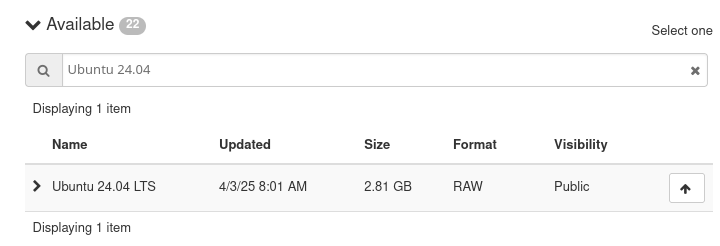
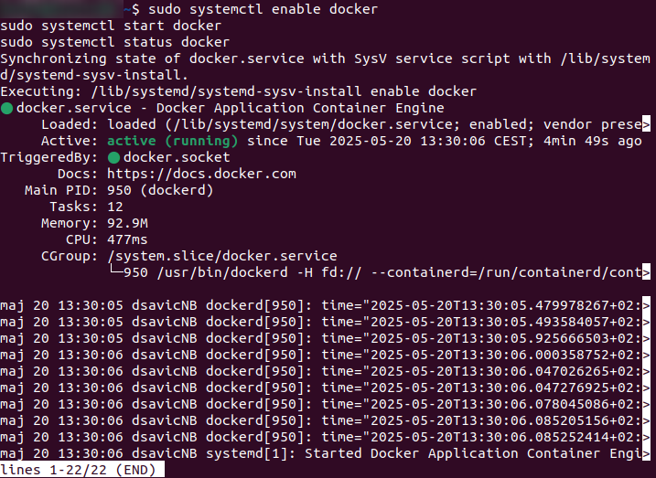
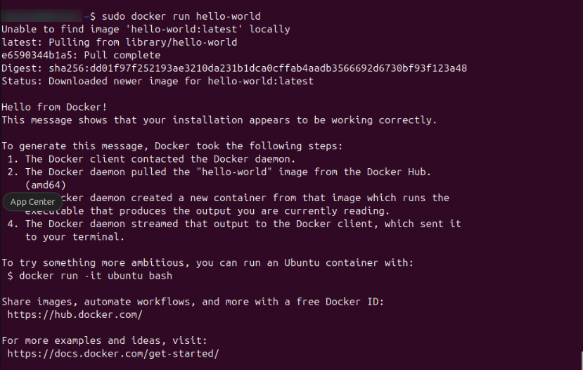
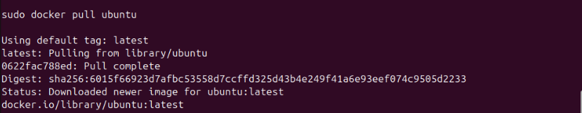
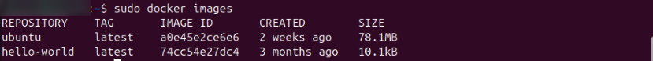
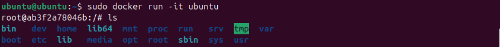

How to install and use Docker on Ubuntu 24.04
=====================================================================

This guide will walk you through

- the installation of `Docker <https://www.docker.com/>`_ on Ubuntu 24.04, and
- basic commands to get you started with Docker containers.

.. raw:: html

   <h2>What we are going to cover</h2>

.. contents::
   :depth: 2
   :local:
   :backlinks: none

Prerequisites
---------------------

Ensure your system meets the following requirements:

1. **Ubuntu 24.04.2 64-bit system**
2. **4 GB of RAM** (recommended for better performance)
3. **20 GB of free storage** (minimum for Docker and container images)
4. **Kernel version 3.10 or higher** (default for Ubuntu 24.04.2)
5. **Virtualization enabled** (if running in a virtualized environment like VMware or Hyper-V)
6. **Internet connection** for downloading packages
7. **Sudo privileges or root access**

If these prerequisites are valid, you will be able to install Docker on:

- a computer natively running Ubuntu 24.04
- a VM running on a local computer
- a VM running in the |brand-name| cloud

Prerequisites for the cloud version of Docker
^^^^^^^^^^^^^^^^^^^^^^^^^^^^^^^^^^^^^^^^^^^^^^^^^

No. 1 **Account**

To run Docker on a VM in the cloud, you need your own cloud account. See article: :doc:`/accountmanagement/Registration-And-Account`.

No. 2 **A VM running Ubuntu 24.04**

.. jinja:: brand_names

   Create a VM by following this or a similar article: :doc:`/cloud/How-to-create-a-Linux-VM-and-access-it-from-Linux-command-line-on-{{ brand_name_hyphen }}/How-to-create-a-Linux-VM-and-access-it-from-Linux-command-line-on-{{ brand_name_hyphen }}`

In the **Source** option, select *Ubuntu 24.04* and then "Ubuntu 24.04 LTS":

   Selecting Ubuntu 24.04 LTS

Choose a flavor such as **eo2a.large** or larger.

No. 3 **Is lsb_release running?**

The **lsb_release -cs** command returns the codename for your Ubuntu version. For Ubuntu 24.04, this is **noble**.

.. code-block:: console

   lsb_release -cs
   No LSB modules are available.
   noble

If the command is not available, install it using:

.. code-block:: console

   sudo apt install lsb-release

At the time of this writing, Docker does **not yet support the noble codename**. Instead, you must temporarily use **jammy** (Ubuntu 22.04 codename) when adding the repository.

Use the following script to detect the codename and substitute **jammy** if needed:

.. code-block:: bash

   # Get the Ubuntu codename
   CODENAME=$(lsb_release -cs)

   # Workaround: Docker does not yet support 'noble'
   if [ "$CODENAME" = "noble" ]; then
       CODENAME=jammy
   fi

   # Print it
   echo $CODENAME

When the Docker starts supporting **noble** codename directly, only the first command from above will be needed.

Environment variable **CODENAME** now contains a working value and we will use it in the command to install Docker (see below).

Before Docker installation
---------------------------

Update the system
^^^^^^^^^^^^^^^^^^^^^^

Make sure your system is up to date:

.. code-block:: console

   sudo apt update
   sudo apt upgrade -y

Install required dependencies
^^^^^^^^^^^^^^^^^^^^^^^^^^^^^^^^^^

Install the required packages before adding Docker’s repository:

.. code-block:: console

   sudo apt install apt-transport-https ca-certificates curl software-properties-common lsb-release -y

- **apt-transport-https**: Access repositories over HTTPS.
- **ca-certificates**: Validate SSL certificates.
- **curl**: Download Docker’s GPG key.
- **software-properties-common**: Manage external repositories.
- **lsb-release**: Detect the OS codename.

Add Docker’s GPG key
^^^^^^^^^^^^^^^^^^^^^^^^^^^^^^

Add Docker's GPG key to ensure the integrity of downloaded packages:

.. code-block:: console

   curl -fsSL https://download.docker.com/linux/ubuntu/gpg | sudo tee /etc/apt/trusted.gpg.d/docker.asc

Add Docker’s Official Repository
^^^^^^^^^^^^^^^^^^^^^^^^^^^^^^^^^^^^^^

Docker packages are distributed through codename-based repositories. We have captured the exact meaning $CODENAME so we now just use it. The following command creates a new repository file with Docker's package source:

.. code-block:: bash

   echo "deb [arch=amd64] https://download.docker.com/linux/ubuntu $CODENAME stable" | sudo tee /etc/apt/sources.list.d/docker.list

That command will save the required information into the **docker.list** and the following commands will read it from there.

Install Docker engine
----------------------

Now install Docker:

.. code-block:: console

   sudo apt update
   sudo apt install docker-ce docker-ce-cli containerd.io -y

- **docker-ce**: Docker Community Edition
- **docker-ce-cli**: Command-line interface
- **containerd.io**: Container runtime

Verify that Docker is installed and running
^^^^^^^^^^^^^^^^^^^^^^^^^^^^^^^^^^^^^^^^^^^^^^^^^

Enable and start Docker:

.. code-block:: console

   sudo systemctl enable docker
   sudo systemctl start docker
   sudo systemctl status docker

Press **Ctrl-C** to return to the prompt.

Verify Docker installation
^^^^^^^^^^^^^^^^^^^^^^^^^^^^^^^^^

Run a test container:

.. code-block:: console

   sudo docker run hello-world

This confirms Docker is correctly installed. If errors occur, read the message carefully—it often includes the fix.

Basic Docker commands
----------------------------

Downloading Docker Images
^^^^^^^^^^^^^^^^^^^^^^^^^^^^^^^^^^

There are hundreds of thousands of Docker images to download. For this example, we choose to download the latest image of Ubuntu operating system. The command is:

.. code-block:: console

   sudo docker pull ubuntu

To view downloaded images:

.. code-block:: console

   sudo docker images

This shows available local images:

Running Docker Containers
^^^^^^^^^^^^^^^^^^^^^^^^^^^^^^^^^^

You can run a container interactively. The actual commands will depend on the container downloaded; here, for Ubuntu image, we supply a command to start working within that Ubuntu container.

.. code-block:: console

   sudo docker run -it ubuntu

You now have a shell inside the container. The prompt for Ubuntu running inside a Docker container in our example is **root@ab3f2a78046b:/#** and it will, most probably, differ on your system.

Use commands like **ls** to explore the root directory. It will contain folders such as **bin**, **dev**, **home**, and other directories typical of a standard Ubuntu installation.

Managing Docker containers
^^^^^^^^^^^^^^^^^^^^^^^^^^^^^^^^^^

- **Create a container (but don't start it):**

  .. code-block:: console

     sudo docker create ubuntu

- **Start an existing container:**

  .. code-block:: console

     sudo docker start <container_id>

- **Enter a running container:**

  .. code-block:: console

     sudo docker exec -it <container_id> /bin/bash

- **Stop a running container:**

  .. code-block:: console

     sudo docker stop <container_id>

- **Remove a stopped container:**

  .. code-block:: console

     sudo docker rm <container_id>

Listing Docker containers
^^^^^^^^^^^^^^^^^^^^^^^^^^^^^^^^^^

- **List running containers:**

  .. code-block:: console

     sudo docker ps

- **List all containers (including stopped):**

  .. code-block:: console

     sudo docker ps -a

Other useful Docker commands
^^^^^^^^^^^^^^^^^^^^^^^^^^^^^^^^^^

- **Remove a Docker image:**

  .. code-block:: console

     sudo docker rmi <image_id>

- **List Docker volumes:**

  .. code-block:: console

     sudo docker volume ls

- **View container logs:**

  .. code-block:: console

     sudo docker logs <container_id>

Troubleshooting
----------------

If Docker commands fail with `permission denied`:

- Use `sudo`, or
- Add your user to the `docker` group:

  .. code-block:: console

     sudo usermod -aG docker $USER

  Then log out and log back in.

If `docker run hello-world` fails:

- Check if Docker is running:

  .. code-block:: console

     sudo systemctl status docker

- View logs:

  .. code-block:: console

     sudo journalctl -u docker

What To Do Next
-------------------

Here are some articles that build upon this tutorial:

.. jinja:: brand_names

   .. ifconfig:: brand_name not in brands_without_eodata

      :doc:`/kubernetes/CICD-pipelines-with-GitLab-on-{{ brand_name_hyphen }}-Kubernetes-building-a-Docker-image`

      :doc:`/kubernetes/Private-container-registries-with-Harbor-on-{{ brand_name_hyphen }}-Kubernetes`

      :doc:`/kubernetes/Install-and-run-Argo-Workflows-on-{{ brand_name_hyphen }}-Magnum-Kubernetes`

