How to Use GUI in Linux VM on |brand-name| and access it From Local Linux Computer
==================================================================================

In this article you will learn how to use GUI (graphical user interface) on a Linux virtual machine running on |brand-name| cloud.

For this purpose, you will install and use **X2Go** on your local Linux computer.

This article covers the installation of two desktop environments: MATE and XFCE. Choose the one that suits you best.

What We Are Going To Cover
--------------------------

 * Installing X2Go client
 * Installing X2Go server and desktop environment (MATE or XFCE)
 * Connecting to your virtual machine using X2Go client
 * Basic troubleshooting

Prerequisites
-------------

No. 1 **Account**

You need a |brand-name| hosting account with access to the Horizon interface: |brand-name-site-link|.

No. 2 **Linux installed on your local computer**

You need to have a local computer with Linux installed. This article was written for such computers running Ubuntu Desktop 22.04. If you are running a different Linux distribution, adjust the instructions from this article accordingly.

No. 3 **Linux virtual machine**

You need a Linux virtual machine running on |brand-name| cloud. You need to able to access it via SSH. The following article explains how to create one such virtual machine:

.. jinja:: brand_names

   :doc:`/cloud/How-to-create-a-Linux-VM-and-access-it-from-Linux-command-line-on-{{ brand_name_hyphen }}`

This article was written for virtual machines using a default Ubuntu 20.04 image on cloud. Adjust the instructions from this article accordingly if your virtual machine has a different Linux distribution.

Step 1: Install X2Go client
---------------------------

Open the terminal on your local Linux computer and update your packages by executing the following command:

.. code::

   sudo apt update && sudo apt upgrade

Now, install the **x2goclient** package:

.. code::

   sudo apt install x2goclient

Step 2: Install the desktop environment on your VM
--------------------------------------------------

Method 1: Installing MATE
^^^^^^^^^^^^^^^^^^^^^^^^^

Connect to your VM using SSH. Update your packages there:

.. code::

   sudo apt update && sudo apt upgrade

Now, install the **MATE** desktop environment and X2Go server:

.. code::

   sudo apt install x2goserver ubuntu-mate-desktop mate-applet-brisk-menu

You can add other packages to that command as needed.

During the installation you will be asked to choose the keyboard layout. Choose the one that suits you best using the arrow keys and Enter.

Once the installation is completed, reboot your VM by executing the following command:

.. code::

   sudo reboot

Method 2: Installing XFCE
^^^^^^^^^^^^^^^^^^^^^^^^^

Connect to your VM using SSH. Update your packages there:

.. code::

   sudo apt update && sudo apt upgrade

Now, install the **XFCE** desktop environment, the terminal emulator and X2Go server:

.. code::

   sudo apt install x2goserver xfce4 xfce4-terminal

You can add other packages to that command as needed.

During the installation you will be asked to choose the keyboard layout. Choose the one that suits you best using the arrow keys and Enter.

Once the installation is completed, reboot your VM by executing the following command:

.. code::

   sudo reboot

Step 3: Connect to your VM using X2Go
-------------------------------------

Open X2Go on your local Linux computer. If you haven't configured any session yet, you should get the window used for creating one:

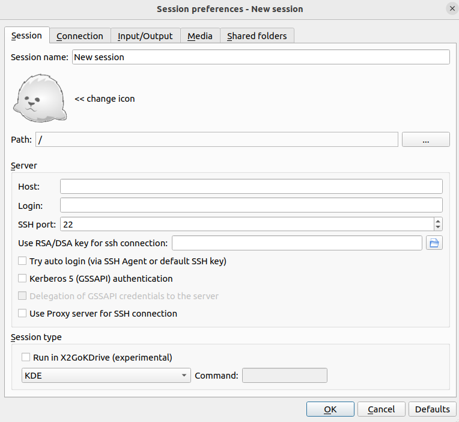

If you didn't get such window, click the **New session** button on the X2Go toolbar.

Enter the name of your choice for your session in the **Session name:** text box. In this example, the name **cloud-session** will be used.

In the text box **Host:** enter the floating IP of your VM.

In the **Login:** button enter **eouser**.

Click the folder icon next to the **Use RSA/DSA key for sh connection:** text field. A file selector should appear. Choose the SSH private file you use for connecting to your VM via SSH.

From the drop-down menu in the **Session type** section choose the desktop environment you installed, for example **MATE** or **XFCE**.

In the **Input/Output** tab choose the screen resolution that suits you best in the **Display** section. Here you can also choose whether you wish to share clipboard with the remote VM in the **Clipboard mode** section.

Click **OK**. The window should close.

The session you created should now be visible in the X2Go client:

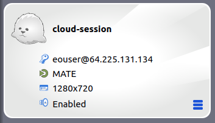

Click the name of your session to connect to your VM. Wait up to a minute until your connection is established. You should now see your desktop environment.

If you chose MATE, it should look like this:

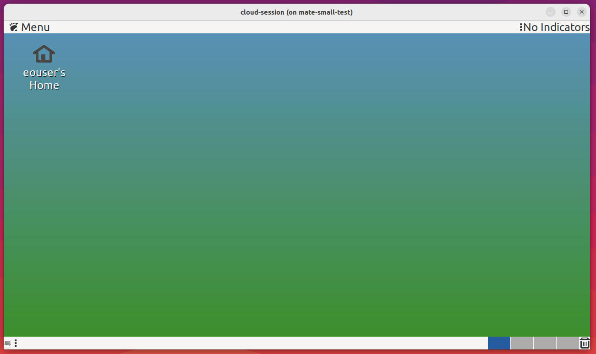

If you, however, chose XFCE, it should look like this:

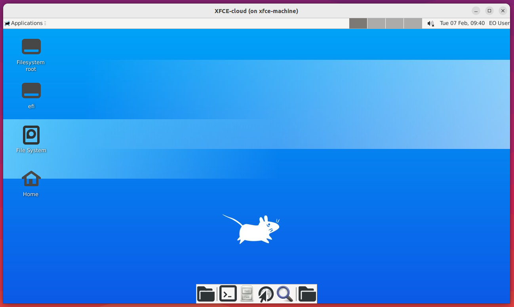

Troubleshooting - Using the terminal emulator on XFCE
-----------------------------------------------------

If the button **Terminal Emulator** on your taskbar does not launch your terminal, click the **Applications** menu in the upper left corner of the screen:

Choose **Settings** -> **Preferred Applications**:

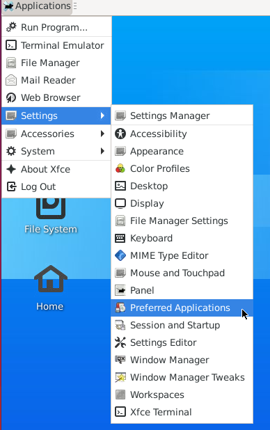

You should get the following window:

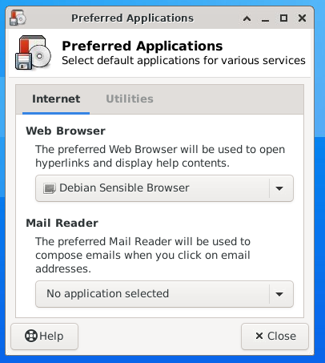

Open the tab **Utilities**. The window should now look like this:

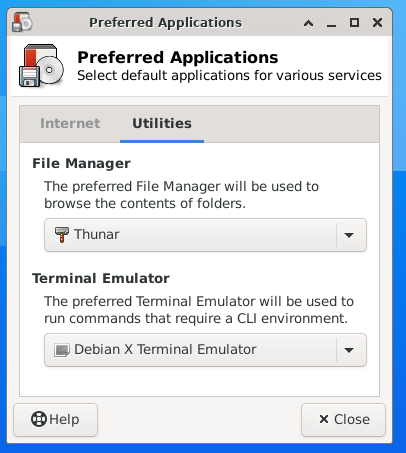

From the drop-down menu in the **Terminal Emulator** section choose **Xfce Terminal**.

Click **Close**.

The button should now launch the terminal emulator correctly.

Troubleshooting - Keyboard layout
---------------------------------

If you discover that the system does not use the keyboard layout you chose during the installation of the desktop environment, you will need to set it manually. The process differs depending on the desktop environment you chose.

MATE
^^^^

Click the **Menu** in the upper left corner of the screen:

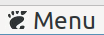

From the **Preferences** section choose **Keyboard**:

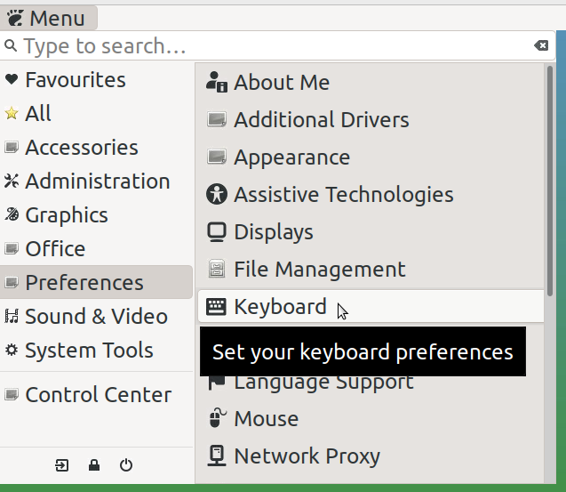

You should get the following window:

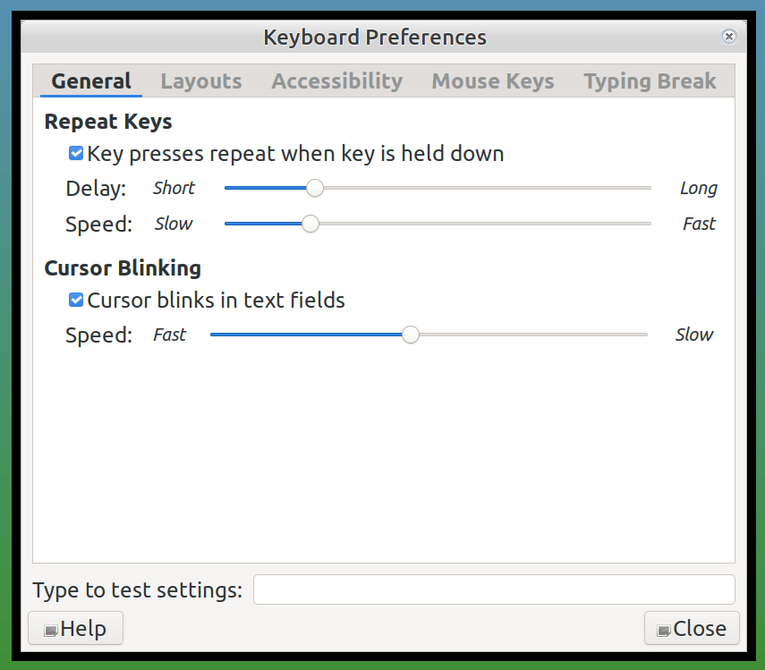

Navigate to the **Layouts** tab:

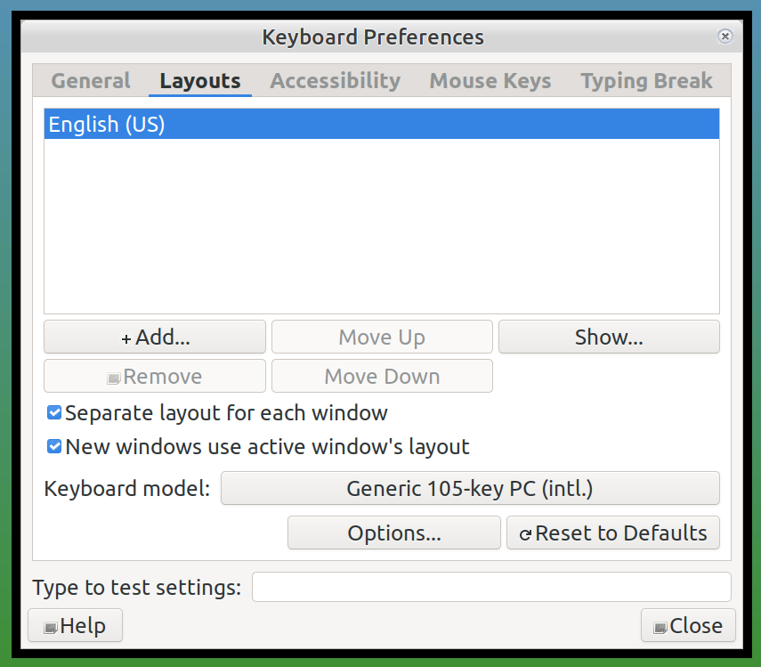

Here, you can add or remove keyboard layouts depending on your needs.

XFCE
^^^^

From the **Applications** menu in the upper left corner of the screen choose **Settings** -> **Keyboard**. You should get the following window:

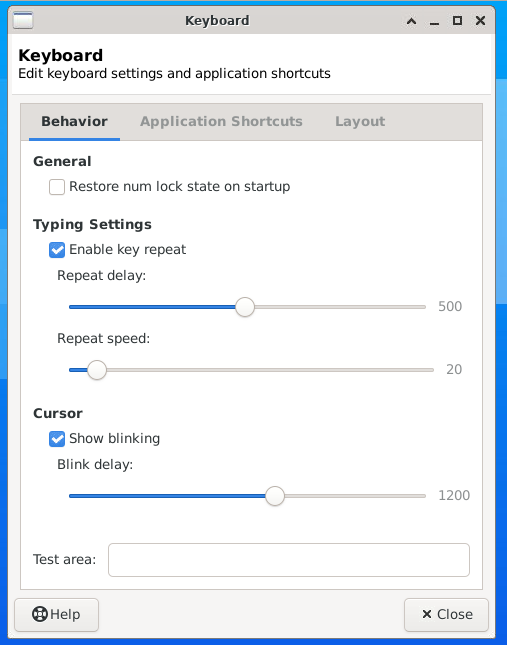

Go to the **Layout** tab:

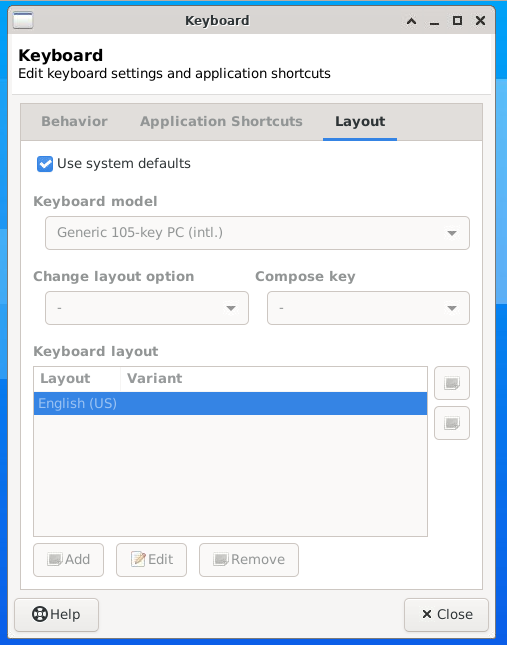

Unselect the **Use system defaults** check box. You can now add or remove the keyboard layouts depending on your needs.