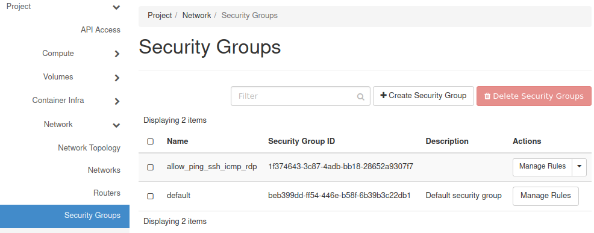
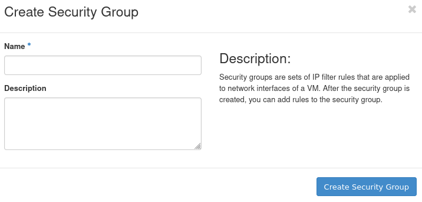
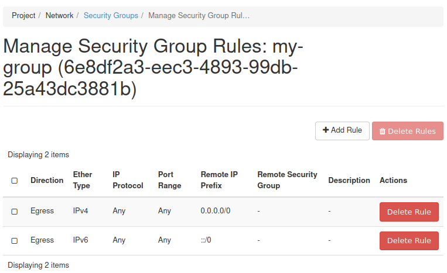
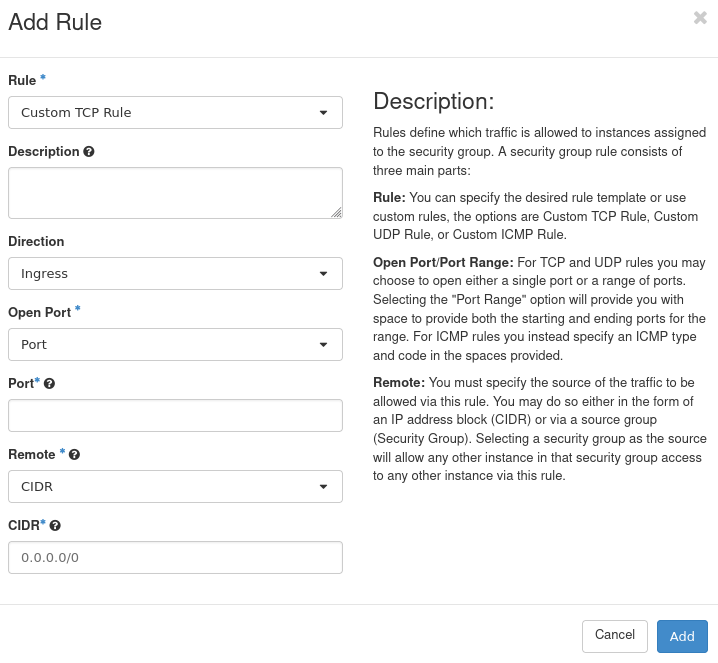
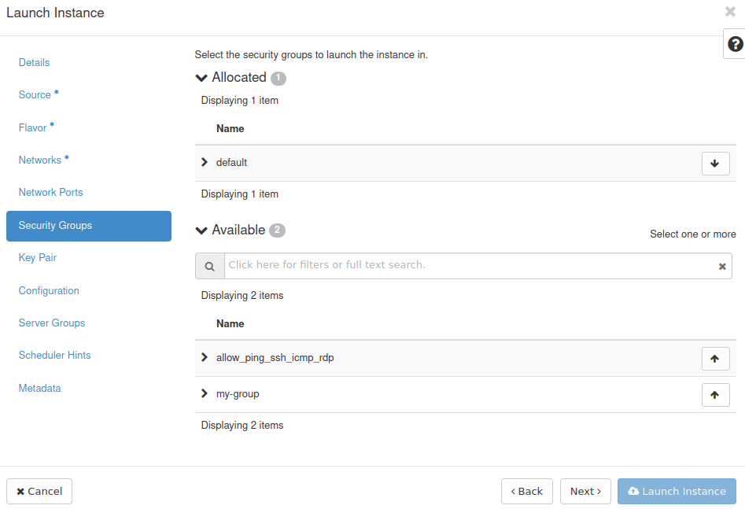
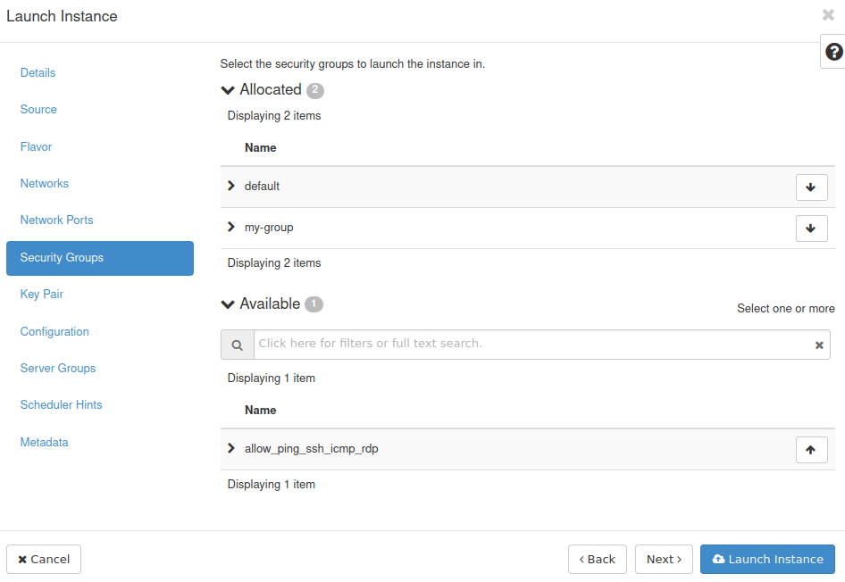
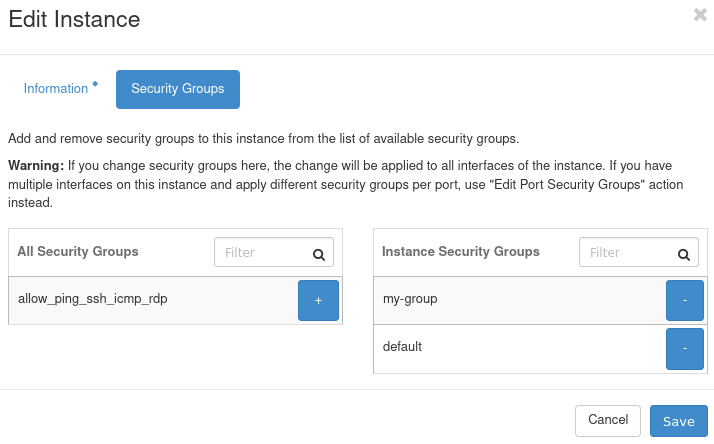

How to use Security Groups in Horizon on |brand-name|
=====================================================

Security groups in **OpenStack** are used to filter the Internet traffic coming **to** and **from** your virtual machines. They consist of security rules and can be attached to your virtual machines during and after the creation of the machines.

By default, each instance has a rule which blocks all incoming Internet traffic and allows all outgoing traffic. To modify those settings, you can apply other security groups to it.

Viewing the security groups
---------------------------

To check your current security groups, please follow these steps:

Log in to your |brand-name| account: |brand-name-site-link|.

In the panel on the left choose **Network** and then **Security Groups**.

You will see the list of your security groups there. The following groups should always be present:

 * **default** which blocks all incoming traffic and allows all outgoing traffic.
 * **allow_ping_ssh_rdp** which allows incoming ping, SSH (port 22) and RDP (port 3389) connections. This group is not attached to your VMs by default.

Creating a new security group
-----------------------------

In order to create a new security group, please follow these steps:

Click the **Create Security Group** button.

The following window should appear:

Give your security group a recognizable name in the **Name** text field. Optionally, you can also provide a description of it in the **Description** text field.

Confirm your choices by clicking the **Create Security Group** button.

You should now be taken to the screen which allows you to modify the security rules of that security group - in our case the group is called **my-group**:

.. note::

   If you want to access that screen later, you can click the **Manage Rules** button next to your security group in the **Security Groups** screen.

By default, your new security group should contain two rules seen on the screenshot above - the first one allows all outgoing traffic on IPv4 and the second one allows all outgoing traffic on IPv6.

Adding security rules to a security group
-----------------------------------------

In the **Manage Security Rules** screen that you entered in the previous step, click the **Add Rule** button.

The following form will appear. In it you can define the security rule:

The drop-down list **Rule** allows you to choose the type of rule. These types, along with the available options for them, are explained below. Once you have finished, click **Add** to finish creating your rule.

**Custom TCP Rule**

This type of rule allows you to create a custom rule for the TCP protocol. This protocol is commonly used, amongst other things, for interacting with websites.

You can optionally provide the description of that rule in the **Description** text field.

The drop-down list **Direction** allows you to choose whether this rule should apply to incoming (**Ingress**) or outgoing (**Egress**) traffic.

The drop-down list **Port** has the following options:

 * If you choose **Port**, you will get the text field **Port** in which you can input one port for which this rule will apply.
 * If you choose **Port Range**, you will be able to enter the first port in range in the text field **From Port** and the last port in the text field **To Port**.
 * If you choose **All ports**, this rule will apply to all ports.

The drop-down list **Remote** has the following options:

 * If you choose **CIDR**, you will get the text field **CIDR** which allows you to input the IP address block for which this rule will apply using the CIDR notation, for example: **64.225.135.119/32**. This example means that only the **64.225.135.119** IP address is included in this rule. If this notation was as follows: **64.225.135.119/8**, then this rule would apply to all IP addresses that have the first digit **64**.
 * If you choose **Security Group**, you will get the drop-down list **Security Group** - the machines which are in that security group will be able to access your virtual machine. You will also get the drop-down list **Ether Type** from which you can choose IPv4 or IPv6. You should almost always use IPv4 for your network operations (apart from a few rare instances in which you know that IPv6 is needed).

**Custom UDP Rule**

This type of rule has the same options as **Custom TCP Rule**, but involves the UDP protocol. It is a protocol similar to TCP, but the main difference is that it does not provide session control.

**Custom ICMP rule**

This type of rule is used for ICMP. This protocol is used, among others, for **traceroute** and **ping**. It has the same options as the **Custom TCP Rule**, but instead of ports, it uses the ICMP types (which you should put in the **Type** text field) and ICMP codes (which should be put in the **Code** text field).

**Other Protocol**

This option is for protocols like for example SIP (protocol used for Internet telephony).

**All ICMP**, **All TCP**, **All UDP**

These options apply to all ports of ICMP, TCP and UPD, respectively.

**Other options**

The drop-down list **Rule** also contains templates for commonly used services like DNS (Domain Name Services), HTTP (Hypertext Transfer Protocol) or SMTP (Simple Mail Transfer Protocol). If you choose one of them, you only have to provide the information about the **Remote** - **CIDR** or **Security Group**. The explanation for those options is in the **Custom TCP Rule** section.

Adding a Security Group to your VM
----------------------------------

You can apply your security group to your VM either during or after creating it.

During its creation
^^^^^^^^^^^^^^^^^^^

During the process of creating your virtual machine you can add security groups to it. This happens during the **Security Groups** step:

You can add security groups to your VM by using the **↑** button an remove them using the **↓** button - the same as in the **Source** or **Network** steps. In this case, we have added the **my-group** group to the VM:

After its creation
^^^^^^^^^^^^^^^^^^

Go to **Compute** > **Instances**. Click the drop-down menu in the row containing information about the to which you wish to apply your rule (column **Actions**). Select **Edit Security Groups**. You should see the window similar to this:

In the left section you can see available security groups and in the right section you can see security groups already attached to your VM. To apply a security group to your VM, click the **+** button next to that group and to remove it, click the **-** button next to it.