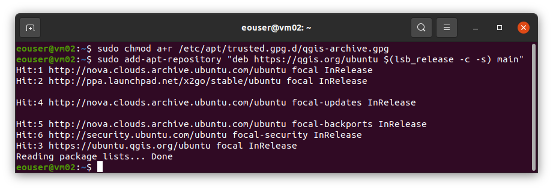
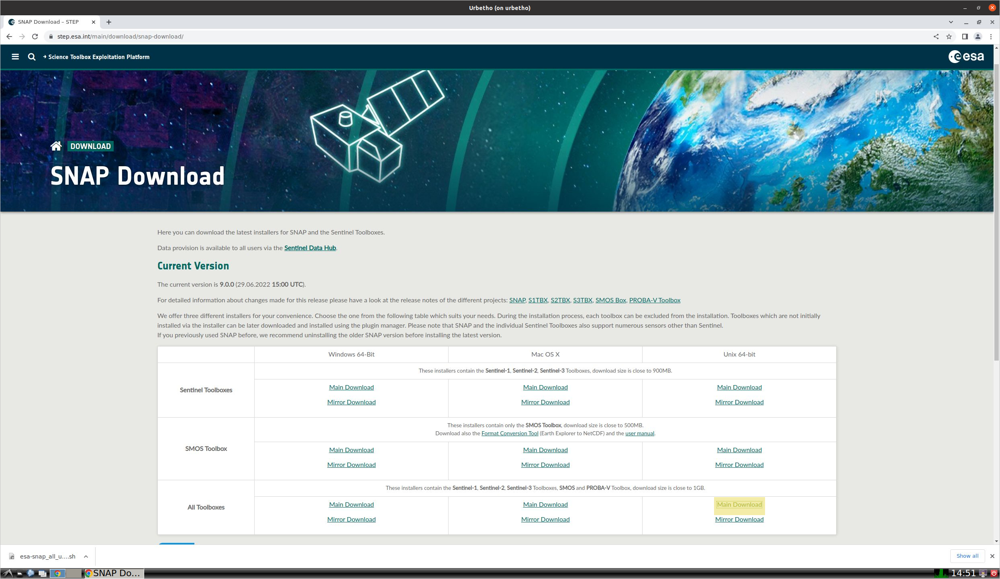
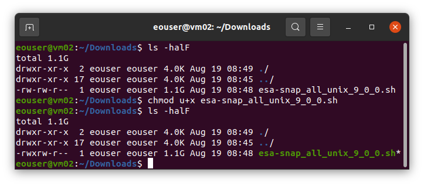
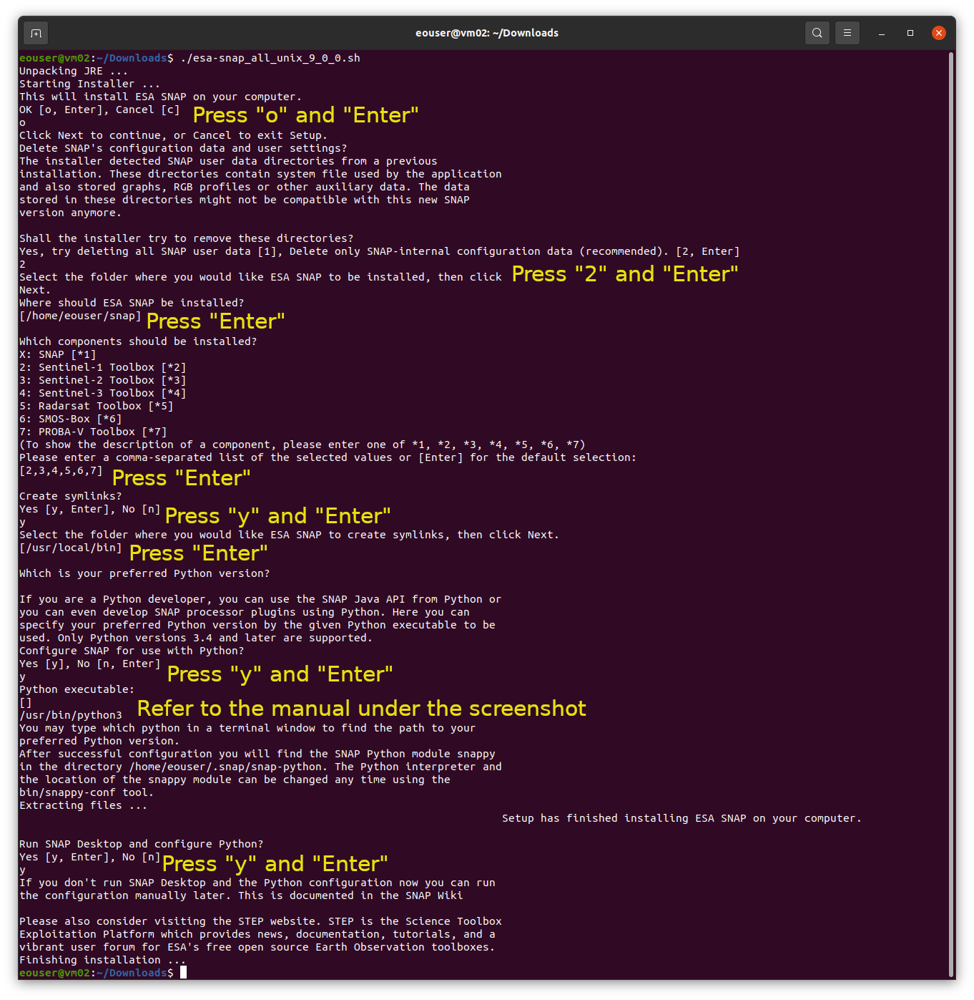

Installation of required tools on Urbetho VM SNAP and QGIS on |brand-name|
============================================================================

**Prerequisites:**

a) A Linux virtual machine with browser(in this case Ubuntu 20.04 LTS)

b) Installed GUI of your choice (in this case LXDE)

.. jinja:: brand_names

   c) Installed x2go service :doc:`/windows/How-to-connect-to-a-virtual-machine-via-SSH-from-Windows-10-Command-Prompt-on-{{ brand_name_hyphen }}/How-to-connect-to-a-virtual-machine-via-SSH-from-Windows-10-Command-Prompt-on-{{ brand_name_hyphen }}`.

**QGIS installation**

Here we will simply install the latest stable QGIS (3.26.x Buenos Aires) without having to edit config files.

.. jinja:: brand_names

   Follow this link :doc:`/windows/How-to-connect-to-a-virtual-machine-via-SSH-from-Windows-10-Command-Prompt-on-{{ brand_name_hyphen }}/How-to-connect-to-a-virtual-machine-via-SSH-from-Windows-10-Command-Prompt-on-{{ brand_name_hyphen }}` to check the latest stable QGIS releases.

First of all, log into your VM via SSH and install some tools you will need later on with the following command:

.. code::

   sudo apt update && apt upgrade
   sudo apt install gnupg software-properties-common

Now install the QGIS Signing Key, so QGIS software from the QGIS repo will be trusted and installed:

.. code::

   wget -qO - https://qgis.org/downloads/qgis-2021.gpg.key | sudo gpg --no-default-keyring --keyring gnupg-ring:/etc/apt/trusted.gpg.d/qgis-archive.gpg --import
   sudo chmod a+r /etc/apt/trusted.gpg.d/qgis-archive.gpg

Add the QGIS repo for the latest stable QGIS (3.26.x Buenos Aires).

Note: **lsb_release -c -s** in those lines will return your distro name:

.. code::

   sudo add-apt-repository "deb https://qgis.org/ubuntu $(lsb_release -c -s) main"

Update your repository information to reflect also the just added QGIS one:

.. code::

   sudo apt update

Now, install QGIS:

.. code::

   sudo apt install qgis qgis-plugin-grass

**SNAP installation**

Open the `link <https://step.esa.int/main/download/snap-download/>`_ from your virtual machine and select "Main download" for "All toolboxes" and "Unix 64-bit" from the table.

Next, switch to your terminal with an opened SSH session and go to your downloads catalog to add execute permission of downloaded file:

.. code::

   cd Downloads
   chmod u+x <downloaded file name>

Execute downloaded file:

.. code::

   ./<downloaded file name>

After "Python executable:" line, open new terminal window and check your python 3 path (by default "/usr/bin/python3")

.. code::

   which python3

Copy and paste it into the SNAP installation terminal, click "Enter".

Follow the rest of the installation process accordingly to the screenshot above.

That's it!

You've successfully installed QGIS and SNAP components:)
