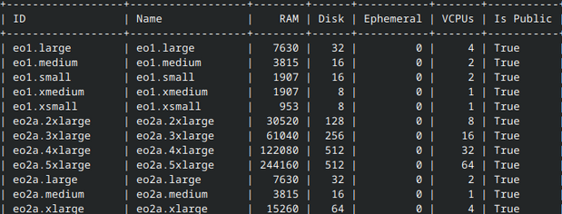

Introduction to IPv6 on |brand-name|
====================================================

IPv6 is the latest version of the Internet Protocol that provides a vastly expanded number of IP addresses compared to the current IPv4 system. This expansion is crucial for accommodating the exponential increase in devices connecting to the Internet. IPv6 is useful for

 * expansion of IoT (Internet of Things)
 * expansion of 5G and beyond
 * removal of address exhaustion for IPv4 addresses
 * cloud computing, multi-cloud networks
 * enhancement of network security
 * improvements in mobile experience
 * enabling larger home and enterprise networks

and so on.

What We Are Going To Cover
------------------------------

 * Some IPv6 use cases -- a technical overview

   * Private networks
   * Public networks
   * Single/Dual stack
   * Security groups
   * Address assignment

 * Load balancers & dual stack

 * Configuring External Network Access for IPv6

 * Creation of IPv6 network with router

   * Prerequisites
   * Step 1 Network Creation
   * Step 2 Subnet Creation
   * Step 3 Router Deployment
   * Step 4 Configuring External Gateway for Router
   * Step 5 Subnet Integration with Router

 * Important Considerations

Prerequisites
^^^^^^^^^^^^^^^^^^^^^^^^

No. 1 **Account**

You need a |brand-name| hosting account with access to the Horizon interface: |brand-name-site-link|.

No. 2 **OpenStack CLI client**

If you want to interact with |brand-name| cloud using OpenStack CLI client, you need to have it installed. Check one of these articles:

.. jinja:: brand_names

    * :doc:`/openstackcli/How-to-install-OpenStackClient-for-Linux-on-{{ brand_name_hyphen }}/How-to-install-OpenStackClient-for-Linux-on-{{ brand_name_hyphen }}`

    * :doc:`/openstackcli/How-to-install-OpenStackClient-GitBash-or-Cygwin-for-Windows-on-{{ brand_name_hyphen }}/How-to-install-OpenStackClient-GitBash-or-Cygwin-for-Windows-on-{{ brand_name_hyphen }}`

    * :doc:`/openstackcli/How-to-install-OpenStackClient-on-Windows-using-Windows-Subsystem-for-Linux-on-{{ brand_name_hyphen }}-OpenStack-Hosting/How-to-install-OpenStackClient-on-Windows-using-Windows-Subsystem-for-Linux-on-{{ brand_name_hyphen }}-OpenStack-Hosting`

.. ifconfig:: brand_name in two_fa_activated

    .. jinja:: brand_names

       Once you have installed this piece of software, you need to authenticate to start using it:
  .. jinja:: doc_links

     :doc:`{{ openstack_cli_auth }}`

.. ifconfig:: brand_name not in two_fa_activated

    .. ifconfig:: brand_name != 'WEkEO'

       .. jinja:: brand_names

          Once you have installed this piece of software, you need to authenticate to start using it: :doc:`/accountmanagement/How-to-activate-OpenStack-CLI-access-to-{{ brand_name_hyphen }}-cloud/How-to-activate-OpenStack-CLI-access-to-{{ brand_name_hyphen }}-cloud`

    .. ifconfig:: brand_name == 'WEkEO'

       Once you have installed this piece of software, you need to authenticate to start using it: :doc:`/accountmanagement/How-to-activate-OpenStack-CLI-access-to-WEkEO-cloud-using-Federated-IDP-authorization-and-application-credentials`

To test whether the **openstack** command is working, list flavors:

.. code-block:: console

   openstack flavor list

If you get a list of flavors that starts out like this:

you will know it all works.

Some IPv6 use cases -- a technical overview
---------------------------------------------------------

Any network, including pre-created tenant networks, can have an IPv6 subnet attached just as an IPv4 subnet would be.

Private networks
^^^^^^^^^^^^^^^^^^^^^^^^

.. role:: under

The private IPv6 address range spans from **fc00::/7**, making any /64 subnet within this range not only an excellent choice but also the most recommended option for local network prefixes.

For example, a network can be configured with a mnemonic address like :under:`fc00:abcd:1234:1::/64`. Typically, the network gateway is located at the first address of the subnet, (at  **:1**), and it is crucial to keep this gateway active to support any form of automatic address assignment, such as SLAAC.

Although it is possible to use other IPv6 prefixes, including publicly routable ones, within private networks, these addresses will not be visible from the Internet. As a result, a private IPv6 network will not have any internet access.

Public networks
^^^^^^^^^^^^^^^^^^^^^^^^

To establish a public IPv6 network, utilize addresses from the provided subnet pool, which can be selected either through the Horizon interface or via the :under:`-\-subnet-pool` option in the command-line interface (CLI).

After selecting the appropriate subnet, create a tenant network and connect it to a router
that has a gateway in one of our external networks.

It is important to note that **all IPv6 networks with internet access are publicly visible**. Therefore, avoid connecting servers with permissive access groups to public networks unless necessary.

Single/Dual stack
^^^^^^^^^^^^^^^^^^^^^^^^

Although single stack IPv6 is supported, it is recommended to attach an IPv4 network during the setup and throughout the lifecycle of a virtual machine.

This ensures compatibility and allows services like cloud-init to function correctly.

Security groups
^^^^^^^^^^^^^^^^^^^^^^^^

IPv6 security groups are fully supported but require additional rules compared to IPv4, including the "**Any host**" rule set to **::/0** to encompass all IPv6 addresses.

When adding interfaces to a server, be mindful of the security groups assigned to each port, as a new port may not inherit all the security groups from the server.

Address assignment
^^^^^^^^^^^^^^^^^^^^^^^^

The recommended setting for address assignment is SLAAC using the EUI-64 format. This setting :under:`MUST` be explicitly configured otherwise, it will default to "**None**".

There are following modes available:

SLAAC (eui-64) RECOMMENDED
   The gateway router sends RA containing network prefix so the VMs can statelessly compute their addresses with eui-64 algorithm.

   It is important to note that any other algorithm or a privacy extension of eui-64 will break the functionality - it needs to be exactly eui-64 no privacy.

SLAAC(external)
   Exists for specific use cases outside the scope of this document.

DHCPv6 stateful
   Classic DHCP, unsupported in many images as a default option.

DHCPv6 stateless
   A mix of SLAAC and DHCP - router provides prefix, DHCP provides extended options like DNS.

Load balancers & dual stack
-----------------------------------

Load balancers in OpenStack, cannot support dual-stack Virtual IPs on a single instance. If IPv4 and IPv6 frontends are needed, two separate load balancers are required, each connected to its respective subnet. Additionally, in dual-stack networks, load balancers can handle pool members using both IPv4 and IPv6. They can also include pool members from external networks that are routable.

Configuring External Network Access for IPv6
-----------------------------------------------------

Below is a step-by-step guide on how to configure external access for IPv6 networks using OpenStack:

Step 1.
   Verify that the *neutron-server* has all the necessary patches applied to support IPv6 functionalities.

Step 2.
   Establish the IPv6 subnet as the primary subnet in the external network range. This subnet will handle the external IPv6 traffic, providing a gateway to the internet. Use the following command to create the subnet:

    .. code::

       openstack subnet create \
       --network external \
       --tag external \
       --subnet-pool external-ipv6-pool \
       --gateway "<addr>::1" \
       --dhcp --ip-version 6 \
       --ipv6-ra-mode slaac \
       --ipv6-address-mode \
       slaac external-ipv6

Step 3.
   Add an IPv6 Subnet Pool. Setting up a subnet pool is essential for managing the allocation of IPv6 addresses within your external network.

    .. code::

       openstack subnet pool create \
       --pool-prefix "<addr>::/48" \
       --min-prefix-length 64 \
       --max-prefix-length 64 \
       --default --share \
       --description "GUA public IPv6 adresses" \
       external-ipv6-pool

Creation of IPv6 network with router
-----------------------------------------------

Step 1 Network Creation
^^^^^^^^^^^^^^^^^^^^^^^^

Initiate the creation of a network by executing the following command:

.. code::

   openstack network create ipv6-network

Step 2 Subnet Creation
^^^^^^^^^^^^^^^^^^^^^^^^

Set the subnet configuration to determine the address allocation for your network.

.. code::

   openstack subnet create \
   --ip-version 6 \
   --ipv6-ra-mode slaac \
   --ipv6-address-mode slaac \
   --use-default-subnet-pool \
   --network ipv6-network \
   ipv6-subnet

Step 3 Router Deployment
^^^^^^^^^^^^^^^^^^^^^^^^^^^^^^^^^^^^^^^^^^^^^^^^^^^^^^^^^

Enable routing capabilities within your network infrastructure to foster communication between subnets.

.. code::

   openstack router create router1

Step 4 Configuring External Gateway for Router
^^^^^^^^^^^^^^^^^^^^^^^^^^^^^^^^^^^^^^^^^^^^^^^^^^^^^^^^^

Configure the router to connect to an external network, granting access beyond your local environment.

.. code::

   openstack router set router1 --external-gateway external

Step 5 Subnet Integration with Router
^^^^^^^^^^^^^^^^^^^^^^^^^^^^^^^^^^^^^^^^^^^^^^^^^^^^^^^^^

Integrate the newly created subnet with the router to ensure seamless device communication across the network.

.. code::

   openstack router add subnet router1 ipv6-subnet

After finishing the outlined steps, the results can now be viewed using the Horizon interface.

.. image:: image_2024-04-24-15-13-21.png

Important Considerations
------------------------------------

Before proceeding with the implementation, it is crucial to note the following:

#. **HTTP(s) Addresses:**
   Ensure that IPv6 addresses used in URLs are enclosed in square brackets to distinguish between the address and the port number.

   .. code::

      http://[fd00:dead:beef:64:34::2]:80

#. **Link-Local Addresses:**
   Every interface in an IPv6 network is automatically assigned a link-local address. These addresses are crucial for local communication, and it's important to specify the interface when using them to ensure clear and targeted network interactions. Example:

   .. code::

      fe80::a9fe:a9fe%eth0

#. **Private Range:**
   The private range for IPv6 is **fc00::/7**.

#. **Link-Local Address:**
   The link-local address (fe80::) is crucial for IPv6 protocol functionality and is always present on network interfaces.

#. **Network Subnetting:**
   Use /64 networks for your subnets unless you have a compelling reason not to do so. This standardization ensures proper IPv6 functionality and compatibility.

#. **SLAAC Configuration:**
   EUI64 without privacy extensions is endorsed in our SLAAC. Any other method would not work, as the address must be the same as the one Openstack shows in server show. This is due to port security.

#. **Port Security and Metadata6 Service:**
   Disabling port security can disrupt the Metadata6 service. This service listens on the link-local address :under:`fe80::a9fe:a9fe%interface`, requiring a specific interface pointing. It is essential for cloud-init OpenStack source compatibility, although it does not function for EC2 source.

#. **DNS Configuration:**
   In single-stack IPv6 implementations, manual DNS configuration for instances is necessary to ensure proper name resolution.

#. **Dual-Stack Recommendation:**
   We highly recommend dual-stack implementations, even with a stub IPv4 private subnet. Dual-stack offers simplicity in configuration and ensures compatibility with various image types.

#. **Default Security Groups:**
   At present, default security groups do not allow incoming IPv6 traffic. Ensure that IPv6 traffic requirements are accommodated properly.
