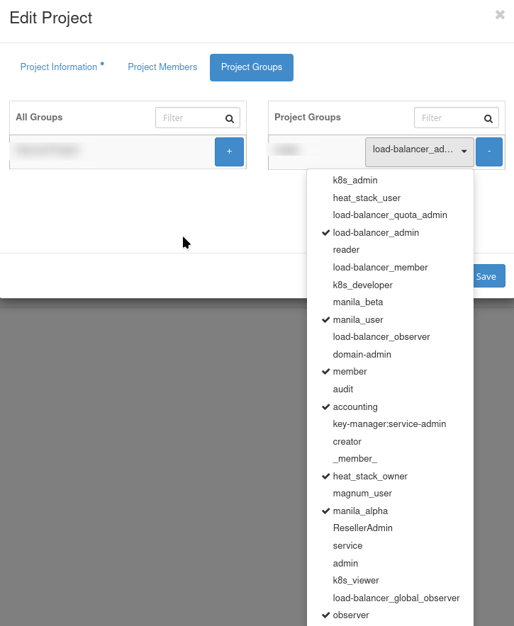
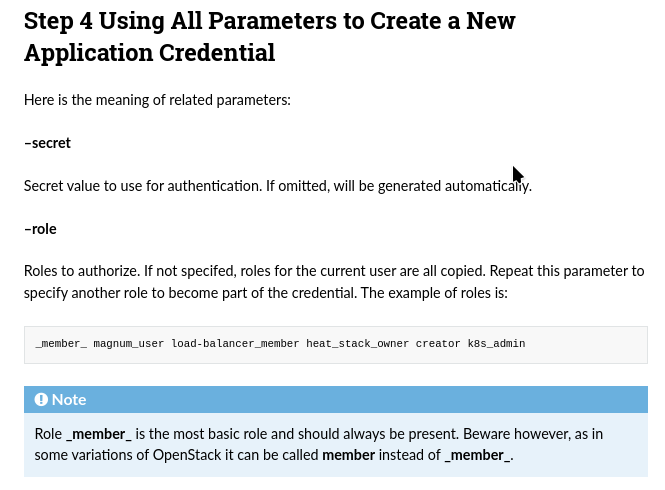
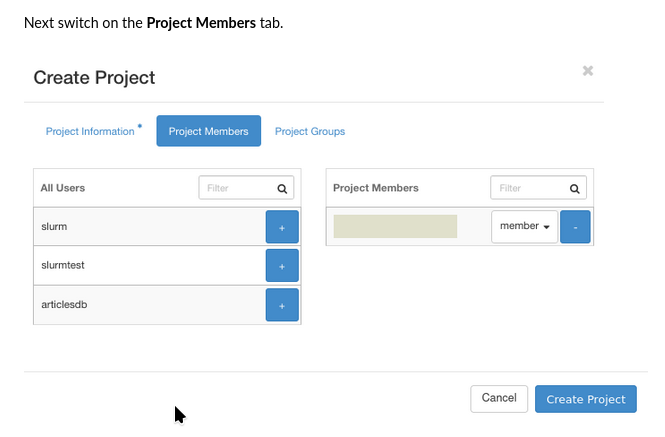
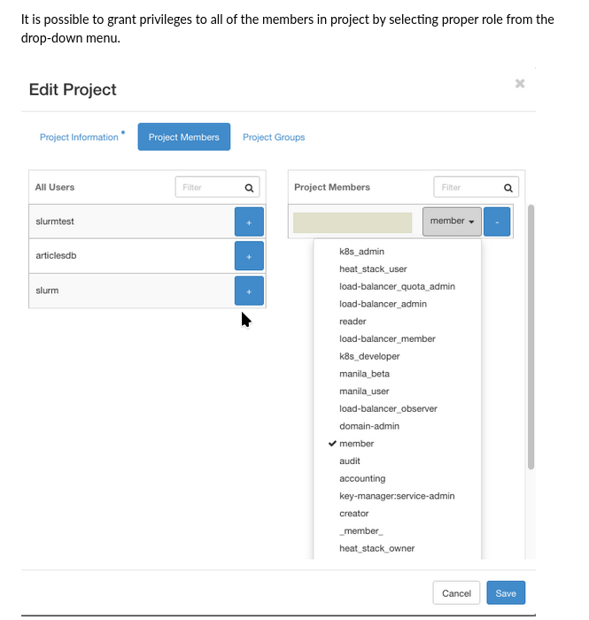
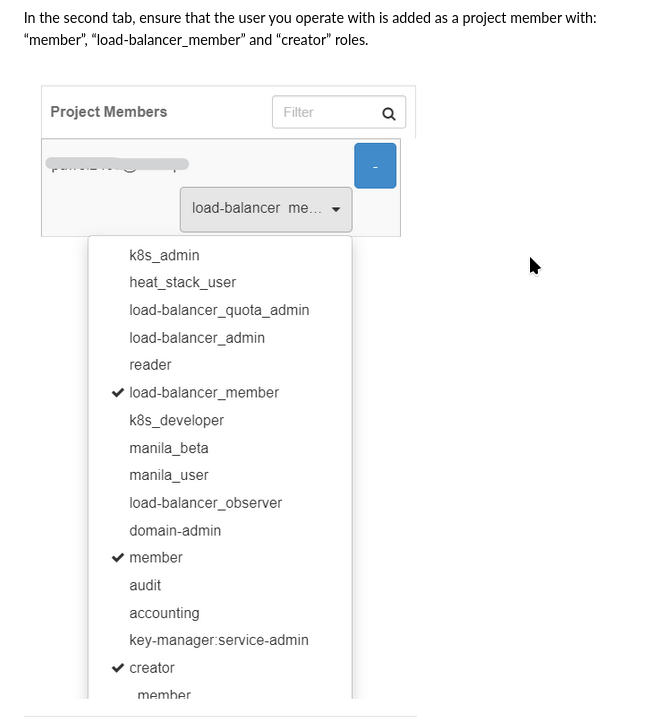

OpenStack User Roles on |brand-name|
==================================================

A **user role** in OpenStack cloud is a set of permissions that govern how members of specific groups interact with system resources, their access scope, and capabilities.

This guide simplifies OpenStack roles for casual users of |brand-name| VMs. It focuses on practical use cases and commonly required roles.

What We Are Going To Cover
------------------------------

 * Frequently used user roles

  * Common user roles
  * Roles for Kubernetes users
  * Roles for Load Balancer users

 * Examples of using user roles

  * Using user roles while creating application credential in Horizon
  * Using user roles while creating application credential via the CLI
  * Using user roles while creating a new project
  * Using member role only while creating a new user

 * Dictionary of other roles

Prerequisites
------------------------

**1. Account**

You need a |brand-name| hosting account with Horizon access: |brand-name-site-link|.

Also see:

.. jinja:: brand_names

   :doc:`/cloud/What-is-an-OpenStack-project-on-{{ brand_name_hyphen }}/What-is-an-OpenStack-project-on-{{ brand_name_hyphen }}`

   :doc:`/cloud/What-is-an-OpenStack-domain-on-{{ brand_name_hyphen }}/What-is-an-OpenStack-domain-on-{{ brand_name_hyphen }}`

   :doc:`/cloud/How-to-generate-or-use-Application-Credentials-via-CLI-on-{{ brand_name_hyphen }}/How-to-generate-or-use-Application-Credentials-via-CLI-on-{{ brand_name_hyphen }}`

**2. Familiarity with OpenStack Commands**

Ensure you know the following OpenStack commands:

.. jinja:: brand_names

   **openstack**
      The primary CLI for interacting with OpenStack services.
      :doc:`/openstackcli/How-to-install-OpenStackClient-for-Linux-on-{{ brand_name_hyphen }}/How-to-install-OpenStackClient-for-Linux-on-{{ brand_name_hyphen }}`

   **kubectl**
      CLI for Kubernetes clusters. Example article:

      :doc:`/kubernetes/How-To-Access-Kubernetes-Cluster-Post-Deployment-Using-Kubectl-On-{{ brand_name_hyphen }}-OpenStack-Magnum`

Frequently used user roles
---------------------------------

Common user roles
^^^^^^^^^^^^^^^^^^^^^^^^^^^^^^^^^^^^^^

**member**
   Grants standard access to project resources.

   .. note::
      Older OpenStack versions may use **_member_**. If both **member** and **_member_** exist, choose **member**.

   - Horizon: **Project** -> **Overview**
   - CLI: **openstack server list**, **openstack project list**

**observer**
   Read-only access for monitoring and auditing resources. Suitable for third-party tools like Prometheus or Grafana.

   - Horizon: **Project** -> **Overview**
   - CLI: **openstack server show**, **openstack project show**

**reader**
   Read-only access with slightly broader permissions than **observer**. Ideal for monitoring and analytics tools requiring detailed resource data.

   - Horizon: **Project** -> **Overview**
   - CLI: **openstack server list**, **openstack project list**

Roles for Kubernetes users
^^^^^^^^^^^^^^^^^^^^^^^^^^^^^^^^^^^^^^

**k8s_admin**
   Administrative access to manage Kubernetes clusters and resources.

   - Horizon: **Kubernetes** -> **Clusters**
   - CLI: **kubectl create deployment**, **kubectl get pods**

**k8s_developer**
   For developers deploying applications within Kubernetes.

   - Horizon: **Kubernetes** -> **Workloads**
   - CLI: **kubectl create**, **kubectl apply**

**k8s_viewer**
   Read-only access to monitor Kubernetes resources.

   - Horizon: **Kubernetes** -> **Overview**
   - CLI: **kubectl get pods**, **kubectl describe pod**

Roles for Load Balancer users
^^^^^^^^^^^^^^^^^^^^^^^^^^^^^^^^^^^^^^

**load-balancer_member**
   Grants access to deploy applications behind load balancers.

   - Horizon: **Network** -> **Load Balancers**
   - CLI: **openstack loadbalancer member create**, **openstack loadbalancer member list**

**load-balancer_observer**
   Read-only access to monitor load balancer configurations.

   - Horizon: **Network** -> **Load Balancers**
   - CLI: **openstack loadbalancer show**, **openstack loadbalancer stats show**

How to View Roles in Horizon
-------------------------------------

You can view roles in Horizon by navigating to **Identity** -> **Roles**.

========================================= =========================================
.. figure:: user-roles-list-2.png           .. figure:: user-roles-list-1.png
========================================= =========================================

Assigning multiple roles is best done during project creation rather than user creation.

Examples of using user roles
---------------------------------------------------

The following articles, as one of many steps, describe how to assign a role to the new project, credential, user or group.

.. ifconfig:: brand_name not in brands_without_eodata

   Example: Using user roles while creating application credential in Horizon
   ^^^^^^^^^^^^^^^^^^^^^^^^^^^^^^^^^^^^^^^^^^^^^^^^^^^^^^^^^^^^^^^^^^^^^^^^^^^^^^^^^^^^^^^^^^^^^^^^

   Normally, you access the cloud via user credentials, which may be one- or two-factor credentials. OpenStack provides a more direct procedure of gaining access to cloud with application credential and you can create a credential with several user roles.

   That S3 article selects user roles when creating an application credential, through Horizon:

   .. jinja:: brand_names

      :doc:`/s3/Create-S3-bucket-and-use-it-in-Sentinel-Hub-requests`

   .. figure:: user-roles-list-create-2.png
      :class: image-with-border

Example: Using user roles while creating application credential via the CLI
^^^^^^^^^^^^^^^^^^^^^^^^^^^^^^^^^^^^^^^^^^^^^^^^^^^^^^^^^^^^^^^^^^^^^^^^^^^^^^^^^^^^^^^^^^^^^

This is the main article about application credentials; it is mostly using CLI:

.. jinja:: brand_names

   :doc:`/cloud/How-to-generate-or-use-Application-Credentials-via-CLI-on-{{ brand_name_hyphen }}/How-to-generate-or-use-Application-Credentials-via-CLI-on-{{ brand_name_hyphen }}`

Here is how to specify user roles through CLI parameters:

Example: Using user roles while creating a new project
^^^^^^^^^^^^^^^^^^^^^^^^^^^^^^^^^^^^^^^^^^^^^^^^^^^^^^^^^

.. jinja:: brand_names

   In article

   :doc:`/openstackcli/How-To-Create-and-Configure-New-Project-on-{{ brand_name_hyphen }}-Cloud`

we use command **Project Members** to define which users to include into the project:

You would then continue by defining the roles for each user in the project:

.. jinja:: brand_names

   See this Rancher article:

   :doc:`/kubernetes/How-to-install-Rancher-RKE2-Kubernetes-on-{{ brand_name_hyphen }}-cloud`.

   Then, in Preparation step 1, a new project is created, with the following user roles:

 * **load-balancer_member**,
 * **member** and
 * **creator**.

.. ifconfig:: brand_name not in brands_without_eodata

    Example: Using member role only while creating a new user
    ^^^^^^^^^^^^^^^^^^^^^^^^^^^^^^^^^^^^^^^^^^^^^^^^^^^^^^^^^

    In SLURM article, we first create a new OpenStack Keystone user, with the role of **member**.

    .. jinja:: brand_names

       :doc:`/cuttingedge/Sample-SLURM-Cluster-on-{{ brand_name_hyphen }}-Cloud-with-ElastiCluster`

    .. figure:: user-roles-list-create-3.png
       :class: image-with-border

    That user can login to Horizon and use project resources together with other users which are defined in a similar way.

Dictionary of other roles
-------------------------

**admin**
    Grants unrestricted access to all resources and configurations in the system. Typically reserved for superusers or administrators.

**project_admin**
    Provides administrative privileges within a specific project, allowing users to manage resources, members, and settings at the project level.

**network_admin**
    Focused on managing networking resources, including creating networks, subnets, and routers, as well as assigning IPs.

**storage_admin**
    Offers full control over storage resources, such as creating, modifying, and deleting volumes and snapshots.

**database_admin**
    Designed for managing database resources, including provisioning, scaling, and backup configurations.

**audit_viewer**
    A read-only role dedicated to viewing logs, system events, and audit trails for compliance and monitoring purposes.

**compute_operator**
    Allows management of compute resources, such as starting, stopping, and resizing virtual machines, but without administrative privileges.

**volume_user**
    Enables users to attach and detach volumes to/from instances and perform basic volume management tasks.

**image_creator**
    Provides permissions to upload, manage, and delete virtual machine images in the image repository.

**security_group_manager**
    Focused on managing security groups and rules, including creating and updating firewall configurations.

**dns_admin**
    Grants administrative privileges over DNS zones, records, and configurations.

**keypair_user**
    A role for managing SSH key pairs used for authenticating access to virtual machines.

**heat_stack_owner**
    Enables users to create and manage orchestration stacks using Heat templates, including scaling and updating stacks.

**backup_admin**
    Offers full control over backup operations, such as scheduling backups, restoring data, and managing backup repositories.

**report_viewer**
    A read-only role that provides access to reports and analytics dashboards without the ability to modify data.

**api_user**
    Designed for programmatic access to the system via APIs, allowing automation and integration tasks.

**support_role**
    A limited-access role for customer support agents, enabling them to troubleshoot issues without full system access.

**custom_role (generic)**
    Represents a user-defined role tailored for specific permissions or organizational policies. Refer to system administrators for details on its scope.

