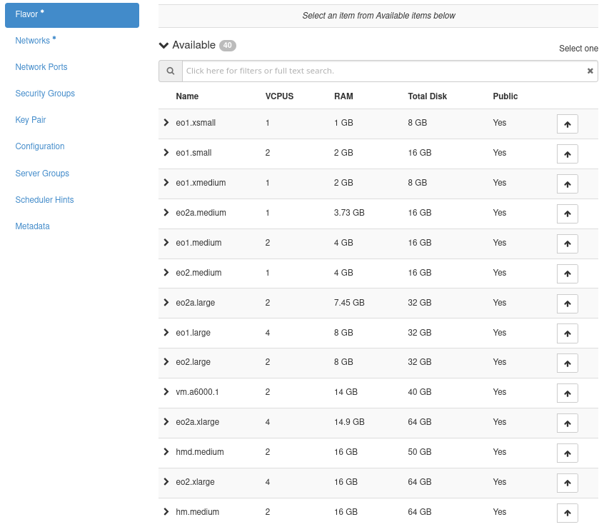
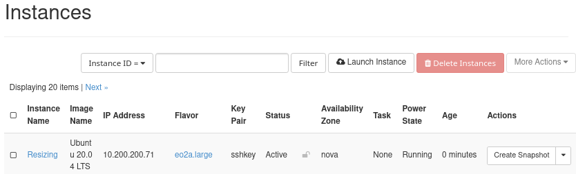
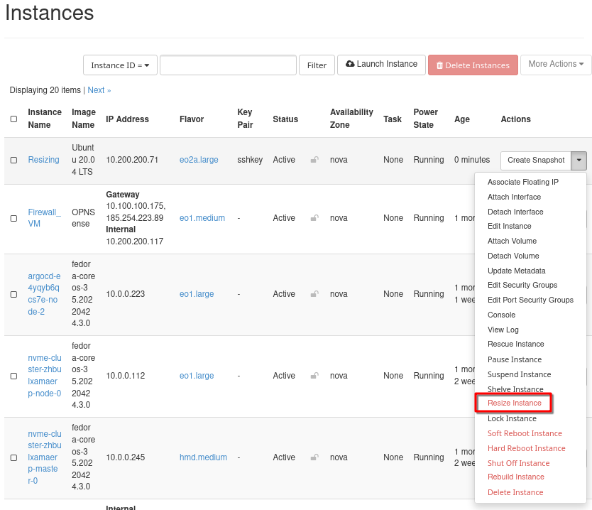
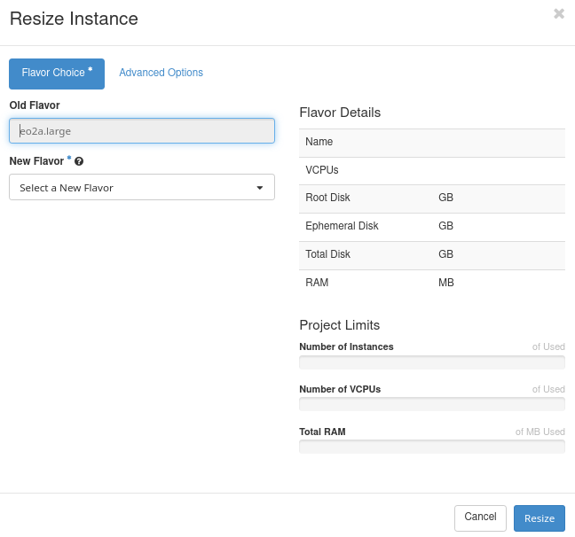
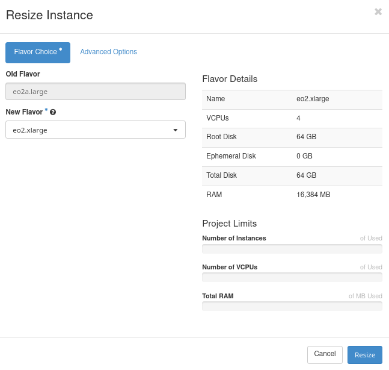
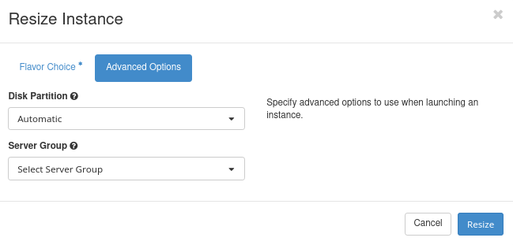
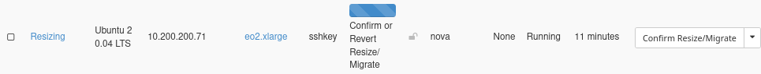
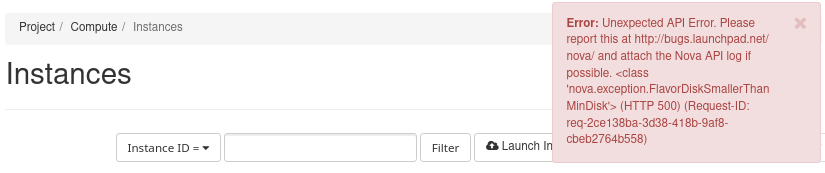

Resizing a virtual machine using OpenStack Horizon on |brand-name|
==================================================================

Introduction
------------

When creating a new virtual machine under OpenStack, one of the options you choose is the *flavor*. A flavor is a predefined combination of CPU, memory and disk size and there usually is a number of such flavors for you to choose from.

After the instance is spawned, it is possible to change one flavor for another, and that process is called *resizing*. You might want to resize an already existing VM in order to:

 * increase (or decrease) the number of CPUs used,
 * use more RAM to prevent crashes or enable swapping,
 * add larger storage to avoid running out of disk space,
 * seamlessly transition from testing to production environment,
 * change application workload byt scaling the VM up or down.

In this article, we are going to resize VMs using commands in OpenStack Horizon.

Prerequisites
-------------

No. 1 **Account**

You need a |brand-name| hosting account with access to the Horizon interface: |brand-name-site-auth-link|.

No. 2 **How to create a new VM**

If you are a normal user of |brand-name| hosting, you will have all prerogatives needed to resize the VM. Make sure that the VM you are about to resize belongs to a project you have access to. Here are the basics of creating a Linux VM in Horizon:

.. jinja:: brand_names

   :doc:`/cloud/How-to-create-a-Linux-VM-and-access-it-from-Linux-command-line-on-{{ brand_name_hyphen }}`

   :doc:`/cloud/How-to-create-a-Linux-VM-and-access-it-from-Windows-desktop-on-{{ brand_name_hyphen }}`

No. 3 **Awareness of existing quotas and flavors limits**

.. jinja:: brand_names

   For general introduction to quotas and flavors, see :doc:`/cloud/Dashboard-Overview-Project-Quotas-And-Flavors-Limits-on-{{ brand_name_hyphen }}`.

Also:

 * The VM you want to resize is in an active or shut down state.
 * A flavor with the desired resource configuration exists.
 * Adequate resources are available in your OpenStack environment to accommodate the resize.

Creating a new VM
-----------------

To illustrate the commands in this article, let us create a new VM in order to start with a clean slate. (It goes without saying that you can practice with any of the already existing VMs in your account.)

Use Prerequisite No. 2 to create a new VM and let it be called **Resizing**. Here is a typical list of flavors you might see:

For the sake of this article, let us choose a "middle" flavor -- not too large and not to small to start with. Let it be **eo2a.large**.

Finish the process of creating a new VM and let it spawn:

Let us now resize the VM called **Resizing**.

Steps to Resize the VM
----------------------

Locate the VM by using Horizon commands **Compute** -> **Instances**.

Click the dropdown arrow next to the VM and select **Resize Instance**.

You get form **Resize Instance** on screen:

Assuming you wanted to scale up the VM, you could decide upon **eo2.xlarge**. Let us compare the two flavors:

.. jinja:: caption_colors

    .. list-table::
       :header-rows: 1
       :widths: 20 15 20 20 20

       * - :{{ header }}:`Flavor`
         - :{{ header }}:`VCPUs`
         - :{{ header }}:`RAM`
         - :{{ header }}:`Total Disk`
         - :{{ header }}:`Root Disk`
       * - eo2a.large
         - 2
         - 7.45 GB
         - 32 GB
         - 32 GB
       * - eo2.xlarge
         - 4
         - 16 GB
         - 64 GB
         - 64 GB

So, select **eo2.xlarge** as the new flavor. This screen shows its parameters:

Advanced Options
----------------

**Advanced Options** tab contains two further options for resizing the instance.

Disk Partition
   Whether the entire disc is a single partition and automatically resizes.
   Options are **Automatic** and **Manual**

Server Group
   Here you select server group to which the instance can belong after resizing. Even if you never manually created a server group, they may be present as a consequence of creating Kubernete clusters, or using parameters for group affinity.

   The list can be quite long:

   .. image:: resize-vm-horizon-11.png
      :class: image-with-border

Resize the VM
-------------

Anyways, click on **Resize** to proceed with the resizing of the VM.

In **Status** column, there will be message **Confirm or Revert Resize/Migrate**. It means the system is waiting for you to decide what to do next. To confirm the resizing/migrating process, click on button **Confirm Resize/Migrate** in the **Actions** column.

The resizing process will finish within a couple of seconds and the VM will be in **Status** Active.

If you encounter issues, you can choose **Revert Resize** to return the VM to its previous state. This option is, however, only available before **Resize/Migration Confirmation**.

Or, if the resizing is finished, you can again use option **Resize instance** and choose the flavor from which you started (**eo2a.large** in this case). This process of scaling down is much faster than the process of scaling up.

Troubleshooting
---------------

If any of the flavor parameters does not match up, the resizing will fail.

You will then see balloon help in the right upper corner:

In this case, the sizes of the disk before and after the resizing do not match.

What To Do Next
---------------

.. jinja:: brand_names

   You can also resize the virtual machine using only OpenStack CLI. More details here: :doc:`/openstackcli/Resizing-a-virtual-machine-using-OpenStack-CLI-on-{{ brand_name_hyphen }}`