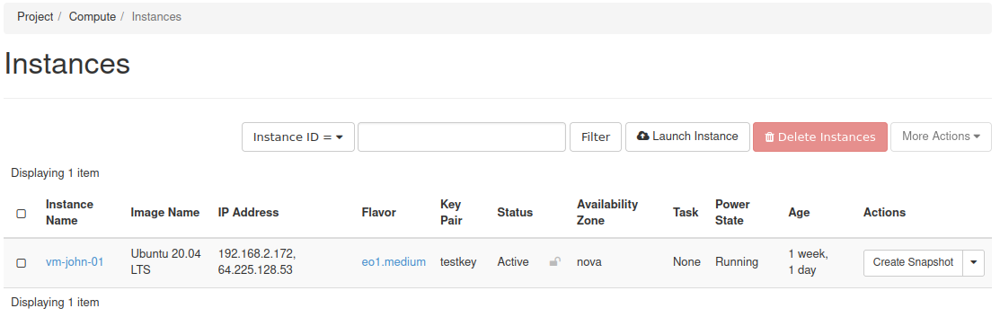

Status Power State and dependencies in billing of instance VMs on |brand-name|
==============================================================================

In OpenStack, instances have their own Status and Power State:

 * **Status** informs about the present condition of the VM, while
 * **Power** states tell us only whether virtual machines are running or not.

There are six Power states, divided into two groups, depending on whether the VM is running or not.

Power state while VM is running
-------------------------------

**NO STATE**
   VM is running, but encountered some fatal errors which require repeat launch of an instance.
**RUNNING**
   VM is running properly.
**PAUSED**
   VM is frozen and a memory dump is made.

Power state while VM is turned off
----------------------------------

**SHUT DOWN**
   VM is powered off properly.
**CRASHED**
   VM is turned down due to fatal error.
**SUSPENDED**
   VM is blocked by system (most likely because of negative credit on account).

Status and its conditions
-------------------------

Status may have one of the following conditions:

**ERROR**
   Instance is not working due to problems in creation process.

   User is not charged.

**ACTIVE**
   Instance is running with the specified image.

   User is charged for particular chosen flavor and storage.

**PAUSED**
   Instance is paused with the specified image.

   User is charged for flavor and storage.

**SUSPENDED**
   Instance is suspended with the specified image, with a valid memory snapshot.

   User is charged for flavor and storage.

**SHUT OFF**
   Instance is powered down by the user and the image is on disk.

   User is charged for chosen flavor and storage.

**SHELVED OFFLOADED**
   Instance is removed from the compute host and it can be reverted by “Unshelve instance” button.

   User is charged for storage.

**RESIZED/MIGRATED**
   Instance is stopped on the source node but running on the destination node. Images exist at two locations. User confirmation is required.

   User is charged for the new flavor and storage.

Please note that floating IP addresses are billed regardless of instance state.