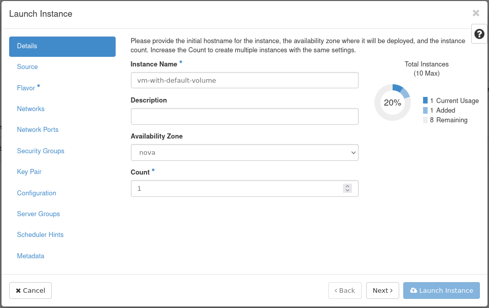
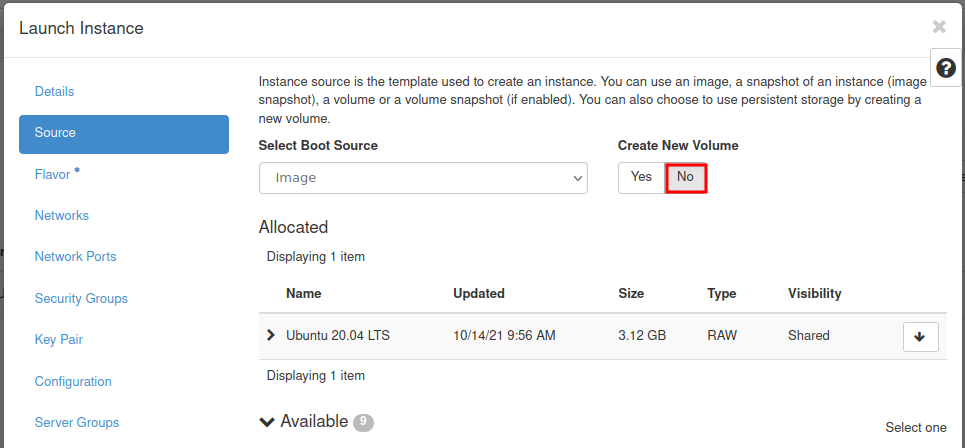
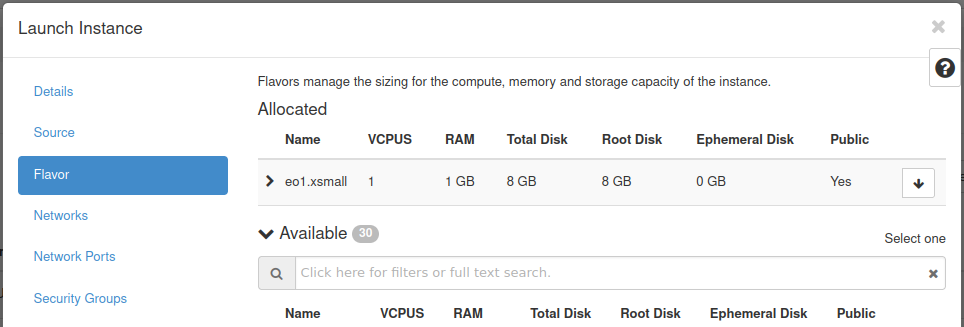
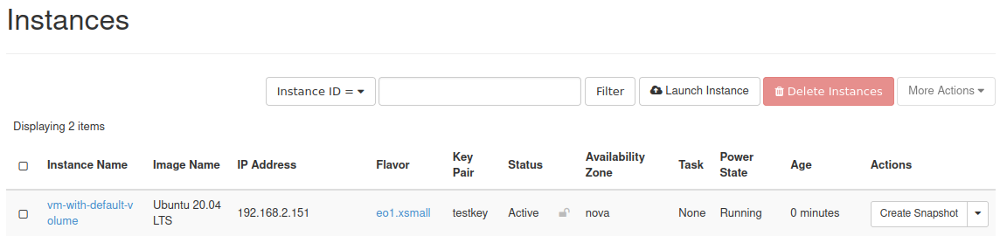
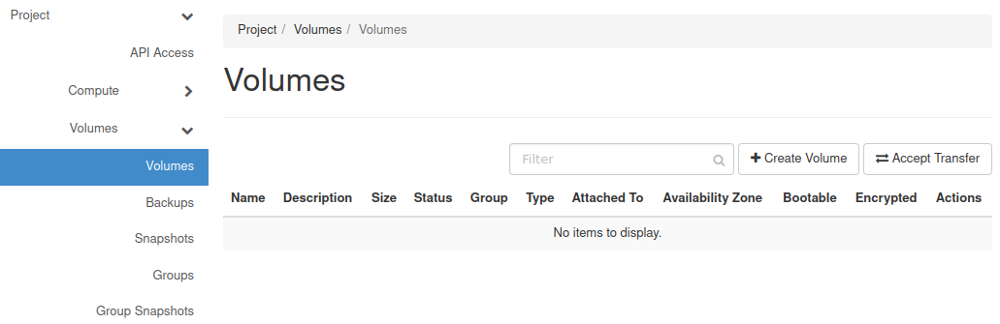

VM created with option Create New Volume No on |brand-name|
===========================================================

During creation of a VM you can select a source. If you choose “Image”, you can then choose **Yes** or **No** for the option “**Create New Volume**”.

By default **No** is selected:

The new Virtual Machine will be created with the System Volume (Root Disk) size as defined in the flavor.

.. jinja:: brand_names

   If you want to select a different size for the System Volume (Root Disk) please read article :doc:`/cloud/VM-created-with-option-Create-New-Volume-Yes-on-{{ brand_name_hyphen }}`.

In contrast to a VM created when choosing **Yes**, when choosing **No** the system disk is “ephemeral” and will not be visible in the Volumes view.

