How to create or delete volume snapshot on |brand-name|
====================================================================================================

Volume snapshot allows you to save the state of volume at a specific point in time. Here is how to create or delete volume snapshot using Horizon dashboard or OpenStack CLI client.

Prerequisites
-----------------------

No. 1 **Hosting**

You need a |brand-name| hosting account with access to Horizon interface: |brand-name-site-link|

No. 2 **A volume**

You need to have the volume which will serve as a source of your volume snapshot.

To prevent data corruption while creating a snapshot, the volume should not be connected to a virtual machine. If it is, disconnect it from the volume using one of these articles:

.. jinja:: brand_names

    * :doc:`/openstackcli/How-to-move-data-volume-between-two-VMs-using-OpenStack-CLI-on-Eumetsat-Elasticity/How-to-move-data-volume-between-two-VMs-using-OpenStack-CLI-on-Eumetsat-Elasticity`
    * :doc:`/datavolume/How-to-move-data-volume-between-two-VMs-using-OpenStack-Horizon-on-Eumetsat-Elasticity/How-to-move-data-volume-between-two-VMs-using-OpenStack-Horizon-on-Eumetsat-Elasticity`

No. 3 **OpenStack CLI client**

If you want to interact with |brand-name| cloud using OpenStack CLI client, you need to have it installed. Check one of these articles:

.. jinja:: brand_names

    * :doc:`/openstackcli/How-to-install-OpenStackClient-for-Linux-on-Eumetsat-Elasticity/How-to-install-OpenStackClient-for-Linux-on-Eumetsat-Elasticity`

    * :doc:`/openstackcli/How-to-install-OpenStackClient-GitBash-or-Cygwin-for-Windows-on-Eumetsat-Elasticity/How-to-install-OpenStackClient-GitBash-or-Cygwin-for-Windows-on-Eumetsat-Elasticity`

    * :doc:`/openstackcli/How-to-install-OpenStackClient-on-Windows-using-Windows-Subsystem-for-Linux-on-Eumetsat-Elasticity-OpenStack-Hosting/How-to-install-OpenStackClient-on-Windows-using-Windows-Subsystem-for-Linux-on-Eumetsat-Elasticity-OpenStack-Hosting`
How to create or delete volume snapshot on |brand-name|
====================================================================================================

Volume snapshot allows you to save the state of volume at a specific point in time. Here is how to create or delete volume snapshot using Horizon dashboard or OpenStack CLI client.

Prerequisites
-----------------------

No. 1 **Hosting**

You need a |brand-name| hosting account with access to Horizon interface: |brand-name-site-link|

No. 2 **A volume**

You need to have the volume which will serve as a source of your volume snapshot.

To prevent data corruption while creating a snapshot, the volume should not be connected to a virtual machine. If it is, disconnect it from the volume using one of these articles:

.. jinja:: brand_names

    * :doc:`/openstackcli/How-to-move-data-volume-between-two-VMs-using-OpenStack-CLI-on-Eumetsat-Elasticity/How-to-move-data-volume-between-two-VMs-using-OpenStack-CLI-on-Eumetsat-Elasticity`
    * :doc:`/datavolume/How-to-move-data-volume-between-two-VMs-using-OpenStack-Horizon-on-Eumetsat-Elasticity/How-to-move-data-volume-between-two-VMs-using-OpenStack-Horizon-on-Eumetsat-Elasticity`

No. 3 **OpenStack CLI client**

If you want to interact with |brand-name| cloud using OpenStack CLI client, you need to have it installed. Check one of these articles:

.. jinja:: brand_names

    * :doc:`/openstackcli/How-to-install-OpenStackClient-for-Linux-on-Eumetsat-Elasticity/How-to-install-OpenStackClient-for-Linux-on-Eumetsat-Elasticity`

    * :doc:`/openstackcli/How-to-install-OpenStackClient-GitBash-or-Cygwin-for-Windows-on-Eumetsat-Elasticity/How-to-install-OpenStackClient-GitBash-or-Cygwin-for-Windows-on-Eumetsat-Elasticity`

    * :doc:`/openstackcli/How-to-install-OpenStackClient-on-Windows-using-Windows-Subsystem-for-Linux-on-Eumetsat-Elasticity-OpenStack-Hosting/How-to-install-OpenStackClient-on-Windows-using-Windows-Subsystem-for-Linux-on-Eumetsat-Elasticity-OpenStack-Hosting`

.. jinja:: doc_links

   Once you have installed this piece of software, you need to authenticate to start using it: :doc:`{{ openstack_cli_auth }}`

What We Are Going To Cover
-------------------------------

 * Creating volume snapshot
    * Creating volume snapshot using Horizon dashboard
    * Creating volume snapshot using OpenStack CLI client

 * Deleting snapshot
    * Deleting snapshot using Horizon dashboard
    * Deleting snapshot using OpenStack CLI client

Creating volume snapshot
---------------------------------

Creating volume snapshot using Horizon dashboard
^^^^^^^^^^^^^^^^^^^^^^^^^^^^^^^^^^^^^^^^^^^^^^^^^^^^^^^^^^^^^^^^

Navigate to section **Volumes -> Volumes** of the Horizon dashboard. You should see the list of your volumes:

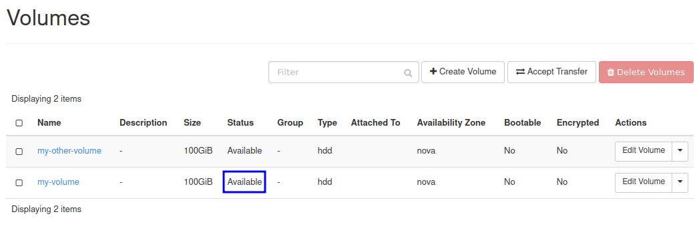

Make sure that the volume from which you want to create a snapshot has the following **Status**: **Available**. If the status is different, see Prerequisite No. 2.

In this example, volume we chose is called **my-volume** and its **Status**, marked with a blue rectangle, is **Available**.

In the row representing the volume you want to download, click the drop-down menu in column **Actions**:

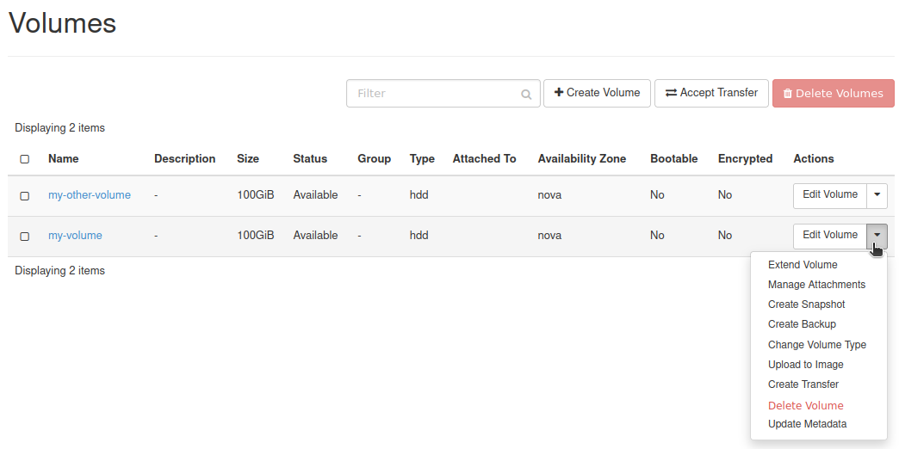

From that drop-down menu, choose **Create Snapshot**. You should get this window:

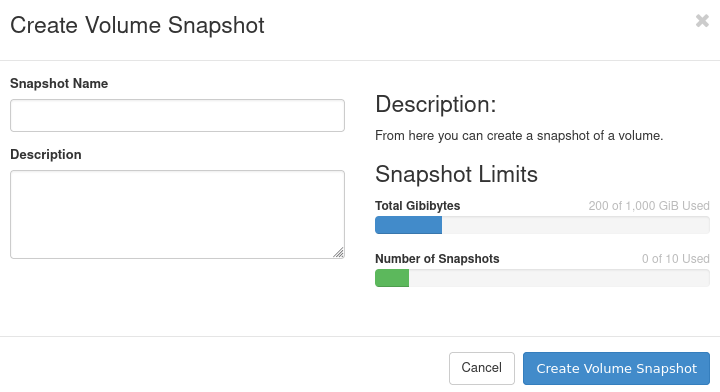

You can now provide a name and/or description of the snapshot you want to create.

Once you're finished, click **Create Volume Snapshot**.

You should now be moved to section **Volumes -> Snapshots** of the Horizon dashboards. Your new snapshot should be there. Wait until its **Status** is **Available**:

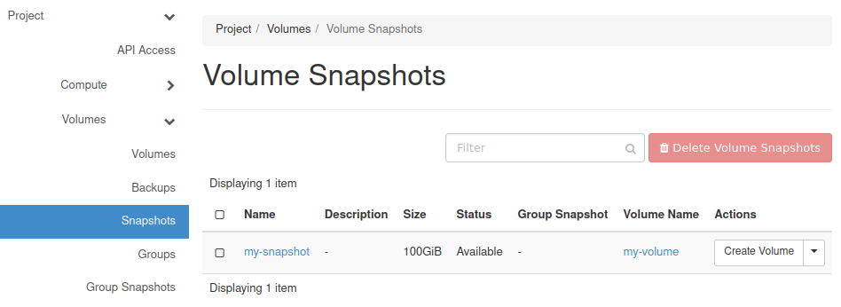

Creating volume snapshot using OpenStack CLI client
^^^^^^^^^^^^^^^^^^^^^^^^^^^^^^^^^^^^^^^^^^^^^^^^^^^^^^^^^^^^^^^^^^^^^^^

Execute the following command to list volumes:

.. code::

   openstack volume list

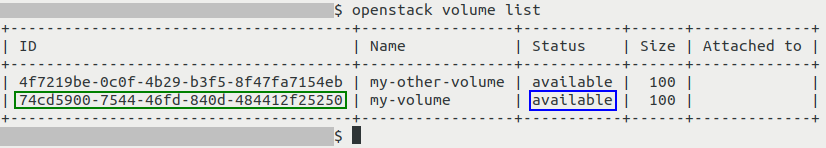

Make sure that the volume from which you want to create a snapshot has the following **Status**: **available**. If the status is different, see Prerequisite No. 2.

Write somewhere down the ID of your volume.

In this example, volume we chose is called **my-volume** and its **Status**, marked with a blue rectangle, is **available**. Its ID is marked with a green rectangle and is as follows: **74cd5900-7544-46fd-840d-484412f25250**.

To create a snapshot of your volume, execute command below after having replaced its parts as instructed.

.. code::

   openstack volume snapshot create --volume 74cd5900-7544-46fd-840d-484412f25250 my-snapshot

Replace:

 * **74cd5900-7544-46fd-840d-484412f25250** with the ID of your volume
 * **my-snapshot** with the name of your volume

Make sure that the name gets passed to the shell correctly - be mindful of spaces and other special characters.

You should get output like this:

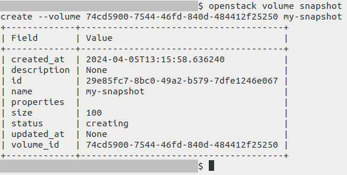

To check status of your snapshot, execute the following command:

.. code::

   openstack volume snapshot list

You should get the list of snapshots of your volumes:

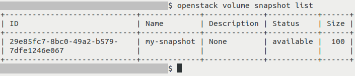

If creating of snapshot was successful, it should have the following **Status**: **available**.

Deleting volume snapshot
--------------------------

There are several reasons for deleting a volume snapshot, for example you might want to (among others):

 * Save storage space
 * Free quota
 * Delete a volume (a volume which has at least one snapshot cannot be deleted using regular methods)

Deleting volume snapshot using Horizon dashboard
^^^^^^^^^^^^^^^^^^^^^^^^^^^^^^^^^^^^^^^^^^^^^^^^^^^^^^^^^^^^

Navigate to section **Volumes -> Snapshots** of the Horizon dashboard. You should see the list of your snapshots:

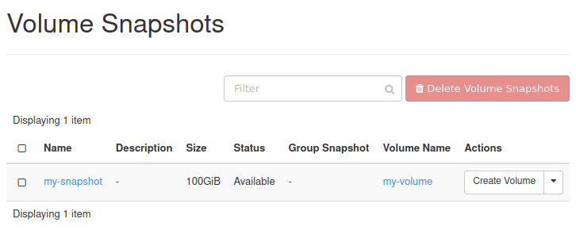

In the row representing your snapshot, open the drop-down menu located in column **Actions**:

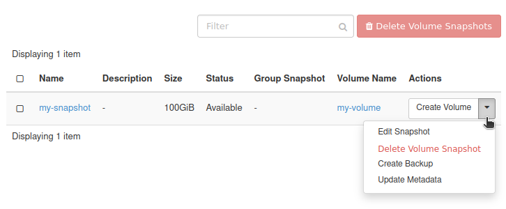

You will be prompted for confirmation:

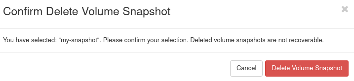

Choose **Delete Volume Snapshot**.

If the operation was successful, your volume should no longer be on the list:

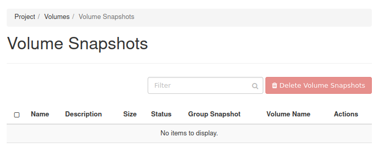

Deleting volume snapshot using OpenStack CLI client
^^^^^^^^^^^^^^^^^^^^^^^^^^^^^^^^^^^^^^^^^^^^^^^^^^^^^^^^^^^^^^^^^^^^^^^^^^^

Execute the following command to list volume snapshots:

.. code::

   openstack volume snapshot list

You should get the list of snapshots of your volumes:

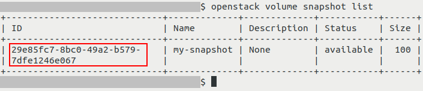

Write somewhere down the ID of the snapshot you want to delete.

In this example, the snapshot we want to delete is called **my-snapshot**. Its ID, marked with a red rectangle, is **29e85fc7-8bc0-49a2-b579-7dfe1246e067**.

Execute command below. In it, replace **29e85fc7-8bc0-49a2-b579-7dfe1246e067** with the ID of the snapshot you want to delete.

.. code::

   openstack volume snapshot delete 29e85fc7-8bc0-49a2-b579-7dfe1246e067

The output of this command should be empty.

To verify, execute **openstack volume snapshot list** again:

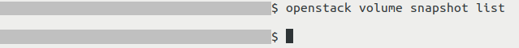

In this example, since we did not have any other volume snapshots and we removed the last one, the output contains only one empty line.

What To Do Next
------------------

.. jinja:: brand_names

   To learn how to restore a volume from volume snapshot, see :doc:`/datavolume/How-to-restore-volume-from-snapshot-on-Eumetsat-Elasticity/How-to-restore-volume-from-snapshot-on-Eumetsat-Elasticity`

   A volume snapshot can also be used to create an instance (if the original volume was bootable). More information can be found here: :doc:`/cloud/How-to-start-a-VM-from-a-snapshot-on-Eumetsat-Elasticity/How-to-start-a-VM-from-a-snapshot-on-Eumetsat-Elasticity`

.. jinja:: brand_names

   To learn more about project quota, see :doc:`/cloud/Dashboard-Overview-Project-Quotas-And-Flavors-Limits-on-Eumetsat-Elasticity/Dashboard-Overview-Project-Quotas-And-Flavors-Limits-on-Eumetsat-Elasticity`

What We Are Going To Cover
-------------------------------

 * Creating volume snapshot
    * Creating volume snapshot using Horizon dashboard
    * Creating volume snapshot using OpenStack CLI client

 * Deleting snapshot
    * Deleting snapshot using Horizon dashboard
    * Deleting snapshot using OpenStack CLI client

Creating volume snapshot
---------------------------------

Creating volume snapshot using Horizon dashboard
^^^^^^^^^^^^^^^^^^^^^^^^^^^^^^^^^^^^^^^^^^^^^^^^^^^^^^^^^^^^^^^^

Navigate to section **Volumes -> Volumes** of the Horizon dashboard. You should see the list of your volumes:

Make sure that the volume from which you want to create a snapshot has the following **Status**: **Available**. If the status is different, see Prerequisite No. 2.

In this example, volume we chose is called **my-volume** and its **Status**, marked with a blue rectangle, is **Available**.

In the row representing the volume you want to download, click the drop-down menu in column **Actions**:

From that drop-down menu, choose **Create Snapshot**. You should get this window:

You can now provide a name and/or description of the snapshot you want to create.

Once you're finished, click **Create Volume Snapshot**.

You should now be moved to section **Volumes -> Snapshots** of the Horizon dashboards. Your new snapshot should be there. Wait until its **Status** is **Available**:

Creating volume snapshot using OpenStack CLI client
^^^^^^^^^^^^^^^^^^^^^^^^^^^^^^^^^^^^^^^^^^^^^^^^^^^^^^^^^^^^^^^^^^^^^^^

Execute the following command to list volumes:

.. code::

   openstack volume list

Make sure that the volume from which you want to create a snapshot has the following **Status**: **available**. If the status is different, see Prerequisite No. 2.

Write somewhere down the ID of your volume.

In this example, volume we chose is called **my-volume** and its **Status**, marked with a blue rectangle, is **available**. Its ID is marked with a green rectangle and is as follows: **74cd5900-7544-46fd-840d-484412f25250**.

To create a snapshot of your volume, execute command below after having replaced its parts as instructed.

.. code::

   openstack volume snapshot create --volume 74cd5900-7544-46fd-840d-484412f25250 my-snapshot

Replace:

 * **74cd5900-7544-46fd-840d-484412f25250** with the ID of your volume
 * **my-snapshot** with the name of your volume

Make sure that the name gets passed to the shell correctly - be mindful of spaces and other special characters.

You should get output like this:

To check status of your snapshot, execute the following command:

.. code::

   openstack volume snapshot list

You should get the list of snapshots of your volumes:

If creating of snapshot was successful, it should have the following **Status**: **available**.

Deleting volume snapshot
--------------------------

There are several reasons for deleting a volume snapshot, for example you might want to (among others):

 * Save storage space
 * Free quota
 * Delete a volume (a volume which has at least one snapshot cannot be deleted using regular methods)

Deleting volume snapshot using Horizon dashboard
^^^^^^^^^^^^^^^^^^^^^^^^^^^^^^^^^^^^^^^^^^^^^^^^^^^^^^^^^^^^

Navigate to section **Volumes -> Snapshots** of the Horizon dashboard. You should see the list of your snapshots:

In the row representing your snapshot, open the drop-down menu located in column **Actions**:

You will be prompted for confirmation:

Choose **Delete Volume Snapshot**.

If the operation was successful, your volume should no longer be on the list:

Deleting volume snapshot using OpenStack CLI client
^^^^^^^^^^^^^^^^^^^^^^^^^^^^^^^^^^^^^^^^^^^^^^^^^^^^^^^^^^^^^^^^^^^^^^^^^^^

Execute the following command to list volume snapshots:

.. code::

   openstack volume snapshot list

You should get the list of snapshots of your volumes:

Write somewhere down the ID of the snapshot you want to delete.

In this example, the snapshot we want to delete is called **my-snapshot**. Its ID, marked with a red rectangle, is **29e85fc7-8bc0-49a2-b579-7dfe1246e067**.

Execute command below. In it, replace **29e85fc7-8bc0-49a2-b579-7dfe1246e067** with the ID of the snapshot you want to delete.

.. code::

   openstack volume snapshot delete 29e85fc7-8bc0-49a2-b579-7dfe1246e067

The output of this command should be empty.

To verify, execute **openstack volume snapshot list** again:

In this example, since we did not have any other volume snapshots and we removed the last one, the output contains only one empty line.

What To Do Next
------------------

.. jinja:: brand_names

   To learn how to restore a volume from volume snapshot, see :doc:`/datavolume/How-to-restore-volume-from-snapshot-on-Eumetsat-Elasticity/How-to-restore-volume-from-snapshot-on-Eumetsat-Elasticity`

   A volume snapshot can also be used to create an instance (if the original volume was bootable). More information can be found here: :doc:`/cloud/How-to-start-a-VM-from-a-snapshot-on-Eumetsat-Elasticity/How-to-start-a-VM-from-a-snapshot-on-Eumetsat-Elasticity`

.. jinja:: brand_names

   To learn more about project quota, see :doc:`/cloud/Dashboard-Overview-Project-Quotas-And-Flavors-Limits-on-Eumetsat-Elasticity/Dashboard-Overview-Project-Quotas-And-Flavors-Limits-on-Eumetsat-Elasticity`
