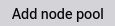
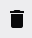
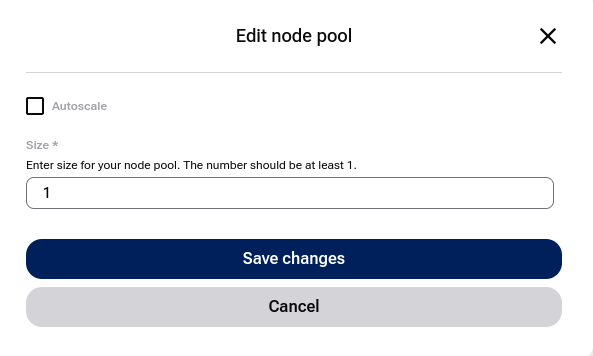
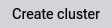

Add node pools to |MK8s| cluster using the launcher GUI
=======================================================

.. |RUNNING| image:: kubernetes-launcher-gui-9.png

.. |UPGRADING| image:: ecis_select_flavor_for_node_pool.png

In this tutorial, you will learn how to add worker nodes to an |MK8s| cluster by creating one or more node pools in the launcher GUI.

.. raw:: html

   <h2>What we are going to cover</h2>

.. contents::
   :depth: 2
   :local:
   :backlinks: none

Prerequisites
-------------

No. 1 **Existing cluster**

.. jinja:: brand_names

   You can add a node pool to a |RUNNING| cluster created according to article :doc:`/kubernetes/How-to-create-a-Managed-Kubernetes-cluster-using-ECIS-launcher-GUI`.

You can also apply the steps from this article when adding a node pool during cluster creation.

No. 2 **Quotas and resources**

Make sure you have enough quota to create worker nodes. If you need more resources for your cluster, contact Support and request a quota extension before creating node pools.

.. jinja:: brand_names

   No. 3 **Supported {{ MK8s }} region**

.. jinja:: mk8s_regions

   

   Available |MK8s| regions for {{ brand_name }}:

   

   * **{{ region.display_name }}**

   

   

Node pools are created in the same region as the |MK8s| cluster you them to be attached to. All other used resources must be in the same region as well.

Single Cluster View -- Node Pools
---------------------------------

How to add a node pool
^^^^^^^^^^^^^^^^^^^^^^

Open your cluster and click **Node Pools**. In the following image, we see a list of existing node pools, as well as the **Create node pool** button.

To start, click that button:

.. jinja:: mk8s_images

   .. figure:: {{ mk8s006 }}
      :class: image-with-border

      Example node pool list.

The node pool creation form looks like this:

.. jinja:: mk8s_images

   .. figure:: {{ mk8s007 }}
      :class: image-with-border

      Node pool creation form.

Node Pool Name
   If left empty, the name will be generated automatically.

Flavor
   Choose a flavor based on your needs.

   .. jinja:: mk8s_images

      .. figure:: {{ mk8s008 }}
         :class: image-with-border

         Select flavor for node pool.

   .. tip::

      When creating a node pool with one of the vGPU machine specs, the NVIDIA GPU Operator gets installed on the cluster. To use GPU acceleration by a workload, for example by a pod, apply this setting in the pod's **spec.containers** definition:

      .. code::

         resources:
           limits:
             nvidia.com/gpu: 1

      By default, the first pod scheduled on a given node in such a node pool will use the full vGPU unit assigned to this node. To enable splitting the vGPU between more pods, see the `NVIDIA GPU Operator - Time Slicing <https://docs.nvidia.com/datacenter/cloud-native/gpu-operator/latest/gpu-sharing.html#about-configuring-gpu-time-slicing>`_ documentation.

Autoscale
   Enable this option to allow the cluster to automatically increase or decrease the number of nodes based on demand.

   The **cluster autoscaler** adds or removes nodes based on pending pods. This complements the **Horizontal Pod Autoscaler (HPA)**, which adjusts the number of pods inside existing nodes.

   .. tip::

      The **cluster autoscaler** is most effective when combined with pod resource limits and requests. Make sure your workloads define them correctly.

Size of Node Pool
   Start with **1** node if unsure. You can resize the node pool later.

Advanced Settings
   In Advanced Settings, you can:

   * Specify **OpenStack shared network IDs**.
   * Assign initial **Kubernetes labels** and **taints**.

   Labels and taints are outside the scope of this article.

Finish creating the node pool and click **Add node pool**. The new pool will appear in the node pool list, and worker nodes will be created in the background.

How to edit a node pool
^^^^^^^^^^^^^^^^^^^^^^^

To change the parameters of an existing node pool, click the pen icon, |PENICON|, on the right side of the node pool row.

.. jinja:: mk8s_images

   .. figure:: {{ mk8s009 }}
      :class: image-with-border

      Node pool editing screen.

You cannot change the name or the flavor of the node pool, but you can adjust worker capacity in two ways.

Define a range
   Turn **Autoscale** on. Two new options appear in the form:

   .. jinja:: mk8s_images

      .. figure:: {{ mk8s010 }}
         :class: image-with-border

         Autoscaling enabled with minimum and maximum limits.

Redefine fixed size of node pool
   Enter the required number in that field and click **Save changes**.

   .. jinja:: mk8s_images

      .. figure:: {{ mk8s011 }}
         :class: image-with-border

   Worker nodes are scaled manually. The status temporarily changes to |SCALING|.

When editing a node pool, you can also change the related networks in **Advanced Settings**.

Delete a node pool
^^^^^^^^^^^^^^^^^^

Click the |TRASHCAN| icon next to the node pool.

What To Do Next
---------------

With worker nodes added, you can start deploying pods, creating services, and running workloads.

.. jinja:: brand_names

   If you already have a cluster, you can back it up with :doc:`/kubernetes/Managed-Kubernetes-backups`.

.. ifconfig:: brand_name in managed_kubernetes_with_magnum

   .. jinja:: brand_names

      Learn how to connect a VM to your Kubernetes network: :doc:`/kubernetes/Accessing-OpenStack-resources-from-{{ brand_name_hyphen }}-Managed-Kubernetes-using-shared-networks`.

.. jinja:: brand_names

   You can also create Kubernetes clusters using Terraform, see :doc:`/kubernetes/Create-a-Managed-Kubernetes-Cluster-with-Terraform`.